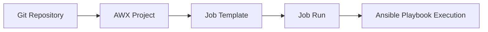

# How to Create Projects in AWX

Author: [nawazdhandala](https://www.github.com/nawazdhandala)

Tags: Ansible, AWX, Projects, Git, Automation

Description: Learn how to create and configure AWX projects from Git repositories, local directories, and archives with sync settings.

---

Projects in AWX are the bridge between your Ansible code (playbooks, roles, collections) and the AWX execution engine. A project points to a source of Ansible content, typically a Git repository, and AWX syncs that content before running jobs. Getting projects set up correctly is one of the first things you do after installing AWX. This post covers all the project types, configuration options, and best practices.

## What Is an AWX Project?

An AWX project is a collection of Ansible playbooks. It maps to a directory on the AWX server that contains your automation code. When you create a job template (which runs a playbook), you select a project to tell AWX where to find the playbook.



## Creating a Project via the Web UI

Navigate to Resources > Projects in the AWX sidebar and click "Add".

The key fields are:

- **Name**: A descriptive name for the project
- **Organization**: Which organization owns this project
- **Source Control Type**: Git, Subversion, Red Hat Insights, Archive, or Manual
- **Source Control URL**: The repository URL (for Git/SVN)
- **Source Control Branch**: Branch, tag, or commit hash to use
- **Source Control Credential**: SSH key or token for private repositories

## Creating a Git-Based Project via the API

The API is more efficient for creating projects programmatically. Here is how to create a project using curl.

```bash
# Create a project pointing to a Git repository
curl -X POST "https://awx.example.com/api/v2/projects/" \
  -H "Content-Type: application/json" \
  -H "Authorization: Bearer $AWX_TOKEN" \
  -d '{
    "name": "Infrastructure Playbooks",
    "description": "Main infrastructure automation playbooks",
    "organization": 1,
    "scm_type": "git",
    "scm_url": "https://github.com/myorg/ansible-playbooks.git",
    "scm_branch": "main",
    "scm_clean": true,
    "scm_delete_on_update": false,
    "scm_update_on_launch": true,
    "scm_update_cache_timeout": 300
  }'
```

## Creating Projects with Ansible

You can automate AWX project creation with the `awx.awx` collection.

```yaml
# create-projects.yml - Create AWX projects with Ansible
---
- name: Configure AWX Projects
  hosts: localhost
  connection: local
  collections:
    - awx.awx

  vars:
    awx_host: "https://awx.example.com"
    awx_token: "{{ lookup('env', 'AWX_TOKEN') }}"

  tasks:
    - name: Create infrastructure playbooks project
      awx.awx.project:
        controller_host: "{{ awx_host }}"
        controller_oauthtoken: "{{ awx_token }}"
        name: "Infrastructure Playbooks"
        description: "Core infrastructure automation"
        organization: "Default"
        scm_type: git
        scm_url: "https://github.com/myorg/ansible-playbooks.git"
        scm_branch: "main"
        scm_clean: true
        scm_update_on_launch: true
        scm_update_cache_timeout: 300
        state: present

    - name: Create security hardening project
      awx.awx.project:
        controller_host: "{{ awx_host }}"
        controller_oauthtoken: "{{ awx_token }}"
        name: "Security Hardening"
        description: "CIS benchmark and security roles"
        organization: "Default"
        scm_type: git
        scm_url: "git@github.com:myorg/security-roles.git"
        scm_branch: "main"
        scm_credential: "GitHub SSH Key"
        scm_clean: true
        scm_update_on_launch: true
        state: present

    - name: Create monitoring project
      awx.awx.project:
        controller_host: "{{ awx_host }}"
        controller_oauthtoken: "{{ awx_token }}"
        name: "Monitoring Setup"
        description: "Prometheus, Grafana, and alerting"
        organization: "Default"
        scm_type: git
        scm_url: "https://github.com/myorg/monitoring-playbooks.git"
        scm_branch: "v2.0"
        scm_update_on_launch: false
        scm_update_cache_timeout: 0
        state: present
```

Install the collection first.

```bash
ansible-galaxy collection install awx.awx
```

## Project Types

### Git Projects (Most Common)

Git is the default and most widely used source control type.

```yaml
- name: Git project with SSH authentication
  awx.awx.project:
    controller_host: "{{ awx_host }}"
    controller_oauthtoken: "{{ awx_token }}"
    name: "Private Repo Project"
    organization: "Default"
    scm_type: git
    scm_url: "git@github.com:myorg/private-playbooks.git"
    scm_branch: "main"
    scm_credential: "GitHub SSH Key"
    state: present

- name: Git project with personal access token
  awx.awx.project:
    controller_host: "{{ awx_host }}"
    controller_oauthtoken: "{{ awx_token }}"
    name: "Token Auth Project"
    organization: "Default"
    scm_type: git
    scm_url: "https://github.com/myorg/playbooks.git"
    scm_credential: "GitHub PAT"
    scm_branch: "main"
    state: present
```

### Manual Projects

Manual projects use playbooks placed directly on the AWX server filesystem.

```yaml
- name: Manual project (filesystem-based)
  awx.awx.project:
    controller_host: "{{ awx_host }}"
    controller_oauthtoken: "{{ awx_token }}"
    name: "Local Playbooks"
    organization: "Default"
    scm_type: ""
    local_path: "my_playbooks"
    state: present
```

For manual projects, place your playbooks in the AWX projects directory.

```bash
# On the AWX server or in the projects volume
/var/lib/awx/projects/my_playbooks/
  site.yml
  roles/
  inventory/
```

### Archive Projects

Archive projects download a tarball or zip file containing playbooks.

```yaml
- name: Archive project
  awx.awx.project:
    controller_host: "{{ awx_host }}"
    controller_oauthtoken: "{{ awx_token }}"
    name: "Archived Playbooks"
    organization: "Default"
    scm_type: archive
    scm_url: "https://releases.example.com/playbooks-v1.0.tar.gz"
    state: present
```

## Project Sync Settings

Understanding sync settings is important for controlling when AWX pulls the latest code.

```yaml
- name: Project with detailed sync settings
  awx.awx.project:
    controller_host: "{{ awx_host }}"
    controller_oauthtoken: "{{ awx_token }}"
    name: "Production Playbooks"
    organization: "Default"
    scm_type: git
    scm_url: "https://github.com/myorg/playbooks.git"
    scm_branch: "release/v3.0"

    # Pull fresh code before every job run
    scm_update_on_launch: true

    # Cache the sync for 5 minutes to avoid hitting Git on rapid job runs
    scm_update_cache_timeout: 300

    # Remove untracked files during sync
    scm_clean: true

    # Delete the entire project directory and re-clone
    scm_delete_on_update: false

    # Timeout for the sync operation (in seconds)
    timeout: 120

    state: present
```

| Setting | Description | Recommendation |
|---|---|---|
| scm_update_on_launch | Sync before each job | Yes for development, use cache for production |
| scm_update_cache_timeout | Seconds before re-syncing | 300 for production |
| scm_clean | Remove untracked files | Yes |
| scm_delete_on_update | Full re-clone on sync | No (too slow for large repos) |

## Syncing Projects

Trigger a project sync manually or via the API.

```bash
# Sync a project via API
curl -X POST "https://awx.example.com/api/v2/projects/1/update/" \
  -H "Authorization: Bearer $AWX_TOKEN"

# Check sync status
curl -s "https://awx.example.com/api/v2/projects/1/" \
  -H "Authorization: Bearer $AWX_TOKEN" | jq '.status, .scm_revision'
```

With Ansible:

```yaml
- name: Sync the project
  awx.awx.project_update:
    controller_host: "{{ awx_host }}"
    controller_oauthtoken: "{{ awx_token }}"
    project: "Infrastructure Playbooks"
    wait: true
    timeout: 120
```

## Repository Structure for AWX

Organize your Git repository so AWX can find everything it needs.

```
ansible-playbooks/
  playbooks/
    deploy-web.yml
    deploy-db.yml
    patch-servers.yml
  roles/
    requirements.yml   # Galaxy role dependencies
  collections/
    requirements.yml   # Collection dependencies
  inventories/
    production/
    staging/
  group_vars/
  host_vars/
```

AWX will automatically install roles and collections from `roles/requirements.yml` and `collections/requirements.yml` during project sync.

## Troubleshooting Project Syncs

```bash
# Check project sync jobs
curl -s "https://awx.example.com/api/v2/project_updates/?project=1" \
  -H "Authorization: Bearer $AWX_TOKEN" | jq '.results[0].status'

# View sync job stdout for errors
curl -s "https://awx.example.com/api/v2/project_updates/42/stdout/" \
  -H "Authorization: Bearer $AWX_TOKEN"
```

Common sync failures:

1. **Authentication failed**: Check your SCM credential. Verify the SSH key or token has read access.
2. **Branch not found**: Verify the branch name exists in the repository.
3. **Timeout**: Large repositories may need a higher timeout value.
4. **Galaxy dependency errors**: Check that your requirements.yml files are valid and the Galaxy server is reachable.

AWX projects are foundational to your automation workflow. A well-organized project structure with proper sync settings ensures that your job templates always run the correct version of your playbooks. Start with Git-based projects and use the `scm_update_on_launch` with cache timeout for a good balance between freshness and performance.
