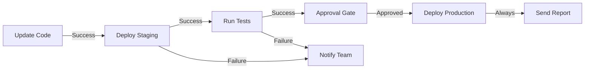
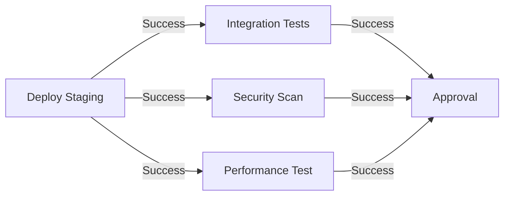
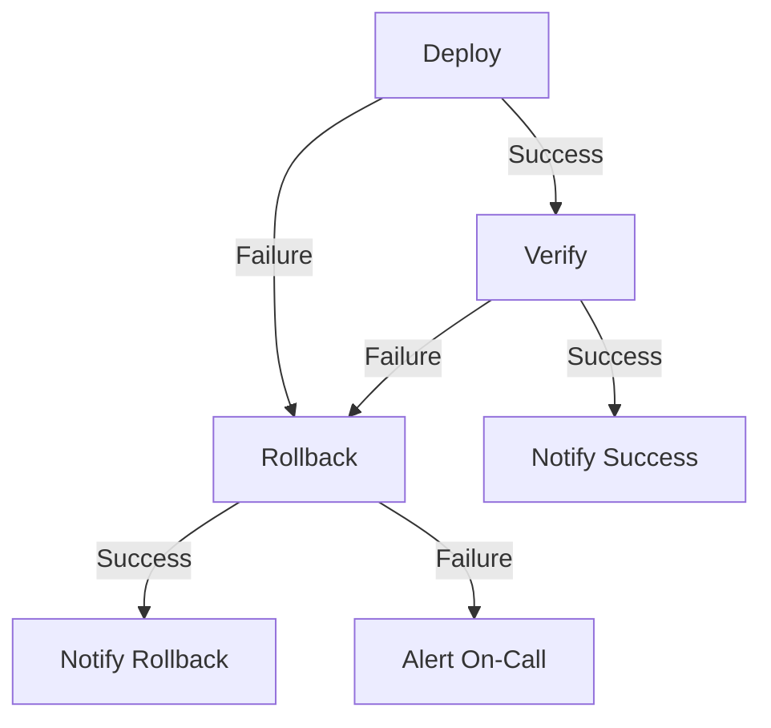

# How to Create Workflow Templates in AWX

Author: [nawazdhandala](https://www.github.com/nawazdhandala)

Tags: Ansible, AWX, Workflows, Automation, Orchestration

Description: Build AWX workflow templates to chain job templates with conditional logic, approval gates, and parallel execution paths.

---

Workflow templates in AWX let you chain multiple job templates together into a coordinated automation pipeline. Instead of running jobs one at a time and manually kicking off the next step, a workflow handles the sequencing, parallelism, and conditional branching for you. This post covers creating workflows through the API and Ansible, along with advanced patterns like approval nodes, convergence, and error handling.

## Workflow Concepts

A workflow is a directed graph of nodes. Each node can be a job template, a project sync, an inventory sync, an approval gate, or another workflow. Nodes connect via three types of links:

- **Success**: Run the next node only if the current one succeeds
- **Failure**: Run the next node only if the current one fails
- **Always**: Run the next node regardless of the current outcome



## Creating a Basic Workflow

```yaml
# create-workflows.yml
---
- name: Configure AWX Workflows
  hosts: localhost
  connection: local
  collections:
    - awx.awx

  vars:
    awx_host: "https://awx.example.com"
    awx_token: "{{ lookup('env', 'AWX_TOKEN') }}"

  tasks:
    - name: Create deployment workflow
      awx.awx.workflow_job_template:
        controller_host: "{{ awx_host }}"
        controller_oauthtoken: "{{ awx_token }}"
        name: "Full Deployment Pipeline"
        description: "Complete deployment workflow: sync, deploy staging, test, deploy production"
        organization: "Default"
        ask_variables_on_launch: true
        extra_vars:
          app_version: "latest"
          skip_tests: false
        survey_enabled: true
        survey_spec:
          name: "Deployment Options"
          description: "Configure the deployment"
          spec:
            - question_name: "Application Version"
              variable: "app_version"
              type: "text"
              required: true
              default: "latest"
            - question_name: "Environment"
              variable: "target_env"
              type: "multiplechoice"
              required: true
              choices:
                - "staging"
                - "production"
              default: "staging"
        state: present
```

## Adding Workflow Nodes

After creating the workflow template, add nodes that define the execution path.

```yaml
    # Node 1: Sync the project code
    - name: Add project sync node
      awx.awx.workflow_job_template_node:
        controller_host: "{{ awx_host }}"
        controller_oauthtoken: "{{ awx_token }}"
        workflow_job_template: "Full Deployment Pipeline"
        identifier: "sync_code"
        unified_job_template: "Infrastructure Playbooks"
        organization: "Default"
        state: present

    # Node 2: Deploy to staging (runs after sync succeeds)
    - name: Add staging deployment node
      awx.awx.workflow_job_template_node:
        controller_host: "{{ awx_host }}"
        controller_oauthtoken: "{{ awx_token }}"
        workflow_job_template: "Full Deployment Pipeline"
        identifier: "deploy_staging"
        unified_job_template: "Deploy Web Application"
        extra_data:
          deploy_env: staging
        organization: "Default"
        state: present

    # Node 3: Run integration tests
    - name: Add test node
      awx.awx.workflow_job_template_node:
        controller_host: "{{ awx_host }}"
        controller_oauthtoken: "{{ awx_token }}"
        workflow_job_template: "Full Deployment Pipeline"
        identifier: "run_tests"
        unified_job_template: "Run Integration Tests"
        organization: "Default"
        state: present

    # Node 4: Approval gate before production
    - name: Add approval node
      awx.awx.workflow_job_template_node:
        controller_host: "{{ awx_host }}"
        controller_oauthtoken: "{{ awx_token }}"
        workflow_job_template: "Full Deployment Pipeline"
        identifier: "production_approval"
        approval_node:
          name: "Approve Production Deploy"
          description: "Review staging results and approve production deployment"
          timeout: 3600  # 1 hour timeout
        organization: "Default"
        state: present

    # Node 5: Deploy to production
    - name: Add production deployment node
      awx.awx.workflow_job_template_node:
        controller_host: "{{ awx_host }}"
        controller_oauthtoken: "{{ awx_token }}"
        workflow_job_template: "Full Deployment Pipeline"
        identifier: "deploy_production"
        unified_job_template: "Deploy Web Application"
        extra_data:
          deploy_env: production
        organization: "Default"
        state: present

    # Node 6: Send notification
    - name: Add notification node
      awx.awx.workflow_job_template_node:
        controller_host: "{{ awx_host }}"
        controller_oauthtoken: "{{ awx_token }}"
        workflow_job_template: "Full Deployment Pipeline"
        identifier: "send_notification"
        unified_job_template: "Send Deployment Report"
        organization: "Default"
        state: present

    # Node 7: Failure notification
    - name: Add failure notification node
      awx.awx.workflow_job_template_node:
        controller_host: "{{ awx_host }}"
        controller_oauthtoken: "{{ awx_token }}"
        workflow_job_template: "Full Deployment Pipeline"
        identifier: "failure_alert"
        unified_job_template: "Send Failure Alert"
        organization: "Default"
        state: present
```

## Linking Workflow Nodes

Now connect the nodes with success, failure, and always links.

```yaml
    # Link: sync -> staging (on success)
    - name: Link sync to staging
      awx.awx.workflow_job_template_node:
        controller_host: "{{ awx_host }}"
        controller_oauthtoken: "{{ awx_token }}"
        workflow_job_template: "Full Deployment Pipeline"
        identifier: "sync_code"
        success_nodes:
          - "deploy_staging"
        state: present

    # Link: staging -> tests (on success), staging -> failure alert (on failure)
    - name: Link staging to tests and failure
      awx.awx.workflow_job_template_node:
        controller_host: "{{ awx_host }}"
        controller_oauthtoken: "{{ awx_token }}"
        workflow_job_template: "Full Deployment Pipeline"
        identifier: "deploy_staging"
        success_nodes:
          - "run_tests"
        failure_nodes:
          - "failure_alert"
        state: present

    # Link: tests -> approval (on success), tests -> failure alert (on failure)
    - name: Link tests to approval and failure
      awx.awx.workflow_job_template_node:
        controller_host: "{{ awx_host }}"
        controller_oauthtoken: "{{ awx_token }}"
        workflow_job_template: "Full Deployment Pipeline"
        identifier: "run_tests"
        success_nodes:
          - "production_approval"
        failure_nodes:
          - "failure_alert"
        state: present

    # Link: approval -> production (on success)
    - name: Link approval to production
      awx.awx.workflow_job_template_node:
        controller_host: "{{ awx_host }}"
        controller_oauthtoken: "{{ awx_token }}"
        workflow_job_template: "Full Deployment Pipeline"
        identifier: "production_approval"
        success_nodes:
          - "deploy_production"
        state: present

    # Link: production -> notification (always)
    - name: Link production to notification
      awx.awx.workflow_job_template_node:
        controller_host: "{{ awx_host }}"
        controller_oauthtoken: "{{ awx_token }}"
        workflow_job_template: "Full Deployment Pipeline"
        identifier: "deploy_production"
        always_nodes:
          - "send_notification"
        state: present
```

## Parallel Execution

Workflow nodes that do not depend on each other can run in parallel. Just link them from the same parent node.

```yaml
    # After staging deploy succeeds, run tests and security scan in parallel
    - name: Link staging to parallel nodes
      awx.awx.workflow_job_template_node:
        controller_host: "{{ awx_host }}"
        controller_oauthtoken: "{{ awx_token }}"
        workflow_job_template: "Full Deployment Pipeline"
        identifier: "deploy_staging"
        success_nodes:
          - "run_tests"
          - "security_scan"    # Runs in parallel with tests
          - "performance_test" # Also runs in parallel
        state: present
```



All three tests run simultaneously, and the approval node waits for all of them to complete before proceeding.

## Convergence Points

When multiple parallel paths need to converge before continuing, AWX handles this automatically. If a node has multiple parent nodes, it waits for all parents to complete before running.

The convergence behavior depends on the link types:

- If all parents are linked via "success", the convergence node runs only if all parents succeed
- If any parent is linked via "always", the convergence node runs regardless of that parent's outcome

## Creating Workflows via the API

```bash
# Create the workflow template
curl -X POST "https://awx.example.com/api/v2/workflow_job_templates/" \
  -H "Content-Type: application/json" \
  -H "Authorization: Bearer $AWX_TOKEN" \
  -d '{
    "name": "Patching Workflow",
    "description": "Server patching with pre/post checks",
    "organization": 1,
    "ask_variables_on_launch": true
  }'

# Add the first node
curl -X POST "https://awx.example.com/api/v2/workflow_job_templates/1/workflow_nodes/" \
  -H "Content-Type: application/json" \
  -H "Authorization: Bearer $AWX_TOKEN" \
  -d '{
    "unified_job_template": 5,
    "identifier": "pre_check"
  }'

# Add the second node and link it
curl -X POST "https://awx.example.com/api/v2/workflow_job_template_nodes/1/success_nodes/" \
  -H "Content-Type: application/json" \
  -H "Authorization: Bearer $AWX_TOKEN" \
  -d '{
    "unified_job_template": 6,
    "identifier": "apply_patches"
  }'
```

## Launching Workflows

```bash
# Launch a workflow
curl -X POST "https://awx.example.com/api/v2/workflow_job_templates/1/launch/" \
  -H "Content-Type: application/json" \
  -H "Authorization: Bearer $AWX_TOKEN" \
  -d '{
    "extra_vars": {"app_version": "2.5.0", "target_env": "staging"}
  }'
```

With Ansible:

```yaml
- name: Launch the deployment workflow
  awx.awx.workflow_launch:
    controller_host: "{{ awx_host }}"
    controller_oauthtoken: "{{ awx_token }}"
    workflow_template: "Full Deployment Pipeline"
    extra_vars:
      app_version: "2.5.0"
    wait: true
    timeout: 3600
  register: workflow_result

- name: Show workflow result
  ansible.builtin.debug:
    msg: "Workflow {{ workflow_result.id }} completed with status: {{ workflow_result.status }}"
```

## Scheduling Workflows

```yaml
- name: Schedule weekly patching workflow
  awx.awx.schedule:
    controller_host: "{{ awx_host }}"
    controller_oauthtoken: "{{ awx_token }}"
    name: "Weekly Patching"
    unified_job_template: "Patching Workflow"
    rrule: "DTSTART:20260222T060000Z RRULE:FREQ=WEEKLY;BYDAY=SU"
    enabled: true
    extra_data:
      reboot_allowed: true
    state: present
```

## Nested Workflows

Workflows can include other workflows as nodes. This lets you build modular, reusable automation pipelines.

```yaml
    - name: Add nested workflow node
      awx.awx.workflow_job_template_node:
        controller_host: "{{ awx_host }}"
        controller_oauthtoken: "{{ awx_token }}"
        workflow_job_template: "Master Deployment Pipeline"
        identifier: "staging_workflow"
        unified_job_template: "Staging Deployment Workflow"
        organization: "Default"
        state: present
```

## Error Handling Patterns

Design workflows to handle failures gracefully.



This pattern ensures that failures trigger a rollback, and if the rollback itself fails, the on-call team gets alerted.

Workflow templates are what make AWX more than just a playbook runner. They let you build complex automation pipelines with approval gates, parallel execution, error handling, and conditional logic. Start with a simple linear workflow and add complexity as your needs grow.
