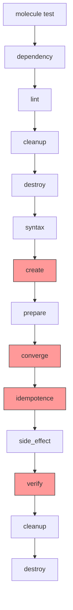

# How to Debug Molecule Test Failures

Author: [nawazdhandala](https://www.github.com/nawazdhandala)

Tags: Ansible, Molecule, Debugging, Testing, Troubleshooting

Description: Practical strategies for diagnosing and fixing Molecule test failures in Ansible role development with real debugging examples.

---

Molecule test failures can be frustrating, especially when the error messages are vague or the failure only happens in CI. Over the years of using Molecule to test Ansible roles, I have developed a systematic approach to debugging these failures. This post covers the most common failure types, the tools available for diagnosis, and practical examples of how to track down and fix problems.

## The Molecule Test Sequence

Before diving into debugging, it helps to understand the full Molecule test sequence and where failures can occur.



The highlighted stages (create, converge, idempotence, verify) are where most failures happen.

## Step 1: Run Individual Stages

The first thing to do when `molecule test` fails is to stop running the full sequence. Instead, run stages individually so you can inspect state between them.

```bash
# Create the test instance without running the full test
molecule create

# Run the converge step and keep the instance running
molecule converge

# If converge fails, you can SSH into the instance
molecule login

# Run the verify step separately
molecule verify

# When done debugging, destroy the instance
molecule destroy
```

Running `molecule converge` instead of `molecule test` is the most useful debugging technique. Unlike `test`, the `converge` command does not destroy the instance on failure, so you can poke around inside it.

## Step 2: Increase Verbosity

Molecule passes verbosity flags through to Ansible. Crank up the verbosity to see exactly what Ansible is doing.

```bash
# Standard verbose output
molecule converge -- -v

# More detailed (shows task parameters)
molecule converge -- -vv

# Maximum verbosity (shows connection details, full module args)
molecule converge -- -vvv
```

You can also enable Molecule's own debug output.

```bash
# Enable Molecule debug logging
molecule --debug converge
```

The Molecule debug flag shows you the exact commands it runs under the hood, which is helpful when the problem is in Molecule's interaction with the driver rather than in your Ansible code.

## Step 3: Log Into the Test Instance

When the converge step fails partway through, log into the running container to inspect its state.

```bash
# Start a shell in the default instance
molecule login

# If you have multiple instances, specify which one
molecule login --host centos8
```

Once inside, you can check:

```bash
# Check if a service is running
systemctl status nginx

# Look at config files your role created
cat /etc/nginx/nginx.conf

# Check package installation
rpm -qa | grep nginx   # RHEL/CentOS
dpkg -l | grep nginx   # Debian/Ubuntu

# Review system logs
journalctl -xe
```

## Debugging Common Failure Types

### Create Stage Failures

When the create stage fails, the issue is usually with Docker or the platform configuration.

```yaml
# molecule/default/molecule.yml - check your platform config
platforms:
  - name: instance
    image: geerlingguy/docker-ubuntu2204-ansible:latest
    # Common mistake: using an image that does not have systemd
    # Use geerlingguy images for systemd support
    command: ""
    volumes:
      - /sys/fs/cgroup:/sys/fs/cgroup:rw
    cgroupns_mode: host
    privileged: true
    pre_build_image: true
```

Common create failures:

```bash
# Docker daemon not running
# Fix: start Docker
sudo systemctl start docker

# Image not found
# Fix: check image name and pull it manually
docker pull geerlingguy/docker-ubuntu2204-ansible:latest

# Port conflicts
# Fix: check if another instance is using the same ports
docker ps -a
```

### Converge Stage Failures

Converge failures are the most common. The role itself has a bug or a dependency issue.

```bash
# Re-run converge with verbose output to see exactly which task fails
molecule converge -- -vvv

# Check if it is a specific task by running converge with a tag
molecule converge -- --tags "install"
```

A useful technique is to add temporary debug tasks to your role.

```yaml
# Add debug tasks to your role temporarily
- name: Debug variable values
  ansible.builtin.debug:
    msg: |
      nginx_version: {{ nginx_version | default('undefined') }}
      nginx_config_path: {{ nginx_config_path | default('undefined') }}
      ansible_os_family: {{ ansible_os_family }}

- name: Check if file exists before modifying it
  ansible.builtin.stat:
    path: /etc/nginx/nginx.conf
  register: nginx_conf_stat

- name: Show file stat results
  ansible.builtin.debug:
    var: nginx_conf_stat
```

### Idempotence Failures

Idempotence failures mean your role reports changes on the second run. This is a code quality issue rather than a functional bug.

```bash
# Run converge twice and compare output
molecule converge
molecule converge

# Or run the idempotence check specifically
molecule idempotence
```

Common causes of idempotence failures:

```yaml
# BAD: shell/command modules always report changed
- name: Set timezone
  ansible.builtin.command: timedatectl set-timezone UTC

# GOOD: use the proper module, which is idempotent
- name: Set timezone
  community.general.timezone:
    name: UTC

# BAD: using shell to modify files
- name: Add line to config
  ansible.builtin.shell: echo "option=value" >> /etc/myapp.conf

# GOOD: use lineinfile which checks before modifying
- name: Add line to config
  ansible.builtin.lineinfile:
    path: /etc/myapp.conf
    line: "option=value"
```

### Verify Stage Failures

Verify failures mean the role completed but the result is not what you expected. The debugging approach depends on your verifier.

For Testinfra (Python):

```python
# molecule/default/tests/test_default.py
import pytest

def test_nginx_installed(host):
    nginx = host.package("nginx")
    assert nginx.is_installed

def test_nginx_running(host):
    nginx = host.service("nginx")
    assert nginx.is_running
    assert nginx.is_enabled

def test_nginx_config(host):
    config = host.file("/etc/nginx/nginx.conf")
    assert config.exists
    assert config.contains("worker_processes")
    # Add debug output for failing assertions
    if not config.contains("worker_processes"):
        print(f"Config content: {config.content_string}")
```

Run Testinfra with verbose output.

```bash
# Run verify with verbose pytest output
molecule verify -- -v --tb=long
```

For the default Ansible verifier:

```yaml
# molecule/default/verify.yml
- name: Verify
  hosts: all
  gather_facts: true
  tasks:
    - name: Check nginx is installed
      ansible.builtin.package:
        name: nginx
        state: present
      check_mode: true
      register: nginx_check

    - name: Assert nginx is installed
      ansible.builtin.assert:
        that:
          - not nginx_check.changed
        fail_msg: "nginx is not installed"
        success_msg: "nginx is installed"
```

## Using the Molecule Ephemeral Directory

Molecule stores temporary files in an ephemeral directory. This can be useful for debugging.

```bash
# Find the ephemeral directory location
molecule --debug create 2>&1 | grep ephemeral

# The directory typically lives at
# ~/.cache/molecule/<role-name>/<scenario-name>/

# Inside you will find:
# - inventory/ - the generated inventory
# - state.yml - current instance state
# - ansible.cfg - generated Ansible config
ls -la ~/.cache/molecule/my-role/default/
```

Inspect the generated inventory to make sure Molecule is connecting to the right instances.

```bash
cat ~/.cache/molecule/my-role/default/inventory/ansible_inventory.yml
```

## Environment-Specific Debugging

Sometimes tests pass locally but fail in CI. The usual suspects are:

1. **Different Docker versions**: Check `docker version` in both environments
2. **Missing environment variables**: CI might not have the same vars as your local shell
3. **Network issues**: CI runners might not be able to pull images from certain registries
4. **Resource constraints**: CI runners often have less memory and CPU than your workstation

```bash
# Add diagnostic output at the start of your CI job
docker version
docker info
python3 --version
molecule --version
ansible --version
```

## The Nuclear Option: molecule reset

When things get really stuck and you cannot even destroy instances properly, use reset.

```bash
# Force-remove all Molecule-managed state
molecule reset

# If that does not work, clean up Docker manually
docker ps -a --filter "label=creator=molecule" -q | xargs docker rm -f
docker network ls --filter "label=creator=molecule" -q | xargs docker network rm
```

Debugging Molecule test failures comes down to isolating which stage fails, increasing verbosity, and inspecting the test instance directly. The ability to run `molecule converge` and then `molecule login` is your most powerful debugging tool. Start there, and most failures will become obvious within a few minutes.
