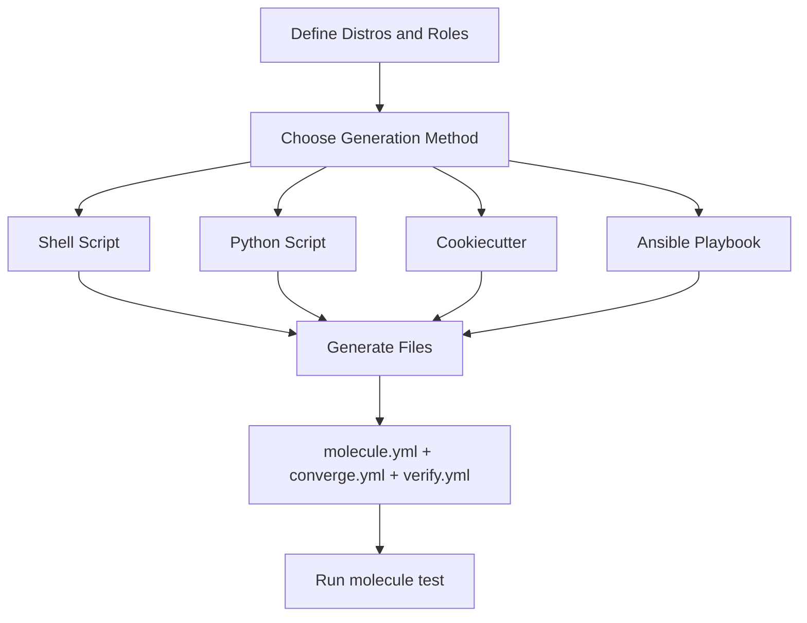

# How to Generate Molecule Scenarios Automatically

Author: [nawazdhandala](https://www.github.com/nawazdhandala)

Tags: Ansible, Molecule, Automation, Testing, Scaffolding

Description: Automate Molecule scenario generation with scripts, templates, and cookiecutter to standardize testing across your Ansible roles.

---

When you manage dozens of Ansible roles, creating Molecule scenarios by hand for each one gets tedious. The files are mostly the same: molecule.yml, converge.yml, verify.yml, and maybe prepare.yml. Automating this saves time and ensures consistency. In this post, I will show several approaches to generating Molecule scenarios automatically, from simple shell scripts to more sophisticated template-based solutions.

## The Molecule Init Command

Molecule ships with a built-in init command that creates the basic scenario structure.

```bash
# Initialize a new role with Molecule scenario
molecule init role my_role --driver-name docker

# Add a new scenario to an existing role
cd my_role
molecule init scenario multi-node --driver-name docker
```

This creates a basic structure.

```
molecule/
  multi-node/
    converge.yml
    molecule.yml
```

The default templates are minimal though. Let us do better.

## Custom Shell Script Generator

Here is a shell script that generates a complete Molecule scenario with all the files you typically need.

```bash
#!/bin/bash
# generate-molecule-scenario.sh
# Usage: ./generate-molecule-scenario.sh <scenario-name> [distro]

set -euo pipefail

SCENARIO_NAME="${1:?Usage: $0 <scenario-name> [distro]}"
DISTRO="${2:-ubuntu2204}"
MOLECULE_DIR="molecule/${SCENARIO_NAME}"

# Map distro names to images
declare -A DISTRO_IMAGES
DISTRO_IMAGES[ubuntu2204]="geerlingguy/docker-ubuntu2204-ansible:latest"
DISTRO_IMAGES[ubuntu2404]="geerlingguy/docker-ubuntu2404-ansible:latest"
DISTRO_IMAGES[centos9]="geerlingguy/docker-centos9-ansible:latest"
DISTRO_IMAGES[debian12]="geerlingguy/docker-debian12-ansible:latest"

IMAGE="${DISTRO_IMAGES[$DISTRO]:-geerlingguy/docker-ubuntu2204-ansible:latest}"

# Create scenario directory
mkdir -p "${MOLECULE_DIR}"

echo "Generating Molecule scenario: ${SCENARIO_NAME} (${DISTRO})"

# Generate molecule.yml
cat > "${MOLECULE_DIR}/molecule.yml" << YAML
---
dependency:
  name: galaxy
  options:
    requirements-file: requirements.yml
    force: false

driver:
  name: docker

platforms:
  - name: ${SCENARIO_NAME}-${DISTRO}
    image: ${IMAGE}
    pre_build_image: true
    privileged: true
    cgroupns_mode: host
    volumes:
      - /sys/fs/cgroup:/sys/fs/cgroup:rw
    tmpfs:
      - /run
      - /tmp

provisioner:
  name: ansible
  config_options:
    defaults:
      callbacks_enabled: timer, profile_tasks
      gathering: smart
      interpreter_python: auto_silent
  env:
    ANSIBLE_FORCE_COLOR: "true"

verifier:
  name: ansible

scenario:
  name: ${SCENARIO_NAME}
  test_sequence:
    - dependency
    - destroy
    - create
    - prepare
    - converge
    - idempotence
    - verify
    - destroy
YAML

# Generate converge.yml
ROLE_NAME=$(basename "$(pwd)")
cat > "${MOLECULE_DIR}/converge.yml" << YAML
---
- name: Converge
  hosts: all
  become: true
  roles:
    - role: ${ROLE_NAME}
YAML

# Generate verify.yml
cat > "${MOLECULE_DIR}/verify.yml" << YAML
---
- name: Verify
  hosts: all
  become: true
  gather_facts: true
  tasks:
    - name: Include verify tasks
      ansible.builtin.debug:
        msg: "Add your verification tasks here"
YAML

# Generate prepare.yml
cat > "${MOLECULE_DIR}/prepare.yml" << YAML
---
- name: Prepare
  hosts: all
  become: true
  tasks:
    - name: Update package cache
      ansible.builtin.apt:
        update_cache: true
        cache_valid_time: 3600
      when: ansible_os_family == 'Debian'
YAML

echo "Scenario created at ${MOLECULE_DIR}/"
echo "Files: molecule.yml, converge.yml, verify.yml, prepare.yml"
```

```bash
# Make it executable and use it
chmod +x generate-molecule-scenario.sh
./generate-molecule-scenario.sh default ubuntu2204
./generate-molecule-scenario.sh centos centos9
./generate-molecule-scenario.sh multi-node ubuntu2204
```

## Python Script for Multi-Distro Generation

For generating scenarios across multiple distributions at once, a Python script is more flexible.

```python
#!/usr/bin/env python3
"""generate_scenarios.py - Generate Molecule scenarios for multiple distros."""

import os
import yaml
from pathlib import Path

# Configuration
DISTROS = {
    "ubuntu2204": {
        "image": "geerlingguy/docker-ubuntu2204-ansible:latest",
        "family": "Debian",
    },
    "ubuntu2404": {
        "image": "geerlingguy/docker-ubuntu2404-ansible:latest",
        "family": "Debian",
    },
    "centos9": {
        "image": "geerlingguy/docker-centos9-ansible:latest",
        "family": "RedHat",
    },
    "debian12": {
        "image": "geerlingguy/docker-debian12-ansible:latest",
        "family": "Debian",
    },
}

def get_role_name():
    """Get the role name from the current directory."""
    return os.path.basename(os.getcwd())

def generate_molecule_yml(distro_name, distro_config, scenario_name):
    """Generate molecule.yml content."""
    config = {
        "dependency": {"name": "galaxy"},
        "driver": {"name": "docker"},
        "platforms": [
            {
                "name": f"{scenario_name}-{distro_name}",
                "image": distro_config["image"],
                "pre_build_image": True,
                "privileged": True,
                "cgroupns_mode": "host",
                "volumes": ["/sys/fs/cgroup:/sys/fs/cgroup:rw"],
                "tmpfs": ["/run", "/tmp"],
            }
        ],
        "provisioner": {
            "name": "ansible",
            "config_options": {
                "defaults": {
                    "callbacks_enabled": "timer, profile_tasks",
                    "interpreter_python": "auto_silent",
                }
            },
        },
        "verifier": {"name": "ansible"},
    }
    return yaml.dump(config, default_flow_style=False, sort_keys=False)

def generate_converge_yml():
    """Generate converge.yml content."""
    role_name = get_role_name()
    return f"""---
- name: Converge
  hosts: all
  become: true
  roles:
    - role: {role_name}
"""

def generate_verify_yml():
    """Generate verify.yml content."""
    return """---
- name: Verify
  hosts: all
  become: true
  gather_facts: true
  tasks:
    - name: Gather service facts
      ansible.builtin.service_facts:

    - name: Gather package facts
      ansible.builtin.package_facts:
"""

def generate_scenario(distro_name, distro_config):
    """Generate a complete scenario for a distro."""
    scenario_dir = Path("molecule") / distro_name
    scenario_dir.mkdir(parents=True, exist_ok=True)

    # molecule.yml
    (scenario_dir / "molecule.yml").write_text(
        generate_molecule_yml(distro_name, distro_config, distro_name)
    )

    # converge.yml
    (scenario_dir / "converge.yml").write_text(generate_converge_yml())

    # verify.yml
    (scenario_dir / "verify.yml").write_text(generate_verify_yml())

    print(f"Generated scenario: {scenario_dir}")

def main():
    for distro_name, distro_config in DISTROS.items():
        generate_scenario(distro_name, distro_config)
    print(f"\nGenerated {len(DISTROS)} scenarios.")

if __name__ == "__main__":
    main()
```

```bash
python3 generate_scenarios.py
```

## Cookiecutter Template

For team-wide standardization, use Cookiecutter to create a template that everyone uses.

```
# Directory structure for the cookiecutter template
molecule-scenario-template/
  cookiecutter.json
  {{cookiecutter.scenario_name}}/
    molecule.yml
    converge.yml
    verify.yml
    prepare.yml
```

```json
{
    "scenario_name": "default",
    "distro": "ubuntu2204",
    "distro_image": "geerlingguy/docker-ubuntu2204-ansible:latest",
    "role_name": "my_role",
    "privileged": true,
    "use_systemd": true,
    "verifier": "ansible"
}
```

```yaml
# {{cookiecutter.scenario_name}}/molecule.yml
---
dependency:
  name: galaxy

driver:
  name: docker

platforms:
  - name: "{{ '{{' }} cookiecutter.scenario_name {{ '}}' }}-instance"
    image: "{{ '{{' }} cookiecutter.distro_image {{ '}}' }}"
    pre_build_image: true

    privileged: true
    cgroupns_mode: host
    volumes:
      - /sys/fs/cgroup:/sys/fs/cgroup:rw


provisioner:
  name: ansible

verifier:
  name: "{{ '{{' }} cookiecutter.verifier {{ '}}' }}"
```

```bash
# Generate a new scenario from the template
pip install cookiecutter
cookiecutter molecule-scenario-template/ \
  --no-input \
  scenario_name=default \
  distro_image="geerlingguy/docker-ubuntu2204-ansible:latest" \
  role_name=$(basename $(pwd))
```

## Makefile for Batch Generation

When you need to generate scenarios for many roles at once, a Makefile coordinates the work.

```makefile
# Makefile - Generate Molecule scenarios for all roles
ROLES_DIR := roles
ROLES := $(shell ls -d $(ROLES_DIR)/*)
DISTROS := ubuntu2204 centos9 debian12

.PHONY: generate-all
generate-all: $(foreach role,$(ROLES),$(foreach distro,$(DISTROS),generate-$(notdir $(role))-$(distro)))

generate-%-ubuntu2204:
	@echo "Generating ubuntu2204 scenario for $*"
	@cd $(ROLES_DIR)/$* && ../../generate-molecule-scenario.sh ubuntu2204 ubuntu2204

generate-%-centos9:
	@echo "Generating centos9 scenario for $*"
	@cd $(ROLES_DIR)/$* && ../../generate-molecule-scenario.sh centos9 centos9

generate-%-debian12:
	@echo "Generating debian12 scenario for $*"
	@cd $(ROLES_DIR)/$* && ../../generate-molecule-scenario.sh debian12 debian12

.PHONY: list-roles
list-roles:
	@for role in $(ROLES); do echo "  - $$(basename $$role)"; done
```

## Scenario Generation with Ansible Itself

You can use Ansible to generate Molecule scenarios. This is fitting since you are already in the Ansible ecosystem.

```yaml
# generate-scenarios.yml - Ansible playbook to generate Molecule scenarios
---
- name: Generate Molecule Scenarios
  hosts: localhost
  connection: local
  gather_facts: false
  vars:
    roles_directory: ./roles
    distros:
      - name: ubuntu2204
        image: geerlingguy/docker-ubuntu2204-ansible:latest
      - name: centos9
        image: geerlingguy/docker-centos9-ansible:latest

  tasks:
    - name: Find all roles
      ansible.builtin.find:
        paths: "{{ roles_directory }}"
        file_type: directory
        depth: 1
      register: found_roles

    - name: Create scenario directories
      ansible.builtin.file:
        path: "{{ item.0.path }}/molecule/{{ item.1.name }}"
        state: directory
        mode: '0755'
      loop: "{{ found_roles.files | product(distros) | list }}"

    - name: Generate molecule.yml for each scenario
      ansible.builtin.template:
        src: templates/molecule.yml.j2
        dest: "{{ item.0.path }}/molecule/{{ item.1.name }}/molecule.yml"
        mode: '0644'
      loop: "{{ found_roles.files | product(distros) | list }}"
      vars:
        role_name: "{{ item.0.path | basename }}"
        distro: "{{ item.1 }}"

    - name: Generate converge.yml for each scenario
      ansible.builtin.template:
        src: templates/converge.yml.j2
        dest: "{{ item.0.path }}/molecule/{{ item.1.name }}/converge.yml"
        mode: '0644'
      loop: "{{ found_roles.files | product(distros) | list }}"
      vars:
        role_name: "{{ item.0.path | basename }}"
```

The flow for automated scenario generation looks like this:



Automating Molecule scenario generation is one of those investments that pays for itself quickly. Whether you go with a simple shell script or a full template system depends on your team size and how many roles you manage. Start simple with the shell script approach and upgrade to Cookiecutter or Ansible-based generation when you need more consistency across a larger role collection.
