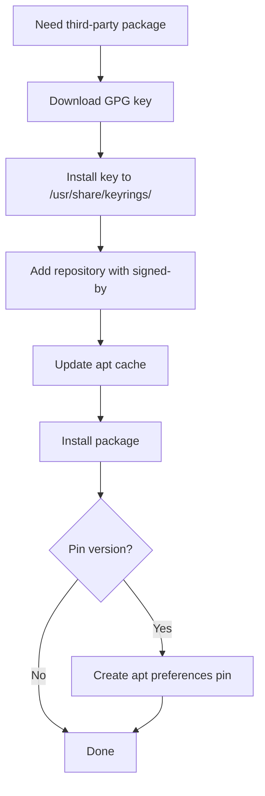

# How to Add APT Repositories with the Ansible apt_repository Module

Author: [nawazdhandala](https://www.github.com/nawazdhandala)

Tags: Ansible, apt, Ubuntu, Repositories

Description: A practical guide to adding, removing, and managing APT repositories using the Ansible apt_repository module on Debian and Ubuntu.

---

Most software you install on Ubuntu and Debian comes from the default system repositories. But plenty of tools like Docker, Node.js, PostgreSQL, and many others need their own repositories added first. The Ansible `apt_repository` module handles this cleanly, and this post shows you how to use it for common scenarios.

## Basic Repository Addition

The simplest case is adding a PPA (Personal Package Archive) on Ubuntu:

```yaml
# Add a PPA repository for the latest Git version
- name: Add Git PPA
  ansible.builtin.apt_repository:
    repo: ppa:git-core/ppa
    state: present
    update_cache: yes
```

The `update_cache: yes` parameter automatically runs `apt-get update` after adding the repository, so packages from the new repo are immediately available.

## Adding a Third-Party Repository

Most third-party software provides a repository URL in the deb-line format. Here is how to add the Docker repository:

```yaml
# Add the Docker CE repository for Ubuntu
- name: Add Docker GPG key
  ansible.builtin.apt_key:
    url: https://download.docker.com/linux/ubuntu/gpg
    state: present

- name: Add Docker repository
  ansible.builtin.apt_repository:
    repo: "deb [arch=amd64] https://download.docker.com/linux/ubuntu {{ ansible_distribution_release }} stable"
    state: present
    filename: docker-ce
    update_cache: yes
```

The `filename` parameter controls the name of the file created in `/etc/apt/sources.list.d/`. If you do not specify it, Ansible generates one from the repo URL, which can be ugly. Setting it explicitly makes things easier to manage.

## Adding Repositories with Signed-By

Modern Debian and Ubuntu systems prefer the `signed-by` method for GPG key management instead of the deprecated `apt-key` approach. Here is the recommended pattern:

```yaml
# Download the GPG key to a dedicated keyring file
- name: Download Node.js GPG key
  ansible.builtin.get_url:
    url: https://deb.nodesource.com/gpgkey/nodesource-repo.gpg.key
    dest: /tmp/nodesource.gpg.key

- name: Dearmor and install Node.js GPG key
  ansible.builtin.command:
    cmd: gpg --dearmor -o /usr/share/keyrings/nodesource.gpg /tmp/nodesource.gpg.key
    creates: /usr/share/keyrings/nodesource.gpg

# Add the repository with signed-by pointing to the keyring
- name: Add Node.js 20.x repository
  ansible.builtin.apt_repository:
    repo: "deb [arch=amd64 signed-by=/usr/share/keyrings/nodesource.gpg] https://deb.nodesource.com/node_20.x nodistro main"
    state: present
    filename: nodesource
    update_cache: yes
```

This approach is more secure because the GPG key only authenticates packages from that specific repository, not from all repositories on the system.

## Adding Multiple Repositories

When you need several repositories, use a loop:

```yaml
# Add multiple repositories in a single task
- name: Add custom repositories
  ansible.builtin.apt_repository:
    repo: "{{ item.repo }}"
    state: present
    filename: "{{ item.filename }}"
  loop:
    - repo: "deb [arch=amd64] https://packages.grafana.com/oss/deb stable main"
      filename: grafana
    - repo: "deb [arch=amd64] https://apt.releases.hashicorp.com {{ ansible_distribution_release }} main"
      filename: hashicorp
    - repo: "deb [arch=amd64] https://packages.elastic.co/beats/apt stable main"
      filename: elastic-beats
  notify: update apt cache

# Use a handler to avoid running apt-get update three times
# handlers/main.yml
# - name: update apt cache
#   ansible.builtin.apt:
#     update_cache: yes
```

Using a handler for the cache update is smarter here. Without it, each loop iteration would trigger a full `apt-get update`, which wastes time. The handler runs once at the end.

## Removing Repositories

To remove a repository, set `state: absent`:

```yaml
# Remove a repository that is no longer needed
- name: Remove old Node.js 16.x repository
  ansible.builtin.apt_repository:
    repo: "deb [arch=amd64 signed-by=/usr/share/keyrings/nodesource.gpg] https://deb.nodesource.com/node_16.x nodistro main"
    state: absent
    filename: nodesource-16
    update_cache: yes
```

If you specified a `filename` when adding the repository, you must use the same filename when removing it. Otherwise, Ansible will not find the right file to delete.

## Repository Management for Different Ubuntu Versions

When your inventory spans multiple Ubuntu versions, use `ansible_distribution_release` to handle the differences:

```yaml
# Add PostgreSQL repository that works across Ubuntu versions
- name: Add PostgreSQL repository
  ansible.builtin.apt_repository:
    repo: "deb [arch=amd64 signed-by=/usr/share/keyrings/postgresql.gpg] http://apt.postgresql.org/pub/repos/apt {{ ansible_distribution_release }}-pgdg main"
    state: present
    filename: pgdg
    update_cache: yes
```

For repos that do not have builds for every Ubuntu release, add a conditional:

```yaml
# Only add the repo on supported distributions
- name: Add custom repository for supported releases
  ansible.builtin.apt_repository:
    repo: "deb [arch=amd64] https://packages.example.com/apt {{ ansible_distribution_release }} main"
    state: present
    filename: example
  when: ansible_distribution_release in ['focal', 'jammy', 'noble']
```

## Complete Example: Setting Up the HashiCorp Repository

Here is a full workflow for adding the HashiCorp repository and installing Terraform:

```yaml
# Full workflow: GPG key + repository + package installation
- name: Set up HashiCorp repository and install Terraform
  hosts: all
  become: yes
  tasks:
    - name: Install prerequisites
      ansible.builtin.apt:
        name:
          - gnupg
          - software-properties-common
          - curl
        state: present

    - name: Download HashiCorp GPG key
      ansible.builtin.get_url:
        url: https://apt.releases.hashicorp.com/gpg
        dest: /tmp/hashicorp.gpg.key

    - name: Install HashiCorp GPG key
      ansible.builtin.command:
        cmd: gpg --dearmor -o /usr/share/keyrings/hashicorp-archive-keyring.gpg /tmp/hashicorp.gpg.key
        creates: /usr/share/keyrings/hashicorp-archive-keyring.gpg

    - name: Add HashiCorp repository
      ansible.builtin.apt_repository:
        repo: "deb [arch=amd64 signed-by=/usr/share/keyrings/hashicorp-archive-keyring.gpg] https://apt.releases.hashicorp.com {{ ansible_distribution_release }} main"
        state: present
        filename: hashicorp
        update_cache: yes

    - name: Install Terraform
      ansible.builtin.apt:
        name: terraform
        state: present
```

## Handling Repository Errors

Sometimes a repository might be temporarily unavailable. You can handle this gracefully:

```yaml
# Add repository with error handling
- name: Add monitoring repository
  ansible.builtin.apt_repository:
    repo: "deb [arch=amd64] https://packages.example.com/apt {{ ansible_distribution_release }} main"
    state: present
    filename: monitoring
    update_cache: yes
  register: repo_result
  retries: 3
  delay: 10
  until: repo_result is succeeded
```

The retry logic is useful for CI/CD environments or cloud instances where DNS resolution or network connectivity might not be immediately available.

## Repository Management Flow



## Best Practices

1. **Always use `filename` parameter.** Auto-generated filenames based on URLs are hard to manage and audit.
2. **Use `signed-by` instead of `apt-key`.** The `apt-key` command is deprecated and will be removed in future Debian/Ubuntu releases.
3. **Store GPG keys in `/usr/share/keyrings/`.** This is the conventional location for repository signing keys on modern Debian systems.
4. **Use handlers for cache updates in loops.** Running `apt-get update` once after adding all repositories is more efficient than updating after each one.
5. **Test repository additions in a container first.** A broken repository line can cause all `apt` operations to fail, which locks you out of installing anything until you fix it.

The `apt_repository` module takes care of the tedious parts of repository management. Combined with proper GPG key handling and version pinning, you get a solid foundation for managing third-party software across your fleet.
