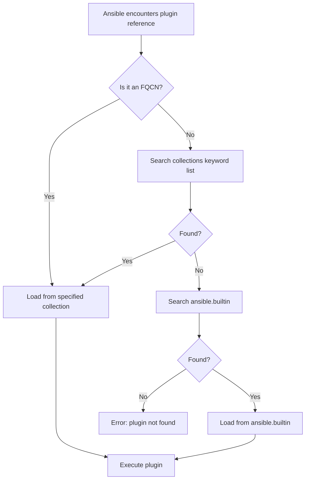

# How to Add Plugins to an Ansible Collection

Author: [nawazdhandala](https://www.github.com/nawazdhandala)

Tags: Ansible, Collections, Plugins, Filter Plugins, Lookup Plugins

Description: How to write and add various plugin types to an Ansible collection including filter, lookup, callback, inventory, and connection plugins.

---

Modules get most of the attention in Ansible, but plugins are what make the engine truly flexible. Plugins run on the control node and extend Ansible's core functionality: transforming data with filters, fetching values with lookups, customizing output with callbacks, loading inventory from dynamic sources, and more.

Adding plugins to a collection follows the same pattern as modules, but each plugin type has its own base class and conventions. This post walks through the most commonly written plugin types with working code examples.

## Plugin Types and Their Directories

Each plugin type goes in a specific subdirectory under `plugins/`:

```
plugins/
  filter/          # Transform data in Jinja2 expressions
  lookup/          # Retrieve data from external sources
  callback/        # Customize Ansible output and events
  inventory/       # Dynamic inventory sources
  connection/      # Define how to connect to hosts
  action/          # Control task execution flow
  cache/           # Cache data between runs
  test/            # Jinja2 test plugins
  vars/            # Load extra variables
  become/          # Privilege escalation methods
  strategy/        # Control play execution strategy
```

Most collection authors will primarily work with filter, lookup, callback, and inventory plugins. The others are more specialized.

## Filter Plugins

Filter plugins are the most commonly written plugin type. They are simple Python functions that Jinja2 can call to transform data.

Here is a filter plugin with several useful data transformation functions:

```python
# plugins/filter/data_filters.py
# Filter plugins for common data transformations

from __future__ import absolute_import, division, print_function
__metaclass__ = type

import hashlib
import re


def mask_sensitive(value, visible_chars=4, mask_char="*"):
    """Mask a string, showing only the last N characters.
    Useful for logging sensitive values safely.
    """
    value = str(value)
    if len(value) <= visible_chars:
        return mask_char * len(value)
    masked_length = len(value) - visible_chars
    return (mask_char * masked_length) + value[-visible_chars:]


def to_tag_dict(tag_list):
    """Convert a list of 'key=value' strings to a dictionary.
    Common when parsing cloud resource tags.
    """
    result = {}
    for item in tag_list:
        if "=" in item:
            key, value = item.split("=", 1)
            result[key.strip()] = value.strip()
    return result


def slugify(value):
    """Convert a string to a URL-safe slug."""
    value = str(value).lower().strip()
    value = re.sub(r"[^\w\s-]", "", value)
    value = re.sub(r"[\s_]+", "-", value)
    value = re.sub(r"-+", "-", value)
    return value.strip("-")


def sha256_hash(value):
    """Generate a SHA-256 hash of a string."""
    return hashlib.sha256(str(value).encode()).hexdigest()


class FilterModule(object):
    """Custom filters for data transformation."""

    def filters(self):
        return {
            "mask_sensitive": mask_sensitive,
            "to_tag_dict": to_tag_dict,
            "slugify": slugify,
            "sha256_hash": sha256_hash,
        }
```

Usage in a playbook:

```yaml
# Using custom filter plugins from the collection
---
- name: Demonstrate custom filters
  hosts: localhost
  vars:
    api_key: "sk-abc123def456ghi789"
    raw_tags:
      - "env=production"
      - "team=platform"
      - "cost_center=eng-42"
    app_title: "My Awesome Application!"
  tasks:
    - name: Mask the API key for safe logging
      ansible.builtin.debug:
        msg: "API Key: {{ api_key | my_namespace.my_collection.mask_sensitive(4) }}"
      # Output: API Key: ***************h789

    - name: Convert tag list to dictionary
      ansible.builtin.debug:
        msg: "{{ raw_tags | my_namespace.my_collection.to_tag_dict }}"
      # Output: {"env": "production", "team": "platform", "cost_center": "eng-42"}

    - name: Generate URL slug
      ansible.builtin.debug:
        msg: "{{ app_title | my_namespace.my_collection.slugify }}"
      # Output: my-awesome-application
```

## Lookup Plugins

Lookup plugins fetch data from external sources and return it to the playbook. They run on the control node and are called using the `lookup()` or `query()` functions.

Here is a lookup plugin that reads configuration from an INI file:

```python
# plugins/lookup/ini_section.py
# Lookup plugin to read entire sections from INI files

from __future__ import absolute_import, division, print_function
__metaclass__ = type

DOCUMENTATION = r"""
---
name: ini_section
short_description: Read all key-value pairs from an INI file section
version_added: "1.0.0"
description:
  - Returns a dictionary of all keys and values from a specified section
    in an INI configuration file.
options:
  _terms:
    description: Path to the INI file.
    required: true
  section:
    description: The section name to read.
    required: true
    type: str
author:
  - DevOps Team (@devops)
"""

EXAMPLES = r"""
- name: Read database section from config
  ansible.builtin.debug:
    msg: "{{ lookup('my_namespace.my_collection.ini_section', '/etc/app/config.ini', section='database') }}"
"""

RETURN = r"""
_raw:
  description: Dictionary of key-value pairs from the INI section.
  type: dict
"""

try:
    import configparser
except ImportError:
    import ConfigParser as configparser

from ansible.errors import AnsibleError
from ansible.plugins.lookup import LookupBase


class LookupModule(LookupBase):
    def run(self, terms, variables=None, **kwargs):
        self.set_options(var_options=variables, direct=kwargs)
        section = self.get_option("section")

        results = []
        for ini_file in terms:
            config = configparser.ConfigParser()
            try:
                config.read(ini_file)
            except Exception as e:
                raise AnsibleError(f"Error reading {ini_file}: {str(e)}")

            if not config.has_section(section):
                raise AnsibleError(
                    f"Section '{section}' not found in {ini_file}. "
                    f"Available sections: {config.sections()}"
                )

            section_data = dict(config.items(section))
            results.append(section_data)

        return results
```

## Callback Plugins

Callback plugins let you customize what happens when Ansible events occur: task starts, task succeeds, play finishes, etc. They are powerful for custom logging, notifications, and metrics.

Here is a callback plugin that sends deployment notifications to a webhook:

```python
# plugins/callback/deploy_notify.py
# Callback plugin to send notifications when playbooks complete

from __future__ import absolute_import, division, print_function
__metaclass__ = type

DOCUMENTATION = r"""
---
name: deploy_notify
type: notification
short_description: Send webhook notifications on playbook completion
version_added: "1.0.0"
description:
  - Sends a POST request to a webhook URL when a playbook finishes.
  - Includes summary information about task results.
requirements:
  - Webhook URL set via DEPLOY_NOTIFY_WEBHOOK_URL environment variable
options:
  webhook_url:
    description: The webhook URL to send notifications to.
    env:
      - name: DEPLOY_NOTIFY_WEBHOOK_URL
    ini:
      - section: callback_deploy_notify
        key: webhook_url
author:
  - DevOps Team (@devops)
"""

import json
import os
from datetime import datetime

from ansible.plugins.callback import CallbackBase

try:
    from ansible.module_utils.urls import open_url
    HAS_OPEN_URL = True
except ImportError:
    HAS_OPEN_URL = False


class CallbackModule(CallbackBase):
    CALLBACK_VERSION = 2.0
    CALLBACK_TYPE = "notification"
    CALLBACK_NAME = "my_namespace.my_collection.deploy_notify"
    CALLBACK_NEEDS_WHITELIST = True

    def __init__(self):
        super(CallbackModule, self).__init__()
        self.webhook_url = os.environ.get("DEPLOY_NOTIFY_WEBHOOK_URL", "")
        self.start_time = None
        self.task_results = {"ok": 0, "changed": 0, "failed": 0, "skipped": 0}

    def v2_playbook_on_start(self, playbook):
        self.start_time = datetime.utcnow()
        self.playbook_name = os.path.basename(playbook._file_name)

    def v2_runner_on_ok(self, result, **kwargs):
        if result._result.get("changed", False):
            self.task_results["changed"] += 1
        else:
            self.task_results["ok"] += 1

    def v2_runner_on_failed(self, result, **kwargs):
        self.task_results["failed"] += 1

    def v2_runner_on_skipped(self, result, **kwargs):
        self.task_results["skipped"] += 1

    def v2_playbook_on_stats(self, stats):
        if not self.webhook_url or not HAS_OPEN_URL:
            return

        duration = (datetime.utcnow() - self.start_time).total_seconds()
        status = "success" if self.task_results["failed"] == 0 else "failure"

        payload = json.dumps({
            "playbook": self.playbook_name,
            "status": status,
            "duration_seconds": duration,
            "results": self.task_results,
            "timestamp": datetime.utcnow().isoformat(),
        })

        try:
            open_url(
                self.webhook_url,
                data=payload,
                headers={"Content-Type": "application/json"},
                method="POST",
            )
        except Exception:
            self._display.warning("Failed to send deploy notification")
```

Enable it in `ansible.cfg`:

```ini
# ansible.cfg - Enable the notification callback
[defaults]
callback_whitelist = my_namespace.my_collection.deploy_notify
```

## Inventory Plugins

Inventory plugins dynamically generate host lists from external sources. Here is a simplified inventory plugin that reads from a JSON API:

```python
# plugins/inventory/api_inventory.py
# Inventory plugin that fetches hosts from an internal API

from __future__ import absolute_import, division, print_function
__metaclass__ = type

DOCUMENTATION = r"""
---
name: api_inventory
short_description: Load inventory from internal host API
version_added: "1.0.0"
description:
  - Queries an internal API for host information.
  - Groups hosts by their reported environment and role.
options:
  api_url:
    description: URL of the host inventory API.
    required: true
    type: str
  api_token:
    description: Authentication token for the API.
    required: true
    type: str
author:
  - DevOps Team (@devops)
"""

import json

from ansible.plugins.inventory import BaseInventoryPlugin
from ansible.module_utils.urls import open_url
from ansible.errors import AnsibleParserError


class InventoryModule(BaseInventoryPlugin):
    NAME = "my_namespace.my_collection.api_inventory"

    def verify_file(self, path):
        """Verify that the inventory source file is valid."""
        valid = False
        if super(InventoryModule, self).verify_file(path):
            if path.endswith((".api_inventory.yml", ".api_inventory.yaml")):
                valid = True
        return valid

    def parse(self, inventory, loader, path, cache=True):
        super(InventoryModule, self).parse(inventory, loader, path, cache)
        self._read_config_data(path)

        api_url = self.get_option("api_url")
        api_token = self.get_option("api_token")

        headers = {
            "Authorization": f"Bearer {api_token}",
            "Content-Type": "application/json",
        }

        try:
            response = open_url(f"{api_url}/hosts", headers=headers)
            hosts = json.loads(response.read())
        except Exception as e:
            raise AnsibleParserError(f"Failed to fetch inventory: {str(e)}")

        for host_data in hosts:
            hostname = host_data["hostname"]
            self.inventory.add_host(hostname)

            # Set host variables
            for key, value in host_data.get("variables", {}).items():
                self.inventory.set_variable(hostname, key, value)

            # Add to environment group
            env = host_data.get("environment", "ungrouped")
            self.inventory.add_group(env)
            self.inventory.add_child(env, hostname)

            # Add to role group
            role = host_data.get("role", "ungrouped")
            self.inventory.add_group(role)
            self.inventory.add_child(role, hostname)
```

The inventory source file looks like this:

```yaml
# inventory.api_inventory.yml
---
plugin: my_namespace.my_collection.api_inventory
api_url: https://cmdb.internal.com/api
api_token: "{{ lookup('env', 'CMDB_TOKEN') }}"
```

## Plugin Resolution Flow



## Adding Documentation Fragments

If multiple plugins share common options (like connection parameters), use documentation fragments to avoid repetition:

```python
# plugins/doc_fragments/api_connection.py
# Shared documentation for API connection parameters

from __future__ import absolute_import, division, print_function
__metaclass__ = type


class ModuleDocFragment(object):
    DOCUMENTATION = r"""
options:
  api_url:
    description: Base URL of the API endpoint.
    required: true
    type: str
  api_token:
    description: Authentication token.
    required: true
    type: str
    no_log: true
  validate_certs:
    description: Whether to validate SSL certificates.
    required: false
    type: bool
    default: true
"""
```

Reference it in your plugin's DOCUMENTATION:

```python
DOCUMENTATION = r"""
---
module: my_module
extends_documentation_fragment:
  - my_namespace.my_collection.api_connection
"""
```

## Conclusion

Adding plugins to a collection is about putting the right Python file in the right directory and implementing the correct base class. Filter plugins are simple functions wrapped in a `FilterModule` class. Lookup plugins extend `LookupBase`. Callback plugins extend `CallbackBase`. Inventory plugins extend `BaseInventoryPlugin`. Each type follows its own conventions, but the overall pattern is consistent: write the code, include documentation strings, place it in the correct `plugins/<type>/` directory, and Ansible discovers it automatically.
