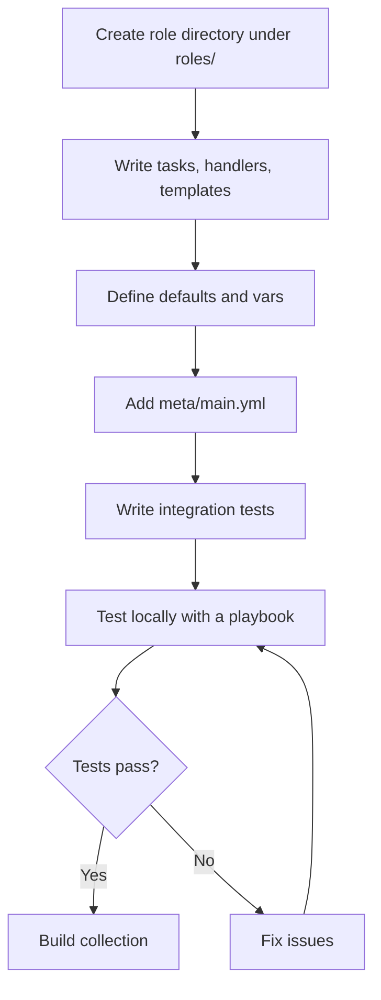

# How to Add Roles to an Ansible Collection

Author: [nawazdhandala](https://www.github.com/nawazdhandala)

Tags: Ansible, Collections, Roles, Configuration Management, DevOps

Description: How to include Ansible roles inside a collection with proper structure, variable scoping, dependencies, and cross-collection references.

---

Roles have been the primary way to organize reusable Ansible content for years. With collections, roles get a proper namespace and can be distributed alongside modules and plugins as a single package. Adding roles to a collection is straightforward if you already know how to write standalone roles, but there are a few differences in how they are structured and referenced.

This post covers how to add roles to a collection, how namespacing works, how to handle role dependencies, and the gotchas you should watch out for.

## Role Location in a Collection

Roles live in the `roles/` directory at the root of your collection:

```
my_namespace/my_collection/
  galaxy.yml
  plugins/
    modules/
  roles/
    webserver/
      tasks/
        main.yml
      defaults/
        main.yml
      handlers/
        main.yml
      templates/
      files/
      meta/
        main.yml
      vars/
        main.yml
    database/
      tasks/
        main.yml
      defaults/
        main.yml
      ...
```

Each subdirectory under `roles/` is a separate role. The directory name becomes the role name. Users reference it as `my_namespace.my_collection.webserver`.

## Writing a Collection Role: Practical Example

Let me build a complete role that sets up an Nginx reverse proxy. This is the kind of role that belongs in an infrastructure collection.

Start with the default variables:

```yaml
# roles/nginx_proxy/defaults/main.yml
# Default variables for the nginx_proxy role
---
nginx_proxy_listen_port: 80
nginx_proxy_ssl_enabled: false
nginx_proxy_ssl_port: 443
nginx_proxy_ssl_certificate: ""
nginx_proxy_ssl_certificate_key: ""
nginx_proxy_worker_processes: auto
nginx_proxy_worker_connections: 1024
nginx_proxy_upstreams: []
nginx_proxy_sites: []
nginx_proxy_log_dir: /var/log/nginx
nginx_proxy_access_log_format: combined
```

Now the main task file:

```yaml
# roles/nginx_proxy/tasks/main.yml
# Main tasks for setting up Nginx as a reverse proxy
---
- name: Install Nginx package
  ansible.builtin.package:
    name: nginx
    state: present

- name: Create log directory
  ansible.builtin.file:
    path: "{{ nginx_proxy_log_dir }}"
    state: directory
    owner: nginx
    group: nginx
    mode: "0755"

- name: Deploy main nginx configuration
  ansible.builtin.template:
    src: nginx.conf.j2
    dest: /etc/nginx/nginx.conf
    owner: root
    group: root
    mode: "0644"
    validate: "nginx -t -c %s"
  notify: reload nginx

- name: Deploy upstream configurations
  ansible.builtin.template:
    src: upstream.conf.j2
    dest: "/etc/nginx/conf.d/upstream_{{ item.name }}.conf"
    owner: root
    group: root
    mode: "0644"
  loop: "{{ nginx_proxy_upstreams }}"
  notify: reload nginx

- name: Deploy site configurations
  ansible.builtin.template:
    src: site.conf.j2
    dest: "/etc/nginx/conf.d/{{ item.server_name }}.conf"
    owner: root
    group: root
    mode: "0644"
  loop: "{{ nginx_proxy_sites }}"
  notify: reload nginx

- name: Remove default site configuration
  ansible.builtin.file:
    path: /etc/nginx/conf.d/default.conf
    state: absent
  notify: reload nginx

- name: Ensure Nginx is started and enabled
  ansible.builtin.service:
    name: nginx
    state: started
    enabled: true
```

The handler for reloading Nginx:

```yaml
# roles/nginx_proxy/handlers/main.yml
# Handlers for the nginx_proxy role
---
- name: reload nginx
  ansible.builtin.service:
    name: nginx
    state: reloaded

- name: restart nginx
  ansible.builtin.service:
    name: nginx
    state: restarted
```

A template for the main Nginx config:

```nginx
# roles/nginx_proxy/templates/nginx.conf.j2
# Main Nginx configuration managed by Ansible
user nginx;
worker_processes {{ nginx_proxy_worker_processes }};
error_log {{ nginx_proxy_log_dir }}/error.log warn;
pid /run/nginx.pid;

events {
    worker_connections {{ nginx_proxy_worker_connections }};
    multi_accept on;
}

http {
    include /etc/nginx/mime.types;
    default_type application/octet-stream;

    log_format main '$remote_addr - $remote_user [$time_local] "$request" '
                    '$status $body_bytes_sent "$http_referer" '
                    '"$http_user_agent"';

    access_log {{ nginx_proxy_log_dir }}/access.log {{ nginx_proxy_access_log_format }};

    sendfile on;
    tcp_nopush on;
    tcp_nodelay on;
    keepalive_timeout 65;
    types_hash_max_size 2048;
    server_tokens off;

    include /etc/nginx/conf.d/*.conf;
}
```

And the site configuration template:

```nginx
# roles/nginx_proxy/templates/site.conf.j2
# Site configuration for {{ item.server_name }}
server {
    listen {{ nginx_proxy_listen_port }};
    server_name {{ item.server_name }};


    listen {{ nginx_proxy_ssl_port }} ssl;
    ssl_certificate {{ nginx_proxy_ssl_certificate }};
    ssl_certificate_key {{ nginx_proxy_ssl_certificate_key }};
    ssl_protocols TLSv1.2 TLSv1.3;
    ssl_ciphers HIGH:!aNULL:!MD5;


    access_log {{ nginx_proxy_log_dir }}/{{ item.server_name }}_access.log;
    error_log {{ nginx_proxy_log_dir }}/{{ item.server_name }}_error.log;


    location {{ location.path }} {
        proxy_pass {{ location.backend }};
        proxy_set_header Host $host;
        proxy_set_header X-Real-IP $remote_addr;
        proxy_set_header X-Forwarded-For $proxy_add_x_forwarded_for;
        proxy_set_header X-Forwarded-Proto $scheme;

        proxy_http_version 1.1;
        proxy_set_header Upgrade $http_upgrade;
        proxy_set_header Connection "upgrade";

    }

}
```

## Role Metadata

The `meta/main.yml` file defines role metadata and dependencies:

```yaml
# roles/nginx_proxy/meta/main.yml
# Role metadata for nginx_proxy
---
galaxy_info:
  role_name: nginx_proxy
  namespace: my_namespace
  description: Configure Nginx as a reverse proxy
  author: DevOps Team
  license: MIT
  min_ansible_version: "2.14"
  platforms:
    - name: EL
      versions:
        - "8"
        - "9"
    - name: Ubuntu
      versions:
        - focal
        - jammy
  galaxy_tags:
    - nginx
    - proxy
    - webserver

dependencies: []
```

## Using a Collection Role in a Playbook

Reference the role using its FQCN:

```yaml
# playbook.yml - Using the collection role
---
- name: Set up reverse proxy
  hosts: proxy_servers
  become: true
  roles:
    - role: my_namespace.my_collection.nginx_proxy
      vars:
        nginx_proxy_ssl_enabled: true
        nginx_proxy_ssl_certificate: /etc/ssl/certs/proxy.crt
        nginx_proxy_ssl_certificate_key: /etc/ssl/private/proxy.key
        nginx_proxy_upstreams:
          - name: app_backend
            servers:
              - 10.0.1.10:8080
              - 10.0.1.11:8080
              - 10.0.1.12:8080
        nginx_proxy_sites:
          - server_name: app.example.com
            locations:
              - path: /
                backend: http://app_backend
              - path: /ws
                backend: http://app_backend
                websocket: true
```

You can also use `include_role` or `import_role` with FQCNs:

```yaml
# Using include_role with FQCN
---
- name: Conditional role inclusion
  hosts: all
  become: true
  tasks:
    - name: Set up proxy only on designated hosts
      ansible.builtin.include_role:
        name: my_namespace.my_collection.nginx_proxy
      when: inventory_hostname in groups['proxy_servers']
      vars:
        nginx_proxy_listen_port: 8080
```

## Role Dependencies Within a Collection

If a role depends on another role in the same collection, reference it by FQCN in `meta/main.yml`:

```yaml
# roles/app_stack/meta/main.yml
# This role depends on the nginx_proxy role from the same collection
---
dependencies:
  - role: my_namespace.my_collection.nginx_proxy
    vars:
      nginx_proxy_listen_port: 80
  - role: my_namespace.my_collection.database_setup
    vars:
      db_engine: postgresql
```

For dependencies on roles in other collections:

```yaml
# roles/monitoring/meta/main.yml
# Cross-collection role dependency
---
dependencies:
  - role: community.grafana.grafana
    vars:
      grafana_port: 3000
```

Make sure the other collection is listed as a dependency in your `galaxy.yml`:

```yaml
# galaxy.yml - Declare collection-level dependencies
---
dependencies:
  community.grafana: ">=2.0.0"
```

## Differences Between Collection Roles and Standalone Roles

There are a few behavioral differences to be aware of:

**Variable precedence** works the same way. Role defaults have the lowest precedence, role vars are higher, and playbook vars override both.

**File lookups** in templates, files, and tasks are relative to the role directory within the collection, not the playbook directory. This is the same as standalone roles but worth confirming when you migrate an existing role into a collection.

**Handler names** should be unique within a play. If two collection roles define a handler with the same name, you might get unexpected behavior. Prefix handler names with the role name to avoid collisions:

```yaml
# Good practice: prefix handler names
- name: nginx_proxy | reload nginx
  ansible.builtin.service:
    name: nginx
    state: reloaded
```

**Ansible Galaxy role commands** (`ansible-galaxy role install`) do not work with collection roles. Collection roles are installed with `ansible-galaxy collection install` as part of the whole collection.

## Using FQCNs Inside Role Tasks

Always use FQCNs for module calls inside collection roles. This makes the role portable and avoids ambiguity:

```yaml
# roles/webserver/tasks/main.yml - Always use FQCNs
---
# Good: explicit FQCN
- name: Install package
  ansible.builtin.yum:
    name: httpd
    state: present

# Bad: short name creates ambiguity
- name: Install package
  yum:
    name: httpd
    state: present
```

## Testing Collection Roles

Write integration tests for your roles:

```yaml
# tests/integration/targets/nginx_proxy/tasks/main.yml
# Integration test for the nginx_proxy role
---
- name: Apply the nginx_proxy role
  ansible.builtin.include_role:
    name: my_namespace.my_collection.nginx_proxy
  vars:
    nginx_proxy_listen_port: 8888
    nginx_proxy_sites:
      - server_name: test.local
        locations:
          - path: /
            backend: http://127.0.0.1:9090

- name: Verify Nginx is running
  ansible.builtin.service_facts:

- name: Assert Nginx service is active
  ansible.builtin.assert:
    that:
      - ansible_facts.services['nginx.service'].state == 'running'
    fail_msg: "Nginx is not running"

- name: Verify Nginx is listening on configured port
  ansible.builtin.wait_for:
    port: 8888
    timeout: 10
```

Run tests with ansible-test:

```bash
# Run integration tests
ansible-test integration nginx_proxy --docker
```

## Workflow Overview



## Conclusion

Adding roles to a collection is essentially the same as writing standalone roles, with the bonus of namespacing and integrated distribution. Put them in `roles/<role_name>/`, use FQCNs for all module calls within the role, declare dependencies properly, and prefix handler names to avoid collisions. The role becomes available as `<namespace>.<collection>.<role_name>` once the collection is installed, which is much cleaner than managing individual role downloads.
