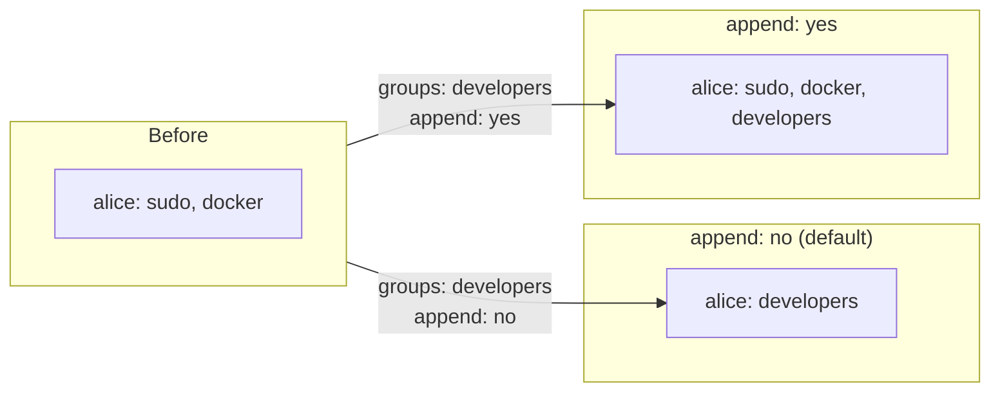

# How to Add Users to Groups with the Ansible user Module

Author: [nawazdhandala](https://www.github.com/nawazdhandala)

Tags: Ansible, User Management, Linux, Groups

Description: Learn how to add users to primary and supplementary groups using the Ansible user module, including the critical append parameter.

---

Group membership is how Linux controls access to files, devices, and system resources. Getting group assignments right is essential, especially when you are managing servers at scale. The Ansible `user` module provides a clean way to manage both primary and supplementary group memberships, but there is one parameter that trips up nearly everyone the first time: `append`. Let me walk you through how group management works with the `user` module.

## Primary vs Supplementary Groups

Every Linux user has exactly one primary group and can belong to zero or more supplementary groups. The primary group is what gets assigned to new files the user creates. Supplementary groups provide additional permissions.

You can see this with the `id` command:

```bash
# Check group membership
id alice
# Output: uid=1001(alice) gid=1001(alice) groups=1001(alice),27(sudo),999(docker)
```

In this example, `alice` is the primary group, and `sudo` and `docker` are supplementary groups.

## Setting the Primary Group

The `group` parameter sets the user's primary group:

```yaml
# set-primary-group.yml - Set a user's primary group
- name: Set user primary group
  hosts: all
  become: yes
  tasks:
    # Make sure the group exists first
    - name: Ensure the developers group exists
      ansible.builtin.group:
        name: developers
        state: present

    - name: Create user with specific primary group
      ansible.builtin.user:
        name: alice
        group: developers
        state: present
```

If you do not specify a `group`, most Linux distributions create a user-private group with the same name as the username. This is called User Private Group (UPG) scheme and is the default on Red Hat, Debian, and Ubuntu.

## Adding Supplementary Groups (The Right Way)

Here is where most people make their first mistake. The `groups` parameter (note the plural) manages supplementary groups:

```yaml
# add-supplementary-groups.yml - Add user to supplementary groups
- name: Add user to groups
  hosts: all
  become: yes
  tasks:
    - name: Ensure required groups exist
      ansible.builtin.group:
        name: "{{ item }}"
        state: present
      loop:
        - docker
        - sudo
        - developers

    # IMPORTANT: append must be yes, otherwise all other groups are removed
    - name: Add alice to docker and developers groups
      ansible.builtin.user:
        name: alice
        groups:
          - docker
          - developers
        append: yes
        state: present
```

The `append: yes` parameter is absolutely critical. Without it, Ansible replaces the user's entire supplementary group list with only the groups you specify. If alice was previously in the `sudo` group and you run this task without `append: yes`, she will lose her sudo access.

## The append Parameter Explained

Let me illustrate the difference between `append: yes` and `append: no` (the default):



See the difference? With `append: no`, alice loses the `sudo` and `docker` groups. With `append: yes`, the `developers` group is added to her existing groups.

## Real-World Group Management Playbook

In practice, you will typically manage groups as part of a broader user provisioning workflow:

```yaml
# manage-groups.yml - Complete group management playbook
- name: Manage user group memberships
  hosts: all
  become: yes
  vars:
    team_groups:
      - name: developers
        gid: 2000
      - name: docker
        gid: 2001
      - name: monitoring
        gid: 2002

    team_members:
      - name: alice
        groups: [developers, docker]
      - name: bob
        groups: [developers, monitoring]
      - name: carol
        groups: [developers, docker, monitoring]

  tasks:
    # Create all groups first
    - name: Create team groups
      ansible.builtin.group:
        name: "{{ item.name }}"
        gid: "{{ item.gid }}"
        state: present
      loop: "{{ team_groups }}"

    # Create users and assign groups
    - name: Create users with group assignments
      ansible.builtin.user:
        name: "{{ item.name }}"
        groups: "{{ item.groups }}"
        append: yes
        state: present
      loop: "{{ team_members }}"
```

## Removing a User from a Group

The `user` module does not have a direct "remove from group" option. To remove a user from a specific group, you have two approaches.

Approach 1: Set the complete group list without append:

```yaml
# remove-from-group-replace.yml - Replace group list to remove membership
- name: Remove alice from docker group
  hosts: all
  become: yes
  tasks:
    # This replaces alice's entire supplementary group list
    # Only use this if you know ALL the groups alice should be in
    - name: Set alice's groups explicitly (no docker)
      ansible.builtin.user:
        name: alice
        groups:
          - developers
          - monitoring
        append: no
        state: present
```

Approach 2: Use the `command` module with `gpasswd`:

```yaml
# remove-from-group-gpasswd.yml - Remove from specific group
- name: Remove alice from docker group specifically
  hosts: all
  become: yes
  tasks:
    - name: Remove alice from docker group
      ansible.builtin.command: "gpasswd -d alice docker"
      register: result
      changed_when: "'removed' in result.stderr or result.rc == 0"
      failed_when: "result.rc != 0 and 'is not a member' not in result.stderr"
```

The second approach is safer because it only affects the specific group you want to remove.

## Using group_vars for Group Definitions

For larger environments, store group definitions in your inventory:

```yaml
# group_vars/webservers.yml - Groups for web servers
web_user_groups:
  - docker
  - www-data
  - ssl-cert

# group_vars/dbservers.yml - Groups for database servers
db_user_groups:
  - docker
  - mysql
  - backup-operators
```

Then reference them in your playbook:

```yaml
# assign-role-groups.yml - Assign groups based on server role
- name: Assign groups based on server role
  hosts: all
  become: yes
  tasks:
    - name: Add deploy user to role-specific groups
      ansible.builtin.user:
        name: deploy
        groups: "{{ web_user_groups | default([]) + db_user_groups | default([]) }}"
        append: yes
        state: present
```

## Verifying Group Membership

After making changes, verify the results:

```yaml
# verify-groups.yml - Check group membership
- name: Verify group memberships
  hosts: all
  become: yes
  tasks:
    - name: Get user group membership
      ansible.builtin.command: "id alice"
      register: user_id
      changed_when: false

    - name: Display group membership
      ansible.builtin.debug:
        msg: "{{ user_id.stdout }}"

    - name: Verify specific group membership
      ansible.builtin.shell: "groups alice | grep -q docker"
      register: docker_check
      changed_when: false
      failed_when: false

    - name: Report docker group status
      ansible.builtin.debug:
        msg: "{{ 'alice IS in docker group' if docker_check.rc == 0 else 'alice is NOT in docker group' }}"
```

## Handling Group Dependencies

Sometimes group assignment has dependencies. For example, a user might need to be in the `docker` group only on servers where Docker is installed:

```yaml
# conditional-groups.yml - Conditional group assignment
- name: Assign groups conditionally
  hosts: all
  become: yes
  tasks:
    - name: Check if Docker is installed
      ansible.builtin.command: "docker --version"
      register: docker_installed
      changed_when: false
      failed_when: false

    - name: Build list of groups for user
      ansible.builtin.set_fact:
        user_groups: "{{ ['developers'] + (['docker'] if docker_installed.rc == 0 else []) }}"

    - name: Create user with appropriate groups
      ansible.builtin.user:
        name: alice
        groups: "{{ user_groups }}"
        append: yes
        state: present
```

## Best Practices

1. **Always use `append: yes`** unless you explicitly want to replace the entire group list. This is the most common source of accidental privilege revocation.

2. **Create groups before users**. If you try to add a user to a group that does not exist, the task will fail.

3. **Use consistent GIDs across servers**. If you are using shared storage (NFS, CIFS), inconsistent GIDs cause permission problems.

4. **Document your group structure**. Keep a mapping of which groups exist and what they are for. Future you will thank present you.

5. **Test group changes in staging first**. Accidentally removing someone from the `sudo` group in production is not a fun experience.

Group management with Ansible is straightforward once you internalize the `append` parameter. Just remember: `append: yes` adds to existing groups, while the default behavior replaces them entirely.
