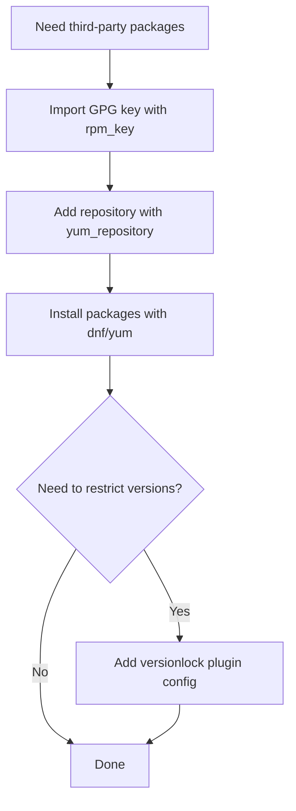

# How to Add YUM Repositories with the Ansible yum_repository Module

Author: [nawazdhandala](https://www.github.com/nawazdhandala)

Tags: Ansible, YUM, RHEL, CentOS, Repositories

Description: How to add, configure, and manage YUM and DNF repositories on RHEL-based systems using the Ansible yum_repository module.

---

On Red Hat-based systems, adding third-party repositories is a common task when setting up servers. The Ansible `yum_repository` module creates `.repo` files in `/etc/yum.repos.d/` with all the configuration options that yum and dnf understand. Despite its name, this module works with both yum and dnf, since dnf reads the same `.repo` file format. This post walks through practical examples of repository management.

## Basic Repository Addition

Here is the simplest case, adding a repository with its URL and GPG key:

```yaml
# Add the EPEL repository
- name: Add EPEL repository
  ansible.builtin.yum_repository:
    name: epel
    description: Extra Packages for Enterprise Linux
    baseurl: https://dl.fedoraproject.org/pub/epel/$releasever/$basearch/
    gpgcheck: yes
    gpgkey: https://dl.fedoraproject.org/pub/epel/RPM-GPG-KEY-EPEL-$releasever
    enabled: yes
```

This creates `/etc/yum.repos.d/epel.repo` with the specified configuration. The `$releasever` and `$basearch` variables are yum/dnf variables that get resolved at runtime, so the same repo definition works across RHEL 8 and 9, x86_64 and aarch64.

## Adding a Repository with metalink

Some repositories use metalink instead of baseurl. Metalink provides a list of mirror URLs and checksums, making downloads more reliable:

```yaml
# Add a repository using metalink
- name: Add Fedora updates repository
  ansible.builtin.yum_repository:
    name: fedora-updates
    description: Fedora $releasever - Updates
    metalink: "https://mirrors.fedoraproject.org/metalink?repo=updates-released-f$releasever&arch=$basearch"
    gpgcheck: yes
    gpgkey: "file:///etc/pki/rpm-gpg/RPM-GPG-KEY-fedora-$releasever-$basearch"
    enabled: yes
```

## Adding Multiple Repositories

You can define several repositories using a loop over a list of dictionaries:

```yaml
# Add multiple repositories from a variable
- name: Add custom repositories
  ansible.builtin.yum_repository:
    name: "{{ item.name }}"
    description: "{{ item.description }}"
    baseurl: "{{ item.baseurl }}"
    gpgcheck: "{{ item.gpgcheck | default(true) }}"
    gpgkey: "{{ item.gpgkey | default(omit) }}"
    enabled: "{{ item.enabled | default(true) }}"
  loop: "{{ custom_repos }}"
  vars:
    custom_repos:
      - name: grafana
        description: Grafana OSS Repository
        baseurl: https://rpm.grafana.com
        gpgcheck: true
        gpgkey: https://rpm.grafana.com/gpg.key
      - name: hashicorp
        description: HashiCorp Stable Repository
        baseurl: https://rpm.releases.hashicorp.com/RHEL/$releasever/$basearch/stable
        gpgcheck: true
        gpgkey: https://rpm.releases.hashicorp.com/gpg
      - name: docker-ce
        description: Docker CE Stable
        baseurl: https://download.docker.com/linux/centos/$releasever/$basearch/stable
        gpgcheck: true
        gpgkey: https://download.docker.com/linux/centos/gpg
```

## Configuring Repository Priority

When packages exist in multiple repositories, you can set priorities to control which repository is preferred:

```yaml
# Add a high-priority custom repo
- name: Add internal package mirror with high priority
  ansible.builtin.yum_repository:
    name: internal-mirror
    description: Internal Package Mirror
    baseurl: https://mirror.internal.example.com/rhel/$releasever/$basearch/
    gpgcheck: no
    enabled: yes
    priority: 1
```

Lower priority numbers mean higher priority. The default is 99. Setting your internal mirror to priority 1 means its packages will always be preferred over external repos.

You need the `priorities` plugin for this to work:

```yaml
# Install the priorities plugin (RHEL 7)
- name: Install yum priorities plugin
  ansible.builtin.yum:
    name: yum-plugin-priorities
    state: present
  when: ansible_distribution_major_version == "7"
```

On RHEL 8+, the priorities plugin is built into dnf and does not need a separate installation.

## Configuring Proxy Settings

If your servers access repositories through a proxy:

```yaml
# Add a repository with proxy configuration
- name: Add repository through proxy
  ansible.builtin.yum_repository:
    name: external-packages
    description: External Package Repository
    baseurl: https://packages.example.com/el/$releasever/$basearch/
    gpgcheck: yes
    gpgkey: https://packages.example.com/gpg.key
    proxy: http://proxy.internal.example.com:8080
    proxy_username: repouser
    proxy_password: "{{ vault_proxy_password }}"
    enabled: yes
```

## Setting Bandwidth and Timeout Options

For repositories on slow or unreliable networks:

```yaml
# Configure a repository with custom timeout and bandwidth settings
- name: Add remote repository with adjusted settings
  ansible.builtin.yum_repository:
    name: slow-remote-repo
    description: Remote Repository with Custom Settings
    baseurl: https://slow-mirror.example.com/packages/
    gpgcheck: yes
    gpgkey: https://slow-mirror.example.com/gpg.key
    timeout: 60
    retries: 5
    throttle: 1M
    enabled: yes
```

## Disabling a Repository

To disable a repository without removing it:

```yaml
# Disable a repository (keeps the .repo file but sets enabled=0)
- name: Disable testing repository
  ansible.builtin.yum_repository:
    name: myapp-testing
    description: MyApp Testing Repository
    baseurl: https://packages.example.com/testing/el/$releasever/$basearch/
    enabled: no
```

## Removing a Repository

To remove a repository entirely:

```yaml
# Remove a repository file
- name: Remove old repository
  ansible.builtin.yum_repository:
    name: old-packages
    state: absent
```

This deletes the corresponding `.repo` file from `/etc/yum.repos.d/`.

## Complete Example: Setting Up a Docker Host

Here is a full workflow that adds the Docker repository and installs Docker:

```yaml
# Set up Docker on RHEL/CentOS
- name: Set up Docker repository and install
  hosts: docker_hosts
  become: yes
  tasks:
    - name: Install prerequisite packages
      ansible.builtin.dnf:
        name:
          - yum-utils
          - device-mapper-persistent-data
          - lvm2
        state: present

    - name: Add Docker CE repository
      ansible.builtin.yum_repository:
        name: docker-ce-stable
        description: Docker CE Stable - $basearch
        baseurl: https://download.docker.com/linux/centos/$releasever/$basearch/stable
        gpgcheck: yes
        gpgkey: https://download.docker.com/linux/centos/gpg
        enabled: yes

    - name: Install Docker CE
      ansible.builtin.dnf:
        name:
          - docker-ce
          - docker-ce-cli
          - containerd.io
          - docker-compose-plugin
        state: present

    - name: Start and enable Docker
      ansible.builtin.systemd:
        name: docker
        state: started
        enabled: yes
```

## Managing Repository GPG Keys

Before adding a repository, you might want to import its GPG key explicitly:

```yaml
# Import a GPG key before adding the repository
- name: Import Grafana GPG key
  ansible.builtin.rpm_key:
    state: present
    key: https://rpm.grafana.com/gpg.key

- name: Add Grafana repository
  ansible.builtin.yum_repository:
    name: grafana
    description: Grafana OSS Repository
    baseurl: https://rpm.grafana.com
    gpgcheck: yes
    gpgkey: https://rpm.grafana.com/gpg.key
    enabled: yes
```

The `rpm_key` module imports the key into the RPM keyring. While `gpgkey` in the repository definition tells yum/dnf where to find the key, importing it first avoids interactive prompts during package installation.

## Repository Configuration Flow



## All Available Parameters

The `yum_repository` module supports the full range of yum/dnf repo options. Here are the most commonly used ones:

| Parameter | Description | Default |
|-----------|-------------|---------|
| `name` | Repository ID (used as filename) | Required |
| `description` | Human-readable name | - |
| `baseurl` | URL to the repository | - |
| `metalink` | Metalink URL | - |
| `mirrorlist` | Mirror list URL | - |
| `gpgcheck` | Enable GPG signature checking | yes |
| `gpgkey` | URL to the GPG key | - |
| `enabled` | Enable the repository | yes |
| `priority` | Repository priority (lower = higher) | 99 |
| `exclude` | Packages to exclude | - |
| `includepkgs` | Only include these packages | - |
| `sslverify` | Verify SSL certificates | yes |

## Tips for Repository Management

1. **Always enable GPG checking in production.** Only use `gpgcheck: no` for internal development repositories.
2. **Use `$releasever` and `$basearch` variables.** They make your repository definitions portable across different RHEL versions and architectures.
3. **Set priorities for internal mirrors.** This ensures your internal packages take precedence over public ones.
4. **Audit repositories regularly.** Run `dnf repolist` as part of your compliance checks to ensure only approved repositories are enabled.
5. **Use `includepkgs` for untrusted repos.** If you must add a repository you do not fully trust, restrict which packages can be installed from it.

The `yum_repository` module gives you complete control over how your RHEL-based systems discover and download packages. Combined with GPG key management and version pinning, it forms the foundation of reliable package management across your fleet.
