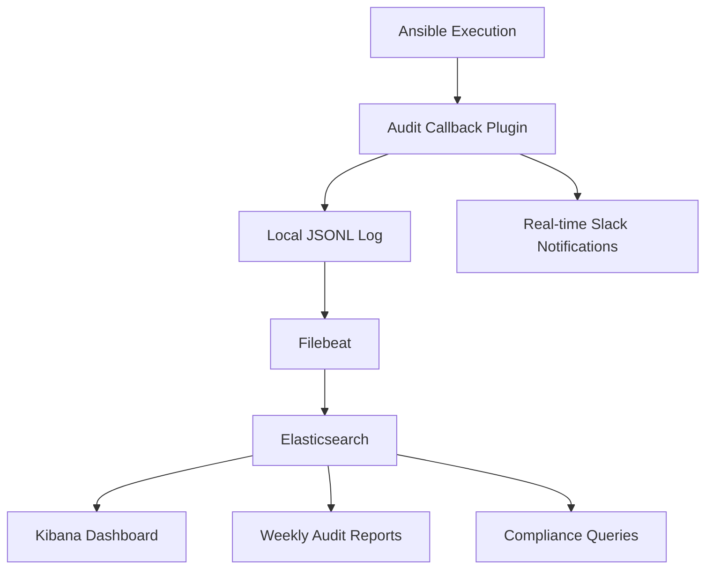

# How to Audit Ansible Automation Changes

Author: [nawazdhandala](https://www.github.com/nawazdhandala)

Tags: Ansible, Auditing, Compliance, Change Tracking

Description: Learn how to implement comprehensive audit trails for Ansible automation including change logging, callback plugins, and compliance reporting.

---

When an auditor asks "who changed the firewall rules on production server X on Tuesday?", you need an answer. Without audit trails, Ansible executions are invisible. You know something changed, but not who initiated it, what they changed, or whether it was authorized. Here is how to build an audit system that captures every detail.

## The Audit Callback Plugin

Ansible callback plugins intercept events during playbook execution. Build one that logs everything:

```python
# callback_plugins/audit_log.py
# Comprehensive audit logging callback plugin

import json
import os
from datetime import datetime
from ansible.plugins.callback import CallbackBase

DOCUMENTATION = '''
callback: audit_log
type: aggregate
short_description: Log all playbook executions for audit
description:
  - Logs every playbook execution with details about
    who, what, where, and when changes occurred.
requirements:
  - whitelist in ansible.cfg
'''

class CallbackModule(CallbackBase):
    CALLBACK_VERSION = 2.0
    CALLBACK_TYPE = 'aggregate'
    CALLBACK_NAME = 'audit_log'
    CALLBACK_NEEDS_WHITELIST = True

    def __init__(self):
        super().__init__()
        self.log_path = os.environ.get(
            'ANSIBLE_AUDIT_LOG',
            '/var/log/ansible/audit.jsonl'
        )
        self.session = {
            'start_time': datetime.utcnow().isoformat(),
            'user': os.environ.get('USER', 'unknown'),
            'awx_user': os.environ.get('AWX_USER', ''),
            'awx_job_id': os.environ.get('AWX_JOB_ID', ''),
            'playbook': '',
            'changes': [],
            'failures': [],
            'hosts_targeted': [],
        }

    def _write_log(self, entry):
        os.makedirs(os.path.dirname(self.log_path), exist_ok=True)
        with open(self.log_path, 'a') as f:
            f.write(json.dumps(entry) + '\n')

    def v2_playbook_on_start(self, playbook):
        self.session['playbook'] = playbook._file_name

    def v2_runner_on_ok(self, result):
        host = result._host.get_name()
        if host not in self.session['hosts_targeted']:
            self.session['hosts_targeted'].append(host)

        if result._result.get('changed', False):
            self.session['changes'].append({
                'host': host,
                'task': result._task.get_name(),
                'module': result._task.action,
                'diff': result._result.get('diff', {}),
                'timestamp': datetime.utcnow().isoformat(),
            })

    def v2_runner_on_failed(self, result, ignore_errors=False):
        self.session['failures'].append({
            'host': result._host.get_name(),
            'task': result._task.get_name(),
            'message': result._result.get('msg', 'unknown error'),
            'timestamp': datetime.utcnow().isoformat(),
        })

    def v2_playbook_on_stats(self, stats):
        self.session['end_time'] = datetime.utcnow().isoformat()
        self.session['summary'] = {}
        for host in sorted(stats.processed.keys()):
            s = stats.summarize(host)
            self.session['summary'][host] = s
        self._write_log(self.session)
```

Enable it in ansible.cfg:

```ini
# ansible.cfg
[defaults]
callbacks_enabled = audit_log
```

## Structured Audit Log Format

Each execution produces a structured log entry:

```json
{
  "start_time": "2025-01-15T14:30:00Z",
  "end_time": "2025-01-15T14:35:22Z",
  "user": "jdoe",
  "awx_user": "jdoe@company.com",
  "awx_job_id": "12345",
  "playbook": "playbooks/deploy.yml",
  "hosts_targeted": ["web01.prod.example.com", "web02.prod.example.com"],
  "changes": [
    {
      "host": "web01.prod.example.com",
      "task": "Deploy nginx configuration",
      "module": "ansible.builtin.template",
      "diff": {
        "before": "worker_connections 1024;",
        "after": "worker_connections 4096;"
      },
      "timestamp": "2025-01-15T14:32:15Z"
    }
  ],
  "failures": [],
  "summary": {
    "web01.prod.example.com": {"ok": 15, "changed": 3, "failures": 0},
    "web02.prod.example.com": {"ok": 15, "changed": 3, "failures": 0}
  }
}
```

## Sending Audit Events to External Systems

Forward audit logs to your SIEM or logging platform:

```yaml
# roles/audit_forwarder/tasks/main.yml
# Forward Ansible audit logs to centralized logging

- name: Configure filebeat for Ansible audit logs
  ansible.builtin.template:
    src: filebeat-ansible.yml.j2
    dest: /etc/filebeat/inputs.d/ansible-audit.yml
  notify: restart filebeat
```

```yaml
# templates/filebeat-ansible.yml.j2
# Filebeat configuration to ship audit logs
- type: log
  enabled: true
  paths:
    - /var/log/ansible/audit.jsonl
  json.keys_under_root: true
  json.add_error_key: true
  fields:
    source: ansible-audit
    environment: "{{ env_name }}"
  fields_under_root: true
```

## AWX Built-in Audit Trail

AWX provides built-in activity streams and job history:

```bash
# Query AWX activity stream via API
# Get all activities in the last 24 hours
curl -s -H "Authorization: Bearer ${AWX_TOKEN}" \
  "${AWX_URL}/api/v2/activity_stream/?timestamp__gte=$(date -u -d '24 hours ago' +%Y-%m-%dT%H:%M:%SZ)" \
  | jq '.results[] | {timestamp, operation, summary_fields}'

# Get all job executions for a specific user
curl -s -H "Authorization: Bearer ${AWX_TOKEN}" \
  "${AWX_URL}/api/v2/jobs/?created_by__username=jdoe&created__gte=2025-01-01" \
  | jq '.results[] | {id, name, status, started, finished, created_by}'
```

## Audit Report Generation

Generate periodic audit reports:

```yaml
# playbooks/generate-audit-report.yml
# Generate weekly audit report from log files
- name: Generate audit report
  hosts: localhost
  gather_facts: yes

  tasks:
    - name: Read audit log entries
      ansible.builtin.slurp:
        src: /var/log/ansible/audit.jsonl
      register: audit_log_raw

    - name: Parse audit entries
      ansible.builtin.set_fact:
        audit_entries: "{{ audit_log_raw.content | b64decode | split('\n') | select | map('from_json') | list }}"

    - name: Filter to report period
      ansible.builtin.set_fact:
        report_entries: >-
          {{ audit_entries | selectattr('start_time', 'ge', report_start_date) | list }}

    - name: Calculate statistics
      ansible.builtin.set_fact:
        report_stats:
          total_executions: "{{ report_entries | length }}"
          total_changes: "{{ report_entries | map(attribute='changes') | map('length') | sum }}"
          total_failures: "{{ report_entries | map(attribute='failures') | map('length') | sum }}"
          unique_users: "{{ report_entries | map(attribute='user') | unique | list }}"
          affected_hosts: "{{ report_entries | map(attribute='hosts_targeted') | flatten | unique | list }}"

    - name: Generate HTML report
      ansible.builtin.template:
        src: audit-report.html.j2
        dest: "/tmp/audit-report-{{ ansible_date_time.date }}.html"

    - name: Send report via email
      community.general.mail:
        host: "{{ smtp_host }}"
        port: "{{ smtp_port }}"
        to: "{{ audit_report_recipients }}"
        subject: "Ansible Audit Report - Week of {{ ansible_date_time.date }}"
        body: "Weekly audit report attached."
        attach:
          - "/tmp/audit-report-{{ ansible_date_time.date }}.html"
```

## Real-Time Audit Notifications

Send real-time notifications for critical changes:

```yaml
# callback_plugins/audit_notify.py (simplified concept)
# Notify on production changes in real-time

# In practice, add this to your audit callback:
# When a change is detected on a production host,
# send a Slack/Teams notification immediately

# The notification includes:
# - Who initiated the change
# - What playbook was running
# - Which hosts were affected
# - What specifically changed
```

Implement via a post-task:

```yaml
# Include at end of production playbooks
- name: Send audit notification for production changes
  ansible.builtin.uri:
    url: "{{ slack_webhook_url }}"
    method: POST
    body_format: json
    body:
      text: |
        :clipboard: *Ansible Production Change*
        *User:* {{ lookup('env', 'USER') }}
        *Playbook:* {{ ansible_play_name }}
        *Hosts:* {{ ansible_play_hosts | join(', ') }}
        *Time:* {{ ansible_date_time.iso8601 }}
        *Change Ticket:* {{ change_ticket | default('N/A') }}
  delegate_to: localhost
  run_once: true
  when: env_name == 'production'
```

## Audit Compliance Queries

Common queries auditors ask and how to answer them:

```bash
# Who made changes to production in the last 30 days?
jq 'select(.hosts_targeted[] | contains("prod")) | .user' \
  /var/log/ansible/audit.jsonl | sort | uniq -c | sort -rn

# What changed on a specific host?
jq 'select(.changes[].host == "web01.prod.example.com") |
  {time: .start_time, user: .user, changes: .changes}' \
  /var/log/ansible/audit.jsonl

# Were there any failed executions?
jq 'select(.failures | length > 0) |
  {time: .start_time, user: .user, failures: .failures}' \
  /var/log/ansible/audit.jsonl

# What playbooks were run during a specific incident window?
jq 'select(.start_time >= "2025-01-15T10:00:00" and
  .start_time <= "2025-01-15T14:00:00")' \
  /var/log/ansible/audit.jsonl
```

## Audit Architecture



## Summary

Auditing Ansible automation requires capturing who, what, when, and where for every execution. Use callback plugins to generate structured audit logs. Forward logs to your SIEM for centralized querying. Send real-time notifications for production changes. Generate periodic audit reports for compliance reviews. AWX provides built-in activity streams and job history. Store audit logs with sufficient retention for your compliance requirements. When the auditor asks their questions, you will have the answers.
