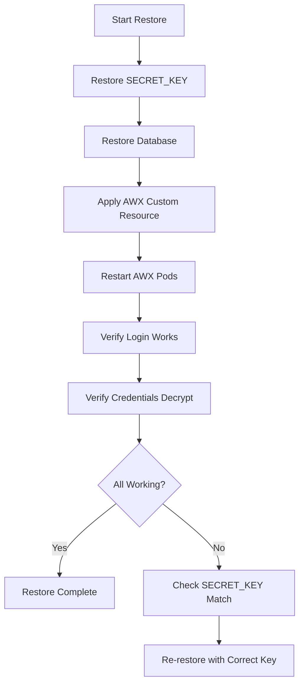

# How to Backup and Restore AWX

Author: [nawazdhandala](https://www.github.com/nawazdhandala)

Tags: Ansible, AWX, Backup, Disaster Recovery, Kubernetes

Description: Implement backup and restore procedures for AWX including database dumps, secrets, and configuration for reliable disaster recovery.

---

Backing up AWX is not just about the database. A complete AWX backup includes the PostgreSQL database, the SECRET_KEY used for encryption, any custom execution environment references, and your Kubernetes secrets. Lose the SECRET_KEY and your encrypted credentials become unrecoverable. Lose the database and you lose all job history, templates, and inventories. This post covers how to back up everything you need and restore it reliably.

## What Needs to Be Backed Up

AWX stores data in several places:

1. **PostgreSQL database** - Contains all AWX configuration: organizations, teams, users, job templates, inventories, projects, schedules, job history, and encrypted credential values.
2. **SECRET_KEY** - The encryption key AWX uses to encrypt sensitive data (credential passwords, vault passwords). Without this, encrypted values in the database are useless.
3. **Kubernetes secrets** - The admin password, database connection details, and any custom secrets you created.
4. **AWX custom resource** - The AWX operator configuration that defines your deployment.

Projects and playbooks are stored in Git, so they do not need to be backed up from AWX itself.

## Backing Up the Database

### Using the AWX Operator Backup CRD

The AWX Operator includes a built-in backup mechanism through a custom resource.

```yaml
# awx-backup.yml
---
apiVersion: awx.ansible.com/v1beta1
kind: AWXBackup
metadata:
  name: awx-backup-20260221
  namespace: awx
spec:
  deployment_name: awx
  backup_pvc: awx-backup-pvc
  backup_pvc_namespace: awx
```

Before applying this, create the PVC.

```yaml
# awx-backup-pvc.yml
---
apiVersion: v1
kind: PersistentVolumeClaim
metadata:
  name: awx-backup-pvc
  namespace: awx
spec:
  accessModes:
    - ReadWriteOnce
  resources:
    requests:
      storage: 20Gi
  storageClassName: standard
```

```bash
# Create the PVC and trigger the backup
kubectl apply -f awx-backup-pvc.yml
kubectl apply -f awx-backup.yml

# Monitor backup progress
kubectl get awxbackup -n awx -w
```

The operator creates a backup job that dumps the database and copies configuration files to the PVC.

### Manual Database Backup

If you prefer doing it manually (or need to back up an external database), use `pg_dump`.

```bash
# For the internal containerized database
kubectl exec -it awx-postgres-13-0 -n awx -- \
  pg_dump -U awx -Fc -f /tmp/awx-backup.dump awx

# Copy the dump file out of the pod
kubectl cp awx/awx-postgres-13-0:/tmp/awx-backup.dump ./awx-backup.dump

# For an external database
pg_dump -h db.example.com -U awx -Fc -f awx-backup.dump awx
```

The `-Fc` flag creates a custom-format dump that supports parallel restore and selective table restoration.

## Backing Up the SECRET_KEY

The SECRET_KEY is stored as a Kubernetes secret. Back it up separately and store it securely.

```bash
# Export the AWX secret key
kubectl get secret awx-secret-key -n awx -o yaml > awx-secret-key-backup.yml

# Also export the admin password secret
kubectl get secret awx-admin-password -n awx -o yaml > awx-admin-password-backup.yml

# Export database configuration secret (if using external DB)
kubectl get secret awx-postgres-configuration -n awx -o yaml > awx-postgres-config-backup.yml
```

Store these files encrypted. Use tools like `gpg`, `age`, or a secrets manager.

```bash
# Encrypt the backup files with gpg
gpg --symmetric --cipher-algo AES256 awx-secret-key-backup.yml
gpg --symmetric --cipher-algo AES256 awx-admin-password-backup.yml
```

## Automated Backup Script

Here is a script that performs a complete AWX backup on a schedule.

```bash
#!/bin/bash
# awx-backup.sh - Complete AWX backup script

set -euo pipefail

BACKUP_DIR="/backups/awx/$(date +%Y%m%d-%H%M%S)"
NAMESPACE="awx"
DB_HOST="db.example.com"
DB_USER="awx"
DB_NAME="awx"
RETENTION_DAYS=30

mkdir -p "${BACKUP_DIR}"

echo "Starting AWX backup to ${BACKUP_DIR}"

# 1. Database dump
echo "Backing up database..."
pg_dump -h "${DB_HOST}" -U "${DB_USER}" -Fc \
  -f "${BACKUP_DIR}/awx-database.dump" "${DB_NAME}"

# 2. Kubernetes secrets
echo "Backing up Kubernetes secrets..."
kubectl get secret awx-secret-key -n "${NAMESPACE}" -o yaml \
  > "${BACKUP_DIR}/awx-secret-key.yml"
kubectl get secret awx-admin-password -n "${NAMESPACE}" -o yaml \
  > "${BACKUP_DIR}/awx-admin-password.yml"
kubectl get secret awx-postgres-configuration -n "${NAMESPACE}" -o yaml \
  > "${BACKUP_DIR}/awx-postgres-config.yml" 2>/dev/null || true

# 3. AWX custom resource
echo "Backing up AWX custom resource..."
kubectl get awx awx -n "${NAMESPACE}" -o yaml \
  > "${BACKUP_DIR}/awx-cr.yml"

# 4. Compress everything
echo "Compressing backup..."
tar -czf "${BACKUP_DIR}.tar.gz" -C "$(dirname ${BACKUP_DIR})" \
  "$(basename ${BACKUP_DIR})"
rm -rf "${BACKUP_DIR}"

# 5. Upload to S3 (optional)
aws s3 cp "${BACKUP_DIR}.tar.gz" \
  "s3://company-backups/awx/$(basename ${BACKUP_DIR}).tar.gz"

# 6. Clean up old backups
echo "Cleaning up backups older than ${RETENTION_DAYS} days..."
find /backups/awx/ -name "*.tar.gz" -mtime +${RETENTION_DAYS} -delete

echo "Backup complete: ${BACKUP_DIR}.tar.gz"
```

Set this up as a cron job or a Kubernetes CronJob.

```yaml
# awx-backup-cronjob.yml
---
apiVersion: batch/v1
kind: CronJob
metadata:
  name: awx-backup
  namespace: awx
spec:
  schedule: "0 2 * * *"
  jobTemplate:
    spec:
      template:
        spec:
          serviceAccountName: awx-backup-sa
          containers:
            - name: backup
              image: bitnami/postgresql:15
              command: ["/bin/bash", "/scripts/awx-backup.sh"]
              volumeMounts:
                - name: backup-scripts
                  mountPath: /scripts
                - name: backup-storage
                  mountPath: /backups
          volumes:
            - name: backup-scripts
              configMap:
                name: awx-backup-scripts
            - name: backup-storage
              persistentVolumeClaim:
                claimName: awx-backup-pvc
          restartPolicy: OnFailure
```

## Restoring AWX

### Using the AWX Operator Restore CRD

If you used the operator backup, restore with the corresponding CRD.

```yaml
# awx-restore.yml
---
apiVersion: awx.ansible.com/v1beta1
kind: AWXRestore
metadata:
  name: awx-restore-20260221
  namespace: awx
spec:
  deployment_name: awx
  backup_name: awx-backup-20260221
```

```bash
# Trigger the restore
kubectl apply -f awx-restore.yml

# Monitor progress
kubectl get awxrestore -n awx -w
```

### Manual Restore

For manual restores, follow this sequence carefully.

```bash
# Step 1: Restore secrets first (the SECRET_KEY is critical)
kubectl apply -f awx-secret-key.yml
kubectl apply -f awx-admin-password.yml
kubectl apply -f awx-postgres-config.yml

# Step 2: Restore the database
# Drop the existing database and recreate it
psql -h db.example.com -U postgres -c "DROP DATABASE IF EXISTS awx;"
psql -h db.example.com -U postgres -c "CREATE DATABASE awx OWNER awx;"

# Restore from the dump
pg_restore -h db.example.com -U awx -d awx \
  --no-owner --no-acl awx-database.dump

# Step 3: Restart AWX pods to pick up the restored data
kubectl rollout restart deployment/awx-web deployment/awx-task -n awx

# Step 4: Verify the restore
kubectl logs deployment/awx-web -n awx --tail=50
```

## Restore Flow



## Testing Your Backups

A backup you have never tested is not a backup. Set up a restore test process.

```bash
# Restore to a test namespace
kubectl create namespace awx-restore-test

# Apply secrets to test namespace
kubectl apply -f awx-secret-key.yml -n awx-restore-test
kubectl apply -f awx-admin-password.yml -n awx-restore-test

# Create a temporary PostgreSQL instance for testing
kubectl run pg-test -n awx-restore-test \
  --image=postgres:15 \
  --env="POSTGRES_USER=awx" \
  --env="POSTGRES_PASSWORD=testpass" \
  --env="POSTGRES_DB=awx"

# Wait for it to be ready, then restore
kubectl wait --for=condition=ready pod/pg-test -n awx-restore-test --timeout=60s
kubectl cp awx-database.dump awx-restore-test/pg-test:/tmp/
kubectl exec pg-test -n awx-restore-test -- \
  pg_restore -U awx -d awx --no-owner /tmp/awx-database.dump

# Clean up after testing
kubectl delete namespace awx-restore-test
```

## Common Restore Problems

**Encrypted credentials show as empty after restore** - This means the SECRET_KEY does not match. The SECRET_KEY used during backup must be the same one used during restore. If you lost the original SECRET_KEY, the encrypted data is gone. You will need to re-enter all credential passwords.

**Database schema version mismatch** - If you restore a backup from an older AWX version to a newer one, AWX will try to run migrations on startup. This usually works but test it first. Going the other direction (restoring a newer backup to an older AWX) will likely fail.

**Permission errors during restore** - Make sure the database user has CREATEDB privileges or that you manually create the database before running `pg_restore`.

## Wrapping Up

AWX backup and restore is straightforward once you know the three things that matter: the database, the SECRET_KEY, and the Kubernetes secrets. Automate daily backups, store them off-site, and test the restore process at least quarterly. The worst time to discover your backups are broken is during an actual outage.
