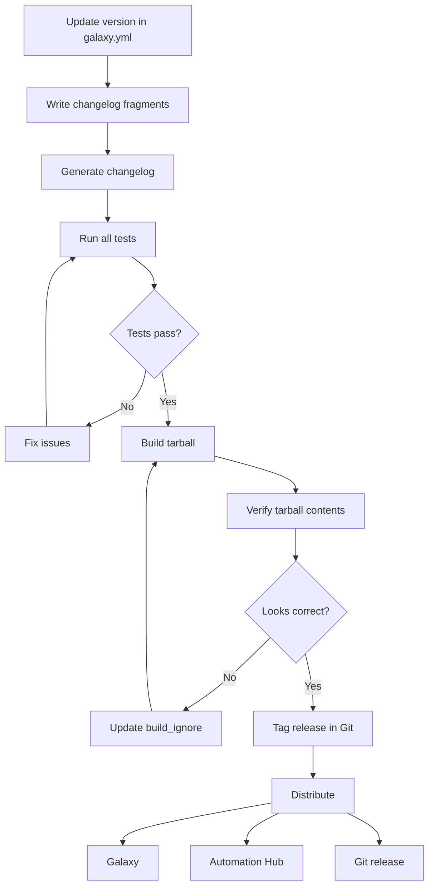

# How to Build Ansible Collections for Distribution

Author: [nawazdhandala](https://www.github.com/nawazdhandala)

Tags: Ansible, Collections, Packaging, Distribution, DevOps

Description: How to build Ansible collections into distributable tarballs with proper versioning, metadata, build exclusions, and release automation.

---

Building an Ansible collection packages your modules, plugins, roles, and documentation into a single tarball that can be uploaded to Galaxy, Automation Hub, or distributed through any file-sharing mechanism. The build process is handled by `ansible-galaxy collection build`, but there is more to getting it right than just running a command.

This post covers the build process end to end: preparing your metadata, controlling what goes into the tarball, versioning, and automating builds in CI/CD.

## The Build Command

At its simplest, building a collection is one command:

```bash
# Navigate to your collection root
cd ansible_collections/my_namespace/my_collection

# Build the collection tarball
ansible-galaxy collection build
```

This produces a file like:

```
Created collection for my_namespace.my_collection at
/path/to/my_namespace-my_collection-1.0.0.tar.gz
```

The tarball contains everything Ansible needs to install and use the collection.

## What Goes Into the Tarball

The build process includes all files in the collection directory except:

- Files and directories listed in `build_ignore` in `galaxy.yml`
- Hidden files (starting with `.`)
- Common VCS directories (`.git`, `.svn`)

It also generates two metadata files inside the tarball:

- `MANIFEST.json` - contains checksums and metadata for verification
- `FILES.json` - lists every file in the tarball with checksums

### Controlling Inclusions with build_ignore

The `build_ignore` field in `galaxy.yml` accepts glob patterns:

```yaml
# galaxy.yml - Control what gets excluded from the build
---
namespace: my_namespace
name: my_collection
version: 1.2.0
build_ignore:
  # Version control
  - .git
  - .gitignore
  - .github

  # Development files
  - .venv
  - .tox
  - .pytest_cache
  - __pycache__
  - "*.pyc"

  # CI/CD configuration
  - .gitlab-ci.yml
  - Makefile
  - Dockerfile
  - docker-compose.yml

  # Test artifacts
  - tests/output
  - tests/integration/inventory
  - tests/integration/cloud-config-*.ini

  # Build artifacts
  - "*.tar.gz"

  # Editor files
  - .vscode
  - .idea
  - "*.swp"

  # Documentation build output
  - docs/_build
```

### Verifying Tarball Contents

After building, check what is actually in the tarball:

```bash
# List files in the tarball
tar tzf my_namespace-my_collection-1.2.0.tar.gz | head -30

# Check the tarball size
ls -lh my_namespace-my_collection-1.2.0.tar.gz

# Extract and inspect (without installing)
mkdir /tmp/inspect && tar xzf my_namespace-my_collection-1.2.0.tar.gz -C /tmp/inspect
ls -la /tmp/inspect/my_namespace-my_collection-1.2.0/
```

If you see test files, virtual environments, or other development artifacts in the tarball, update your `build_ignore` patterns.

## Versioning Strategy

Collection versions follow semantic versioning (semver):

```
MAJOR.MINOR.PATCH

1.0.0 -> 1.0.1  (patch: bug fixes only)
1.0.1 -> 1.1.0  (minor: new features, backward compatible)
1.1.0 -> 2.0.0  (major: breaking changes)
```

The version is set in `galaxy.yml`. Update it before each build:

```yaml
# galaxy.yml - Version field
version: 1.2.0
```

### Automating Version Bumps

You can script version bumps to avoid manual edits:

```bash
#!/bin/bash
# bump-version.sh - Bump collection version
# Usage: ./bump-version.sh [major|minor|patch]

set -euo pipefail

BUMP_TYPE="${1:-patch}"
GALAXY_FILE="galaxy.yml"

# Read current version
CURRENT=$(grep "^version:" "${GALAXY_FILE}" | awk '{print $2}' | tr -d '"')
IFS='.' read -r MAJOR MINOR PATCH <<< "${CURRENT}"

case "${BUMP_TYPE}" in
    major) MAJOR=$((MAJOR + 1)); MINOR=0; PATCH=0 ;;
    minor) MINOR=$((MINOR + 1)); PATCH=0 ;;
    patch) PATCH=$((PATCH + 1)) ;;
    *) echo "Usage: $0 [major|minor|patch]"; exit 1 ;;
esac

NEW_VERSION="${MAJOR}.${MINOR}.${PATCH}"
sed -i "s/^version:.*/version: ${NEW_VERSION}/" "${GALAXY_FILE}"

echo "Version bumped: ${CURRENT} -> ${NEW_VERSION}"
```

## Pre-Build Checklist

Before building a release, go through this checklist:

```yaml
# release-checklist.yml - Things to verify before building
---
checks:
  - description: "Version in galaxy.yml is updated"
    command: "grep 'version:' galaxy.yml"

  - description: "Changelog fragments exist for this release"
    command: "ls changelogs/fragments/"

  - description: "Sanity tests pass"
    command: "ansible-test sanity --docker"

  - description: "Unit tests pass"
    command: "ansible-test units --docker"

  - description: "Integration tests pass"
    command: "ansible-test integration --docker"

  - description: "No uncommitted changes"
    command: "git status --porcelain"

  - description: "README is up to date"
    command: "cat README.md"
```

Here is a script that runs through these checks:

```bash
#!/bin/bash
# pre-build-check.sh - Verify collection is ready to build
set -euo pipefail

echo "Running pre-build checks..."

# Check for uncommitted changes
if [ -n "$(git status --porcelain)" ]; then
    echo "ERROR: Uncommitted changes detected. Commit or stash before building."
    git status --short
    exit 1
fi

# Run sanity tests
echo "Running sanity tests..."
ansible-test sanity --docker

# Run unit tests
echo "Running unit tests..."
ansible-test units --docker

# Check version is not already published
VERSION=$(grep "^version:" galaxy.yml | awk '{print $2}')
echo "Building version: ${VERSION}"

# Generate changelog
if command -v antsibull-changelog &> /dev/null; then
    echo "Generating changelog..."
    antsibull-changelog release --version "${VERSION}"
fi

echo "All pre-build checks passed. Ready to build."
```

## Building with Output Path

Specify where to put the built tarball:

```bash
# Build to a specific directory
ansible-galaxy collection build --output-path ./dist/

# The dist directory will contain the tarball
ls ./dist/
# my_namespace-my_collection-1.2.0.tar.gz
```

## Build Process Flow



## Automating Builds in CI/CD

Here is a GitHub Actions workflow that builds and publishes on tagged releases:

```yaml
# .github/workflows/release.yml
---
name: Release Collection
on:
  push:
    tags:
      - "v*"

jobs:
  build:
    runs-on: ubuntu-latest
    steps:
      - uses: actions/checkout@v4
        with:
          path: ansible_collections/my_namespace/my_collection

      - uses: actions/setup-python@v5
        with:
          python-version: "3.11"

      - name: Install dependencies
        run: pip install ansible-core antsibull-changelog

      - name: Run tests
        working-directory: ansible_collections/my_namespace/my_collection
        run: |
          ansible-test sanity --local
          ansible-test units --local

      - name: Build collection
        working-directory: ansible_collections/my_namespace/my_collection
        run: ansible-galaxy collection build --output-path ./dist/

      - name: Upload build artifact
        uses: actions/upload-artifact@v4
        with:
          name: collection-tarball
          path: ansible_collections/my_namespace/my_collection/dist/*.tar.gz

  publish_galaxy:
    needs: build
    runs-on: ubuntu-latest
    steps:
      - uses: actions/download-artifact@v4
        with:
          name: collection-tarball
          path: ./dist

      - name: Install ansible-core
        run: pip install ansible-core

      - name: Publish to Galaxy
        run: >
          ansible-galaxy collection publish
          ./dist/*.tar.gz
          --api-key "${{ secrets.GALAXY_API_KEY }}"
```

## Testing the Built Tarball

Always test the built tarball by installing it in a clean environment:

```bash
# Create a fresh virtual environment
python -m venv /tmp/test-collection
source /tmp/test-collection/bin/activate
pip install ansible-core

# Install the built collection
ansible-galaxy collection install ./dist/my_namespace-my_collection-1.2.0.tar.gz -p /tmp/test-collections

# Verify it installed correctly
ANSIBLE_COLLECTIONS_PATH=/tmp/test-collections ansible-doc my_namespace.my_collection.config_entry

# Run a smoke test playbook
ANSIBLE_COLLECTIONS_PATH=/tmp/test-collections ansible-playbook test-smoke.yml
```

## Handling Dependencies in Builds

If your collection depends on other collections, declare them in `galaxy.yml`:

```yaml
# galaxy.yml - Collection dependencies
dependencies:
  ansible.posix: ">=1.4.0,<2.0.0"
  community.general: ">=6.0.0"
```

These dependencies are recorded in the built tarball's `MANIFEST.json`. When someone installs your collection, `ansible-galaxy` automatically resolves and installs the dependencies.

Be specific with version ranges. Avoid using `*` for the version because a breaking change in a dependency could break your collection for every user.

## Common Build Issues

**"ERROR! galaxy.yml is not valid"**: Check for YAML syntax errors. Run `python -c "import yaml; yaml.safe_load(open('galaxy.yml'))"` to validate.

**Tarball is too large**: Check for accidentally included test outputs, log files, or virtual environments. Update `build_ignore` patterns.

**"namespace must be a valid Python identifier"**: The namespace in `galaxy.yml` cannot contain hyphens. Use underscores.

**Version already exists on Galaxy**: You cannot overwrite a published version. Bump the version number and build again.

## Conclusion

Building Ansible collections for distribution is a matter of discipline: keep your `galaxy.yml` accurate, use `build_ignore` to exclude development artifacts, follow semantic versioning, and automate the build-test-publish pipeline. Test the built tarball in a clean environment before publishing to make sure nothing was accidentally excluded or included. The build step itself is simple; the work is in everything that leads up to it.
