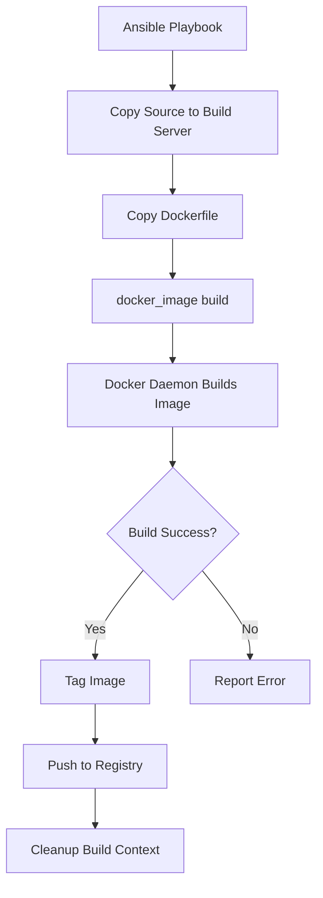

# How to Build Docker Images with Ansible

Author: [nawazdhandala](https://www.github.com/nawazdhandala)

Tags: Ansible, Docker, Docker Build, Container Images, CI/CD

Description: Complete guide to building Docker images with Ansible using the docker_image module, covering Dockerfiles, build arguments, multi-stage builds, and tagging.

---

Building Docker images is typically part of a CI/CD pipeline, but there are plenty of scenarios where building images directly on your servers with Ansible makes sense. Maybe you need to build images on a build server and then push them to a registry. Maybe you are building custom images that include host-specific configuration. Or maybe you just want a repeatable, version-controlled image build process that integrates with the rest of your Ansible automation. Let us walk through how to do it.

## Prerequisites

```bash
# Install the community.docker collection
ansible-galaxy collection install community.docker

# Install the Docker Python SDK
pip install docker
```

Docker must be installed on the host where you are building images.

## Building from a Dockerfile

The most common way to build images is from a Dockerfile. The `docker_image` module's `build` source handles this.

```yaml
# build-basic.yml - Build a Docker image from a Dockerfile
---
- name: Build Docker Image
  hosts: build_server
  become: true

  tasks:
    # First, make sure the build context exists
    - name: Create build directory
      ansible.builtin.file:
        path: /opt/build/myapp
        state: directory
        mode: "0755"

    - name: Copy Dockerfile to build server
      ansible.builtin.copy:
        content: |
          FROM python:3.12-slim
          WORKDIR /app
          COPY requirements.txt .
          RUN pip install --no-cache-dir -r requirements.txt
          COPY . .
          EXPOSE 8000
          CMD ["python", "app.py"]
        dest: /opt/build/myapp/Dockerfile
        mode: "0644"

    - name: Copy application files
      ansible.builtin.copy:
        src: "{{ item }}"
        dest: "/opt/build/myapp/{{ item }}"
      loop:
        - requirements.txt
        - app.py

    # Build the image
    - name: Build the application image
      community.docker.docker_image:
        name: myapp
        tag: "1.0.0"
        source: build
        build:
          path: /opt/build/myapp
        state: present
      register: build_result

    - name: Show build result
      ansible.builtin.debug:
        msg: |
          Image built: {{ build_result.image.RepoTags | first }}
          Image ID: {{ build_result.image.Id[:12] }}
          Size: {{ (build_result.image.Size / 1024 / 1024) | round(1) }} MB
```

## Build with Arguments

Build arguments let you parameterize your Dockerfile. This is useful for things like setting version numbers or choosing base images at build time.

```yaml
# build-with-args.yml - Build with build arguments
---
- name: Build Image with Build Arguments
  hosts: build_server
  become: true

  vars:
    app_version: "2.5.0"
    python_version: "3.12"

  tasks:
    - name: Create Dockerfile with build args
      ansible.builtin.copy:
        content: |
          ARG PYTHON_VERSION=3.12
          FROM python:${PYTHON_VERSION}-slim

          ARG APP_VERSION=dev
          LABEL app.version=${APP_VERSION}
          LABEL maintainer="devops@example.com"

          WORKDIR /app
          COPY requirements.txt .
          RUN pip install --no-cache-dir -r requirements.txt
          COPY . .

          ENV APP_VERSION=${APP_VERSION}
          EXPOSE 8000
          CMD ["gunicorn", "-w", "4", "-b", "0.0.0.0:8000", "app:app"]
        dest: /opt/build/myapp/Dockerfile
        mode: "0644"

    - name: Build with build arguments
      community.docker.docker_image:
        name: myapp
        tag: "{{ app_version }}"
        source: build
        build:
          path: /opt/build/myapp
          args:
            PYTHON_VERSION: "{{ python_version }}"
            APP_VERSION: "{{ app_version }}"
        state: present
      register: build_result

    - name: Show the built image
      ansible.builtin.debug:
        msg: "Built myapp:{{ app_version }} with Python {{ python_version }}"
```

## Multi-Stage Build

Multi-stage builds let you keep your final image small by using separate build and runtime stages.

```yaml
# build-multistage.yml - Build a multi-stage Docker image
---
- name: Build Multi-Stage Docker Image
  hosts: build_server
  become: true

  tasks:
    - name: Create multi-stage Dockerfile
      ansible.builtin.copy:
        content: |
          # Stage 1: Build the Go application
          FROM golang:1.22 AS builder
          WORKDIR /src
          COPY go.mod go.sum ./
          RUN go mod download
          COPY . .
          RUN CGO_ENABLED=0 GOOS=linux go build -o /app/server ./cmd/server

          # Stage 2: Create the minimal runtime image
          FROM alpine:3.19
          RUN apk --no-cache add ca-certificates
          WORKDIR /app
          COPY --from=builder /app/server .
          EXPOSE 8080
          USER nobody
          ENTRYPOINT ["./server"]
        dest: /opt/build/goapp/Dockerfile
        mode: "0644"

    - name: Build the multi-stage image
      community.docker.docker_image:
        name: goapp
        tag: "1.0.0"
        source: build
        build:
          path: /opt/build/goapp
          # Target a specific stage (optional)
          # target: builder
        state: present
      register: build_result

    - name: Show final image size
      ansible.builtin.debug:
        msg: "Final image size: {{ (build_result.image.Size / 1024 / 1024) | round(1) }} MB"
```

## Build Workflow



## Tagging Images

Images often need multiple tags. For example, you might tag an image with the version number, the git commit SHA, and "latest".

```yaml
# tag-images.yml - Apply multiple tags to a built image
---
- name: Build and Tag Docker Image
  hosts: build_server
  become: true

  vars:
    app_name: "myapp"
    version: "2.5.0"
    git_sha: "abc123f"
    registry: "gcr.io/my-project"

  tasks:
    - name: Build the image with version tag
      community.docker.docker_image:
        name: "{{ registry }}/{{ app_name }}"
        tag: "{{ version }}"
        source: build
        build:
          path: /opt/build/{{ app_name }}
        state: present

    # Tag with git SHA
    - name: Tag image with git commit SHA
      community.docker.docker_image:
        name: "{{ registry }}/{{ app_name }}"
        tag: "{{ version }}"
        repository: "{{ registry }}/{{ app_name }}"
        push: false
        source: local
      register: base_image

    - name: Add git SHA tag
      community.docker.docker_image:
        name: "{{ registry }}/{{ app_name }}"
        tag: "{{ git_sha }}"
        source: local
        force_tag: true

    # Tag as latest
    - name: Tag as latest
      community.docker.docker_image:
        name: "{{ registry }}/{{ app_name }}"
        tag: latest
        source: local
        force_tag: true

    - name: Show all tags
      ansible.builtin.debug:
        msg: |
          Image tagged as:
          - {{ registry }}/{{ app_name }}:{{ version }}
          - {{ registry }}/{{ app_name }}:{{ git_sha }}
          - {{ registry }}/{{ app_name }}:latest
```

## Building and Pushing to a Registry

After building, you usually want to push the image to a registry so other servers can pull it.

```yaml
# build-and-push.yml - Build, tag, and push to a registry
---
- name: Build and Push Docker Image
  hosts: build_server
  become: true

  vars:
    registry: "gcr.io/my-project"
    app_name: "api-service"
    version: "2.5.0"

  tasks:
    - name: Authenticate with the registry
      community.docker.docker_login:
        registry_url: "https://gcr.io"
        username: "_json_key"
        password: "{{ lookup('file', '/path/to/service-account.json') }}"
      no_log: true

    - name: Build the image
      community.docker.docker_image:
        name: "{{ registry }}/{{ app_name }}"
        tag: "{{ version }}"
        source: build
        build:
          path: "/opt/build/{{ app_name }}"
          args:
            APP_VERSION: "{{ version }}"
        # Push immediately after building
        push: true
        state: present
      register: push_result

    - name: Confirm push
      ansible.builtin.debug:
        msg: "Pushed {{ registry }}/{{ app_name }}:{{ version }} to registry"

    # Also push with latest tag
    - name: Tag and push as latest
      community.docker.docker_image:
        name: "{{ registry }}/{{ app_name }}"
        tag: "{{ version }}"
        repository: "{{ registry }}/{{ app_name }}"
        push: true
        source: local
```

## Using .dockerignore

Always create a `.dockerignore` file to keep your build context small and exclude sensitive files.

```yaml
# setup-build-context.yml - Prepare build context with .dockerignore
---
- name: Setup Build Context
  hosts: build_server
  become: true

  tasks:
    - name: Create .dockerignore file
      ansible.builtin.copy:
        content: |
          .git
          .gitignore
          .env
          .env.*
          node_modules
          __pycache__
          *.pyc
          .pytest_cache
          .coverage
          *.log
          docker-compose*.yml
          Makefile
          README.md
          tests/
          docs/
        dest: /opt/build/myapp/.dockerignore
        mode: "0644"
```

## Build Caching and Performance

Docker layer caching can significantly speed up builds. Here are some tips encoded in a playbook.

```yaml
# optimized-build.yml - Build with caching optimizations
---
- name: Optimized Docker Image Build
  hosts: build_server
  become: true

  tasks:
    - name: Create optimized Dockerfile
      ansible.builtin.copy:
        content: |
          FROM node:20-slim

          # Create app directory
          WORKDIR /app

          # Copy dependency files first (these change less often)
          # This layer gets cached unless package.json changes
          COPY package.json package-lock.json ./
          RUN npm ci --production

          # Copy application code (changes more often)
          COPY src/ ./src/
          COPY public/ ./public/

          EXPOSE 3000
          CMD ["node", "src/index.js"]
        dest: /opt/build/nodeapp/Dockerfile
        mode: "0644"

    - name: Build with Docker cache
      community.docker.docker_image:
        name: nodeapp
        tag: "{{ app_version }}"
        source: build
        build:
          path: /opt/build/nodeapp
          # Do not disable cache for regular builds
          nocache: false
          # Pull newer base image
          pull: true
        state: present

    # For CI builds where you want a clean slate
    - name: Build without cache (clean build)
      community.docker.docker_image:
        name: nodeapp
        tag: "{{ app_version }}-clean"
        source: build
        build:
          path: /opt/build/nodeapp
          nocache: true
        state: present
      when: clean_build | default(false)
```

## Cleanup After Building

Build processes leave behind intermediate images and build cache. Clean them up periodically.

```yaml
# post-build-cleanup.yml - Clean up after image builds
---
- name: Post-Build Cleanup
  hosts: build_server
  become: true

  tasks:
    - name: Remove dangling images from builds
      community.docker.docker_prune:
        images: true
        images_filters:
          dangling: true
      register: prune

    - name: Remove build context files
      ansible.builtin.file:
        path: /opt/build/myapp
        state: absent
      when: cleanup_source | default(false)

    - name: Show cleanup results
      ansible.builtin.debug:
        msg: "Cleaned up {{ prune.images | default([]) | length }} dangling images"
```

## Best Practices

1. **Order Dockerfile instructions by change frequency.** Put things that change rarely (base image, system packages) at the top and things that change often (application code) at the bottom. This maximizes cache hits.

2. **Use specific base image tags.** Instead of `FROM python:3`, use `FROM python:3.12-slim`. This makes your builds reproducible.

3. **Use multi-stage builds.** They keep your final image small by separating the build tools from the runtime.

4. **Always use `.dockerignore`.** Without it, Docker sends your entire build context to the daemon, including things like `.git` directories and `node_modules`.

5. **Tag images with version and git SHA.** This gives you traceability between images and source code.

6. **Clean up after builds.** Intermediate images and build cache can consume significant disk space on build servers.

7. **Do not store secrets in images.** Use build arguments for secrets needed during build, and use multi-stage builds to ensure the secrets do not end up in the final image.

## Conclusion

Building Docker images with Ansible integrates your image build process with the rest of your infrastructure automation. Whether you are building simple single-stage images or complex multi-stage builds with custom build arguments, the `docker_image` module provides a clean, declarative interface. Combined with Ansible's ability to manage source code deployment, registry authentication, and cleanup, you get a complete build pipeline that is repeatable and version-controlled.
