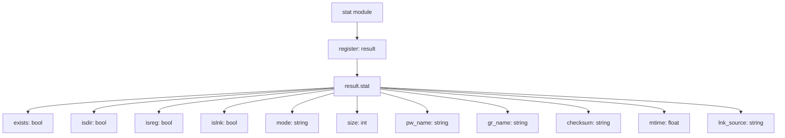

# How to Check if a File Exists with Ansible stat Module

Author: [nawazdhandala](https://www.github.com/nawazdhandala)

Tags: Ansible, stat Module, File Management, Conditionals, Idempotency

Description: Learn how to use the Ansible stat module to check file existence, permissions, size, and other attributes for conditional task execution.

---

Before creating, modifying, or deleting a file, you often need to know whether it already exists. The Ansible `stat` module gathers detailed information about a file or directory on the remote host, including whether it exists, its permissions, ownership, size, and checksums. Pairing `stat` with a `when` conditional is the standard pattern for file-existence checks in Ansible.

## Basic File Existence Check

The simplest use case: check if a file exists, then do something based on the result.

```yaml
# file-exists.yml - Basic file existence check
---
- name: Check if a file exists
  hosts: all
  gather_facts: false
  become: true
  tasks:
    - name: Check if config file exists
      ansible.builtin.stat:
        path: /etc/myapp/config.yml
      register: config_file

    - name: Create default config if it does not exist
      ansible.builtin.copy:
        src: default-config.yml
        dest: /etc/myapp/config.yml
        owner: app
        group: app
        mode: '0644'
      when: not config_file.stat.exists

    - name: Backup existing config before update
      ansible.builtin.copy:
        src: /etc/myapp/config.yml
        dest: /etc/myapp/config.yml.bak
        remote_src: true
        mode: '0644'
      when: config_file.stat.exists
```

The key field is `config_file.stat.exists`, which is a boolean. It is `true` if the path exists and `false` otherwise.

## Checking Directories

The `stat` module works for directories too. Use the `isdir` attribute to confirm the path is a directory, not a file.

```yaml
# dir-check.yml - Check for directory existence
---
- name: Directory checks
  hosts: all
  gather_facts: false
  become: true
  tasks:
    - name: Check if deployment directory exists
      ansible.builtin.stat:
        path: /opt/app/releases
      register: releases_dir

    - name: Create releases directory structure
      ansible.builtin.file:
        path: "{{ item }}"
        state: directory
        owner: app
        group: app
        mode: '0755'
      loop:
        - /opt/app
        - /opt/app/releases
        - /opt/app/shared
        - /opt/app/shared/log
      when: not releases_dir.stat.exists

    - name: Verify it is actually a directory (not a file)
      ansible.builtin.fail:
        msg: "/opt/app/releases exists but is not a directory"
      when:
        - releases_dir.stat.exists
        - not releases_dir.stat.isdir
```

## Checking File Permissions

The `stat` module returns detailed permission information:

```yaml
# check-permissions.yml - Verify file permissions
---
- name: Check and fix file permissions
  hosts: all
  gather_facts: false
  become: true
  tasks:
    - name: Get file stats
      ansible.builtin.stat:
        path: /etc/ssl/private/server.key
      register: key_file

    - name: Show file details
      ansible.builtin.debug:
        msg:
          - "Exists: {{ key_file.stat.exists }}"
          - "Mode: {{ key_file.stat.mode }}"
          - "Owner: {{ key_file.stat.pw_name }}"
          - "Group: {{ key_file.stat.gr_name }}"
          - "Size: {{ key_file.stat.size }} bytes"
      when: key_file.stat.exists

    - name: Fix permissions if too open
      ansible.builtin.file:
        path: /etc/ssl/private/server.key
        mode: '0600'
        owner: root
        group: ssl-cert
      when:
        - key_file.stat.exists
        - key_file.stat.mode != '0600'
```

## Checking Symlinks

By default, `stat` follows symlinks and reports on the target. Use `follow: false` to check the symlink itself:

```yaml
# symlink-check.yml - Check symlink status
---
- name: Symlink verification
  hosts: all
  gather_facts: false
  become: true
  tasks:
    - name: Check current deployment symlink
      ansible.builtin.stat:
        path: /opt/app/current
      register: current_link

    - name: Verify it is a symlink
      ansible.builtin.debug:
        msg:
          - "Is link: {{ current_link.stat.islnk }}"
          - "Points to: {{ current_link.stat.lnk_source }}"
      when:
        - current_link.stat.exists
        - current_link.stat.islnk

    - name: Check symlink without following it
      ansible.builtin.stat:
        path: /opt/app/current
        follow: false
      register: link_info

    - name: Remove broken symlink
      ansible.builtin.file:
        path: /opt/app/current
        state: absent
      when:
        - link_info.stat.exists
        - link_info.stat.islnk
        - not current_link.stat.exists  # Target does not exist
```

## File Size Checks

Use size information to detect empty files, oversized logs, or unexpected file states:

```yaml
# size-check.yml - File size validation
---
- name: File size checks
  hosts: all
  gather_facts: false
  become: true
  tasks:
    - name: Check log file size
      ansible.builtin.stat:
        path: /var/log/myapp/application.log
      register: log_file

    - name: Rotate log if larger than 100MB
      ansible.builtin.command:
        cmd: >
          mv /var/log/myapp/application.log
          /var/log/myapp/application.log.{{ now(utc=true, fmt='%Y%m%d%H%M%S') }}
      when:
        - log_file.stat.exists
        - log_file.stat.size > 104857600
      changed_when: true
      notify: restart syslog

    - name: Warn if config file is empty
      ansible.builtin.fail:
        msg: "Configuration file exists but is empty"
      when:
        - log_file.stat.exists
        - log_file.stat.size == 0
```

## Checksum Comparison

The `stat` module can compute file checksums, useful for verifying file integrity:

```yaml
# checksum-verify.yml - Verify file integrity with checksums
---
- name: File integrity verification
  hosts: all
  gather_facts: false
  become: true
  vars:
    expected_checksum: "e3b0c44298fc1c149afbf4c8996fb92427ae41e4649b934ca495991b7852b855"
  tasks:
    - name: Get file checksum
      ansible.builtin.stat:
        path: /opt/app/bin/application
        checksum_algorithm: sha256
      register: app_binary

    - name: Verify binary integrity
      ansible.builtin.assert:
        that:
          - app_binary.stat.exists
          - app_binary.stat.checksum == expected_checksum
        fail_msg: >
          Binary integrity check failed.
          Expected: {{ expected_checksum }}
          Got: {{ app_binary.stat.checksum | default('file not found') }}
```

## Checking Multiple Files

When you need to check several files at once:

```yaml
# multi-file-check.yml - Check multiple files
---
- name: Check multiple required files
  hosts: all
  gather_facts: false
  become: true
  vars:
    required_files:
      - /etc/myapp/config.yml
      - /etc/myapp/database.yml
      - /opt/app/bin/application
      - /etc/ssl/certs/app.pem
  tasks:
    - name: Check each required file
      ansible.builtin.stat:
        path: "{{ item }}"
      loop: "{{ required_files }}"
      register: file_checks

    - name: Identify missing files
      ansible.builtin.set_fact:
        missing_files: >-
          {{ file_checks.results | selectattr('stat.exists', 'equalto', false)
             | map(attribute='item') | list }}

    - name: Report missing files
      ansible.builtin.fail:
        msg: "The following required files are missing: {{ missing_files | join(', ') }}"
      when: missing_files | length > 0
```

## The stat Module Return Structure



## Pre-deployment Validation

A practical example that validates the entire deployment environment:

```yaml
# pre-deploy-check.yml - Full pre-deployment validation
---
- name: Pre-deployment file validation
  hosts: app_servers
  gather_facts: false
  become: true
  tasks:
    - name: Check deployment directory
      ansible.builtin.stat:
        path: /opt/app
      register: app_dir

    - name: Check SSL certificate
      ansible.builtin.stat:
        path: /etc/ssl/certs/app.pem
      register: ssl_cert

    - name: Check SSL private key
      ansible.builtin.stat:
        path: /etc/ssl/private/app.key
      register: ssl_key

    - name: Check database config
      ansible.builtin.stat:
        path: /etc/myapp/database.yml
      register: db_config

    - name: Validate deployment prerequisites
      ansible.builtin.assert:
        that:
          - app_dir.stat.exists and app_dir.stat.isdir
          - ssl_cert.stat.exists
          - ssl_key.stat.exists
          - ssl_key.stat.mode == '0600'
          - db_config.stat.exists
          - db_config.stat.size > 0
        fail_msg: |
          Pre-deployment check failed:
          - App directory: {{ 'OK' if app_dir.stat.exists else 'MISSING' }}
          - SSL cert: {{ 'OK' if ssl_cert.stat.exists else 'MISSING' }}
          - SSL key: {{ 'OK' if ssl_key.stat.exists else 'MISSING' }}
          - SSL key perms: {{ ssl_key.stat.mode | default('N/A') }}
          - DB config: {{ 'OK' if db_config.stat.exists else 'MISSING' }}
```

## Best Practices

Always register the `stat` result and check `.stat.exists` before accessing other attributes since accessing `.stat.size` on a non-existent file will error. Use `stat` with `when` clauses to make tasks idempotent. For permission checks, compare against the mode string (`'0644'`) not the integer. Use `checksum_algorithm: sha256` for integrity verification. When checking multiple files, use a loop to keep the code DRY. Remember that `stat` runs on the remote host, not the controller, so the paths must exist on the managed node.

The `stat` module is the foundation of file-aware automation in Ansible. It turns "does this file exist?" from a shell command hack into a proper, structured check that integrates cleanly with Ansible's conditional system.
