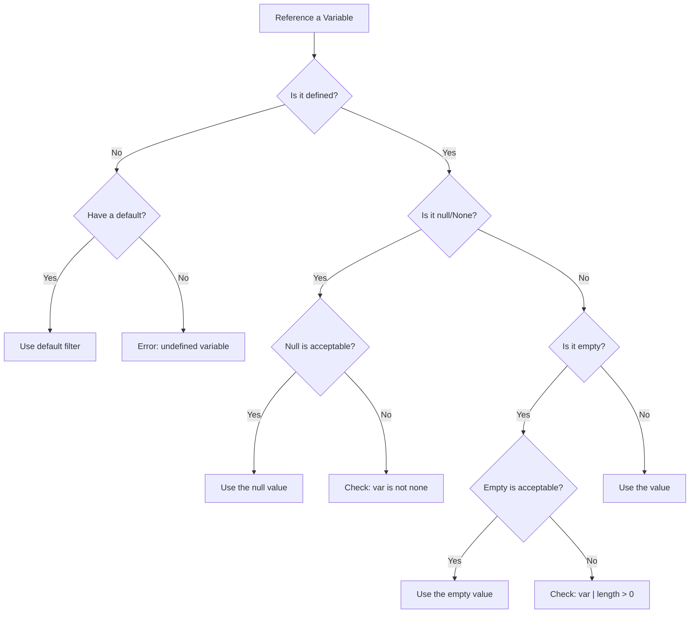

# How to Check if a Variable is Defined in Ansible

Author: [nawazdhandala](https://www.github.com/nawazdhandala)

Tags: Ansible, Variables, Conditionals, Jinja2 Tests, Best Practices

Description: Learn multiple ways to check if a variable is defined in Ansible and handle undefined variables gracefully in your playbooks.

---

Undefined variables are one of the most common sources of Ansible playbook failures. A variable might not be defined because it is optional, because someone forgot to set it, or because it only exists in certain contexts. Knowing how to check for variable existence before using it prevents cryptic error messages and makes your playbooks resilient to missing data.

## The is defined Test

The most straightforward way to check if a variable exists is the Jinja2 `is defined` test:

```yaml
# is-defined-basic.yml - Check if a variable is defined
---
- name: Basic defined check
  hosts: localhost
  gather_facts: false
  vars:
    configured_var: "hello"
    # missing_var is intentionally not defined
  tasks:
    - name: Run only if variable is defined
      ansible.builtin.debug:
        msg: "configured_var is: {{ configured_var }}"
      when: configured_var is defined

    - name: Skip if variable is not defined
      ansible.builtin.debug:
        msg: "This will not run"
      when: missing_var is defined

    - name: Run if variable is NOT defined
      ansible.builtin.debug:
        msg: "missing_var was not provided"
      when: missing_var is not defined
```

## is defined vs is not none

A variable can be defined but set to `null` (None). The `is defined` test returns `true` even for null values. If you need to distinguish between "not defined" and "defined but null," use both tests:

```yaml
# defined-vs-none.yml - Distinguishing undefined from null
---
- name: defined vs none
  hosts: localhost
  gather_facts: false
  vars:
    null_var: null
    empty_var: ""
    zero_var: 0
    false_var: false
  tasks:
    - name: Check null_var
      ansible.builtin.debug:
        msg:
          - "is defined: {{ null_var is defined }}"       # true
          - "is not none: {{ null_var is not none }}"     # false
          - "is none: {{ null_var is none }}"             # true

    - name: Check empty_var
      ansible.builtin.debug:
        msg:
          - "is defined: {{ empty_var is defined }}"       # true
          - "is not none: {{ empty_var is not none }}"     # true
          - "length: {{ empty_var | length }}"             # 0

    - name: Check zero_var
      ansible.builtin.debug:
        msg:
          - "is defined: {{ zero_var is defined }}"        # true
          - "is not none: {{ zero_var is not none }}"      # true
          - "bool value: {{ zero_var | bool }}"            # false

    - name: Check false_var
      ansible.builtin.debug:
        msg:
          - "is defined: {{ false_var is defined }}"       # true
          - "is not none: {{ false_var is not none }}"     # true
          - "bool value: {{ false_var | bool }}"           # false
```

## Using the default Filter

The `default` filter provides a fallback value when a variable is not defined. This is often cleaner than a `when` check.

```yaml
# default-filter.yml - Using default for undefined variables
---
- name: Default filter examples
  hosts: localhost
  gather_facts: false
  vars:
    app_port: 8080
    # app_host is not defined
    # debug_mode is not defined
  tasks:
    - name: Use default for missing variables
      ansible.builtin.debug:
        msg:
          - "Port: {{ app_port | default(3000) }}"         # 8080 (defined, so default is ignored)
          - "Host: {{ app_host | default('0.0.0.0') }}"    # 0.0.0.0 (using default)
          - "Debug: {{ debug_mode | default(false) }}"     # false (using default)

    # default(omit) is special - it makes the parameter behave as if it was not specified
    - name: Create user with optional password
      ansible.builtin.user:
        name: appuser
        password: "{{ user_password | default(omit) }}"
        state: present
      become: true
```

## The default(omit) Pattern

The `omit` placeholder is incredibly useful. When a parameter gets `omit`, Ansible treats it as if the parameter was not specified at all. This lets you write a single task that handles both cases.

```yaml
# default-omit.yml - Using default(omit) for optional parameters
---
- name: Optional parameters with default(omit)
  hosts: all
  gather_facts: false
  become: true
  vars:
    install_version: "2.4.1"
    # proxy_url is not defined
  tasks:
    - name: Install package with optional proxy
      ansible.builtin.apt:
        name: nginx
        state: present
      environment:
        http_proxy: "{{ proxy_url | default(omit) }}"
        https_proxy: "{{ proxy_url | default(omit) }}"

    - name: Create file with optional owner
      ansible.builtin.file:
        path: /opt/app/data
        state: directory
        mode: '0755'
        owner: "{{ app_user | default(omit) }}"
        group: "{{ app_group | default(omit) }}"
```

## Checking Nested Variable Attributes

Checking if a nested attribute is defined requires careful handling. A direct check like `my_dict.key is defined` will fail if `my_dict` itself is not defined.

```yaml
# nested-defined.yml - Checking nested attributes safely
---
- name: Nested variable checks
  hosts: localhost
  gather_facts: false
  vars:
    server_config:
      host: 10.0.1.50
      # port is not defined in this dict
  tasks:
    # This works because server_config is defined
    - name: Check nested attribute
      ansible.builtin.debug:
        msg: "Port is defined: {{ server_config.port is defined }}"
    # Output: false

    # For deeply nested checks, use multiple conditions
    - name: Safe nested check
      ansible.builtin.debug:
        msg: "SSL cert: {{ server_config.ssl.cert_path }}"
      when:
        - server_config is defined
        - server_config.ssl is defined
        - server_config.ssl.cert_path is defined

    # Or use the default filter on each level
    - name: Default for nested values
      ansible.builtin.debug:
        msg: "Port: {{ (server_config | default({})).port | default(8080) }}"
```

## Practical Example: Role with Optional Features

Roles often have features that should only be configured if the relevant variables are provided:

```yaml
# roles/webserver/tasks/main.yml - Optional feature configuration
---
- name: Install web server
  ansible.builtin.apt:
    name: nginx
    state: present
  become: true

- name: Configure base nginx
  ansible.builtin.template:
    src: nginx.conf.j2
    dest: /etc/nginx/nginx.conf
    mode: '0644'
  become: true
  notify: reload nginx

# SSL is only configured if cert paths are provided
- name: Configure SSL
  when:
    - ssl_cert_path is defined
    - ssl_key_path is defined
  block:
    - name: Copy SSL certificate
      ansible.builtin.copy:
        src: "{{ ssl_cert_path }}"
        dest: /etc/nginx/ssl/server.crt
        mode: '0644'
      become: true

    - name: Copy SSL key
      ansible.builtin.copy:
        src: "{{ ssl_key_path }}"
        dest: /etc/nginx/ssl/server.key
        mode: '0600'
      become: true

    - name: Enable SSL virtual host
      ansible.builtin.template:
        src: ssl-vhost.conf.j2
        dest: /etc/nginx/sites-enabled/ssl.conf
        mode: '0644'
      become: true
      notify: reload nginx

# Custom error pages are optional
- name: Deploy custom error pages
  ansible.builtin.copy:
    src: "{{ item.src }}"
    dest: "/var/www/errors/{{ item.dest }}"
    mode: '0644'
  loop: "{{ custom_error_pages | default([]) }}"
  become: true
  when: custom_error_pages is defined
```

## Checking if a Variable is Truthy (Defined and Not Empty)

Sometimes "defined" is not enough. You want to ensure the variable is defined AND has a meaningful value:

```yaml
# truthy-check.yml - Comprehensive variable validation
---
- name: Truthy variable checks
  hosts: localhost
  gather_facts: false
  vars:
    good_var: "hello"
    empty_var: ""
    null_var: null
    zero_var: 0
    false_var: false
    empty_list: []
  tasks:
    - name: Check if variable is defined and truthy
      ansible.builtin.debug:
        msg: "{{ item.name }} is {{ 'truthy' if item.value else 'falsy' }}"
      loop:
        - { name: "good_var", value: "{{ good_var | default('') }}" }
        - { name: "empty_var", value: "{{ empty_var | default('') }}" }
        - { name: "null_var", value: "{{ null_var | default('') }}" }
        - { name: "zero_var", value: "{{ zero_var | default('') }}" }

    # Robust pattern: defined AND has content
    - name: Run only if api_key is actually provided
      ansible.builtin.debug:
        msg: "API key is set"
      when:
        - api_key is defined
        - api_key | length > 0
```

## The Decision Tree



## Setting Ansible's Behavior for Undefined Variables

Ansible's behavior with undefined variables is controlled by `ansible.cfg`:

```ini
# ansible.cfg
[defaults]
# Default behavior: error on undefined variables
# error_on_undefined_vars = true

# Set to false to treat undefined variables as empty strings (not recommended)
# error_on_undefined_vars = false
```

Keep `error_on_undefined_vars = true` (the default). Silencing undefined variable errors hides real bugs.

## Best Practices

Use `is defined` for truly optional variables where the absence of the variable means "do not configure this feature." Use `default()` when a variable is optional but you have a reasonable fallback value. Use `default(omit)` when a module parameter should be left unspecified if the variable is not provided. For required variables, use `undef()` in role defaults or `assert` tasks rather than relying on the generic undefined variable error. Chain checks for nested attributes to avoid cascading undefined errors. Keep `error_on_undefined_vars = true` and handle missing variables explicitly rather than silently swallowing errors.

Properly handling undefined variables is what separates fragile playbooks from robust ones. A few extra `is defined` checks and `default()` filters make your automation resilient to the inevitable variations in how different teams and environments provide their configuration.
