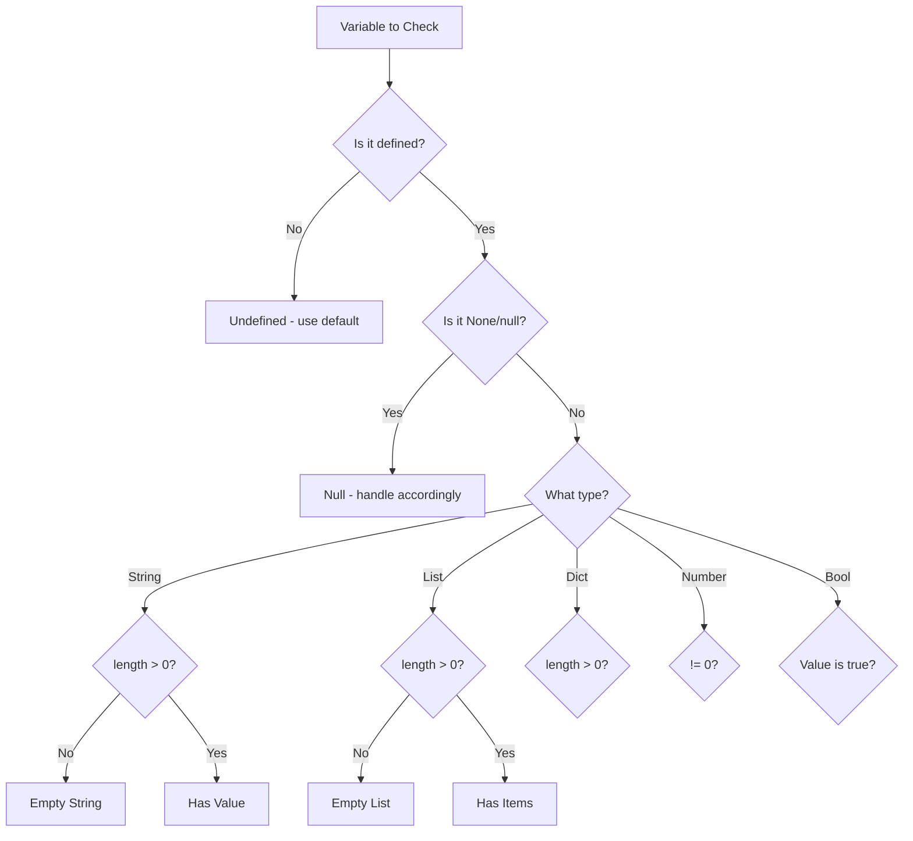

# How to Check if a Variable is Empty in Ansible

Author: [nawazdhandala](https://www.github.com/nawazdhandala)

Tags: Ansible, Variables, Conditionals, Validation, Jinja2

Description: Learn reliable methods to check if a variable is empty in Ansible, covering strings, lists, dictionaries, and null values.

---

Checking if a variable is empty in Ansible is not as simple as it sounds. An "empty" variable could be an empty string, an empty list, an empty dictionary, `null`, `0`, or `false`. Each of these requires slightly different handling depending on what you consider "empty" in your context. This post covers every scenario and gives you reliable patterns for each.

## Empty Strings

The most common case is checking for empty strings. Use the `length` filter:

```yaml
# empty-string.yml - Check for empty strings
---
- name: Empty string checks
  hosts: localhost
  gather_facts: false
  vars:
    non_empty: "hello"
    empty_string: ""
    whitespace_only: "   "
  tasks:
    - name: Check non-empty string
      ansible.builtin.debug:
        msg: "non_empty has content: {{ non_empty | length > 0 }}"
    # Output: true

    - name: Check empty string
      ansible.builtin.debug:
        msg: "empty_string has content: {{ empty_string | length > 0 }}"
    # Output: false

    - name: Check whitespace-only string
      ansible.builtin.debug:
        msg: "whitespace_only has content: {{ whitespace_only | length > 0 }}"
    # Output: true (whitespace counts as content!)

    - name: Check whitespace-only with trim
      ansible.builtin.debug:
        msg: "whitespace_only trimmed: {{ whitespace_only | trim | length > 0 }}"
    # Output: false
```

## Practical Pattern: Validate Before Using

```yaml
# validate-before-use.yml - Validate variables before using them
---
- name: Validate and use variables
  hosts: all
  gather_facts: false
  become: true
  vars:
    db_password: ""
    api_key: "sk-abc123"
  tasks:
    - name: Fail if database password is empty
      ansible.builtin.fail:
        msg: "db_password cannot be empty"
      when: db_password is not defined or db_password | length == 0

    - name: Configure API if key is provided
      ansible.builtin.template:
        src: api-config.j2
        dest: /etc/app/api.conf
        mode: '0600'
      when:
        - api_key is defined
        - api_key | trim | length > 0
```

## Empty Lists

Lists have their own emptiness check. An empty list `[]` has a length of 0:

```yaml
# empty-list.yml - Check for empty lists
---
- name: Empty list checks
  hosts: localhost
  gather_facts: false
  vars:
    populated_list:
      - item1
      - item2
    empty_list: []
  tasks:
    - name: Check if list has items
      ansible.builtin.debug:
        msg: "populated_list has {{ populated_list | length }} items"

    - name: Check if list is empty
      ansible.builtin.debug:
        msg: "empty_list is empty: {{ empty_list | length == 0 }}"

    # Common pattern: skip loop if list is empty
    - name: Process items only if list is not empty
      ansible.builtin.debug:
        msg: "Processing {{ item }}"
      loop: "{{ task_list | default([]) }}"
      when: task_list is defined and task_list | length > 0
```

## Empty Dictionaries

Same approach works for dictionaries:

```yaml
# empty-dict.yml - Check for empty dictionaries
---
- name: Empty dictionary checks
  hosts: localhost
  gather_facts: false
  vars:
    populated_dict:
      key1: value1
      key2: value2
    empty_dict: {}
  tasks:
    - name: Check if dict has keys
      ansible.builtin.debug:
        msg: "populated_dict has {{ populated_dict | length }} keys"

    - name: Check if dict is empty
      ansible.builtin.debug:
        msg: "empty_dict is empty: {{ empty_dict | length == 0 }}"

    - name: Process config only if not empty
      ansible.builtin.debug:
        msg: "Applying custom config: {{ custom_config }}"
      when:
        - custom_config is defined
        - custom_config | length > 0
```

## Null and None Values

A variable set to `null` in YAML becomes Python's `None`. It is different from an empty string or an empty list:

```yaml
# null-check.yml - Check for null/None values
---
- name: Null value checks
  hosts: localhost
  gather_facts: false
  vars:
    null_var: null
    empty_var: ""
    defined_var: "value"
  tasks:
    - name: Check null with various methods
      ansible.builtin.debug:
        msg:
          - "null_var is defined: {{ null_var is defined }}"     # true!
          - "null_var is none: {{ null_var is none }}"           # true
          - "null_var is not none: {{ null_var is not none }}"   # false

    - name: Safe check for non-null and non-empty
      ansible.builtin.debug:
        msg: "Variable has a real value"
      when:
        - defined_var is defined
        - defined_var is not none
        - defined_var | string | length > 0
```

## The Falsy Values Chart

Different "empty" values behave differently in boolean contexts:

```yaml
# falsy-values.yml - How different empty values evaluate as booleans
---
- name: Boolean evaluation of empty values
  hosts: localhost
  gather_facts: false
  vars:
    test_values:
      - { name: "empty string", value: "" }
      - { name: "zero", value: 0 }
      - { name: "false", value: false }
      - { name: "empty list", value: [] }
      - { name: "empty dict", value: {} }
      - { name: "non-empty string", value: "hello" }
      - { name: "one", value: 1 }
      - { name: "true", value: true }
  tasks:
    - name: Show boolean evaluation
      ansible.builtin.debug:
        msg: "{{ item.name }} ({{ item.value }}) -> bool: {{ item.value | bool if item.value is not mapping and item.value is not iterable else 'N/A' }}, truthy: {{ true if item.value else false }}"
      loop: "{{ test_values }}"
      loop_control:
        label: "{{ item.name }}"
```

## A Universal "Is Empty" Check

Here is a comprehensive pattern that handles all types:

```yaml
# universal-empty.yml - Universal emptiness check
---
- name: Universal emptiness checking
  hosts: localhost
  gather_facts: false
  vars:
    test_empty_string: ""
    test_null: null
    test_empty_list: []
    test_value: "hello"
  tasks:
    # Pattern: defined AND not none AND (has length for strings/lists/dicts)
    - name: Check if variable has a real value
      ansible.builtin.debug:
        msg: "{{ item.name }} has a value: {{ item.var is defined and item.var is not none and (item.var | string | length > 0) }}"
      loop:
        - { name: "empty_string", var: "{{ test_empty_string }}" }
        - { name: "null", var: "{{ test_null }}" }
        - { name: "empty_list", var: "{{ test_empty_list }}" }
        - { name: "value", var: "{{ test_value }}" }
      loop_control:
        label: "{{ item.name }}"
```

## Real-World Example: Configuration Validation

```yaml
# config-validation.yml - Validate a configuration before applying it
---
- name: Validate and apply application configuration
  hosts: app_servers
  gather_facts: false
  become: true
  vars:
    app_config:
      name: "myapp"
      port: 8080
      database_url: ""          # Empty - should be caught
      secret_key: "abc123"
      allowed_origins: []       # Empty list - might be intentional
      extra_headers: {}         # Empty dict
  tasks:
    - name: Validate required string fields are not empty
      ansible.builtin.assert:
        that:
          - app_config[item] is defined
          - app_config[item] is not none
          - app_config[item] | string | trim | length > 0
        fail_msg: "{{ item }} is required and cannot be empty"
      loop:
        - name
        - database_url
        - secret_key

    - name: Validate port is set
      ansible.builtin.assert:
        that:
          - app_config.port is defined
          - app_config.port | int > 0
        fail_msg: "port must be a positive integer"

    - name: Configure CORS only if origins are specified
      ansible.builtin.template:
        src: cors.conf.j2
        dest: /etc/app/cors.conf
        mode: '0644'
      when: app_config.allowed_origins | default([]) | length > 0

    - name: Apply extra headers if provided
      ansible.builtin.template:
        src: headers.conf.j2
        dest: /etc/app/headers.conf
        mode: '0644'
      when: app_config.extra_headers | default({}) | length > 0
```

## Checking Registered Variable Output

Command output is often checked for emptiness to determine if something was found:

```yaml
# registered-empty.yml - Check if command output is empty
---
- name: Check command output emptiness
  hosts: all
  gather_facts: false
  become: true
  tasks:
    - name: Search for running Java processes
      ansible.builtin.command:
        cmd: pgrep -f java
      register: java_procs
      failed_when: false
      changed_when: false

    - name: Report Java process status
      ansible.builtin.debug:
        msg: >
          {{ 'Java processes found: ' + java_procs.stdout
             if java_procs.stdout | length > 0
             else 'No Java processes running' }}

    - name: Find old log files
      ansible.builtin.find:
        paths: /var/log/app
        patterns: "*.log"
        age: 30d
      register: old_logs

    - name: Clean up old logs if any found
      ansible.builtin.file:
        path: "{{ item.path }}"
        state: absent
      loop: "{{ old_logs.files }}"
      when: old_logs.files | length > 0
```

## Decision Flowchart



## Helper Macro for Reuse

If you find yourself repeating the same emptiness checks, create a reusable set of variables:

```yaml
# group_vars/all.yml - Helper patterns
# Use these in templates:
# 
# Or use the shorthand in when clauses:
# when: my_var | default('') | trim | length > 0
```

## Best Practices

Use `| length > 0` for checking strings, lists, and dicts. Use `is none` specifically for null checks. Use `| trim | length > 0` when whitespace-only strings should be treated as empty. Combine `is defined` with emptiness checks to handle both missing and empty variables. Use `| default('')` or `| default([])` to normalize undefined variables before checking their length. Never rely on implicit boolean conversion for emptiness checks since `0` and `false` are valid non-empty values in many contexts.

Getting emptiness checks right in Ansible takes some discipline, but once you have the patterns down, your playbooks become much more resilient to the messy variable data that real-world infrastructure inevitably produces.
