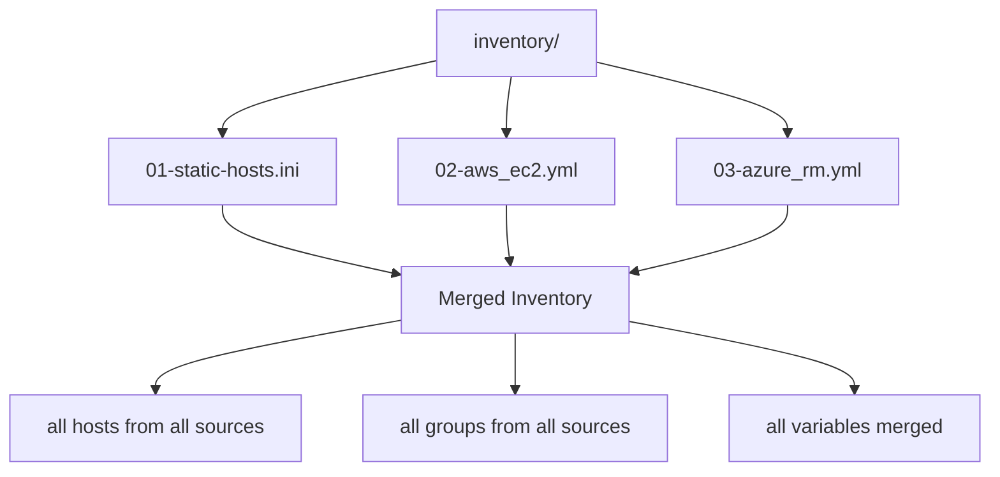

# How to Combine Static and Dynamic Inventories in Ansible

Author: [nawazdhandala](https://www.github.com/nawazdhandala)

Tags: Ansible, Inventory, Dynamic Inventory, DevOps, Cloud

Description: Learn how to merge static inventory files with dynamic cloud inventory plugins in Ansible to manage hybrid infrastructure with on-premises and cloud resources.

---

Most real-world infrastructure is not purely cloud or purely on-premises. You have legacy servers in a data center, VMs in AWS, containers in Kubernetes, and maybe a few special-purpose machines that do not fit into any cloud provider's inventory plugin. Ansible handles this by letting you combine static and dynamic inventories in the same project, merging everything into a unified view of your infrastructure.

## The Inventory Directory Approach

The simplest way to combine static and dynamic inventory is to put them all in the same directory.

```
inventory/
  01-static-hosts.ini        # On-premises and manually managed servers
  02-aws_ec2.yml             # AWS EC2 inventory plugin config
  03-azure_rm.yml            # Azure inventory plugin config
  group_vars/
    all.yml
    webservers.yml
    databases.yml
```

When you point Ansible at the directory, it loads every file:

```bash
# Load all inventory sources from the directory
ansible-playbook -i inventory/ site.yml
```

The static file defines hosts that do not live in any cloud API:

```ini
# inventory/01-static-hosts.ini
# On-premises servers and special-purpose machines

[onprem_loadbalancers]
lb-01.dc.local ansible_host=192.168.1.10
lb-02.dc.local ansible_host=192.168.1.11

[onprem_monitoring]
prometheus.dc.local ansible_host=192.168.1.50
grafana.dc.local ansible_host=192.168.1.51

[bastion]
bastion.dc.local ansible_host=203.0.113.10

[onprem_loadbalancers:vars]
ansible_user=lbadmin

[onprem_monitoring:vars]
ansible_user=monitoring
```

The dynamic inventory plugin configuration sits alongside it:

```yaml
# inventory/02-aws_ec2.yml
# AWS EC2 dynamic inventory plugin configuration
plugin: amazon.aws.aws_ec2
regions:
  - us-east-1
  - us-west-2
filters:
  tag:managed_by: ansible
keyed_groups:
  - key: tags.role
    prefix: aws_role
    separator: "_"
  - key: tags.environment
    prefix: aws_env
    separator: "_"
compose:
  ansible_host: private_ip_address
```

## How Merging Works

Ansible processes inventory sources in alphabetical order within a directory. All hosts end up in a single merged inventory.



After merging, you can target any group from any source. A playbook that targets `webservers` will pick up web servers from both the static file and the dynamic plugins, as long as they share the group name.

## Creating Cross-Source Groups

The tricky part is that your static hosts and cloud-discovered hosts need to be in the same logical groups. There are two ways to handle this.

### Method 1: Use group_vars with a parent group

Define a parent group in your static file that includes both static and dynamically-discovered groups:

```ini
# inventory/01-static-hosts.ini
[onprem_web]
web-dc-01.local ansible_host=192.168.1.20
web-dc-02.local ansible_host=192.168.1.21

# Create a parent group that includes on-prem and cloud web servers
[webservers:children]
onprem_web
aws_role_web
```

The `aws_role_web` group is created by the EC2 plugin's `keyed_groups` configuration. By including it in the static file's `[webservers:children]`, you create a unified group.

### Method 2: Use the constructed plugin

Add a constructed inventory plugin configuration:

```yaml
# inventory/04-groups.yml
# Constructed inventory plugin to create unified groups
plugin: ansible.builtin.constructed
strict: false
groups:
  # Put all web servers in a single group regardless of source
  webservers: >
    'onprem_web' in group_names or
    'aws_role_web' in group_names or
    'azure_web' in group_names

  # Same for databases
  databases: >
    'onprem_db' in group_names or
    'aws_role_db' in group_names or
    'azure_db' in group_names

  # Environment grouping
  production: >
    'onprem_production' in group_names or
    'aws_env_production' in group_names
```

## Practical Example: Hybrid Infrastructure

Here is a complete setup for a company with on-premises data centers and AWS cloud:

```ini
# inventory/01-datacenter.ini
# Data center servers (manually managed)

[dc_web]
web-dc-01.dc.local ansible_host=192.168.10.10
web-dc-02.dc.local ansible_host=192.168.10.11

[dc_db]
db-dc-primary.dc.local ansible_host=192.168.10.20
db-dc-replica.dc.local ansible_host=192.168.10.21

[dc_bastion]
bastion.dc.local ansible_host=203.0.113.10

[dc_web:vars]
ansible_user=webdeploy
location=datacenter

[dc_db:vars]
ansible_user=dbadmin
location=datacenter
```

```yaml
# inventory/02-aws_ec2.yml
# AWS EC2 auto-discovery
plugin: amazon.aws.aws_ec2
regions:
  - us-east-1
filters:
  instance-state-name: running
  tag:managed_by: ansible
keyed_groups:
  - key: tags.role
    prefix: aws
    separator: "_"
  - key: tags.env
    prefix: env
    separator: "_"
hostnames:
  - tag:Name
compose:
  ansible_host: private_ip_address
  ansible_user: "'ec2-user'"
  location: "'aws-us-east-1'"
```

```yaml
# inventory/03-constructed.yml
# Merge static and dynamic groups into unified groups
plugin: ansible.builtin.constructed
strict: false
groups:
  webservers: "'dc_web' in group_names or 'aws_web' in group_names"
  databases: "'dc_db' in group_names or 'aws_db' in group_names"
  all_production: "'dc_web' in group_names or 'dc_db' in group_names or 'env_production' in group_names"
```

Now your playbook works against all web servers, regardless of where they live:

```yaml
# deploy.yml
# Deploy to all web servers, on-prem and cloud
- hosts: webservers
  become: true
  tasks:
    - name: Deploy application
      include_role:
        name: webapp

    - name: Configure monitoring agent
      include_role:
        name: monitoring
      vars:
        monitor_location: "{{ location }}"
```

## Shared group_vars Across Sources

The `group_vars` directory in the inventory folder applies to hosts from all sources:

```yaml
# inventory/group_vars/all.yml
# Applied to every host, static and dynamic
ntp_servers:
  - 0.pool.ntp.org
  - 1.pool.ntp.org
monitoring_enabled: true
log_retention_days: 30
```

```yaml
# inventory/group_vars/webservers.yml
# Applied to all web servers (datacenter + cloud)
nginx_version: "1.24"
ssl_enabled: true
health_check_path: /health
```

## Handling Variable Conflicts

When a host appears in both static and dynamic inventory (unlikely but possible), or when groups from different sources define the same variable, Ansible uses the standard precedence rules. Variables from files loaded later (alphabetically) override earlier ones.

To control this explicitly:

```yaml
# inventory/group_vars/dc_web.yml
# Higher priority for datacenter web servers
ansible_group_priority: 20
http_port: 80

# inventory/group_vars/aws_web.yml
# Lower priority for cloud web servers
ansible_group_priority: 10
http_port: 8080
```

## Debugging the Combined Inventory

Verify the merged result before running playbooks:

```bash
# List all hosts from all sources
ansible-inventory -i inventory/ --list

# Show the full group hierarchy
ansible-inventory -i inventory/ --graph

# Check a specific host from the dynamic source
ansible-inventory -i inventory/ --host web-dc-01.dc.local

# Ping all web servers across all sources
ansible webservers -i inventory/ -m ping
```

If a dynamic inventory plugin fails, Ansible will report the error but still load the other inventory sources (unless `strict: true` is set in the plugin config).

## Tips for Production Use

1. **Number your files.** `01-static.ini`, `02-aws.yml`, `03-constructed.yml`. The alphabetical ordering determines load and merge priority.

2. **Use the constructed plugin for unification.** Do not rely on naming conventions alone. The constructed plugin explicitly defines which dynamic groups map to which unified groups.

3. **Test each source independently.** Before combining, verify each inventory source works on its own: `ansible-inventory -i inventory/02-aws_ec2.yml --list`.

4. **Cache dynamic inventory.** Cloud API calls add latency. Enable caching in your plugin configs to speed up repeated runs:

```yaml
# inventory/02-aws_ec2.yml
plugin: amazon.aws.aws_ec2
cache: true
cache_plugin: jsonfile
cache_timeout: 300
cache_connection: /tmp/ansible_inventory_cache
```

5. **Keep static inventory as a fallback.** If a cloud API is down, your on-premises infrastructure should still be manageable from the static file.

Combining static and dynamic inventories is the reality for most organizations running Ansible at scale. Get the directory structure right, use the constructed plugin for cross-source grouping, and you will have a single unified view of your entire infrastructure regardless of where each server lives.
