# How to Configure Ansible Forks for Parallel Execution

Author: [nawazdhandala](https://www.github.com/nawazdhandala)

Tags: Ansible, Performance, Parallel Execution, DevOps

Description: Learn how to configure Ansible forks to run tasks across multiple hosts in parallel and find the right fork count for your infrastructure.

---

Ansible processes hosts in batches. The `forks` setting controls how many hosts Ansible will manage simultaneously for each task. The default value is 5, which means if you have 200 hosts, Ansible will process them in 40 sequential batches per task. Bumping the fork count is one of the easiest and most impactful performance improvements you can make.

## Understanding Forks

When Ansible executes a task, it forks child processes to handle multiple hosts at the same time. Each fork manages one host: it opens the SSH connection, transfers the module, runs it, and collects the results. The Ansible controller waits until all forks in the current batch complete before starting the next batch.

Here is a visual representation of how forks affect execution:

```mermaid
gantt
    title Task Execution with 5 Forks (20 hosts)
    dateFormat X
    axisFormat %s
    section Batch 1
    Host 1-5   :0, 3
    section Batch 2
    Host 6-10  :3, 6
    section Batch 3
    Host 11-15 :6, 9
    section Batch 4
    Host 16-20 :9, 12
```



With 5 forks, 20 hosts require 4 batches. With 20 forks, the same work finishes in a single batch.

## Setting the Fork Count

There are three ways to set the fork count.

In `ansible.cfg`:

```ini
# Set default forks to 50 for all playbook runs
[defaults]
forks = 50
```

Via command line flag:

```bash
# Override forks for a single run
ansible-playbook site.yml -f 50
```

Via environment variable:

```bash
# Set forks through environment variable
export ANSIBLE_FORKS=50
ansible-playbook site.yml
```

The command line flag takes precedence over `ansible.cfg`, and the environment variable takes precedence over both.

## Finding the Right Fork Count

More forks is not always better. Each fork consumes memory and CPU on your Ansible control node. Setting forks too high can cause the control node to swap or run out of file descriptors, which actually slows things down.

Here is a practical approach to finding the right value:

```bash
# Check available memory on your control node
free -m

# Check current CPU load
nproc
uptime

# Check file descriptor limits
ulimit -n
```

A reasonable starting formula is:

```
forks = min(number_of_hosts, control_node_cpu_cores * 10)
```

For a 4-core control node, start with 40 forks. For an 8-core machine, try 80. Then monitor resource usage during a playbook run:

```bash
# Monitor control node resources during playbook execution
# Run this in a separate terminal
watch -n 1 'echo "=== CPU ===" && uptime && echo "=== Memory ===" && free -m && echo "=== Processes ===" && ps aux | grep ansible | wc -l'
```

## Benchmark Script

Here is a script to test different fork values and find the sweet spot:

```bash
#!/bin/bash
# benchmark-forks.sh - Test different fork counts and measure execution time

PLAYBOOK="site.yml"
FORK_VALUES="5 10 20 30 50 75 100"

echo "Fork Count | Execution Time | Memory Peak"
echo "-----------|----------------|------------"

for forks in $FORK_VALUES; do
    # Clear any caches between runs for fair comparison
    sync

    # Time the playbook execution
    START=$(date +%s%N)
    ansible-playbook "$PLAYBOOK" -f "$forks" > /dev/null 2>&1
    END=$(date +%s%N)

    # Calculate elapsed time in seconds
    ELAPSED=$(echo "scale=2; ($END - $START) / 1000000000" | bc)

    echo "$forks          | ${ELAPSED}s"
done
```

In my experience, the results typically look like a curve that flattens out. You see big gains going from 5 to 20 forks, moderate gains from 20 to 50, and diminishing returns after that.

## Fork Interaction with Serial

The `serial` keyword in a play limits how many hosts are processed per batch, and it interacts with forks:

```yaml
---
# Rolling update: 10 hosts at a time, processed with up to 50 forks
- hosts: webservers
  serial: 10
  tasks:
    - name: Update application
      apt:
        name: myapp
        state: latest

    - name: Restart service
      service:
        name: myapp
        state: restarted
```

If `serial` is less than `forks`, the serial value wins. In this example, even with `forks = 50`, only 10 hosts are processed at a time because `serial` caps the batch size. This is intentional for rolling updates where you want to limit the blast radius.

You can also use a percentage:

```yaml
# Process 25% of hosts at a time
- hosts: webservers
  serial: "25%"
  tasks:
    - name: Deploy new config
      template:
        src: app.conf.j2
        dest: /etc/myapp/app.conf
```

## Fork Resource Usage

Each fork runs as a separate Python process on the control node. Let us look at what that means for memory:

```bash
# Check memory usage per Ansible fork process
# Run this while a playbook is executing
ps aux | grep ansible | grep -v grep | awk '{sum += $6} END {print "Total RSS:", sum/1024, "MB"; print "Per process:", sum/NR/1024, "MB"; print "Process count:", NR}'
```

Typical memory per fork is 30-80 MB depending on the modules being used and the size of the variables in scope. So 50 forks might consume 1.5-4 GB of RAM on the control node.

## Forks and Connection Plugins

The fork count applies differently depending on the connection plugin:

```ini
# For SSH connections (the default), each fork opens one SSH session
[defaults]
forks = 50

[ssh_connection]
pipelining = True
ssh_args = -o ControlMaster=auto -o ControlPersist=60s
```

When using the `local` connection plugin, forks still spawn child processes but they all run on the same machine. For `docker` connections, each fork communicates with the Docker daemon, which can become a bottleneck.

## Handling File Descriptor Limits

With high fork counts, you might hit the system's file descriptor limit. Each fork opens several file descriptors for SSH connections, pipes, and temporary files:

```bash
# Check the current limit
ulimit -n

# Increase it for the current session
ulimit -n 65536

# Make it permanent by editing limits.conf
# Add these lines to /etc/security/limits.conf
# ansible_user  soft  nofile  65536
# ansible_user  hard  nofile  65536
```

A playbook to configure this across your environment:

```yaml
---
# Configure file descriptor limits on the control node
- hosts: ansible_controller
  become: true
  tasks:
    - name: Set file descriptor limits for ansible user
      pam_limits:
        domain: "{{ ansible_user }}"
        limit_type: "{{ item }}"
        limit_item: nofile
        value: 65536
      loop:
        - soft
        - hard

    - name: Ensure pam_limits is enabled
      lineinfile:
        path: /etc/pam.d/common-session
        line: "session required pam_limits.so"
        state: present
```

## Per-Host Group Fork Limits

Sometimes you want different fork counts for different host groups. While there is no per-group fork setting in Ansible, you can achieve this with separate plays:

```yaml
---
# Use fewer forks for database servers (be gentle)
- hosts: databases
  tasks:
    - name: Run database maintenance
      command: /opt/db/maintenance.sh

# Use more forks for stateless web servers
- hosts: webservers
  tasks:
    - name: Deploy application
      copy:
        src: app.tar.gz
        dest: /opt/app/
```

Then run with:

```bash
# Run with high forks but rely on serial for the database play
ansible-playbook deploy.yml -f 100
```

## Summary

The fork count is one of Ansible's most impactful settings, and the default of 5 is too conservative for most environments. Start at 50, benchmark your specific workload, and adjust from there based on your control node's resources. Combine forks with SSH pipelining and ControlPersist for the best results, and always monitor your control node's CPU and memory during high-fork runs.
