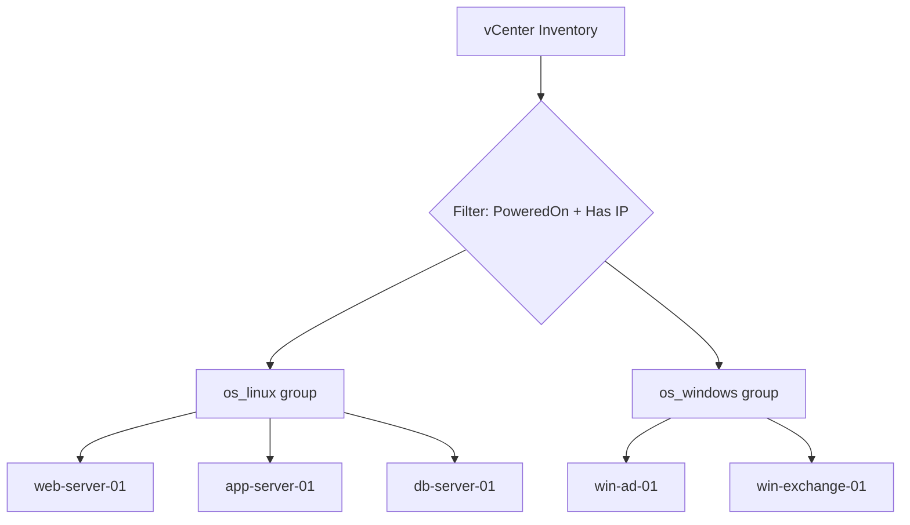

# How to Configure Ansible Inventory for VMware vSphere

Author: [nawazdhandala](https://www.github.com/nawazdhandala)

Tags: Ansible, VMware, vSphere, Dynamic Inventory, Virtualization

Description: Learn how to set up Ansible dynamic inventory for VMware vSphere to automatically discover and manage virtual machines in your vCenter environment.

---

VMware vSphere is the backbone of many enterprise data centers. If you manage hundreds or thousands of VMs through vCenter, manually maintaining an Ansible inventory for them is not practical. The `community.vmware` collection includes a dynamic inventory plugin that queries vCenter and automatically builds your inventory from the VMs it finds. This post walks through the complete setup.

## Prerequisites

You need:
- vCenter Server or ESXi host with API access
- The `community.vmware` Ansible collection
- The `pyVmomi` Python library (VMware's Python SDK)

```bash
# Install the VMware collection
ansible-galaxy collection install community.vmware

# Install the Python SDK
pip install pyVmomi requests
```

## Basic vSphere Inventory Plugin Configuration

Create an inventory file for the VMware plugin. The filename must end with `vmware.yml` or `vmware.yaml`:

```yaml
# inventory/vmware.yml
plugin: community.vmware.vmware_vm_inventory
strict: false

# vCenter connection settings
hostname: vcenter.example.com
username: ansible@vsphere.local
password: "your-vcenter-password"
validate_certs: false

# Properties to fetch for each VM
properties:
  - name
  - guest.ipAddress
  - guest.guestId
  - guest.hostName
  - config.cpuHotAddEnabled
  - config.hardware.numCPU
  - config.hardware.memoryMB
  - runtime.powerState
  - config.guestId
  - config.annotation
  - customValue

# Only include powered-on VMs
filters:
  - runtime.powerState == "poweredOn"

# Set ansible_host from the VM's IP address
compose:
  ansible_host: guest.ipAddress
  ansible_user: "'deploy'"

# Create groups based on VM properties
keyed_groups:
  # Group by guest OS
  - key: config.guestId
    prefix: os
    separator: "_"
  # Group by power state
  - key: runtime.powerState
    prefix: state
    separator: "_"
```

Enable the plugin:

```ini
# ansible.cfg
[inventory]
enable_plugins = community.vmware.vmware_vm_inventory, ansible.builtin.yaml, ansible.builtin.ini
```

Test the inventory:

```bash
# List all discovered VMs
ansible-inventory -i inventory/vmware.yml --graph

# Show full details
ansible-inventory -i inventory/vmware.yml --list
```

## Using Environment Variables for Credentials

Hardcoding credentials in the inventory file is not great practice. Use environment variables instead:

```yaml
# inventory/vmware.yml
plugin: community.vmware.vmware_vm_inventory
strict: false

# Credentials from environment variables
hostname: "{{ lookup('env', 'VMWARE_HOST') }}"
username: "{{ lookup('env', 'VMWARE_USER') }}"
password: "{{ lookup('env', 'VMWARE_PASSWORD') }}"
validate_certs: false

filters:
  - runtime.powerState == "poweredOn"

compose:
  ansible_host: guest.ipAddress
```

Set the environment variables:

```bash
export VMWARE_HOST="vcenter.example.com"
export VMWARE_USER="ansible@vsphere.local"
export VMWARE_PASSWORD="your-password"

ansible-inventory -i inventory/vmware.yml --graph
```

## Grouping VMs by Folder, Cluster, and Datacenter

vSphere organizes VMs in a hierarchy: Datacenter > Cluster > Resource Pool > Folder. You can create inventory groups based on this structure:

```yaml
# inventory/vmware_grouped.yml
plugin: community.vmware.vmware_vm_inventory
strict: false

hostname: "{{ lookup('env', 'VMWARE_HOST') }}"
username: "{{ lookup('env', 'VMWARE_USER') }}"
password: "{{ lookup('env', 'VMWARE_PASSWORD') }}"
validate_certs: false

# Include these properties
properties:
  - name
  - guest.ipAddress
  - config.guestId
  - runtime.powerState
  - config.hardware.numCPU
  - config.hardware.memoryMB

# Group by vSphere organizational structure
with_nested_properties: true

# Generate groups from these paths
hostnames:
  - config.name

keyed_groups:
  # Group by the VM folder path
  - key: config.folder | basename
    prefix: folder
    separator: "_"
  # Group by datacenter
  - key: datacenter
    prefix: dc
    separator: "_"
  # Group by cluster
  - key: cluster
    prefix: cluster
    separator: "_"

filters:
  - runtime.powerState == "poweredOn"

compose:
  ansible_host: guest.ipAddress
  vm_cpus: config.hardware.numCPU
  vm_memory_mb: config.hardware.memoryMB
```

This creates groups like `dc_MainDC`, `cluster_ProdCluster`, `folder_WebServers`.

## Grouping by Custom Attributes

If you use vSphere custom attributes (also called custom values or annotations) to tag VMs, you can group on those:

```yaml
# inventory/vmware_custom_attrs.yml
plugin: community.vmware.vmware_vm_inventory
strict: false

hostname: "{{ lookup('env', 'VMWARE_HOST') }}"
username: "{{ lookup('env', 'VMWARE_USER') }}"
password: "{{ lookup('env', 'VMWARE_PASSWORD') }}"
validate_certs: false

properties:
  - name
  - guest.ipAddress
  - runtime.powerState
  - customValue

with_tags: true

filters:
  - runtime.powerState == "poweredOn"

# Group by vSphere tags
keyed_groups:
  - key: tags | default([]) | map(attribute='tag_name') | list
    prefix: tag
    separator: "_"
  - key: tags | default([]) | selectattr('tag_category', 'equalto', 'Environment') | map(attribute='tag_name') | first | default('untagged')
    prefix: env
    separator: "_"

compose:
  ansible_host: guest.ipAddress
```

For this to work, you need to tag your VMs in vCenter with appropriate tags. For example, create a tag category called "Environment" with tags "production", "staging", and "development".

## Complete Production Configuration

Here is a full production setup with filtering, grouping, and caching:

```yaml
# inventory/vsphere_production.yml
plugin: community.vmware.vmware_vm_inventory
strict: false

hostname: "{{ lookup('env', 'VMWARE_HOST') }}"
username: "{{ lookup('env', 'VMWARE_USER') }}"
password: "{{ lookup('env', 'VMWARE_PASSWORD') }}"
validate_certs: true

# Fetch only what we need for performance
properties:
  - name
  - guest.ipAddress
  - guest.guestId
  - guest.hostName
  - runtime.powerState
  - config.hardware.numCPU
  - config.hardware.memoryMB
  - config.guestId
  - config.annotation

# Filter criteria
filters:
  # Only powered-on VMs
  - runtime.powerState == "poweredOn"
  # Only VMs that have an IP address (skip templates and new VMs)
  - guest.ipAddress is defined and guest.ipAddress != ""

# Use VM name as the inventory hostname
hostnames:
  - config.name

# Set Ansible connection variables
compose:
  ansible_host: guest.ipAddress
  # Set ansible_user based on OS type
  ansible_user: >-
    
    Administrator
    
    deploy
    
  # Set connection type for Windows VMs
  ansible_connection: >-
    
    winrm
    
    ssh
    
  vm_cpus: config.hardware.numCPU
  vm_memory_mb: config.hardware.memoryMB
  vm_annotation: config.annotation | default('')

# Create inventory groups
keyed_groups:
  # Group by OS family
  - key: "'windows' if 'win' in (config.guestId | default('')) else 'linux'"
    prefix: os
    separator: "_"
  # Group by guest OS type
  - key: config.guestId | default('unknown')
    prefix: guestos
    separator: "_"

# Cache to reduce vCenter API load
cache: true
cache_plugin: ansible.builtin.jsonfile
cache_connection: /tmp/vmware_inventory_cache
cache_timeout: 1800
```

The grouping structure looks like this:



## Filtering by Datacenter and Cluster

You can limit which datacenters the plugin queries:

```yaml
# inventory/vmware_filtered.yml
plugin: community.vmware.vmware_vm_inventory
strict: false

hostname: "{{ lookup('env', 'VMWARE_HOST') }}"
username: "{{ lookup('env', 'VMWARE_USER') }}"
password: "{{ lookup('env', 'VMWARE_PASSWORD') }}"
validate_certs: false

# Only query these datacenters
resources:
  - datacenter:
      - DC-East
      - DC-West

filters:
  - runtime.powerState == "poweredOn"

compose:
  ansible_host: guest.ipAddress
```

## Using with the constructed Plugin

Add cross-cutting groups using the constructed plugin alongside the VMware plugin:

```yaml
# inventory/constructed.yml
plugin: ansible.builtin.constructed
strict: false

groups:
  # All Linux VMs with more than 4 CPUs
  high_cpu_linux: "vm_cpus | default(0) | int > 4 and 'os_linux' in group_names"
  # All VMs in the web role (based on naming convention)
  webservers: "inventory_hostname is match('web-.*')"
  # All database servers
  databases: "inventory_hostname is match('db-.*')"
```

```bash
# Use both inventory sources together
ansible-inventory -i inventory/vsphere_production.yml -i inventory/constructed.yml --graph
```

## Running Playbooks Against vSphere VMs

```bash
# Ping all discovered Linux VMs
ansible -i inventory/vsphere_production.yml os_linux -m ping

# Run a playbook on web servers (matched by naming convention)
ansible-playbook -i inventory/ site.yml --limit webservers

# Deploy to VMs in a specific datacenter
ansible-playbook -i inventory/ deploy.yml --limit dc_DC_East
```

## Troubleshooting

If the plugin returns no hosts, check these things:

```bash
# Run with verbose output to see what is happening
ansible-inventory -i inventory/vmware.yml --list -vvv

# Test vCenter connectivity with Python directly
python3 -c "
from pyVim.connect import SmartConnect
import ssl
ctx = ssl.create_default_context()
ctx.check_hostname = False
ctx.verify_mode = ssl.CERT_NONE
si = SmartConnect(host='vcenter.example.com', user='ansible@vsphere.local', pwd='password', sslContext=ctx)
print('Connected to:', si.content.about.fullName)
"
```

Common issues:
- VMware Tools not running on guests (no IP address reported)
- Firewall blocking HTTPS (port 443) to vCenter
- Insufficient vCenter permissions for the API user

The VMware inventory plugin is the standard way to bring vSphere infrastructure into Ansible. Set up the plugin with proper grouping by folder, cluster, and tags, enable caching to reduce API load on vCenter, and use the constructed plugin for any additional grouping logic you need. This approach scales well from a handful of VMs to thousands.
