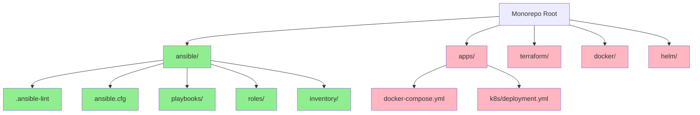

# How to Configure ansible-lint for Monorepos

Author: [nawazdhandala](https://www.github.com/nawazdhandala)

Tags: Ansible, ansible-lint, Monorepo, Code Quality

Description: Learn how to configure ansible-lint for monorepo projects with multiple playbook directories, roles, collections, and varying lint standards.

---

Monorepos that contain Ansible code alongside application code, Terraform configs, Docker files, and other infrastructure tooling present unique challenges for linting. You need ansible-lint to scan only the relevant directories, handle multiple sets of roles and playbooks, and avoid false positives from non-Ansible YAML files. This post covers practical strategies for making ansible-lint work smoothly in a monorepo environment.

## The Monorepo Challenge

A typical monorepo might look like this:

```
myorg-infra/
  apps/
    frontend/
      docker-compose.yml     # Not Ansible
      k8s/
        deployment.yml        # Not Ansible
    backend/
      docker-compose.yml
  ansible/
    playbooks/
      site.yml
      deploy.yml
    roles/
      webserver/
      database/
    inventory/
      production/
      staging/
    collections/
      requirements.yml
  terraform/
    main.tf
    variables.tf
  .github/
    workflows/
      ci.yml                  # Not Ansible
  docker/
    Dockerfile
  helm/
    values.yml                # Not Ansible
```

The problem: ansible-lint will try to parse every YAML file in the repo, including Kubernetes manifests, Helm values, Docker Compose files, and GitHub Actions workflows. These will produce a flood of false positives.

## Strategy 1: Exclude Everything Non-Ansible

The most straightforward approach is to exclude all non-Ansible directories.

```yaml
# .ansible-lint - Exclude non-Ansible content
---
profile: moderate

exclude_paths:
  # Non-Ansible YAML files
  - apps/
  - terraform/
  - docker/
  - helm/
  - .github/
  - .gitlab-ci.yml

  # Build artifacts and caches
  - .cache/
  - .git/
  - node_modules/
  - venv/

  # Ansible paths to skip
  - ansible/molecule/
  - ansible/collections/ansible_collections/
```

## Strategy 2: Run from the Ansible Subdirectory

Instead of configuring extensive exclusions, run ansible-lint from the Ansible subdirectory:

```bash
# Navigate to the Ansible directory and lint from there
cd myorg-infra/ansible
ansible-lint
```

Place your `.ansible-lint` config inside the `ansible/` directory:

```yaml
# ansible/.ansible-lint - Config in the Ansible subdirectory
---
profile: moderate

exclude_paths:
  - molecule/
  - collections/ansible_collections/
  - .cache/
```

And your `ansible.cfg` alongside it:

```ini
# ansible/ansible.cfg
[defaults]
roles_path = ./roles
collections_path = ./collections
inventory = ./inventory/production
```

## Strategy 3: Multiple Ansible Projects in One Repo

Some monorepos have multiple independent Ansible projects (for example, separate teams or environments). Each can have its own configuration.

```
myorg-infra/
  team-platform/
    ansible/
      .ansible-lint
      ansible.cfg
      playbooks/
      roles/
  team-security/
    ansible/
      .ansible-lint
      ansible.cfg
      playbooks/
      roles/
  shared/
    ansible/
      roles/
      collections/
```

Each team has their own `.ansible-lint` with potentially different profiles:

```yaml
# team-platform/ansible/.ansible-lint - Platform team config
---
profile: moderate
skip_list:
  - yaml[line-length]
```

```yaml
# team-security/ansible/.ansible-lint - Security team (stricter)
---
profile: safety
# No skips - security team enforces everything
```

Run linting per team:

```bash
# Lint platform team's Ansible code
ansible-lint team-platform/ansible/

# Lint security team's Ansible code
ansible-lint team-security/ansible/

# Or lint everything (each project uses its own config)
for dir in team-*/ansible; do
  echo "Linting $dir..."
  ansible-lint "$dir/"
done
```

## CI Configuration for Monorepos

### Only Lint When Ansible Files Change

In GitHub Actions, trigger ansible-lint only when relevant files change:

```yaml
# .github/workflows/ansible-lint.yml - Triggered by Ansible file changes
---
name: Ansible Lint

on:
  push:
    branches: [main]
    paths:
      - "ansible/**"
      - ".ansible-lint"
  pull_request:
    branches: [main]
    paths:
      - "ansible/**"
      - ".ansible-lint"

jobs:
  lint:
    name: Lint Ansible code
    runs-on: ubuntu-latest
    defaults:
      run:
        working-directory: ansible
    steps:
      - name: Check out repository
        uses: actions/checkout@v4

      - name: Set up Python
        uses: actions/setup-python@v5
        with:
          python-version: "3.12"
          cache: "pip"

      - name: Install ansible-lint
        run: pip install ansible-lint

      - name: Install collections
        run: |
          if [ -f collections/requirements.yml ]; then
            ansible-galaxy collection install -r collections/requirements.yml
          fi

      - name: Run ansible-lint
        run: ansible-lint
```

The `paths` filter ensures the workflow only runs when Ansible files change, saving CI minutes.

### GitLab CI with Path-Based Rules

```yaml
# .gitlab-ci.yml - Path-based triggering
---
ansible-lint:
  stage: lint
  image: python:3.12-slim
  before_script:
    - pip install ansible-lint
    - cd ansible
  script:
    - ansible-lint
  rules:
    - changes:
        - ansible/**/*
        - .ansible-lint
      if: $CI_PIPELINE_SOURCE == "merge_request_event"
```

## Handling Shared Roles

In a monorepo with shared roles consumed by multiple projects, configure the roles path:

```ini
# ansible/ansible.cfg - Reference shared roles
[defaults]
roles_path = ./roles:../shared/ansible/roles
```

```yaml
# ansible/.ansible-lint - Include shared roles in linting
---
profile: moderate

# ansible-lint will follow roles_path from ansible.cfg
exclude_paths:
  - .cache/
  - molecule/
```

## Makefile for Monorepo Linting

Create a Makefile at the repo root to standardize linting commands:

```makefile
# Makefile - Monorepo lint targets
.PHONY: lint lint-ansible lint-yaml lint-all

# Lint just the Ansible code
lint-ansible:
	cd ansible && ansible-lint

# Lint YAML first, then Ansible
lint-yaml:
	cd ansible && yamllint -c .yamllint.yml .

# Run all linters
lint: lint-yaml lint-ansible

# Lint all team projects
lint-all:
	@for dir in team-*/ansible; do \
		echo "=== Linting $$dir ==="; \
		(cd "$$dir" && ansible-lint) || exit 1; \
	done
```

## Pre-Commit for Monorepos

Configure pre-commit to only check Ansible files:

```yaml
# .pre-commit-config.yaml - Scoped to Ansible files only
---
repos:
  - repo: https://github.com/adrienverge/yamllint
    rev: v1.35.1
    hooks:
      - id: yamllint
        files: ^ansible/.*\.(yml|yaml)$
        args: [-c, ansible/.yamllint.yml]

  - repo: https://github.com/ansible/ansible-lint
    rev: v24.10.0
    hooks:
      - id: ansible-lint
        files: ^ansible/.*\.(yml|yaml)$
        args: [-c, ansible/.ansible-lint]
```

The `files` regex ensures only YAML files under the `ansible/` directory are checked.

## Monorepo Structure Diagram



Green nodes are linted by ansible-lint. Red nodes are excluded.

## Handling Common False Positives

### Kubernetes YAML Files

Kubernetes manifests use YAML but are not Ansible. If they are not excluded, ansible-lint will try to parse them as playbooks and fail.

```yaml
# .ansible-lint - Exclude K8s manifests
exclude_paths:
  - "**/k8s/"
  - "**/kubernetes/"
  - "**/manifests/"
  - "**/*deployment*.yml"
  - "**/*service*.yml"
```

### Docker Compose Files

```yaml
exclude_paths:
  - "**/docker-compose*.yml"
  - "**/compose*.yml"
```

### Helm Chart Values

```yaml
exclude_paths:
  - "**/helm/"
  - "**/charts/"
  - "**/values*.yml"
```

## Tips for Monorepo Success

1. **Keep the `.ansible-lint` config inside the Ansible directory**, not at the repo root. This makes it clear which files the config applies to.

2. **Use `ansible.cfg` alongside `.ansible-lint`** so both Ansible and ansible-lint agree on paths.

3. **Set `working-directory` in CI** to the Ansible subdirectory so all paths resolve correctly.

4. **Use path-based CI triggers** to avoid running ansible-lint when only non-Ansible files change.

5. **Document the lint commands** in a Makefile or README so everyone on the team knows how to run the linter locally.

Monorepos require a bit more configuration, but the payoff is having all your infrastructure code in one place with consistent quality enforcement. Get the exclusions right, scope your CI triggers, and ansible-lint will work just as well in a monorepo as it does in a standalone Ansible project.
