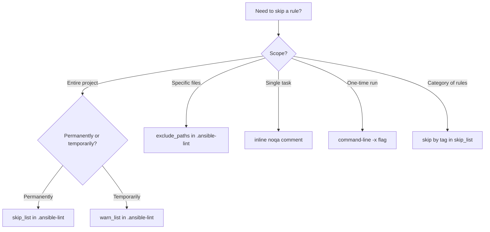

# How to Configure ansible-lint Skip Rules

Author: [nawazdhandala](https://www.github.com/nawazdhandala)

Tags: Ansible, ansible-lint, Configuration, Code Quality

Description: Learn all the ways to skip ansible-lint rules including configuration file options, inline noqa comments, and per-task skip strategies.

---

Not every ansible-lint rule makes sense for every project. Maybe you have a legacy codebase where enforcing FQCN everywhere would require touching hundreds of files. Or perhaps a specific rule conflicts with your team's established conventions. Whatever the reason, ansible-lint provides several mechanisms to skip rules at different levels of granularity.

This post covers every method for skipping rules, from project-wide configuration to individual task suppression, so you can fine-tune ansible-lint to match your project's needs.

## Method 1: skip_list in Configuration File

The most common approach is adding rules to the `skip_list` in your `.ansible-lint` configuration file. This completely suppresses the rule across the entire project.

```yaml
# .ansible-lint - Skip rules project-wide
---
profile: moderate

skip_list:
  # Skip by rule ID
  - fqcn[action-core]
  - name[casing]

  # Skip by rule tag
  - yaml[line-length]
  - yaml[truthy]

  # Skip by old-style numeric ID (still supported)
  - "301"  # command-instead-of-module
```

When a rule is in `skip_list`, ansible-lint will not check for it at all. No output, no warnings, no errors. The rule is completely invisible.

## Method 2: warn_list in Configuration File

If you want to see violations but not have them block your CI pipeline, use `warn_list` instead. Rules in `warn_list` produce warnings but do not cause a non-zero exit code.

```yaml
# .ansible-lint - Warn but do not fail on certain rules
---
profile: moderate

warn_list:
  - risky-file-permissions
  - no-changed-when
  - experimental
  - command-instead-of-shell
```

This is useful during a transition period when you are gradually enforcing stricter standards. Your team can see the warnings and fix them over time without blocking their work.

## Method 3: Inline noqa Comments

For skipping a rule on a specific task, use the `# noqa` comment. This is the most granular level of control.

```yaml
# tasks/main.yml - Skip rules on individual tasks
---
- name: Run one-time migration script
  ansible.builtin.command: /opt/migrate.sh  # noqa: no-changed-when
  when: migration_needed | bool

- name: Quick fix using shell  # noqa: command-instead-of-shell risky-shell-pipe
  ansible.builtin.shell: cat /var/log/app.log | grep ERROR | tail -5
  register: recent_errors
  changed_when: false
```

You can skip multiple rules on one line by separating them with spaces after `noqa:`.

### Skipping All Rules on a Task

To suppress all rules on a single task, use `# noqa` without specifying any rule IDs:

```yaml
- name: This task skips all linting  # noqa
  ansible.builtin.shell: |
    cd /opt && ./legacy-script.sh
```

Use this very sparingly. It defeats the purpose of linting entirely for that task.

## Method 4: Per-File Skipping with exclude_paths

To skip linting for entire files or directories, use `exclude_paths`:

```yaml
# .ansible-lint - Exclude specific paths from linting
---
exclude_paths:
  # Exclude entire directories
  - roles/legacy/
  - playbooks/deprecated/
  - molecule/

  # Exclude specific files
  - playbooks/one-off-migration.yml

  # Exclude by pattern
  - "**/*_generated.yml"
  - .cache/
  - .git/
```

This is useful for generated files, vendored roles from Ansible Galaxy, or legacy playbooks that you do not plan to update.

## Method 5: Skip Rules by Tag

Rules in ansible-lint have tags that group related checks. You can skip entire tag groups.

```yaml
# .ansible-lint - Skip by tag
---
skip_list:
  # Skip all YAML-related checks
  - yaml

  # Skip all naming-related checks
  - name

  # Skip all FQCN-related checks
  - fqcn
```

To see which tags are available:

```bash
# List all rules with their tags
ansible-lint -T
```

Common tags include: `command-shell`, `core`, `deprecations`, `experimental`, `formatting`, `idempotency`, `metadata`, `yaml`.

## Method 6: Command-Line Skipping

For one-off runs, skip rules directly from the command line:

```bash
# Skip specific rules from command line
ansible-lint -x fqcn[action-core] -x yaml[line-length] playbook.yml

# Skip using the --skip-list option
ansible-lint --skip-list fqcn[action-core],yaml[line-length] playbook.yml

# Override the config file's warn_list from CLI
ansible-lint -w no-changed-when playbook.yml
```

Command-line arguments override the configuration file, so this is useful for testing or temporary exceptions.

## Method 7: Environment Variable

You can also skip rules via environment variables:

```bash
# Skip rules via environment variable
ANSIBLE_LINT_SKIP_LIST="yaml[line-length],fqcn[action-core]" ansible-lint playbook.yml
```

## Choosing the Right Skip Strategy

Here is a decision tree for when to use each method:



## Practical Configuration Examples

### New Project Starting Fresh

For a new project, be strict and only skip rules you have a good reason to skip:

```yaml
# .ansible-lint - Strict config for new projects
---
profile: production

skip_list: []

warn_list:
  - experimental

exclude_paths:
  - .cache/
  - .git/
```

### Legacy Project Being Gradually Improved

For an existing project, start lenient and tighten over time:

```yaml
# .ansible-lint - Lenient config for legacy projects
---
profile: basic
progressive: true

skip_list:
  - fqcn[action-core]     # Too many files to fix at once
  - fqcn[action]           # Same reason
  - name[casing]           # Our convention differs

warn_list:
  - no-changed-when
  - risky-file-permissions
  - command-instead-of-shell
  - yaml[truthy]

exclude_paths:
  - roles/vendor/          # Downloaded from Galaxy, not our code
  - playbooks/deprecated/  # Scheduled for removal
  - .cache/
```

### CI Pipeline vs Local Development

Use different skip lists for CI and local development:

```yaml
# .ansible-lint - Base config (used locally)
---
profile: moderate

warn_list:
  - no-changed-when
  - risky-file-permissions
```

```bash
# In CI, override to be stricter (no warnings, everything is an error)
ansible-lint --warn-list "" playbook.yml
```

## Documenting Your Skip Decisions

When you skip a rule, always document why. Future team members (and future you) will want to know the reasoning.

```yaml
# .ansible-lint - Documented skip decisions
---
profile: moderate

skip_list:
  # We allow long lines because our Jinja2 expressions are complex
  # and breaking them across lines hurts readability more than
  # the long lines themselves. Revisit after migrating to filters.
  - yaml[line-length]

  # Our team convention uses Title Case for task names.
  # This conflicts with ansible-lint's preference for sentence case.
  - name[casing]
```

For inline noqa comments, add a brief explanation:

```yaml
# The migration script is idempotent internally, it checks before running
- name: Run database migration
  ansible.builtin.command: /opt/db/migrate.sh  # noqa: no-changed-when
```

## Tracking Skip Usage Over Time

Periodically audit your skip_list to see if rules can be re-enabled. A simple way to track this:

```bash
# Count total noqa comments in your codebase
grep -r "# noqa" --include="*.yml" --include="*.yaml" | wc -l

# Show which rules are being skipped most often
grep -roh "noqa: [a-z\-\[\]]*" --include="*.yml" | sort | uniq -c | sort -rn
```

If a rule has zero or very few inline noqa comments, consider removing it from the project-wide skip_list and handling the remaining violations individually.

Skip rules are a practical necessity, but treat them as technical debt. The goal is to have as few skips as possible while still keeping your team productive. Review your skip_list quarterly and remove rules that are no longer needed.
