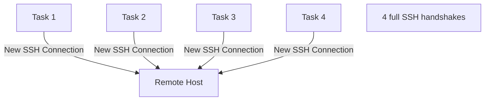
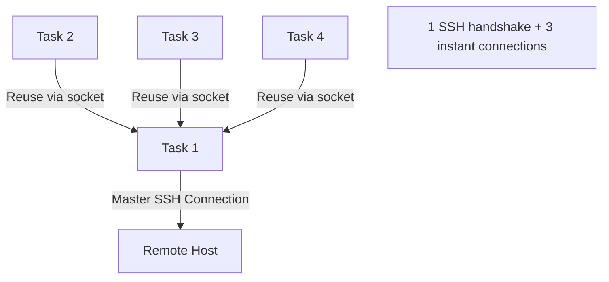

# How to Configure Ansible SSH ControlMaster for Persistent Connections

Author: [nawazdhandala](https://www.github.com/nawazdhandala)

Tags: Ansible, SSH, ControlMaster, Performance Optimization

Description: Configure SSH ControlMaster with Ansible to reuse persistent connections and significantly speed up playbook execution times.

---

Every time Ansible runs a task on a remote host, it establishes an SSH connection. For a playbook with 30 tasks running against 20 hosts, that is 600 SSH handshakes. Each handshake involves TCP connection establishment, cryptographic key exchange, and authentication. SSH ControlMaster eliminates this overhead by keeping a persistent connection open and multiplexing additional sessions over it.

## How ControlMaster Works

Without ControlMaster, every SSH command from Ansible opens a new connection:



With ControlMaster, the first connection becomes the "master" and subsequent connections reuse it:



The master connection creates a Unix domain socket on disk. Subsequent SSH sessions detect this socket and tunnel through the existing connection instead of establishing a new one.

## Basic Configuration

Enable ControlMaster in your `ansible.cfg`:

```ini
# ansible.cfg
[ssh_connection]
ssh_args = -o ControlMaster=auto -o ControlPersist=60s
control_path_dir = ~/.ansible/cp
control_path = %(directory)s/%%h-%%r-%%p
```

Let us break down each option:

- `ControlMaster=auto` - Automatically create a master connection if one does not exist, or reuse an existing one
- `ControlPersist=60s` - Keep the master connection alive for 60 seconds after the last session disconnects
- `control_path_dir` - Directory where Unix socket files are stored
- `control_path` - Template for socket file names (`%%h` = host, `%%r` = remote user, `%%p` = port)

## Understanding ControlPersist Values

The `ControlPersist` value determines how long the master connection stays alive after the last client disconnects:

```ini
# Keep alive for 60 seconds (good for most playbooks)
ssh_args = -o ControlMaster=auto -o ControlPersist=60s

# Keep alive for 30 minutes (good for interactive development)
ssh_args = -o ControlMaster=auto -o ControlPersist=30m

# Keep alive for 1 hour
ssh_args = -o ControlMaster=auto -o ControlPersist=1h

# Keep alive indefinitely (not recommended)
ssh_args = -o ControlMaster=auto -o ControlPersist=yes
```

For Ansible playbook runs, 60 seconds is usually sufficient. If you are iterating on playbooks and running them repeatedly, 30 minutes saves time between runs.

## Control Path Configuration

The control path is where the Unix socket for the master connection lives. Getting this right matters.

### Default Ansible Control Path

```ini
# ansible.cfg
[ssh_connection]
control_path_dir = ~/.ansible/cp
control_path = %(directory)s/%%h-%%r-%%p
```

### Handling Long Hostnames

SSH has a limit on the length of the socket path (usually 108 characters on Linux). Long hostnames or deep directory paths can exceed this:

```ini
# Use a shorter path to avoid socket path length issues
control_path = %(directory)s/%%C

# %%C is a hash of %l%h%p%r - guaranteed to be short
```

The `%%C` format (available in OpenSSH 6.7+) creates a hash of the connection parameters, keeping the socket path short.

### Per-Host Socket Directories

You can also put sockets in /tmp for simplicity:

```ini
control_path = /tmp/ansible-ssh-%%h-%%p-%%r
```

## Full Performance Configuration

Combine ControlMaster with other SSH optimizations:

```ini
# ansible.cfg
[defaults]
forks = 20
pipelining = True

[ssh_connection]
ssh_args = -o ControlMaster=auto -o ControlPersist=60s -o PreferredAuthentications=publickey -o ServerAliveInterval=30
control_path_dir = ~/.ansible/cp
control_path = %(directory)s/%%C
pipelining = True
```

The `PreferredAuthentications=publickey` skips password, keyboard-interactive, and other auth methods, going straight to key-based auth. `ServerAliveInterval=30` sends keepalive packets every 30 seconds to prevent connection drops.

## Verifying ControlMaster Is Working

Check if control sockets are being created:

```bash
# Run a playbook and then check for socket files
ansible-playbook site.yml &

# List control sockets
ls -la ~/.ansible/cp/

# You should see socket files like:
# srw------- 1 user user 0 Feb 21 14:30 abcdef123456
```

Check the status of a control connection:

```bash
# Check if a master connection exists for a host
ssh -O check -o ControlPath=~/.ansible/cp/%%C user@host

# Example with the actual control path
ssh -O check -S ~/.ansible/cp/abcdef123456 user@10.0.1.10
```

## Managing Master Connections

Sometimes you need to manually manage master connections.

```bash
# List all active control sockets
ls -la ~/.ansible/cp/

# Stop a specific master connection
ssh -O stop -S ~/.ansible/cp/abcdef123456 user@host

# Exit a specific master connection immediately
ssh -O exit -S ~/.ansible/cp/abcdef123456 user@host

# Clean up all stale sockets
rm -f ~/.ansible/cp/*
```

## Benchmarking the Improvement

Create a simple timing test:

```yaml
# benchmark.yml
---
- name: ControlMaster benchmark
  hosts: all
  gather_facts: no

  tasks:
    - name: "Task {{ item }}"
      command: echo "task {{ item }}"
      loop: "{{ range(1, 21) | list }}"
```

```bash
# Test without ControlMaster
time ANSIBLE_SSH_ARGS="" ansible-playbook benchmark.yml

# Test with ControlMaster
time ANSIBLE_SSH_ARGS="-o ControlMaster=auto -o ControlPersist=60s" ansible-playbook benchmark.yml
```

In my tests with 10 hosts and 20 tasks per host, the difference was roughly:
- Without ControlMaster: ~85 seconds
- With ControlMaster: ~35 seconds

The improvement is more dramatic with higher latency connections or when using bastion hosts.

## ControlMaster with Bastion Hosts

ControlMaster is especially valuable when using jump hosts because each connection has a double handshake:

```ini
# ansible.cfg - Optimized for bastion host setup
[ssh_connection]
ssh_args = -o ProxyJump=admin@bastion.example.com -o ControlMaster=auto -o ControlPersist=300s
control_path_dir = ~/.ansible/cp
control_path = %(directory)s/%%C
pipelining = True
```

The 300-second persist time is higher here because bastion connections are more expensive to establish.

## Troubleshooting ControlMaster

### Stale Sockets

If Ansible hangs or fails with connection errors, stale socket files might be the cause:

```bash
# Remove all control sockets and try again
rm -f ~/.ansible/cp/*
ansible-playbook site.yml
```

### Permission Issues

The control socket directory needs correct permissions:

```bash
# Ensure correct permissions
mkdir -p ~/.ansible/cp
chmod 700 ~/.ansible/cp
```

### Socket Path Too Long

If you see errors about the socket path being too long:

```
ControlPath "/home/very-long-username/.ansible/cp/very-long-hostname-deploy-22" too long for Unix domain socket
```

Switch to the hashed path:

```ini
control_path = %(directory)s/%%C
```

### Connection Refused After Host Reboot

If a host reboots, the master connection becomes stale but the socket file remains:

```bash
# Remove the stale socket for the specific host
rm -f ~/.ansible/cp/*

# Or be more targeted if you know the socket file
find ~/.ansible/cp/ -name "*.sock" -mmin +60 -delete
```

## Ansible's Built-in Cleanup

Ansible handles ControlMaster cleanup reasonably well. When a playbook finishes, the master connections persist for the `ControlPersist` duration and then exit cleanly. However, if Ansible is killed (Ctrl+C, OOM kill, etc.), sockets can become orphaned.

Add a cleanup step to your CI/CD pipeline:

```bash
#!/bin/bash
# Pre-run cleanup for CI/CD
rm -f ~/.ansible/cp/*
ansible-playbook site.yml
# Post-run cleanup
rm -f ~/.ansible/cp/*
```

## ControlMaster with Async Tasks

When using Ansible async tasks, ControlMaster can sometimes cause issues because the master connection might close before the async task checks back:

```yaml
- name: Long running task
  command: /opt/scripts/backup.sh
  async: 3600
  poll: 0

- name: Wait for task
  async_status:
    jid: "{{ result.ansible_job_id }}"
  register: job_result
  until: job_result.finished
  retries: 360
  delay: 10
```

For async tasks that run longer than your `ControlPersist` value, the connection will be re-established automatically. This works fine but adds a one-time overhead when the master connection has to be rebuilt.

## Recommended Settings

```ini
# For small to medium environments (< 50 hosts)
[ssh_connection]
ssh_args = -o ControlMaster=auto -o ControlPersist=60s
control_path_dir = ~/.ansible/cp
control_path = %(directory)s/%%C

# For large environments (50+ hosts)
[ssh_connection]
ssh_args = -o ControlMaster=auto -o ControlPersist=120s -o ServerAliveInterval=30
control_path_dir = ~/.ansible/cp
control_path = %(directory)s/%%C
pipelining = True
```

## Wrapping Up

SSH ControlMaster is one of the easiest performance wins for Ansible. Three lines in `ansible.cfg` and you get a 30-60% reduction in execution time for multi-task playbooks. The key settings are `ControlMaster=auto`, a sensible `ControlPersist` value (60 seconds for most cases), and a short control path using the `%%C` hash format. Combine it with pipelining and increased forks, and your playbooks will run noticeably faster. Just remember to clean up stale sockets if Ansible exits unexpectedly.
