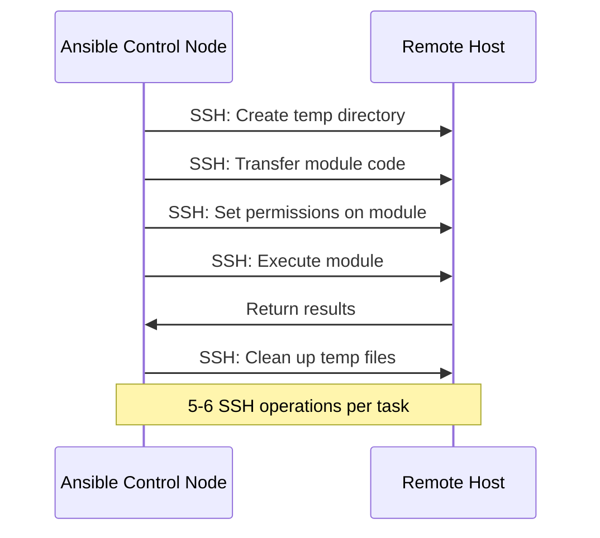
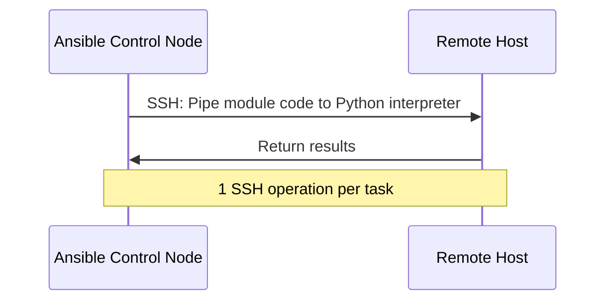

# How to Configure Ansible SSH Pipelining for Performance

Author: [nawazdhandala](https://www.github.com/nawazdhandala)

Tags: Ansible, SSH, Pipelining, Performance Optimization

Description: Enable SSH pipelining in Ansible to dramatically reduce task execution time by eliminating extra SSH operations per task.

---

If you have ever watched an Ansible playbook run against dozens of hosts and thought "this is slow," SSH pipelining might be the single biggest performance improvement available to you. By default, Ansible executes each task by creating a temporary file on the remote host, transferring the module code, executing it, and then cleaning up. Pipelining changes this by piping the module code directly to the Python interpreter over SSH, cutting out the file transfer steps entirely.

## How Ansible Normally Executes Tasks

Without pipelining, here is what happens for every single task on every single host:



That is five or six separate SSH operations per task, per host. Multiply that by hundreds of tasks and dozens of hosts, and you can see why playbooks feel slow.

## How Pipelining Changes Execution

With pipelining enabled, Ansible sends the module code directly through the SSH connection's stdin to the Python interpreter:



One SSH operation per task instead of five or six. The performance difference is substantial.

## Enabling Pipelining

Pipelining is disabled by default. Enable it in your `ansible.cfg`:

```ini
# ansible.cfg
[ssh_connection]
pipelining = True
```

Or use an environment variable:

```bash
# Enable pipelining via environment variable
export ANSIBLE_PIPELINING=True
ansible-playbook site.yml
```

That is it. One line change. But there is an important prerequisite to handle first.

## The requiretty Problem

The most common reason pipelining fails is the `requiretty` setting in sudoers. Many Linux distributions ship with this line in `/etc/sudoers`:

```
Defaults    requiretty
```

This tells sudo to require a real TTY (terminal) for execution. Since pipelined commands do not have a TTY, sudo operations fail. You need to either remove this setting or add an exception.

### Fixing requiretty Globally

```bash
# Check if requiretty is set
ansible all -m shell -a "grep requiretty /etc/sudoers" --become
```

If it is present, disable it:

```yaml
# fix_requiretty.yml
---
- name: Disable requiretty for pipelining
  hosts: all
  become: yes

  tasks:
    # Comment out requiretty in sudoers
    - name: Disable requiretty
      lineinfile:
        path: /etc/sudoers
        regexp: '^Defaults\s+requiretty'
        line: '# Defaults    requiretty'
        validate: 'visudo -cf %s'
```

### Fixing requiretty Per User

A less invasive approach is to exempt only the Ansible user:

```yaml
- name: Exempt ansible user from requiretty
  copy:
    content: "Defaults:ansible !requiretty\n"
    dest: /etc/sudoers.d/ansible-no-requiretty
    mode: '0440'
    validate: 'visudo -cf %s'
  become: yes
```

## Measuring the Performance Improvement

Let us actually measure the difference. Create a simple playbook that runs multiple tasks:

```yaml
# benchmark.yml
---
- name: Performance benchmark
  hosts: all
  gather_facts: no

  tasks:
    - name: Task 1
      command: echo "task 1"

    - name: Task 2
      command: echo "task 2"

    - name: Task 3
      command: echo "task 3"

    - name: Task 4
      command: echo "task 4"

    - name: Task 5
      command: echo "task 5"

    - name: Task 6
      command: echo "task 6"

    - name: Task 7
      command: echo "task 7"

    - name: Task 8
      command: echo "task 8"

    - name: Task 9
      command: echo "task 9"

    - name: Task 10
      command: echo "task 10"
```

Run it with and without pipelining:

```bash
# Without pipelining
ANSIBLE_PIPELINING=False time ansible-playbook benchmark.yml

# With pipelining
ANSIBLE_PIPELINING=True time ansible-playbook benchmark.yml
```

In my testing against 10 hosts with 10 tasks each, pipelining reduced execution time from 45 seconds to 18 seconds. That is a 60% improvement.

## Enabling Ansible Callback Timer

To get task-level timing data, enable the timer callback:

```ini
# ansible.cfg
[defaults]
callback_whitelist = timer, profile_tasks

[ssh_connection]
pipelining = True
```

This adds timing information to every task and a summary at the end showing which tasks took the longest.

## Combining Pipelining with Other Optimizations

Pipelining works best when combined with other SSH optimizations:

```ini
# ansible.cfg - Full performance configuration
[defaults]
forks = 20
callback_whitelist = timer, profile_tasks
gathering = smart
fact_caching = jsonfile
fact_caching_connection = /tmp/ansible_facts_cache
fact_caching_timeout = 3600

[ssh_connection]
pipelining = True
ssh_args = -o ControlMaster=auto -o ControlPersist=60s -o PreferredAuthentications=publickey
control_path_dir = ~/.ansible/cp
```

Here is what each setting does:

- `forks = 20` - Process 20 hosts in parallel instead of the default 5
- `gathering = smart` - Only gather facts when they have not been cached
- `fact_caching` - Cache facts to avoid re-gathering them
- `ControlMaster` and `ControlPersist` - Reuse SSH connections across tasks
- `PreferredAuthentications=publickey` - Skip password auth negotiation

## Pipelining and become_method

Pipelining works with the default `become_method: sudo` but requires that `requiretty` is not set. For other become methods:

```ini
# ansible.cfg
[privilege_escalation]
become = True
become_method = sudo
become_user = root
```

If you use `su` instead of `sudo`, pipelining still works:

```ini
[privilege_escalation]
become_method = su
```

However, `pbrun` and `pfexec` may have their own TTY requirements. Test each one individually.

## When Pipelining Does Not Help

Pipelining helps most with tasks that execute modules (command, shell, copy content, template, etc.). It does not significantly improve:

- **File transfers** (using the `copy` module with `src` parameter) - These need the actual file content transferred
- **Large template files** - The template still needs to be processed and transferred
- **gather_facts** - The setup module still takes time regardless of pipelining

## Verifying Pipelining Is Active

To confirm pipelining is actually being used:

```bash
# Run with maximum verbosity
ansible all -m ping -vvvv
```

Look for this in the output:

```
<web01> EXEC /bin/sh -c 'echo ~ && sleep 0'
<web01> EXEC /bin/sh -c '( umask 77 && mkdir -p "` echo ~/.ansible/tmp `"&& mkdir "` echo ~/.ansible/tmp/ansible-tmp-... `" && echo ansible-tmp-... )'
```

Without pipelining, you will see multiple EXEC lines for temp directory creation, file transfer, and execution. With pipelining, you will see fewer EXEC lines because the module is piped directly.

## Per-Task Pipelining Control

You cannot enable or disable pipelining per task in Ansible. It is a connection-level setting that applies to all tasks in a play. However, you can use different plays within the same playbook:

```yaml
# mixed_pipelining.yml
---
# Play 1: Tasks that benefit from pipelining
- name: Configuration tasks
  hosts: all
  vars:
    ansible_ssh_pipelining: true
  tasks:
    - name: Set sysctl values
      sysctl:
        name: "{{ item.key }}"
        value: "{{ item.value }}"
      loop:
        - { key: "net.core.somaxconn", value: "65535" }
        - { key: "vm.swappiness", value: "10" }

# Play 2: File transfer tasks (pipelining does not help much)
- name: File transfer tasks
  hosts: all
  vars:
    ansible_ssh_pipelining: false
  tasks:
    - name: Copy large application archive
      copy:
        src: /local/path/app.tar.gz
        dest: /opt/app.tar.gz
```

## Troubleshooting Pipelining

If tasks fail after enabling pipelining, the usual culprit is `requiretty`. Check for these error messages:

```
"msg": "sudo: sorry, you must have a tty to run sudo"
```

Fix:

```bash
# Quick check from the control node
ansible all -m shell -a "sudo grep requiretty /etc/sudoers" --become
```

Other potential issues:
- The remote Python interpreter path is wrong (set `ansible_python_interpreter`)
- SELinux is blocking pipe operations
- Custom sudo configurations that interfere with stdin

```bash
# Debug pipelining issues
ANSIBLE_PIPELINING=True ansible all -m ping -vvvv 2>&1 | grep -i "pipeline\|pipe\|tty"
```

## Wrapping Up

SSH pipelining is one of those settings that should be enabled by default in every Ansible deployment but somehow is not. One line in `ansible.cfg`, a quick fix for `requiretty` on your managed hosts, and you get a 30-60% reduction in task execution time. Combine it with ControlMaster, increased forks, and fact caching, and your playbooks will run dramatically faster. There is really no good reason not to enable it once you have sorted out the `requiretty` requirement.
