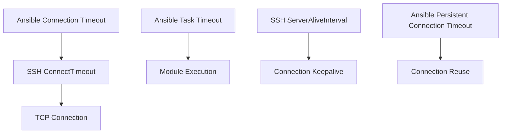

# How to Configure Ansible SSH Timeout and Retries

Author: [nawazdhandala](https://www.github.com/nawazdhandala)

Tags: Ansible, SSH, Timeout, Retries, Reliability

Description: Configure SSH connection timeouts and retry settings in Ansible to handle unreliable networks, slow hosts, and transient failures.

---

Network hiccups happen. Servers get overloaded. SSH connections drop. If your Ansible playbooks fail because of transient connection issues, you are probably not tuning your timeout and retry settings. Getting these right is the difference between a playbook that fails halfway through at 2 AM and one that gracefully retries and completes successfully.

## Understanding Ansible's Timeout Layers

Ansible has multiple timeout settings that operate at different layers:



Each timeout controls a different aspect of the connection lifecycle.

## Connection Timeout

The primary connection timeout controls how long Ansible waits to establish an SSH connection:

```ini
# ansible.cfg
[defaults]
# Time in seconds to wait for a connection to a host
timeout = 30
```

This maps to the SSH `ConnectTimeout` option. The default is 10 seconds. Increase it for hosts on slow or unreliable networks.

```bash
# Override timeout on the command line
ansible-playbook site.yml -T 60

# Or via environment variable
export ANSIBLE_TIMEOUT=60
ansible-playbook site.yml
```

### Per-Host Timeout

Set different timeouts for different hosts:

```ini
# inventory/hosts
[fast_network]
web01 ansible_host=10.0.1.10

[slow_network]
remote01 ansible_host=203.0.113.50 ansible_timeout=60

[slow_network:vars]
ansible_timeout=60
```

## SSH-Level Timeouts

For finer control, pass timeout options directly to SSH:

```ini
# ansible.cfg
[ssh_connection]
ssh_args = -o ConnectTimeout=30 -o ServerAliveInterval=15 -o ServerAliveCountMax=3
```

These settings work together:

- `ConnectTimeout=30` - Wait up to 30 seconds for the initial TCP connection
- `ServerAliveInterval=15` - Send a keepalive packet every 15 seconds after connection is established
- `ServerAliveCountMax=3` - Drop the connection if 3 consecutive keepalives fail (45 seconds of silence)

## SSH Connection Retries

When a connection fails, Ansible can retry automatically:

```ini
# ansible.cfg
[ssh_connection]
retries = 3
```

This retries the SSH connection up to 3 times before giving up. Combined with a reasonable timeout, this handles most transient failures:

```ini
# ansible.cfg - Reliable configuration
[defaults]
timeout = 30

[ssh_connection]
retries = 3
ssh_args = -o ConnectTimeout=30 -o ServerAliveInterval=15 -o ServerAliveCountMax=3
```

With these settings, each retry waits up to 30 seconds for a connection. Three retries means a total of up to 90 seconds before Ansible gives up on a host.

## Task-Level Retries

For individual tasks that might fail due to transient issues, use the `retries` keyword:

```yaml
# Retry a task up to 5 times
- name: Wait for SSH to become available after reboot
  wait_for_connection:
    delay: 10
    timeout: 300
  retries: 5
  delay: 10
  register: result
  until: result is success
```

A more common pattern is retrying tasks that depend on network services:

```yaml
# Retry downloading a file if the server is flaky
- name: Download application package
  get_url:
    url: "https://releases.company.com/app-2.0.tar.gz"
    dest: /tmp/app-2.0.tar.gz
    timeout: 60
  retries: 3
  delay: 5
  register: download_result
  until: download_result is success
```

## Handling Reboots

After rebooting a server, you need to wait for SSH to come back. This requires careful timeout configuration:

```yaml
# Reboot and wait for the host to come back
- name: Reboot the server
  reboot:
    reboot_timeout: 600     # Wait up to 10 minutes for reboot
    connect_timeout: 30     # SSH connection timeout per attempt
    pre_reboot_delay: 5     # Wait 5 seconds before rebooting
    post_reboot_delay: 30   # Wait 30 seconds after reboot before testing
    test_command: uptime     # Command to verify host is back
```

Alternatively, using `wait_for_connection`:

```yaml
- name: Reboot the server
  command: /sbin/reboot
  async: 1
  poll: 0
  ignore_errors: yes

- name: Wait for server to come back
  wait_for_connection:
    delay: 30          # Wait 30 seconds before first check
    sleep: 10          # Check every 10 seconds
    timeout: 600       # Give up after 10 minutes
```

## Persistent Connection Timeout

For connection plugins that maintain persistent connections (like network devices):

```ini
# ansible.cfg
[persistent_connection]
# How long to keep a persistent connection alive (seconds)
connect_timeout = 30

# How long to wait for a command to complete (seconds)
command_timeout = 30

# Idle timeout before closing persistent connection
idle_timeout = 60
```

## Module-Specific Timeouts

Many Ansible modules have their own timeout parameters:

```yaml
# URI module timeout
- name: Check API health
  uri:
    url: https://api.example.com/health
    timeout: 30
  retries: 3
  delay: 5
  until: api_check.status == 200
  register: api_check

# wait_for module
- name: Wait for port to be available
  wait_for:
    host: "{{ inventory_hostname }}"
    port: 8080
    timeout: 120
    delay: 5

# Package installation timeout
- name: Install packages (may be slow on first run)
  apt:
    name: nginx
    state: present
    update_cache: yes
  async: 300
  poll: 15
```

## Async Tasks for Long-Running Operations

For tasks that take a long time but should not time out the SSH connection:

```yaml
# Run a long backup job without blocking
- name: Start database backup
  command: /opt/scripts/full_backup.sh
  async: 3600      # Allow up to 1 hour
  poll: 0          # Do not wait for completion
  register: backup_job

# Do other tasks while backup runs...
- name: Other maintenance tasks
  command: /opt/scripts/cleanup.sh

# Check back on the backup job
- name: Wait for backup to complete
  async_status:
    jid: "{{ backup_job.ansible_job_id }}"
  register: backup_result
  until: backup_result.finished
  retries: 120    # Check 120 times
  delay: 30       # Every 30 seconds (total: 1 hour max)
```

## Tuning for Different Environments

### Fast Internal Network

```ini
# ansible.cfg - Low latency, reliable network
[defaults]
timeout = 10
forks = 30

[ssh_connection]
retries = 1
ssh_args = -o ControlMaster=auto -o ControlPersist=60s -o ConnectTimeout=10
pipelining = True
```

### Slow or Unreliable Network

```ini
# ansible.cfg - High latency, unreliable network
[defaults]
timeout = 60
forks = 5

[ssh_connection]
retries = 5
ssh_args = -o ControlMaster=auto -o ControlPersist=300s -o ConnectTimeout=60 -o ServerAliveInterval=30 -o ServerAliveCountMax=5
pipelining = True
```

### Cloud Instances (Variable Network)

```ini
# ansible.cfg - Cloud environment
[defaults]
timeout = 30
forks = 20

[ssh_connection]
retries = 3
ssh_args = -o ControlMaster=auto -o ControlPersist=120s -o ConnectTimeout=30 -o ServerAliveInterval=15 -o ServerAliveCountMax=3
pipelining = True
```

### Hosts Behind a VPN or Bastion

```ini
# ansible.cfg - VPN/Bastion environment (extra latency)
[defaults]
timeout = 45
forks = 10

[ssh_connection]
retries = 3
ssh_args = -o ProxyJump=admin@bastion.example.com -o ControlMaster=auto -o ControlPersist=180s -o ConnectTimeout=45 -o ServerAliveInterval=20 -o ServerAliveCountMax=4
pipelining = True
```

## Monitoring Timeouts in Playbook Runs

Use callback plugins to track which tasks are slow or timing out:

```ini
# ansible.cfg
[defaults]
callback_whitelist = timer, profile_tasks, profile_roles

# Show task duration thresholds
[callback_profile_tasks]
task_output_limit = 20
sort_order = descending
```

This adds timing information to every task, making it easy to identify which tasks need timeout tuning.

## Handling Unreachable Hosts

When hosts are completely unreachable, you can control how Ansible handles them:

```yaml
# Continue playbook even if some hosts are unreachable
- name: Configure all servers
  hosts: all
  max_fail_percentage: 25    # Allow up to 25% of hosts to fail
  any_errors_fatal: false    # Do not abort on first error

  tasks:
    - name: Apply configuration
      template:
        src: config.j2
        dest: /etc/app/config.conf
      register: config_result
      ignore_unreachable: yes  # Skip unreachable hosts for this task
```

## Retry Files

When a playbook fails partway through, Ansible creates a `.retry` file listing the failed hosts:

```bash
# Ansible creates playbook_name.retry with failed hosts
# Retry only the failed hosts
ansible-playbook site.yml --limit @site.retry
```

Configure retry file behavior:

```ini
# ansible.cfg
[defaults]
# Enable retry files
retry_files_enabled = True

# Where to save them
retry_files_save_path = ~/.ansible/retry
```

## Wrapping Up

Timeout and retry configuration is about matching Ansible's behavior to your network reality. Fast internal networks need short timeouts and few retries. Slow or unreliable networks need longer timeouts, more retries, and ServerAliveInterval keepalives. Use async tasks for anything that runs longer than a few minutes, and always configure `wait_for_connection` after reboots. The combination of connection-level retries (`retries = 3` in ssh_connection), task-level retries (`retries` and `until` on tasks), and appropriate timeouts will make your playbooks resilient to the transient failures that inevitably happen in real infrastructure.
