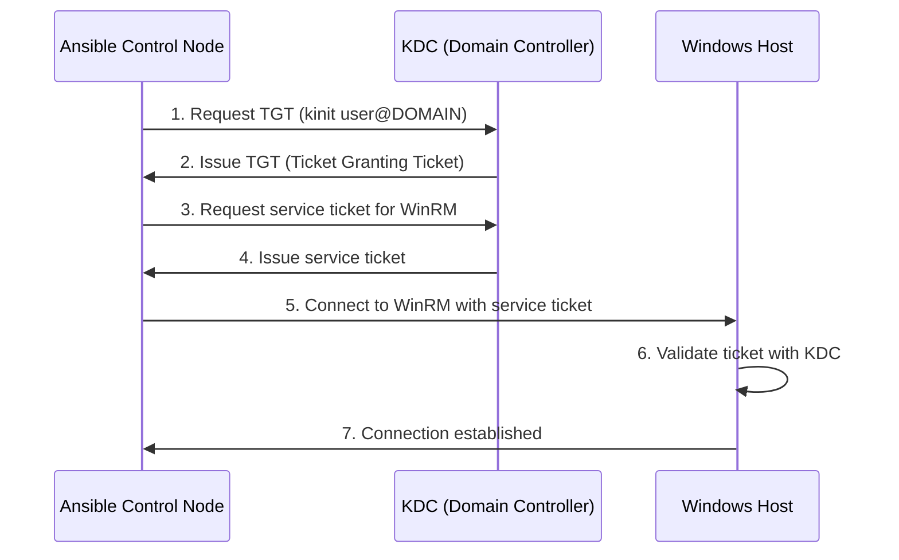

# How to Configure Ansible with Kerberos for Windows

Author: [nawazdhandala](https://www.github.com/nawazdhandala)

Tags: Ansible, Windows, Kerberos, Active Directory, Authentication

Description: Set up Kerberos authentication between Ansible and Windows hosts for secure, domain-integrated automation with Active Directory.

---

When managing Windows hosts in an Active Directory environment, Kerberos authentication is the gold standard. It is more secure than NTLM, it does not transmit passwords over the network (even encrypted ones), and it integrates naturally with AD-based access controls. If your Windows servers are domain-joined and your Ansible control node can reach the domain controllers, Kerberos is the authentication method you should be using.

Setting up Kerberos on a Linux-based Ansible control node requires a few extra steps compared to NTLM, but the security benefits are worth the effort. This guide walks through the complete setup process.

## How Kerberos Authentication Works with Ansible



The key concept is that Ansible never sends a password to the Windows host. Instead, it obtains a Kerberos ticket from the domain controller and presents that ticket to the Windows host. The Windows host validates the ticket with the KDC (Key Distribution Center, which is the domain controller).

## Prerequisites

You need the following before starting:

- Linux control node with Ansible installed
- Active Directory domain with Windows hosts joined to it
- A domain account for Ansible to use
- Network connectivity from the control node to domain controllers (TCP/UDP 88 for Kerberos, TCP 389/636 for LDAP)

## Step 1: Install Kerberos Packages on the Control Node

On your Linux Ansible control node, install the Kerberos client libraries:

```bash
# For RHEL/CentOS/Rocky Linux
sudo yum install -y krb5-workstation krb5-libs krb5-devel gcc python3-devel

# For Ubuntu/Debian
sudo apt-get install -y krb5-user libkrb5-dev gcc python3-dev

# Install the Python Kerberos library for Ansible
pip install pywinrm[kerberos]
pip install pykerberos
```

The `pywinrm[kerberos]` package includes the necessary Python bindings for Kerberos authentication.

## Step 2: Configure krb5.conf

The Kerberos configuration file tells the control node about your AD domain and where to find the KDC servers.

```yaml
# playbook-local-krb5.yml
# This is run on the Ansible control node (localhost)
# You would typically create this file manually or with a configuration management tool
- name: Configure Kerberos on control node
  hosts: localhost
  connection: local
  become: yes
  vars:
    domain: CORP.LOCAL
    domain_lower: corp.local
    kdc_servers:
      - dc01.corp.local
      - dc02.corp.local

  tasks:
    - name: Write krb5.conf
      ansible.builtin.template:
        dest: /etc/krb5.conf
        content: |
          [libdefaults]
              default_realm = {{ domain }}
              dns_lookup_realm = false
              dns_lookup_kdc = false
              ticket_lifetime = 24h
              renew_lifetime = 7d
              forwardable = true
              rdns = false
              default_ccache_name = KEYRING:persistent:%{uid}

          [realms]
              {{ domain }} = {
                  kdc = {{ kdc_servers | join('\n              kdc = ') }}
                  admin_server = {{ kdc_servers[0] }}
              }

          [domain_realm]
              .{{ domain_lower }} = {{ domain }}
              {{ domain_lower }} = {{ domain }}
```

If you are writing the file manually, here is what `/etc/krb5.conf` should look like:

```ini
# /etc/krb5.conf
# Kerberos configuration for CORP.LOCAL Active Directory domain
[libdefaults]
    default_realm = CORP.LOCAL
    dns_lookup_realm = false
    dns_lookup_kdc = false
    ticket_lifetime = 24h
    renew_lifetime = 7d
    forwardable = true
    rdns = false
    default_ccache_name = KEYRING:persistent:%{uid}

[realms]
    CORP.LOCAL = {
        kdc = dc01.corp.local
        kdc = dc02.corp.local
        admin_server = dc01.corp.local
    }

[domain_realm]
    .corp.local = CORP.LOCAL
    corp.local = CORP.LOCAL
```

Important notes about the realm name: it **must** be in UPPERCASE. This is not optional. Kerberos realm names are case-sensitive and AD realms are always uppercase.

## Step 3: Test Kerberos Authentication

Before configuring Ansible, verify that Kerberos is working:

```bash
# Obtain a Kerberos TGT (Ticket Granting Ticket)
kinit ansible-svc@CORP.LOCAL

# Verify the ticket was obtained
klist

# You should see output like:
# Ticket cache: KEYRING:persistent:1000:1000
# Default principal: ansible-svc@CORP.LOCAL
#
# Valid starting     Expires            Service principal
# 02/21/2026 10:00  02/22/2026 10:00  krbtgt/CORP.LOCAL@CORP.LOCAL
```

If `kinit` fails, check:
- DNS resolution for the domain controllers
- Network connectivity to port 88 on the domain controllers
- The account credentials
- The realm name (must be uppercase)

## Step 4: Configure Ansible Inventory for Kerberos

Now configure your Ansible inventory to use Kerberos authentication:

```ini
# inventory/hosts.ini
# Inventory configured for Kerberos authentication
[windows]
web-server-01.corp.local
web-server-02.corp.local
db-server-01.corp.local

[windows:vars]
ansible_user=ansible-svc@CORP.LOCAL
ansible_connection=winrm
ansible_port=5986
ansible_winrm_transport=kerberos
ansible_winrm_scheme=https
ansible_winrm_server_cert_validation=ignore
```

Key differences from NTLM configuration:

- `ansible_winrm_transport=kerberos` instead of `ntlm`
- `ansible_user` includes the realm: `user@REALM`
- No `ansible_password` is needed if you have a valid TGT (from `kinit`)

If you prefer to pass the password through Ansible (so you do not need to run `kinit` manually), you can add:

```ini
ansible_password={{ vault_windows_password }}
```

Ansible will automatically run `kinit` for you when a password is provided.

## Step 5: Configure WinRM on Windows for Kerberos

The Windows hosts need WinRM configured to accept Kerberos authentication:

```yaml
# playbook-winrm-kerberos.yml
# Configures WinRM to accept Kerberos authentication
# (Run this with NTLM first, then switch to Kerberos)
- name: Configure WinRM for Kerberos
  hosts: windows
  tasks:
    - name: Enable Kerberos authentication on WinRM
      ansible.windows.win_shell: |
        Set-Item WSMan:\localhost\Service\Auth\Kerberos -Value $true

    - name: Verify SPN exists for WinRM
      ansible.windows.win_shell: |
        # Check if the HTTP SPN is registered for this host
        $hostname = $env:COMPUTERNAME
        $spns = setspn -L $hostname 2>&1
        $hasHttpSpn = $spns | Select-String "HTTP/"
        if ($hasHttpSpn) {
          Write-Output "SPN found: $($hasHttpSpn.Line.Trim())"
        } else {
          # Register the SPN
          setspn -S "HTTP/$hostname" $hostname
          setspn -S "HTTP/$hostname.corp.local" $hostname
          Write-Output "SPNs registered"
        }
      register: spn_result

    - name: Display SPN status
      ansible.builtin.debug:
        msg: "{{ spn_result.stdout }}"
```

## Kerberos with CredSSP for Delegation

Sometimes you need credential delegation, for example, when an Ansible task on a Windows host needs to access another network resource (like a file share or database on a different server). Plain Kerberos does not forward credentials by default. CredSSP or Kerberos Constrained Delegation can help:

```ini
# inventory for CredSSP (credential delegation)
[windows:vars]
ansible_winrm_transport=credssp
ansible_user=ansible-svc@CORP.LOCAL
ansible_password={{ vault_password }}
ansible_connection=winrm
ansible_port=5986
ansible_winrm_scheme=https
```

CredSSP requires additional setup on the Windows side:

```yaml
# playbook-credssp.yml
# Enables CredSSP for credential delegation scenarios
- name: Enable CredSSP
  hosts: windows
  tasks:
    - name: Enable CredSSP server role
      ansible.windows.win_shell: |
        Enable-WSManCredSSP -Role Server -Force

    - name: Verify CredSSP is enabled
      ansible.windows.win_shell: |
        Get-Item WSMan:\localhost\Service\Auth\CredSSP | Select-Object Value
      register: credssp_status

    - name: Display CredSSP status
      ansible.builtin.debug:
        msg: "CredSSP enabled: {{ credssp_status.stdout }}"
```

## Automating Ticket Renewal

Kerberos tickets expire (typically after 10 hours). For long-running automation jobs or scheduled playbook runs, you need to handle ticket renewal:

```bash
#!/bin/bash
# /usr/local/bin/ansible-kinit.sh
# Script to obtain and maintain Kerberos TGT for Ansible automation

PRINCIPAL="ansible-svc@CORP.LOCAL"
KEYTAB="/etc/ansible/ansible-svc.keytab"

# Obtain TGT using keytab (no password needed)
kinit -kt "$KEYTAB" "$PRINCIPAL"

if [ $? -eq 0 ]; then
    echo "$(date): TGT obtained successfully for $PRINCIPAL"
    klist
else
    echo "$(date): ERROR - Failed to obtain TGT for $PRINCIPAL"
    exit 1
fi
```

To create the keytab file on a domain controller:

```powershell
# Run on a domain controller
# Creates a keytab file for the ansible-svc account
ktpass /out ansible-svc.keytab /princ ansible-svc@CORP.LOCAL /mapuser CORP\ansible-svc /pass * /crypto AES256-SHA1 /ptype KRB5_NT_PRINCIPAL
```

Then set up a cron job to renew the ticket:

```bash
# Cron job to refresh the Kerberos TGT every 8 hours
0 */8 * * * /usr/local/bin/ansible-kinit.sh >> /var/log/ansible-kinit.log 2>&1
```

## Complete Configuration Example

Here is the full setup with all the pieces together:

```yaml
# group_vars/windows.yml
# Complete Kerberos configuration for Windows hosts
ansible_connection: winrm
ansible_port: 5986
ansible_winrm_transport: kerberos
ansible_winrm_scheme: https
ansible_winrm_server_cert_validation: ignore
ansible_user: ansible-svc@CORP.LOCAL
ansible_winrm_kerberos_delegation: false
ansible_winrm_operation_timeout_sec: 60
ansible_winrm_read_timeout_sec: 70
```

```yaml
# playbook-test-kerberos.yml
# Tests Kerberos connectivity to all Windows hosts
- name: Test Kerberos authentication
  hosts: windows
  tasks:
    - name: Ping via WinRM
      ansible.windows.win_ping:
      register: ping_result

    - name: Get current user context
      ansible.windows.win_shell: |
        @{
          Username = [System.Security.Principal.WindowsIdentity]::GetCurrent().Name
          AuthType = "Kerberos"
          Computer = $env:COMPUTERNAME
        } | ConvertTo-Json
      register: user_context

    - name: Display connection info
      ansible.builtin.debug:
        msg: "{{ user_context.stdout | from_json }}"
```

## Troubleshooting Kerberos Issues

**Clock skew errors**: Kerberos is sensitive to time differences. The control node and domain controllers must be within 5 minutes of each other. Use NTP to keep clocks synchronized.

**DNS resolution failures**: Kerberos relies heavily on DNS. The control node must be able to resolve the domain controllers and Windows hosts by their FQDN. Add the AD DNS servers to `/etc/resolv.conf`.

**Realm not found**: Double-check that the realm in `krb5.conf` matches your AD domain name exactly, in uppercase.

**SPN issues**: If you get "Server not found in Kerberos database" errors, the Service Principal Name (SPN) for WinRM might not be registered. Check with `setspn -L hostname` on the Windows server.

**Encryption type mismatch**: Modern AD uses AES encryption by default. Older Kerberos libraries might default to RC4. Make sure both sides support the same encryption types.

Kerberos authentication with Ansible is the proper way to manage Windows hosts in an Active Directory environment. The initial setup takes more effort than NTLM, but you get stronger security, better integration with AD policies, and no passwords transmitted over the network. For any production AD environment, this is the authentication method to use.
