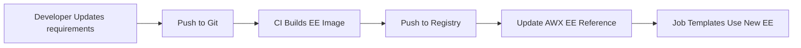

# How to Configure AWX Execution Environments

Author: [nawazdhandala](https://www.github.com/nawazdhandala)

Tags: Ansible, AWX, Execution Environments, Containers, DevOps

Description: Build and configure custom AWX execution environments to package Python dependencies, collections, and system libraries for consistent playbook runs.

---

Execution environments (EEs) replaced the old virtualenv approach in AWX 18+. They are container images that package everything a playbook needs to run: the Ansible engine, Python libraries, system packages, and Ansible collections. Instead of installing dependencies on the AWX server itself, you build a container image and tell AWX to use it. This keeps your AWX installation clean and makes playbook dependencies reproducible.

## Why Execution Environments Exist

Before EEs, AWX used Python virtual environments. You would SSH into the AWX server, create a venv, pip-install your dependencies, and configure the job template to use that venv. This worked but had problems. Dependencies could conflict between venvs. System libraries were hard to manage. And the whole setup was impossible to version-control or reproduce on a different AWX instance.

Execution environments solve all of this by moving the runtime into a container image. You define what goes in it using a YAML file, build the image with `ansible-builder`, push it to a registry, and point AWX at it. Done.

## Installing ansible-builder

The `ansible-builder` tool is what creates execution environment images. Install it on your workstation or build server.

```bash
# Install ansible-builder
pip3 install ansible-builder

# Verify the installation
ansible-builder --version
```

You also need a container runtime. Either Docker or Podman works. ansible-builder uses Podman by default but you can override it.

## The Execution Environment Definition File

The core of an EE is the `execution-environment.yml` file. It tells ansible-builder what base image to use and what to install.

```yaml
# execution-environment.yml
---
version: 3

build_arg_defaults:
  ANSIBLE_GALAXY_CLI_COLLECTION_OPTS: "--pre"

images:
  base_image:
    name: "quay.io/ansible/ansible-runner:latest"

dependencies:
  galaxy: requirements.yml
  python: requirements.txt
  system: bindep.txt

additional_build_steps:
  prepend_base:
    - RUN whoami
    - RUN cat /etc/os-release
  append_final:
    - RUN echo "Custom EE build complete"
    - COPY --from=quay.io/ansible/ansible-runner:latest /usr/bin/ssh /usr/bin/ssh
```

The three dependency files control what gets installed at different layers.

## Defining Dependencies

Create the three dependency files referenced above.

```yaml
# requirements.yml - Ansible collections to include
---
collections:
  - name: amazon.aws
    version: ">=7.0.0"
  - name: community.general
    version: ">=8.0.0"
  - name: community.docker
  - name: ansible.posix
  - name: kubernetes.core
```

```text
# requirements.txt - Python packages
boto3>=1.28.0
botocore>=1.31.0
requests>=2.31.0
psycopg2-binary
docker>=6.0.0
kubernetes>=27.0.0
jmespath
```

```text
# bindep.txt - System packages (RPM-based format)
gcc [compile]
python3-devel [compile]
libpq-devel [compile platform:centos-8 platform:centos-9]
openssl-devel [platform:centos-8 platform:centos-9]
```

The bindep file uses a specific syntax where tags in brackets control when packages are installed. The `[compile]` tag means the package is only needed during the build phase.

## Building the Image

With the definition and dependency files in place, run the build.

```bash
# Build the execution environment image
ansible-builder build \
  --tag myregistry.example.com/custom-ee:1.0 \
  --container-runtime docker \
  --verbosity 3
```

This pulls the base image, installs collections from Galaxy, installs Python packages, installs system packages, and tags the result. The build can take several minutes depending on how many dependencies you have.

```bash
# Verify the image was created
docker images | grep custom-ee
```

## Inspecting the Image

Before pushing the image, verify that your dependencies are actually inside it.

```bash
# Check installed collections
docker run --rm myregistry.example.com/custom-ee:1.0 \
  ansible-galaxy collection list

# Check installed Python packages
docker run --rm myregistry.example.com/custom-ee:1.0 \
  pip3 list | grep boto3

# Check the Ansible version
docker run --rm myregistry.example.com/custom-ee:1.0 \
  ansible --version
```

## Pushing to a Registry

AWX needs to pull the image from a container registry. Push it to wherever your AWX instance has access.

```bash
# Log into your registry
docker login myregistry.example.com

# Push the image
docker push myregistry.example.com/custom-ee:1.0
```

If your registry requires authentication, you will also need to add those credentials to AWX (covered below).

## Adding the EE to AWX

In the AWX UI, go to Administration > Execution Environments and click Add.

You can also do this via the API.

```bash
# Create an execution environment in AWX
curl -s -X POST \
  -H "Authorization: Bearer ${AWX_TOKEN}" \
  -H "Content-Type: application/json" \
  https://awx.example.com/api/v2/execution_environments/ \
  -d '{
    "name": "Custom AWS EE",
    "image": "myregistry.example.com/custom-ee:1.0",
    "pull": "missing",
    "description": "EE with AWS, Docker, and Kubernetes collections",
    "credential": null
  }'
```

The `pull` field controls when AWX pulls the image:
- `always` - Pull before every job (safest for `latest` tags)
- `missing` - Only pull if the image is not on the node
- `never` - Never pull, image must already exist locally

If your registry needs authentication, create a "Container Registry" credential in AWX first and pass its ID in the `credential` field.

## Assigning an EE to a Job Template

Each job template can specify which execution environment to use.

```bash
# Update job template 10 to use EE ID 3
curl -s -X PATCH \
  -H "Authorization: Bearer ${AWX_TOKEN}" \
  -H "Content-Type: application/json" \
  https://awx.example.com/api/v2/job_templates/10/ \
  -d '{"execution_environment": 3}'
```

You can also set a default EE at the organization level. Any job template that does not specify an EE will use the organization default.

## Build Pipeline for EEs

Treat execution environments like any other container image in your CI pipeline.



Here is a GitLab CI example that automates the build.

```yaml
# .gitlab-ci.yml
stages:
  - build
  - deploy

build-ee:
  stage: build
  image: quay.io/ansible/ansible-builder:latest
  services:
    - docker:dind
  variables:
    DOCKER_HOST: tcp://docker:2375
  script:
    - ansible-builder build
        --tag ${CI_REGISTRY_IMAGE}/custom-ee:${CI_COMMIT_SHORT_SHA}
        --container-runtime docker
    - docker push ${CI_REGISTRY_IMAGE}/custom-ee:${CI_COMMIT_SHORT_SHA}

update-awx:
  stage: deploy
  image: curlimages/curl:latest
  script:
    - |
      curl -s -X PATCH \
        -H "Authorization: Bearer ${AWX_TOKEN}" \
        -H "Content-Type: application/json" \
        ${AWX_URL}/api/v2/execution_environments/${EE_ID}/ \
        -d "{\"image\": \"${CI_REGISTRY_IMAGE}/custom-ee:${CI_COMMIT_SHORT_SHA}\"}"
```

## Troubleshooting Common Build Issues

**Collection not found**: Make sure your `requirements.yml` uses correct collection names. Run `ansible-galaxy collection install -r requirements.yml` locally first to catch errors.

**Python package compile errors**: If a Python package needs C headers, add the corresponding `-devel` package to `bindep.txt`. The most common offenders are `psycopg2` (needs `libpq-devel`) and `cryptography` (needs `openssl-devel`).

**Image too large**: Base images can be 700MB+. Use the `--prune-images` flag to clean up intermediate layers. Consider using a smaller base image like `ansible-runner:slim` if available.

**AWX cannot pull the image**: Check that the registry credential in AWX is correct. Test the pull manually on one of the AWX worker nodes with `docker pull` or `podman pull`.

## Final Thoughts

Execution environments are the right way to manage playbook dependencies in AWX. They replace the fragile virtualenv approach with something reproducible, version-controlled, and portable. Build them in CI, tag them with commit hashes for traceability, and set pull policies that match your risk tolerance. Once you have EEs working, you will never go back to installing packages directly on the AWX server.
