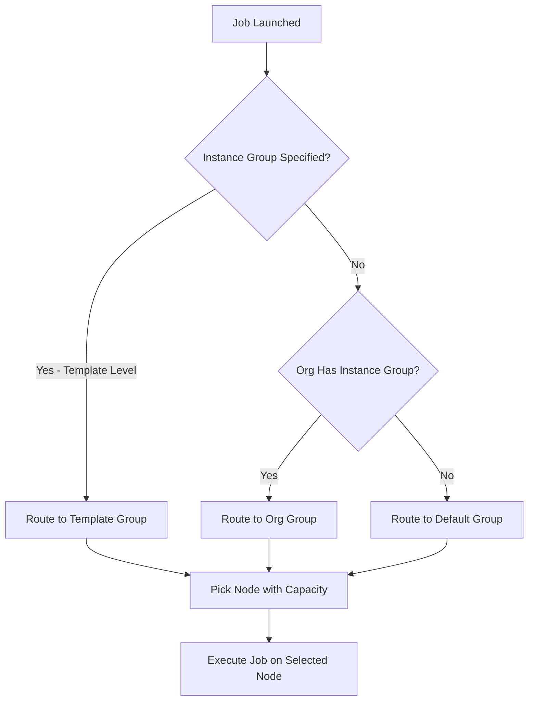

# How to Configure AWX Instance Groups

Author: [nawazdhandala](https://www.github.com/nawazdhandala)

Tags: Ansible, AWX, Instance Groups, Scaling, Infrastructure

Description: Configure AWX instance groups to distribute job execution across multiple nodes and isolate workloads for different teams or environments.

---

Instance groups in AWX control where jobs actually run. When you have a single AWX node, every job runs on that node. But as your automation scales, you need to spread the load across multiple workers, isolate production jobs from development ones, or dedicate capacity to specific teams. Instance groups make this possible by letting you group AWX execution nodes and assign job templates to specific groups.

## What Instance Groups Do

An instance group is a named collection of AWX instances (nodes) that can execute jobs. When a job template is assigned to an instance group, AWX will only run that template on nodes within that group. If no instance group is specified, AWX uses the default group.

The two main use cases are:

1. **Load distribution** - spread jobs across multiple worker nodes so no single node gets overwhelmed.
2. **Workload isolation** - keep production automation separate from development or testing jobs, both for performance and security reasons.

## Default Instance Groups

Every AWX installation starts with two built-in groups:

- **default** - Contains all instances. Jobs without a specific group assignment run here.
- **controlplane** - Reserved for AWX internal tasks like project updates and inventory syncs.

You cannot delete these, but you can create additional groups and move instances around.

## Viewing Current Instance Groups

```bash
# List all instance groups
curl -s -H "Authorization: Bearer ${AWX_TOKEN}" \
  https://awx.example.com/api/v2/instance_groups/ \
  | python3 -m json.tool
```

```bash
# List instances in a specific group (group ID 1)
curl -s -H "Authorization: Bearer ${AWX_TOKEN}" \
  https://awx.example.com/api/v2/instance_groups/1/instances/ \
  | python3 -c "
import sys, json
data = json.load(sys.stdin)
for inst in data['results']:
    print(f\"{inst['hostname']} - capacity: {inst['capacity']} - jobs: {inst['jobs_running']}\")
"
```

## Creating a New Instance Group

```bash
# Create an instance group for production workloads
curl -s -X POST \
  -H "Authorization: Bearer ${AWX_TOKEN}" \
  -H "Content-Type: application/json" \
  https://awx.example.com/api/v2/instance_groups/ \
  -d '{
    "name": "production",
    "policy_instance_minimum": 2,
    "policy_instance_percentage": 0,
    "max_concurrent_jobs": 50,
    "max_forks": 0
  }'
```

Key parameters:

- `policy_instance_minimum` - The minimum number of instances AWX should keep in this group. AWX auto-assigns instances from the pool to meet this minimum.
- `policy_instance_percentage` - Instead of a fixed number, use a percentage of total available instances. Set to 100 to include all instances.
- `max_concurrent_jobs` - Cap how many jobs can run at once in this group. Set to 0 for unlimited.
- `max_forks` - Limit the total number of Ansible forks across all jobs in the group. Set to 0 for unlimited.

## Assigning Instances to Groups

After creating a group, you add instances to it.

```bash
# Add instance ID 2 to instance group ID 3
curl -s -X POST \
  -H "Authorization: Bearer ${AWX_TOKEN}" \
  -H "Content-Type: application/json" \
  https://awx.example.com/api/v2/instance_groups/3/instances/ \
  -d '{"id": 2}'
```

```bash
# Remove instance ID 2 from instance group ID 3
curl -s -X POST \
  -H "Authorization: Bearer ${AWX_TOKEN}" \
  -H "Content-Type: application/json" \
  https://awx.example.com/api/v2/instance_groups/3/instances/ \
  -d '{"id": 2, "disassociate": true}'
```

## Assigning Instance Groups to Job Templates

Once you have your groups configured, assign them to job templates.

```bash
# Set job template ID 10 to run in the "production" instance group (ID 3)
curl -s -X POST \
  -H "Authorization: Bearer ${AWX_TOKEN}" \
  -H "Content-Type: application/json" \
  https://awx.example.com/api/v2/job_templates/10/instance_groups/ \
  -d '{"id": 3}'
```

You can assign multiple instance groups to a single job template. AWX will pick the group with the most available capacity.

## Assigning Instance Groups to Organizations

Instead of assigning groups to individual templates, you can set them at the organization level. All templates in that organization inherit the group assignment unless they override it.

```bash
# Set organization ID 1 to use instance group ID 3
curl -s -X POST \
  -H "Authorization: Bearer ${AWX_TOKEN}" \
  -H "Content-Type: application/json" \
  https://awx.example.com/api/v2/organizations/1/instance_groups/ \
  -d '{"id": 3}'
```

## Instance Group Architecture

Here is how instance groups fit into the AWX job routing system.



## Capacity and Job Routing

AWX calculates each instance's capacity based on its CPU and memory. When a job needs to run, AWX picks the instance in the target group that has the most available capacity. If all instances in the group are at capacity, the job queues until a slot opens up.

You can check the capacity of each instance.

```bash
# Check capacity for all instances
curl -s -H "Authorization: Bearer ${AWX_TOKEN}" \
  https://awx.example.com/api/v2/instances/ \
  | python3 -c "
import sys, json
data = json.load(sys.stdin)
for inst in data['results']:
    used = inst['consumed_capacity']
    total = inst['capacity']
    pct = (used / total * 100) if total > 0 else 0
    print(f\"{inst['hostname']}: {used}/{total} ({pct:.0f}% used)\")
"
```

## Container Groups

AWX also supports container groups, which are a special type of instance group that runs jobs in Kubernetes pods instead of on AWX instances. This gives you near-infinite scaling since Kubernetes creates and destroys pods as needed.

```bash
# Create a container group
curl -s -X POST \
  -H "Authorization: Bearer ${AWX_TOKEN}" \
  -H "Content-Type: application/json" \
  https://awx.example.com/api/v2/instance_groups/ \
  -d '{
    "name": "k8s-jobs",
    "is_container_group": true,
    "credential": 5,
    "pod_spec_override": {
      "apiVersion": "v1",
      "kind": "Pod",
      "metadata": {
        "namespace": "awx-jobs"
      },
      "spec": {
        "serviceAccountName": "awx-job-runner",
        "containers": [
          {
            "name": "worker",
            "image": "quay.io/ansible/awx-ee:latest",
            "resources": {
              "requests": {
                "cpu": "500m",
                "memory": "1Gi"
              },
              "limits": {
                "cpu": "2",
                "memory": "4Gi"
              }
            }
          }
        ]
      }
    }
  }'
```

The `credential` field should reference a Kubernetes API credential that AWX can use to create pods in the target cluster.

## Practical Topology Example

Here is a common setup for a mid-size organization.

```yaml
# Instance group layout
instance_groups:
  # Default group for ad-hoc and development jobs
  default:
    instances:
      - awx-worker-01
      - awx-worker-02
    max_concurrent_jobs: 20

  # Production group with dedicated capacity
  production:
    instances:
      - awx-worker-03
      - awx-worker-04
    max_concurrent_jobs: 30

  # Network automation on isolated nodes
  network:
    instances:
      - awx-network-01
    max_concurrent_jobs: 10

  # Kubernetes-based overflow for burst capacity
  k8s-overflow:
    is_container_group: true
    credential: k8s-api-cred
```

## Monitoring Instance Group Health

Keep an eye on group utilization to know when you need to add more nodes.

```bash
# Check job queue length and running jobs per group
curl -s -H "Authorization: Bearer ${AWX_TOKEN}" \
  https://awx.example.com/api/v2/instance_groups/ \
  | python3 -c "
import sys, json
data = json.load(sys.stdin)
for group in data['results']:
    print(f\"Group: {group['name']}\")
    print(f\"  Instances: {group['instances']}\")
    print(f\"  Running jobs: {group['jobs_running']}\")
    print(f\"  Capacity: {group['capacity']}\")
    print()
"
```

## Wrapping Up

Instance groups are the knob you turn when you need to scale AWX beyond a single node or isolate different types of automation workloads. Start with the default group for everything, then carve out dedicated groups as your job volume grows or as teams request isolation. Container groups are the escape hatch for bursty workloads since Kubernetes handles the scaling for you. The key is to monitor capacity utilization and add nodes before queued jobs start backing up.
