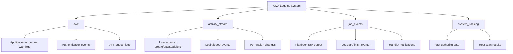

# How to Configure AWX Logging and Auditing

Author: [nawazdhandala](https://www.github.com/nawazdhandala)

Tags: Ansible, AWX, Logging, Auditing, Compliance

Description: Configure AWX external logging, activity streams, and audit trails for compliance, troubleshooting, and operational visibility.

---

AWX generates a lot of operational data: job output, activity streams, system logs, and performance metrics. By default, most of this lives inside AWX's database and container logs. For production environments, you need to ship logs to an external system where they can be searched, retained, and used for compliance auditing. This post covers AWX's logging architecture and how to set up external log aggregation.

## AWX Log Types

AWX produces several categories of log data.

**Job Output** - The stdout/stderr from every playbook run. This is what you see in the job detail page. Stored in the database and can be forwarded externally.

**Activity Stream** - An audit log of every action taken in AWX: who created a template, who launched a job, who changed a credential, who logged in. This is your compliance trail.

**System Logs** - Application-level logs from the AWX web server, task dispatcher, and other internal services. These are the logs you grep when AWX itself is misbehaving.

**Analytics/Metrics** - Performance data exposed at the `/api/v2/metrics/` endpoint (covered in the monitoring post).

## The Activity Stream

The activity stream is AWX's built-in audit log. Every create, update, and delete operation is recorded with the actor, timestamp, and details of what changed.

```bash
# Query the activity stream for recent events
curl -s -H "Authorization: Bearer ${AWX_TOKEN}" \
  "https://awx.example.com/api/v2/activity_stream/?order_by=-timestamp&page_size=10" \
  | python3 -c "
import sys, json
data = json.load(sys.stdin)
for event in data['results']:
    actor = event.get('summary_fields', {}).get('actor', {}).get('username', 'system')
    operation = event['operation']
    obj_type = event.get('object1', 'unknown')
    obj_name = event.get('summary_fields', {}).get('object1', {}).get('name', '')
    ts = event['timestamp']
    print(f'{ts}  {actor:15s}  {operation:8s}  {obj_type}: {obj_name}')
"
```

### Filtering the Activity Stream

```bash
# Find all actions by a specific user
curl -s -H "Authorization: Bearer ${AWX_TOKEN}" \
  "https://awx.example.com/api/v2/activity_stream/?actor__username=jdoe"

# Find all delete operations
curl -s -H "Authorization: Bearer ${AWX_TOKEN}" \
  "https://awx.example.com/api/v2/activity_stream/?operation=delete"

# Find changes to job templates in the last 24 hours
curl -s -H "Authorization: Bearer ${AWX_TOKEN}" \
  "https://awx.example.com/api/v2/activity_stream/?object1=job_template&timestamp__gt=$(date -u -v-1d +%Y-%m-%dT%H:%M:%SZ)"
```

## Configuring External Logging

AWX can ship logs to external aggregators. Go to Settings > Logging in the UI, or configure it via the API.

AWX supports these external log aggregators:
- Splunk
- Elastic Stack (Logstash)
- Loggly
- Sumologic
- Generic HTTP (for anything else)

### Setting Up Splunk Integration

```bash
# Configure AWX to send logs to Splunk
curl -s -X PATCH \
  -H "Authorization: Bearer ${AWX_TOKEN}" \
  -H "Content-Type: application/json" \
  https://awx.example.com/api/v2/settings/logging/ \
  -d '{
    "LOG_AGGREGATOR_HOST": "https://splunk.example.com:8088/services/collector/event",
    "LOG_AGGREGATOR_PORT": 8088,
    "LOG_AGGREGATOR_TYPE": "splunk",
    "LOG_AGGREGATOR_USERNAME": "",
    "LOG_AGGREGATOR_PASSWORD": "your-splunk-hec-token",
    "LOG_AGGREGATOR_PROTOCOL": "https",
    "LOG_AGGREGATOR_VERIFY_CERT": true,
    "LOG_AGGREGATOR_ENABLED": true,
    "LOG_AGGREGATOR_LOGGERS": [
      "awx",
      "activity_stream",
      "job_events",
      "system_tracking"
    ],
    "LOG_AGGREGATOR_MAX_DISK_USAGE_GB": 1,
    "LOG_AGGREGATOR_MAX_DISK_USAGE_PATH": "/var/lib/awx"
  }'
```

### Setting Up Elastic Stack Integration

```bash
# Configure AWX to send logs to Logstash
curl -s -X PATCH \
  -H "Authorization: Bearer ${AWX_TOKEN}" \
  -H "Content-Type: application/json" \
  https://awx.example.com/api/v2/settings/logging/ \
  -d '{
    "LOG_AGGREGATOR_HOST": "logstash.example.com",
    "LOG_AGGREGATOR_PORT": 5044,
    "LOG_AGGREGATOR_TYPE": "logstash",
    "LOG_AGGREGATOR_PROTOCOL": "tcp",
    "LOG_AGGREGATOR_VERIFY_CERT": false,
    "LOG_AGGREGATOR_ENABLED": true,
    "LOG_AGGREGATOR_LOGGERS": [
      "awx",
      "activity_stream",
      "job_events",
      "system_tracking"
    ]
  }'
```

Create the Logstash pipeline to receive AWX logs.

```ruby
# logstash-awx.conf
input {
  tcp {
    port => 5044
    codec => json
  }
}

filter {
  if [logger_name] == "awx.analytics.job_events" {
    mutate {
      add_field => { "log_type" => "job_event" }
    }
  }
  if [logger_name] == "awx.analytics.activity_stream" {
    mutate {
      add_field => { "log_type" => "activity" }
    }
  }
  date {
    match => ["@timestamp", "ISO8601"]
  }
}

output {
  elasticsearch {
    hosts => ["elasticsearch:9200"]
    index => "awx-logs-%{+YYYY.MM.dd}"
  }
}
```

### Generic HTTP Endpoint

For log aggregators not directly supported, use the HTTP type.

```bash
# Send logs to a generic HTTP endpoint
curl -s -X PATCH \
  -H "Authorization: Bearer ${AWX_TOKEN}" \
  -H "Content-Type: application/json" \
  https://awx.example.com/api/v2/settings/logging/ \
  -d '{
    "LOG_AGGREGATOR_HOST": "https://logs.example.com/api/v1/ingest",
    "LOG_AGGREGATOR_TYPE": "other",
    "LOG_AGGREGATOR_PROTOCOL": "https",
    "LOG_AGGREGATOR_ENABLED": true,
    "LOG_AGGREGATOR_LOGGERS": ["awx", "activity_stream", "job_events"]
  }'
```

## Log Categories in Detail

The `LOG_AGGREGATOR_LOGGERS` setting controls which log categories are forwarded.



## Kubernetes-Level Logging

AWX containers also write to stdout/stderr, which Kubernetes captures. If you have a cluster-level logging solution (like Fluentd, Fluent Bit, or Loki), these logs are automatically collected.

```bash
# View AWX web container logs
kubectl logs deployment/awx-web -n awx --tail=100

# View AWX task container logs
kubectl logs deployment/awx-task -n awx --tail=100

# View logs from a specific job pod (container groups)
kubectl logs awx-job-42 -n awx-jobs
```

For structured logging in Kubernetes, deploy Fluent Bit with AWX-specific parsing.

```yaml
# fluent-bit config for AWX containers
---
apiVersion: v1
kind: ConfigMap
metadata:
  name: fluent-bit-config
data:
  fluent-bit.conf: |
    [INPUT]
        Name              tail
        Path              /var/log/containers/awx-*.log
        Parser            docker
        Tag               awx.*
        Refresh_Interval  5

    [FILTER]
        Name   kubernetes
        Match  awx.*
        Merge_Log On
        Keep_Log Off

    [OUTPUT]
        Name            es
        Match           awx.*
        Host            elasticsearch
        Port            9200
        Index           awx-k8s-logs
        Logstash_Format On
        Logstash_Prefix awx-k8s
```

## Compliance and Audit Reports

For compliance requirements, you need to demonstrate who did what and when. Here is a script that generates a compliance-friendly audit report from the activity stream.

```python
#!/usr/bin/env python3
"""Generate an AWX audit report for compliance."""

import requests
import json
from datetime import datetime, timedelta

AWX_URL = "https://awx.example.com"
TOKEN = "your-token"
HEADERS = {"Authorization": f"Bearer {TOKEN}"}

# Report period
days_back = 30
since = (datetime.utcnow() - timedelta(days=days_back)).strftime(
    "%Y-%m-%dT%H:%M:%SZ"
)

print(f"AWX Audit Report - Last {days_back} days")
print(f"Generated: {datetime.utcnow().isoformat()}")
print("=" * 70)

# Fetch credential changes
print("\n## Credential Changes")
resp = requests.get(
    f"{AWX_URL}/api/v2/activity_stream/"
    f"?object1=credential&timestamp__gt={since}&page_size=200",
    headers=HEADERS,
)
for event in resp.json()["results"]:
    actor = event.get("summary_fields", {}).get("actor", {}).get(
        "username", "system"
    )
    op = event["operation"]
    name = event.get("summary_fields", {}).get("object1", {}).get("name", "")
    ts = event["timestamp"][:19]
    print(f"  {ts}  {actor:15s}  {op:8s}  {name}")

# Fetch permission changes
print("\n## Permission Changes")
resp = requests.get(
    f"{AWX_URL}/api/v2/activity_stream/"
    f"?object1=role&timestamp__gt={since}&page_size=200",
    headers=HEADERS,
)
for event in resp.json()["results"]:
    actor = event.get("summary_fields", {}).get("actor", {}).get(
        "username", "system"
    )
    op = event["operation"]
    ts = event["timestamp"][:19]
    changes = json.dumps(event.get("changes", {}))[:80]
    print(f"  {ts}  {actor:15s}  {op:8s}  {changes}")

# Fetch login events
print("\n## Login Events")
resp = requests.get(
    f"{AWX_URL}/api/v2/activity_stream/"
    f"?object1=o_auth2_access_token&timestamp__gt={since}&page_size=200",
    headers=HEADERS,
)
for event in resp.json()["results"]:
    actor = event.get("summary_fields", {}).get("actor", {}).get(
        "username", "system"
    )
    op = event["operation"]
    ts = event["timestamp"][:19]
    print(f"  {ts}  {actor:15s}  {op}")
```

## Log Retention

AWX stores job output in the database, which can grow large. Configure job output retention to keep the database manageable.

```bash
# Set job output retention to 120 days
curl -s -X PATCH \
  -H "Authorization: Bearer ${AWX_TOKEN}" \
  -H "Content-Type: application/json" \
  https://awx.example.com/api/v2/settings/jobs/ \
  -d '{
    "DEFAULT_JOB_TIMEOUT": 0,
    "DEFAULT_INVENTORY_UPDATE_TIMEOUT": 0
  }'
```

Also configure the AWX cleanup management command to prune old data.

```bash
# Run cleanup via the AWX management command
kubectl exec deployment/awx-task -n awx -- \
  awx-manage cleanup_jobs --days=90 --dry-run

# Remove the --dry-run flag to actually delete
kubectl exec deployment/awx-task -n awx -- \
  awx-manage cleanup_jobs --days=90
```

## Wrapping Up

AWX logging and auditing is about three things: shipping logs to a centralized system for search and alerting, using the activity stream for compliance auditing, and managing log retention so your database does not grow unbounded. Set up external logging early, before you need to investigate a failed midnight deployment and discover the logs already rolled over. The activity stream is your best friend for answering "who changed what and when" questions that inevitably come up.
