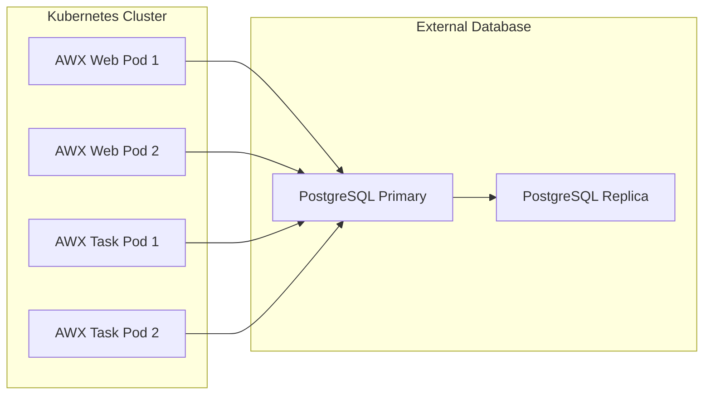

# How to Configure AWX with External Database

Author: [nawazdhandala](https://www.github.com/nawazdhandala)

Tags: Ansible, AWX, PostgreSQL, Database, High Availability

Description: Configure AWX to use an external PostgreSQL database for better performance, easier backups, and high availability in production deployments.

---

The default AWX installation deploys PostgreSQL as a container alongside the AWX application. This works fine for testing and small deployments, but production environments benefit from an external database. An external PostgreSQL instance gives you dedicated resources, easier backup management, replication options, and the ability to use managed database services like AWS RDS or Azure Database for PostgreSQL.

## Why Use an External Database

The containerized PostgreSQL that comes with AWX shares resources with the AWX application containers. As your job history grows and concurrent users increase, the database starts competing for CPU and memory with the web and task containers. Moving PostgreSQL to a dedicated server (or managed service) solves this and gives you:

- Independent scaling of compute and database resources
- Point-in-time recovery using native PostgreSQL backup tools
- Replication for high availability
- Connection pooling with PgBouncer if needed
- Easier monitoring with database-specific tools

## Prerequisites

You need a PostgreSQL server (version 13 or higher) that AWX can reach over the network. The database user needs the ability to create tables and indexes in the AWX database.

## Setting Up the External PostgreSQL Instance

If you are running your own PostgreSQL server, here is the initial setup.

```bash
# On the PostgreSQL server, install PostgreSQL 15
sudo apt-get update
sudo apt-get install -y postgresql-15

# Start and enable the service
sudo systemctl start postgresql
sudo systemctl enable postgresql
```

Create the AWX database and user.

```sql
-- Connect to PostgreSQL as the postgres user
-- Create the AWX database and user

CREATE USER awx WITH PASSWORD 'your-strong-password-here';
CREATE DATABASE awx OWNER awx;
GRANT ALL PRIVILEGES ON DATABASE awx TO awx;

-- Connect to the awx database and grant schema permissions
\c awx
GRANT ALL ON SCHEMA public TO awx;
```

## Configuring PostgreSQL for Remote Connections

By default, PostgreSQL only accepts connections from localhost. You need to allow AWX to connect.

```bash
# Edit postgresql.conf to listen on all interfaces
# Find and update the listen_addresses setting
# File location varies by OS, commonly /etc/postgresql/15/main/postgresql.conf
```

```ini
# postgresql.conf - allow remote connections
listen_addresses = '*'
max_connections = 200
shared_buffers = 2GB
effective_cache_size = 6GB
work_mem = 16MB
```

```bash
# Edit pg_hba.conf to allow AWX hosts
# Add this line to allow the AWX server subnet
```

```text
# pg_hba.conf - allow AWX hosts to connect
# TYPE  DATABASE  USER  ADDRESS            METHOD
host    awx       awx   10.0.0.0/24        scram-sha-256
```

```bash
# Restart PostgreSQL to apply changes
sudo systemctl restart postgresql
```

## Configuring AWX Operator for External Database

If you deploy AWX using the AWX Operator on Kubernetes (which is the standard method), you configure the external database through a Kubernetes secret and the AWX custom resource.

First, create a secret with the database credentials.

```yaml
# awx-postgres-secret.yml
---
apiVersion: v1
kind: Secret
metadata:
  name: awx-postgres-configuration
  namespace: awx
type: Opaque
stringData:
  host: "db.example.com"
  port: "5432"
  database: "awx"
  username: "awx"
  password: "your-strong-password-here"
  sslmode: "prefer"
  type: "unmanaged"
```

The `type: "unmanaged"` is critical. It tells the AWX Operator not to create its own PostgreSQL deployment.

```bash
# Apply the secret
kubectl apply -f awx-postgres-secret.yml
```

Now update the AWX custom resource to reference this secret.

```yaml
# awx-instance.yml
---
apiVersion: awx.ansible.com/v1beta1
kind: AWX
metadata:
  name: awx
  namespace: awx
spec:
  service_type: ClusterIP
  postgres_configuration_secret: awx-postgres-configuration
  # Other AWX settings
  admin_user: admin
  admin_password_secret: awx-admin-password
  web_replicas: 2
  task_replicas: 2
```

```bash
# Apply the AWX instance
kubectl apply -f awx-instance.yml
```

The AWX Operator will read the database connection details from the secret and configure the AWX containers accordingly.

## Using AWS RDS as the External Database

For AWS deployments, RDS for PostgreSQL is a natural choice. Here is how to set it up.

```bash
# Create an RDS PostgreSQL instance using the AWS CLI
aws rds create-db-instance \
  --db-instance-identifier awx-database \
  --db-instance-class db.r6g.large \
  --engine postgres \
  --engine-version 15.4 \
  --master-username awx \
  --master-user-password 'your-strong-password-here' \
  --allocated-storage 100 \
  --storage-type gp3 \
  --db-name awx \
  --vpc-security-group-ids sg-0123456789abcdef \
  --db-subnet-group-name awx-db-subnet \
  --backup-retention-period 7 \
  --multi-az \
  --storage-encrypted \
  --no-publicly-accessible
```

Key RDS settings for AWX:
- Use `db.r6g.large` or bigger depending on job volume
- Enable Multi-AZ for high availability
- Enable encryption at rest
- Set backup retention to at least 7 days
- Keep it in a private subnet

After the RDS instance is ready, get its endpoint and update your AWX configuration.

```bash
# Get the RDS endpoint
aws rds describe-db-instances \
  --db-instance-identifier awx-database \
  --query 'DBInstances[0].Endpoint.Address' \
  --output text
```

## Connection Architecture



## Performance Tuning the Database

AWX is read-heavy with periodic write bursts when jobs complete. Tune PostgreSQL accordingly.

```ini
# postgresql.conf tuning for AWX
# Adjust based on available server RAM

# Memory settings (for a server with 16GB RAM)
shared_buffers = 4GB
effective_cache_size = 12GB
work_mem = 32MB
maintenance_work_mem = 1GB

# Write performance
wal_buffers = 64MB
checkpoint_completion_target = 0.9
max_wal_size = 4GB

# Connection settings
max_connections = 200

# Query planner
random_page_cost = 1.1
effective_io_concurrency = 200
```

For RDS, you set these through a parameter group instead of editing files directly.

## Verifying the Connection

After deploying AWX with the external database, verify it is using the right database.

```bash
# Check AWX pod logs for database connection info
kubectl logs deployment/awx-web -n awx | grep -i database

# Connect to the database and check AWX tables exist
psql -h db.example.com -U awx -d awx -c "\dt" | head -20
```

## SSL/TLS for Database Connections

Always encrypt the connection between AWX and the database, especially if they are on different networks.

```yaml
# Update the secret with SSL settings
stringData:
  host: "db.example.com"
  port: "5432"
  database: "awx"
  username: "awx"
  password: "your-strong-password-here"
  sslmode: "verify-full"
  sslrootcert: "/etc/ssl/certs/rds-ca-2019-root.pem"
  type: "unmanaged"
```

For RDS, download the AWS RDS root certificate and mount it into the AWX pods.

## Migrating from Internal to External Database

If you started with the built-in database and want to migrate, use `pg_dump` and `pg_restore`.

```bash
# Dump the internal database
kubectl exec -it awx-postgres-0 -n awx -- \
  pg_dump -U awx -Fc awx > awx-backup.dump

# Restore to the external database
pg_restore -h db.example.com -U awx -d awx \
  --no-owner --no-acl awx-backup.dump

# Update the AWX custom resource to point to the external database
# Then restart the AWX pods
kubectl rollout restart deployment/awx-web deployment/awx-task -n awx
```

## Monitoring the Database

Set up monitoring to catch issues before they affect AWX.

```bash
# Check active connections
psql -h db.example.com -U awx -d awx -c "
SELECT count(*) as total,
       state,
       application_name
FROM pg_stat_activity
WHERE datname = 'awx'
GROUP BY state, application_name
ORDER BY total DESC;
"

# Check database size
psql -h db.example.com -U awx -d awx -c "
SELECT pg_size_pretty(pg_database_size('awx')) as db_size;
"

# Check largest tables
psql -h db.example.com -U awx -d awx -c "
SELECT relname as table_name,
       pg_size_pretty(pg_total_relation_size(relid)) as total_size
FROM pg_catalog.pg_statio_user_tables
ORDER BY pg_total_relation_size(relid) DESC
LIMIT 10;
"
```

## Wrapping Up

An external database is a foundational requirement for production AWX deployments. It separates concerns, improves performance, and gives you access to enterprise database features like replication and managed backups. Whether you run your own PostgreSQL server or use a managed service like RDS, the migration path is straightforward. Set it up early in your AWX deployment so you do not have to migrate under pressure later.
