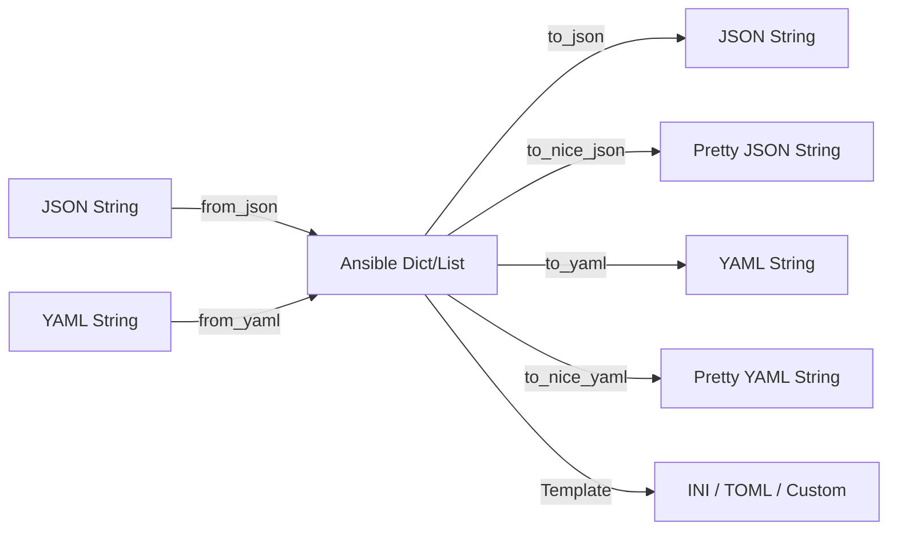

# How to Convert Data Formats (JSON to YAML) in Ansible

Author: [nawazdhandala](https://www.github.com/nawazdhandala)

Tags: Ansible, JSON, YAML, Data Conversion

Description: Learn how to convert between JSON, YAML, INI, and other data formats in Ansible using built-in filters like to_json, to_yaml, from_json, and from_yaml.

---

Data format conversion is a regular task when working with Ansible. You might need to read a JSON config and output it as YAML, convert YAML inventory data to JSON for an API call, or transform structured data into INI format. Ansible provides a suite of `to_*` and `from_*` filters that make these conversions straightforward.

## JSON to YAML Conversion

The most common conversion. Parse JSON with `from_json`, then output as YAML with `to_yaml` or `to_nice_yaml`:

```yaml
# playbook-json-to-yaml.yml
# Reads a JSON configuration file and writes it out as YAML
- name: Convert JSON to YAML
  hosts: localhost
  gather_facts: false

  tasks:
    - name: Read JSON file
      ansible.builtin.set_fact:
        config: "{{ lookup('file', '/tmp/config.json') | from_json }}"

    - name: Write as YAML
      ansible.builtin.copy:
        content: "{{ config | to_nice_yaml(indent=2) }}"
        dest: /tmp/config.yml

    - name: Show YAML output
      ansible.builtin.debug:
        msg: "{{ config | to_nice_yaml(indent=2) }}"
```

## YAML to JSON Conversion

Going the other direction:

```yaml
# playbook-yaml-to-json.yml
# Reads YAML variables and outputs them as formatted JSON
- name: Convert YAML to JSON
  hosts: localhost
  gather_facts: false
  vars:
    service_config:
      apiVersion: apps/v1
      kind: Deployment
      metadata:
        name: myapp
        labels:
          app: myapp
      spec:
        replicas: 3
        selector:
          matchLabels:
            app: myapp

  tasks:
    - name: Write as pretty JSON
      ansible.builtin.copy:
        content: "{{ service_config | to_nice_json(indent=2) }}"
        dest: /tmp/deployment.json

    - name: Show compact JSON (single line)
      ansible.builtin.debug:
        msg: "{{ service_config | to_json }}"

    - name: Show pretty JSON
      ansible.builtin.debug:
        msg: "{{ service_config | to_nice_json(indent=4) }}"
```

## Available Conversion Filters

Here is a summary of all the conversion filters:

```yaml
# playbook-all-conversions.yml
# Demonstrates all available format conversion filters
- name: All conversion filters
  hosts: localhost
  gather_facts: false
  vars:
    sample_data:
      name: myapp
      version: "2.1.0"
      features:
        - logging
        - caching
      database:
        host: localhost
        port: 5432

  tasks:
    - name: to_json - compact JSON
      ansible.builtin.debug:
        msg: "{{ sample_data | to_json }}"

    - name: to_nice_json - formatted JSON
      ansible.builtin.debug:
        msg: "{{ sample_data | to_nice_json(indent=2) }}"

    - name: to_yaml - compact YAML
      ansible.builtin.debug:
        msg: "{{ sample_data | to_yaml }}"

    - name: to_nice_yaml - formatted YAML
      ansible.builtin.debug:
        msg: "{{ sample_data | to_nice_yaml(indent=2) }}"
```

## Conversion Flow Diagram



## JSON to INI Conversion

There is no built-in INI filter, but you can use Jinja2 templates:

```yaml
# playbook-json-to-ini.yml
# Converts structured data to INI format using a Jinja2 template
- name: Convert data to INI format
  hosts: localhost
  gather_facts: false
  vars:
    ini_data:
      server:
        host: "0.0.0.0"
        port: "8080"
        workers: "4"
      database:
        host: "db.internal"
        port: "5432"
        name: "myapp"
      logging:
        level: "info"
        file: "/var/log/myapp.log"

  tasks:
    - name: Generate INI file from structured data
      ansible.builtin.copy:
        content: |
          
          [{{ section }}]
          
          {{ key }} = {{ value }}
          

          
        dest: /tmp/myapp.ini
```

Output:

```ini
[server]
host = 0.0.0.0
port = 8080
workers = 4

[database]
host = db.internal
port = 5432
name = myapp

[logging]
level = info
file = /var/log/myapp.log
```

## Controlling YAML Output Style

The `to_nice_yaml` filter supports parameters to control output formatting:

```yaml
# playbook-yaml-style.yml
# Shows different YAML output styles using formatting parameters
- name: YAML output formatting options
  hosts: localhost
  gather_facts: false
  vars:
    config:
      server:
        host: "0.0.0.0"
        port: 8080
      features:
        - logging
        - monitoring
        - alerting

  tasks:
    - name: Default YAML style
      ansible.builtin.debug:
        msg: "{{ config | to_nice_yaml }}"

    - name: YAML with custom indent
      ansible.builtin.debug:
        msg: "{{ config | to_nice_yaml(indent=4) }}"

    - name: YAML with specific width
      ansible.builtin.debug:
        msg: "{{ config | to_nice_yaml(indent=2, width=120) }}"
```

## Controlling JSON Output

Similarly, `to_nice_json` has formatting options:

```yaml
# playbook-json-style.yml
# Demonstrates JSON formatting options including sort_keys and indent
- name: JSON output formatting options
  hosts: localhost
  gather_facts: false
  vars:
    config:
      zebra: 1
      alpha: 2
      middle: 3

  tasks:
    - name: JSON with sorted keys
      ansible.builtin.debug:
        msg: "{{ config | to_nice_json(indent=2, sort_keys=true) }}"

    - name: Compact JSON
      ansible.builtin.debug:
        msg: "{{ config | to_json(sort_keys=true) }}"
```

## Batch File Conversion

Convert multiple files at once:

```yaml
# playbook-batch-convert.yml
# Converts all JSON files in a directory to YAML format
- name: Batch convert JSON to YAML
  hosts: localhost
  gather_facts: false

  tasks:
    - name: Find all JSON config files
      ansible.builtin.find:
        paths: /etc/myapp/configs/
        patterns: "*.json"
      register: json_files

    - name: Convert each JSON file to YAML
      ansible.builtin.copy:
        content: "{{ lookup('file', item.path) | from_json | to_nice_yaml(indent=2) }}"
        dest: "{{ item.path | regex_replace('\\.json$', '.yml') }}"
      loop: "{{ json_files.files }}"
      loop_control:
        label: "{{ item.path | basename }}"
```

## Handling Conversion Edge Cases

Some data types can cause issues during conversion. Here are common gotchas:

```yaml
# playbook-edge-cases.yml
# Handles common format conversion edge cases with booleans and numbers
- name: Handle conversion edge cases
  hosts: localhost
  gather_facts: false
  vars:
    tricky_data:
      boolean_yes: true
      boolean_no: false
      number_string: "8080"
      actual_number: 8080
      null_value: null
      empty_string: ""
      date_like: "2024-01-15"

  tasks:
    - name: Show JSON output (types preserved)
      ansible.builtin.debug:
        msg: "{{ tricky_data | to_nice_json(indent=2) }}"

    - name: Show YAML output (watch for type coercion)
      ansible.builtin.debug:
        msg: "{{ tricky_data | to_nice_yaml(indent=2) }}"

    - name: Force string types in YAML output for safe round-tripping
      ansible.builtin.copy:
        content: |
          
          
          {{ key }}: null
          
          {{ key }}: "{{ value }}"
          
          {{ key }}: {{ value }}
          
          
        dest: /tmp/safe_output.yml
```

## Practical Example: Converting Docker Compose Formats

```yaml
# playbook-docker-compose.yml
# Converts between docker-compose YAML and a JSON representation
- name: Docker Compose format conversion
  hosts: localhost
  gather_facts: false

  tasks:
    - name: Read docker-compose.yml
      ansible.builtin.set_fact:
        compose: "{{ lookup('file', './docker-compose.yml') | from_yaml }}"

    - name: Write as JSON (for tools that need JSON input)
      ansible.builtin.copy:
        content: "{{ compose | to_nice_json(indent=2) }}"
        dest: ./docker-compose.json

    - name: Show service summary
      ansible.builtin.debug:
        msg: "Services: {{ compose.services.keys() | list | join(', ') }}"
```

## Practical Example: Converting Terraform Variables

```yaml
# playbook-terraform-vars.yml
# Converts Ansible variables to Terraform JSON variable files
- name: Generate Terraform variable files
  hosts: localhost
  gather_facts: false
  vars:
    terraform_vars:
      aws_region: us-east-1
      instance_type: t3.medium
      instance_count: 3
      tags:
        project: myapp
        environment: production

  tasks:
    - name: Write terraform.tfvars.json
      ansible.builtin.copy:
        content: "{{ terraform_vars | to_nice_json(indent=2) }}"
        dest: /opt/terraform/terraform.tfvars.json

    - name: Write as HCL-style tfvars (simple key=value)
      ansible.builtin.copy:
        content: |
          
          
          {{ key }} = {{ value | to_json }}
          
          {{ key }} = {{ value }}
          
          {{ key }} = "{{ value }}"
          
          
        dest: /opt/terraform/terraform.tfvars
```

## Summary

Ansible makes data format conversion simple with paired `from_*` and `to_*` filters. The key pattern is: parse the source format into an Ansible native data structure, then output it in the target format. Use `to_nice_json` and `to_nice_yaml` for human-readable output with configurable indentation. For formats without built-in filters (like INI or TOML), Jinja2 templates fill the gap. Watch out for type coercion issues, especially with booleans and numeric strings, when round-tripping between formats.
