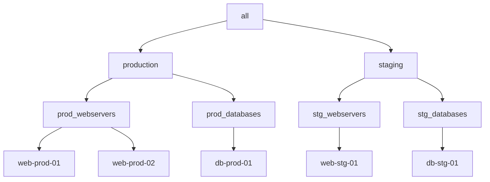

# How to Create an Ansible Inventory File in YAML Format

Author: [nawazdhandala](https://www.github.com/nawazdhandala)

Tags: Ansible, Inventory, YAML, DevOps, Infrastructure Automation

Description: Learn how to write Ansible inventory files in YAML format with structured data types, nested groups, and real-world examples for modern infrastructure management.

---

YAML inventory files give you more flexibility than the traditional INI format. You get proper data types (booleans, integers, lists, dictionaries), cleaner nesting, and a format that matches the rest of the Ansible ecosystem since playbooks, roles, and variable files all use YAML already.

This guide covers how to build YAML inventories from simple host lists to production-ready configurations.

## Basic Structure

A YAML inventory starts with the `all` group at the top level. Every host belongs to `all` implicitly.

```yaml
# inventory.yml
# Minimal YAML inventory with just a list of hosts
all:
  hosts:
    web1.example.com:
    web2.example.com:
    db1.example.com:
```

Notice the trailing colon after each hostname. That is required YAML syntax for defining dictionary keys, even when they have no value.

Test the inventory:

```bash
# Verify the YAML inventory parses correctly
ansible-inventory -i inventory.yml --list
```

## Organizing Hosts into Groups

Groups are defined under the `children` key of any parent group.

```yaml
# inventory.yml
# Hosts organized into functional groups
all:
  children:
    webservers:
      hosts:
        web1.example.com:
        web2.example.com:
        web3.example.com:
    databases:
      hosts:
        db-primary.example.com:
        db-replica-01.example.com:
    loadbalancers:
      hosts:
        lb1.example.com:
        lb2.example.com:
```

You can now run commands against individual groups:

```bash
# Ping only the database servers
ansible databases -i inventory.yml -m ping
```

## Adding Host Variables

Variables go directly under the hostname. Unlike INI format, YAML gives you real data types.

```yaml
# inventory.yml
# Host variables with proper YAML data types
all:
  children:
    webservers:
      hosts:
        web1.example.com:
          ansible_host: 10.0.1.10
          ansible_port: 22
          http_port: 8080
          ssl_enabled: true          # Real boolean, not a string
          max_connections: 1000      # Real integer, not a string
          allowed_origins:           # A list, not possible in INI
            - "https://app.example.com"
            - "https://api.example.com"
        web2.example.com:
          ansible_host: 10.0.1.11
          http_port: 8081
          ssl_enabled: true
          max_connections: 1000
          allowed_origins:
            - "https://app.example.com"
            - "https://api.example.com"
```

This is one of the biggest advantages over INI format. You can define lists, nested dictionaries, and properly typed values without worrying about Jinja2 filters to convert strings.

## Adding Group Variables

Group variables go under the `vars` key within a group.

```yaml
# inventory.yml
# Group-level variables applied to all hosts in the group
all:
  children:
    webservers:
      vars:
        ansible_user: deploy
        nginx_worker_processes: auto
        document_root: /var/www/html
        firewall_rules:
          - port: 80
            proto: tcp
          - port: 443
            proto: tcp
      hosts:
        web1.example.com:
          ansible_host: 10.0.1.10
        web2.example.com:
          ansible_host: 10.0.1.11

    databases:
      vars:
        ansible_user: dbadmin
        postgresql_version: 16
        backup_enabled: true
        backup_retention_days: 30
      hosts:
        db-primary.example.com:
          ansible_host: 10.0.2.10
          db_role: primary
        db-replica.example.com:
          ansible_host: 10.0.2.11
          db_role: replica
```

## Nested Groups (Children of Children)

YAML makes nested group hierarchies much easier to read than the INI `:children` syntax.

```yaml
# inventory.yml
# Multi-level group hierarchy for environment separation
all:
  children:
    production:
      children:
        prod_webservers:
          hosts:
            web-prod-01.example.com:
            web-prod-02.example.com:
        prod_databases:
          hosts:
            db-prod-01.example.com:
      vars:
        env: production
        monitoring_enabled: true

    staging:
      children:
        stg_webservers:
          hosts:
            web-stg-01.example.com:
        stg_databases:
          hosts:
            db-stg-01.example.com:
      vars:
        env: staging
        monitoring_enabled: false
```

The structure is visible at a glance:



## A Complete Production Example

Here is a full YAML inventory for a multi-tier application across two data centers:

```yaml
# inventory.yml
# Production inventory for multi-datacenter deployment
all:
  vars:
    ansible_python_interpreter: /usr/bin/python3
    ntp_servers:
      - 0.pool.ntp.org
      - 1.pool.ntp.org
    dns_servers:
      - 10.0.0.2
      - 10.0.0.3

  children:
    # ---- Data Center East ----
    dc_east:
      children:
        dc_east_web:
          hosts:
            web-east-01.example.com:
              ansible_host: 10.1.1.10
            web-east-02.example.com:
              ansible_host: 10.1.1.11
        dc_east_db:
          hosts:
            db-east-01.example.com:
              ansible_host: 10.1.2.10
              db_role: primary
            db-east-02.example.com:
              ansible_host: 10.1.2.11
              db_role: replica
      vars:
        datacenter: east
        subnet_prefix: "10.1"

    # ---- Data Center West ----
    dc_west:
      children:
        dc_west_web:
          hosts:
            web-west-01.example.com:
              ansible_host: 10.2.1.10
            web-west-02.example.com:
              ansible_host: 10.2.1.11
        dc_west_db:
          hosts:
            db-west-01.example.com:
              ansible_host: 10.2.2.10
              db_role: primary
      vars:
        datacenter: west
        subnet_prefix: "10.2"

    # ---- Cross-cutting groups ----
    webservers:
      children:
        dc_east_web:
        dc_west_web:
      vars:
        ansible_user: webdeploy
        nginx_version: "1.24"

    databases:
      children:
        dc_east_db:
        dc_west_db:
      vars:
        ansible_user: pgadmin
        pg_version: "16"
```

Notice how `webservers` and `databases` pull in hosts from both data centers using the `children` key. A single host can belong to multiple groups, and Ansible merges the variables from all of its groups.

## Verifying the YAML Inventory

Always validate your inventory after making changes:

```bash
# Show the full parsed inventory as JSON
ansible-inventory -i inventory.yml --list

# Show the group tree structure
ansible-inventory -i inventory.yml --graph

# Check what variables a specific host will receive
ansible-inventory -i inventory.yml --host web-east-01.example.com
```

The `--host` flag is particularly useful for debugging variable precedence when a host belongs to multiple groups.

## Converting INI to YAML

If you have an existing INI inventory, you can convert it by dumping it to YAML:

```bash
# Convert an existing INI inventory to YAML format
ansible-inventory -i old_inventory.ini --list --yaml > inventory.yml
```

Review the output and clean it up. The auto-generated YAML is valid but usually needs some reformatting to be readable.

## When to Choose YAML Over INI

Use YAML inventory when:

- You need complex variable types (lists, dictionaries, booleans)
- Your inventory has deep group nesting
- You want consistency with the rest of your Ansible codebase
- You are generating inventory programmatically

Stick with INI when:

- Your inventory is small and simple
- Team members are unfamiliar with YAML syntax
- You want the fastest possible setup

Both formats are fully supported and there is no performance difference between them. The choice comes down to your team's preferences and the complexity of your infrastructure.

## Common YAML Inventory Mistakes

Watch out for these common errors:

1. **Missing trailing colons**: `web1.example.com` without a colon will cause a parse error. Always write `web1.example.com:`.

2. **Indentation**: YAML is whitespace-sensitive. Use consistent 2-space indentation and never mix tabs with spaces.

3. **Quoting strings that look like numbers**: A hostname like `10.0.1.10` should be fine as a dictionary key, but if you use bare numbers as hostnames, quote them: `"123":`.

4. **Forgetting the `hosts` key**: Groups need an explicit `hosts:` key. You cannot put hostnames directly under a group name.

YAML inventories keep your infrastructure definitions clean, typed, and consistent with the rest of your Ansible workflow. Once you get comfortable with the structure, you will rarely want to go back to INI.
