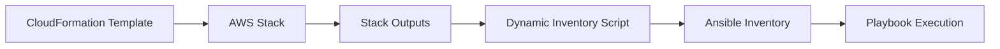

# How to Create an Ansible Inventory from AWS CloudFormation Outputs

Author: [nawazdhandala](https://www.github.com/nawazdhandala)

Tags: Ansible, AWS, CloudFormation, Dynamic Inventory, DevOps

Description: Learn how to build Ansible dynamic inventory from AWS CloudFormation stack outputs to manage infrastructure provisioned by CloudFormation.

---

If you use AWS CloudFormation to provision infrastructure and Ansible to configure it, you need a way to connect the two. CloudFormation stack outputs contain the IP addresses, DNS names, and resource IDs of what was provisioned. This post shows you how to pull those outputs into an Ansible inventory so your playbooks can configure the resources CloudFormation created.

## The Challenge

CloudFormation stacks create resources like EC2 instances, RDS databases, and load balancers. The specific IP addresses and identifiers are only known after the stack finishes deploying. You need those values in your Ansible inventory before you can run configuration playbooks. Hardcoding them defeats the purpose of infrastructure as code.

## Method 1: Dynamic Inventory Script Using boto3

The most flexible approach is a Python dynamic inventory script that queries CloudFormation stacks using the AWS SDK:

```python
#!/usr/bin/env python3
# cfn_inventory.py
# Dynamic inventory script that reads CloudFormation stack outputs

import json
import sys
import boto3
from collections import defaultdict

# Configuration: map stack names to inventory groups
STACK_GROUP_MAP = {
    'production-web-stack': 'webservers',
    'production-app-stack': 'appservers',
    'production-db-stack': 'databases',
}

# Configuration: which output keys contain host addresses
HOST_OUTPUT_KEYS = ['InstancePublicIP', 'InstancePrivateIP', 'HostIP', 'DNSName']

def get_stack_outputs(stack_name, region='us-east-1'):
    """Fetch outputs from a CloudFormation stack."""
    cfn = boto3.client('cloudformation', region_name=region)
    try:
        response = cfn.describe_stacks(StackName=stack_name)
        stack = response['Stacks'][0]
        outputs = {}
        for output in stack.get('Outputs', []):
            outputs[output['OutputKey']] = output['OutputValue']
        return outputs
    except Exception as e:
        print(f"Warning: Could not read stack {stack_name}: {e}", file=sys.stderr)
        return {}

def build_inventory():
    """Build Ansible inventory from CloudFormation stack outputs."""
    inventory = defaultdict(lambda: {'hosts': [], 'vars': {}})
    hostvars = {}

    for stack_name, group in STACK_GROUP_MAP.items():
        outputs = get_stack_outputs(stack_name)

        # Extract host IPs from outputs
        for key, value in outputs.items():
            if key in HOST_OUTPUT_KEYS:
                hostname = f"{group}-{key.lower()}"
                inventory[group]['hosts'].append(hostname)
                hostvars[hostname] = {
                    'ansible_host': value,
                    'cfn_stack': stack_name,
                }

            # Handle comma-separated lists of IPs (common for ASG outputs)
            if key.endswith('IPList') or key.endswith('Addresses'):
                ips = [ip.strip() for ip in value.split(',')]
                for idx, ip in enumerate(ips):
                    hostname = f"{group}-{idx:02d}"
                    inventory[group]['hosts'].append(hostname)
                    hostvars[hostname] = {
                        'ansible_host': ip,
                        'cfn_stack': stack_name,
                    }

        # Pass all stack outputs as group variables
        inventory[group]['vars'].update({
            f'cfn_{k.lower()}': v for k, v in outputs.items()
        })

    inventory['_meta'] = {'hostvars': hostvars}
    return dict(inventory)

if __name__ == '__main__':
    if len(sys.argv) > 1 and sys.argv[1] == '--host':
        # Return empty dict for host mode; all vars are in _meta
        print(json.dumps({}))
    else:
        print(json.dumps(build_inventory(), indent=2))
```

Make it executable and test:

```bash
# Make the script executable
chmod +x cfn_inventory.py

# Test the inventory output
./cfn_inventory.py --list | python3 -m json.tool

# Use with ansible
ansible -i cfn_inventory.py webservers -m ping
```

## CloudFormation Template Setup

For this approach to work, your CloudFormation templates need to export the right values. Here is an example template that outputs instance IPs:

```yaml
# cloudformation/web-stack.yml
AWSTemplateFormatVersion: '2010-09-09'
Description: Web server stack with outputs for Ansible inventory

Parameters:
  InstanceCount:
    Type: Number
    Default: 2
  KeyName:
    Type: AWS::EC2::KeyPair::KeyName

Resources:
  WebInstance1:
    Type: AWS::EC2::Instance
    Properties:
      ImageId: ami-0abcdef1234567890
      InstanceType: t3.medium
      KeyName: !Ref KeyName
      Tags:
        - Key: Name
          Value: web-01
        - Key: Role
          Value: webserver

  WebInstance2:
    Type: AWS::EC2::Instance
    Properties:
      ImageId: ami-0abcdef1234567890
      InstanceType: t3.medium
      KeyName: !Ref KeyName
      Tags:
        - Key: Name
          Value: web-02
        - Key: Role
          Value: webserver

Outputs:
  # Individual instance IPs
  Web1PrivateIP:
    Description: Private IP of web instance 1
    Value: !GetAtt WebInstance1.PrivateIp
  Web2PrivateIP:
    Description: Private IP of web instance 2
    Value: !GetAtt WebInstance2.PrivateIp
  # Comma-separated list for the inventory script
  WebIPList:
    Description: All web server private IPs
    Value: !Join
      - ','
      - - !GetAtt WebInstance1.PrivateIp
        - !GetAtt WebInstance2.PrivateIp
  # VPC info for group variables
  VpcId:
    Description: VPC ID
    Value: !Ref VPC
```

## Method 2: Using AWS EC2 Plugin with CloudFormation Tags

A cleaner approach for EC2 instances is to use the `aws_ec2` dynamic inventory plugin filtered by CloudFormation stack tags. When CloudFormation creates EC2 instances, it automatically tags them with `aws:cloudformation:stack-name`:

```yaml
# inventory/aws_ec2_cfn.yml
# Use the AWS EC2 plugin filtered to CloudFormation-managed instances
plugin: amazon.aws.aws_ec2
regions:
  - us-east-1

# Only include instances created by specific CloudFormation stacks
filters:
  "tag:aws:cloudformation:stack-name":
    - production-web-stack
    - production-app-stack
    - production-db-stack
  instance-state-name: running

# Create groups based on the stack name
keyed_groups:
  - key: tags['aws:cloudformation:stack-name'] | default('')
    prefix: cfn_stack
    separator: "_"
  - key: tags.Role | default('untagged')
    prefix: role
    separator: "_"

# Set connection variables from instance attributes
compose:
  ansible_host: private_ip_address
  ansible_user: "'ec2-user'"
  cfn_stack_name: tags.get('aws:cloudformation:stack-name', '')
  cfn_logical_id: tags.get('aws:cloudformation:logical-id', '')
```

This approach is simpler because it uses a built-in plugin and automatically picks up new instances as they are added to the stack.

```bash
# Verify the inventory groups
ansible-inventory -i inventory/aws_ec2_cfn.yml --graph
```

The output shows groups based on stack names:

```
@all:
  |--@cfn_stack_production_web_stack:
  |  |--ec2-10-0-1-10.compute.internal
  |  |--ec2-10-0-1-11.compute.internal
  |--@cfn_stack_production_app_stack:
  |  |--ec2-10-0-2-20.compute.internal
  |--@role_webserver:
  |  |--ec2-10-0-1-10.compute.internal
  |  |--ec2-10-0-1-11.compute.internal
```

## Method 3: Ansible Playbook that Builds Inventory from Stacks

You can also use an Ansible playbook to query CloudFormation and build inventory dynamically using `add_host`:

```yaml
# playbooks/cfn-inventory-build.yml
# Build inventory from CloudFormation stack outputs
- hosts: localhost
  connection: local
  gather_facts: false
  vars:
    stacks:
      - name: production-web-stack
        group: webservers
        output_key: WebIPList
      - name: production-app-stack
        group: appservers
        output_key: AppIPList

  tasks:
    - name: Get CloudFormation stack outputs
      amazon.aws.cloudformation_info:
        stack_name: "{{ item.name }}"
        region: us-east-1
      register: cfn_results
      loop: "{{ stacks }}"

    - name: Add hosts from stack outputs to inventory
      ansible.builtin.add_host:
        name: "{{ item.1 }}"
        groups: "{{ item.0.item.group }}"
        ansible_host: "{{ item.1 }}"
        ansible_user: ec2-user
        cfn_stack: "{{ item.0.item.name }}"
      loop: "{{ cfn_results.results | subelements('cloudformation', skip_missing=True) }}"
      when: item.0.cloudformation is defined

# Now run your actual configuration against the dynamically built inventory
- hosts: webservers
  tasks:
    - name: Configure web servers
      ansible.builtin.debug:
        msg: "Configuring {{ inventory_hostname }} from stack {{ cfn_stack }}"
```

## Handling Stack Updates

When you update a CloudFormation stack, instance IPs might change. Here is a wrapper script that refreshes the inventory and runs the playbook:

```bash
#!/bin/bash
# deploy.sh
# Update CloudFormation stack and then run Ansible configuration

STACK_NAME="production-web-stack"
TEMPLATE="cloudformation/web-stack.yml"
REGION="us-east-1"

# Update the CloudFormation stack
echo "Updating CloudFormation stack..."
aws cloudformation update-stack \
    --stack-name "$STACK_NAME" \
    --template-body "file://$TEMPLATE" \
    --region "$REGION"

# Wait for the stack update to complete
echo "Waiting for stack update to complete..."
aws cloudformation wait stack-update-complete \
    --stack-name "$STACK_NAME" \
    --region "$REGION"

# Run Ansible with the dynamic inventory
echo "Running Ansible configuration..."
ansible-playbook -i cfn_inventory.py playbooks/configure-web.yml
```

## Combining Multiple Stacks into One Inventory

In a real deployment, you typically have separate stacks for networking, compute, and databases. Your inventory script needs to pull from all of them:

```python
#!/usr/bin/env python3
# multi_stack_inventory.py
# Combines outputs from multiple CloudFormation stacks

import json
import sys
import os
import boto3
from collections import defaultdict

# Stack configuration loaded from environment or config file
STACKS = [
    {
        'name': os.environ.get('WEB_STACK', 'production-web-stack'),
        'group': 'webservers',
        'ip_output': 'WebIPList',
        'region': 'us-east-1',
    },
    {
        'name': os.environ.get('APP_STACK', 'production-app-stack'),
        'group': 'appservers',
        'ip_output': 'AppIPList',
        'region': 'us-east-1',
    },
    {
        'name': os.environ.get('DB_STACK', 'production-db-stack'),
        'group': 'databases',
        'ip_output': 'DBEndpoint',
        'region': 'us-east-1',
    },
]

def get_outputs(stack_name, region):
    """Get all outputs from a CloudFormation stack."""
    cfn = boto3.client('cloudformation', region_name=region)
    resp = cfn.describe_stacks(StackName=stack_name)
    return {
        o['OutputKey']: o['OutputValue']
        for o in resp['Stacks'][0].get('Outputs', [])
    }

def build_inventory():
    inventory = defaultdict(lambda: {'hosts': [], 'vars': {}})
    hostvars = {}

    for stack_cfg in STACKS:
        outputs = get_outputs(stack_cfg['name'], stack_cfg['region'])
        group = stack_cfg['group']
        ip_key = stack_cfg['ip_output']

        if ip_key in outputs:
            ips = [ip.strip() for ip in outputs[ip_key].split(',')]
            for idx, ip in enumerate(ips):
                host = f"{group}-{idx:02d}"
                inventory[group]['hosts'].append(host)
                hostvars[host] = {
                    'ansible_host': ip,
                    'cfn_stack': stack_cfg['name'],
                    'aws_region': stack_cfg['region'],
                }

        # Add all outputs as group vars with cfn_ prefix
        for k, v in outputs.items():
            inventory[group]['vars'][f'cfn_{k.lower()}'] = v

    inventory['_meta'] = {'hostvars': hostvars}
    return dict(inventory)

if __name__ == '__main__':
    print(json.dumps(build_inventory(), indent=2))
```

The flow from CloudFormation to Ansible looks like this:



Bridging CloudFormation and Ansible inventory is a common pattern in AWS environments. The AWS EC2 plugin with CloudFormation tag filters is the lowest-maintenance option for EC2 instances. For non-EC2 resources (RDS endpoints, ElastiCache clusters, etc.), a custom inventory script that reads stack outputs gives you the most flexibility. Choose the approach that best fits your stack structure and resource types.
