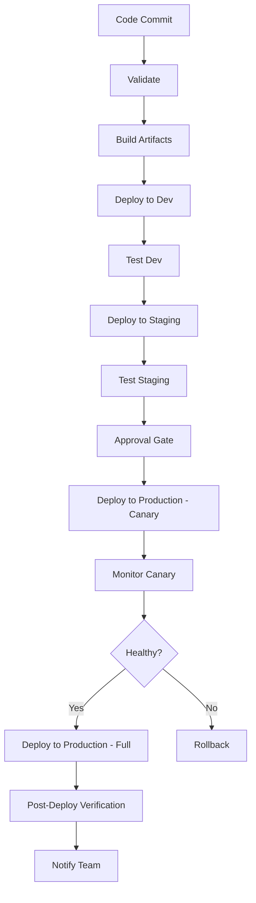

# How to Create Ansible Deployment Pipelines

Author: [nawazdhandala](https://www.github.com/nawazdhandala)

Tags: Ansible, Deployment, CI/CD, Pipeline, DevOps

Description: Design and build multi-stage Ansible deployment pipelines with validation, testing, staged rollouts, and rollback capabilities.

---

A deployment pipeline is more than just running `ansible-playbook` against production. A well-designed pipeline includes validation, testing, staged rollouts, health checks, and rollback capabilities. This post walks through building a complete Ansible deployment pipeline from scratch, covering the architecture, the playbook structure, and the CI/CD integration.

## Pipeline Architecture

A production deployment pipeline should have these stages:



## Project Structure

Organize your Ansible project for pipeline execution.

```
ansible-deployment/
  inventory/
    dev.ini
    staging.ini
    production.ini
    group_vars/
      all/
        common.yml
        vault.yml
      dev/
        vars.yml
      staging/
        vars.yml
      production/
        vars.yml
  playbooks/
    deploy.yml
    rollback.yml
    health-check.yml
    smoke-test.yml
    pre-deploy.yml
    post-deploy.yml
  roles/
    app-deploy/
    health-check/
    notifications/
  scripts/
    validate.sh
    vault_pass.sh
  ansible.cfg
  requirements.yml
```

## The Deploy Playbook

The main deployment playbook should be structured in phases.

```yaml
# playbooks/deploy.yml
---
- name: Pre-Deployment Checks
  hosts: "{{ target_hosts | default('webservers') }}"
  become: true
  gather_facts: true
  serial: "{{ serial_count | default('100%') }}"

  pre_tasks:
    # Check that required variables are defined
    - name: Validate deployment variables
      assert:
        that:
          - deploy_version is defined
          - deploy_version != ""
        fail_msg: "deploy_version must be defined"

    # Check disk space before deployment
    - name: Check available disk space
      shell: df -BG /opt/app | tail -1 | awk '{print $4}' | tr -d 'G'
      register: disk_space
      changed_when: false

    - name: Fail if insufficient disk space
      fail:
        msg: "Only {{ disk_space.stdout }}GB available. Need at least 5GB."
      when: disk_space.stdout | int < 5

    # Check current running version
    - name: Get current version
      slurp:
        src: /opt/app/VERSION
      register: current_version_file
      ignore_errors: true

    - name: Set current version fact
      set_fact:
        current_version: "{{ (current_version_file.content | b64decode | trim) if current_version_file is success else 'unknown' }}"

    - name: Display version transition
      debug:
        msg: "Upgrading from {{ current_version }} to {{ deploy_version }}"

  roles:
    - role: app-deploy
      vars:
        app_version: "{{ deploy_version }}"
        app_user: "webapp"
        app_dir: "/opt/app"

  post_tasks:
    # Verify the deployment
    - name: Wait for application to start
      uri:
        url: "http://localhost:8080/health"
        status_code: 200
      register: health_result
      retries: 30
      delay: 5
      until: health_result.status == 200

    - name: Verify deployed version
      uri:
        url: "http://localhost:8080/version"
        return_content: true
      register: version_check

    - name: Confirm version matches
      assert:
        that:
          - "deploy_version in version_check.content"
        fail_msg: "Deployed version does not match expected version {{ deploy_version }}"
```

## The App Deploy Role

```yaml
# roles/app-deploy/tasks/main.yml
---
# Step 1: Download the application artifact
- name: Download application package
  get_url:
    url: "https://artifacts.example.com/app/{{ app_version }}/app-{{ app_version }}.tar.gz"
    dest: "/tmp/app-{{ app_version }}.tar.gz"
    checksum: "sha256:{{ artifact_checksum }}"

# Step 2: Create release directory
- name: Create release directory
  file:
    path: "{{ app_dir }}/releases/{{ app_version }}"
    state: directory
    owner: "{{ app_user }}"
    group: "{{ app_user }}"
    mode: '0755'

# Step 3: Extract application
- name: Extract application package
  unarchive:
    src: "/tmp/app-{{ app_version }}.tar.gz"
    dest: "{{ app_dir }}/releases/{{ app_version }}"
    remote_src: true
    owner: "{{ app_user }}"
    group: "{{ app_user }}"

# Step 4: Deploy configuration
- name: Deploy application configuration
  template:
    src: app-config.yml.j2
    dest: "{{ app_dir }}/releases/{{ app_version }}/config.yml"
    owner: "{{ app_user }}"
    group: "{{ app_user }}"
    mode: '0640'

# Step 5: Update symlink (atomic deployment)
- name: Update current symlink
  file:
    src: "{{ app_dir }}/releases/{{ app_version }}"
    dest: "{{ app_dir }}/current"
    state: link
    force: true
  notify: restart application

# Step 6: Write version file
- name: Write version file
  copy:
    content: "{{ app_version }}"
    dest: "{{ app_dir }}/VERSION"
    owner: "{{ app_user }}"
    group: "{{ app_user }}"
    mode: '0644'

# Step 7: Clean up old releases (keep last 5)
- name: Find old releases
  find:
    paths: "{{ app_dir }}/releases"
    file_type: directory
  register: releases

- name: Remove old releases
  file:
    path: "{{ item.path }}"
    state: absent
  loop: "{{ (releases.files | sort(attribute='mtime') | list)[:-5] }}"
  when: releases.files | length > 5
```

## The Rollback Playbook

Every deployment pipeline needs a rollback plan.

```yaml
# playbooks/rollback.yml
---
- name: Rollback Deployment
  hosts: "{{ target_hosts | default('webservers') }}"
  become: true
  gather_facts: true

  vars:
    app_dir: "/opt/app"

  tasks:
    # Find the previous release
    - name: List all releases
      find:
        paths: "{{ app_dir }}/releases"
        file_type: directory
      register: releases

    - name: Get current release
      stat:
        path: "{{ app_dir }}/current"
      register: current_link

    - name: Determine previous release
      set_fact:
        previous_release: "{{ (releases.files | sort(attribute='mtime') | map(attribute='path') | list)[-2] }}"
      when: releases.files | length >= 2

    - name: Fail if no previous release
      fail:
        msg: "No previous release found to roll back to"
      when: releases.files | length < 2

    - name: Display rollback target
      debug:
        msg: "Rolling back to {{ previous_release | basename }}"

    # Switch the symlink to the previous release
    - name: Update current symlink to previous release
      file:
        src: "{{ previous_release }}"
        dest: "{{ app_dir }}/current"
        state: link
        force: true

    # Update version file
    - name: Update version file
      copy:
        content: "{{ previous_release | basename }}"
        dest: "{{ app_dir }}/VERSION"
        mode: '0644'

    # Restart the application
    - name: Restart application
      systemd:
        name: webapp
        state: restarted

    # Verify rollback
    - name: Wait for application after rollback
      uri:
        url: "http://localhost:8080/health"
        status_code: 200
      retries: 30
      delay: 5
      register: health_result
      until: health_result.status == 200

    - name: Rollback complete
      debug:
        msg: "Successfully rolled back to {{ previous_release | basename }}"
```

## Health Check Playbook

A dedicated health check playbook for use between deployment stages.

```yaml
# playbooks/health-check.yml
---
- name: Application Health Check
  hosts: "{{ target_hosts | default('webservers') }}"
  gather_facts: false

  tasks:
    # Check HTTP health endpoint
    - name: Check application health endpoint
      uri:
        url: "http://{{ ansible_host }}:8080/health"
        status_code: 200
        timeout: 10
      register: health_result
      retries: 3
      delay: 5
      until: health_result.status == 200

    # Check that the process is running
    - name: Check application process
      command: pgrep -f webapp
      changed_when: false
      register: process_check

    # Check database connectivity
    - name: Check database connection via app
      uri:
        url: "http://{{ ansible_host }}:8080/health/db"
        status_code: 200
        timeout: 10

    # Check disk space
    - name: Check disk space
      shell: df -h /opt/app | tail -1 | awk '{print $5}' | tr -d '%'
      register: disk_usage
      changed_when: false

    - name: Alert on low disk space
      debug:
        msg: "WARNING: Disk usage at {{ disk_usage.stdout }}%"
      when: disk_usage.stdout | int > 85

    - name: Health check summary
      debug:
        msg: |
          Host: {{ ansible_host }}
          HTTP Health: {{ 'OK' if health_result.status == 200 else 'FAIL' }}
          Process: {{ 'Running' if process_check.rc == 0 else 'NOT Running' }}
          Disk Usage: {{ disk_usage.stdout }}%
```

## CI/CD Pipeline Integration

Here is a GitHub Actions workflow that implements the full pipeline.

```yaml
# .github/workflows/deploy-pipeline.yml
name: Deployment Pipeline

on:
  push:
    branches: [main]
  workflow_dispatch:
    inputs:
      version:
        description: 'Version to deploy'
        required: true
      skip_staging:
        description: 'Skip staging deployment'
        type: boolean
        default: false

jobs:
  validate:
    runs-on: ubuntu-latest
    steps:
      - uses: actions/checkout@v4
      - run: pip install ansible==8.7.0 ansible-lint
      - run: ansible-lint playbooks/
      - run: |
          for playbook in playbooks/*.yml; do
            ansible-playbook --syntax-check "$playbook"
          done

  deploy-staging:
    needs: validate
    if: ${{ !inputs.skip_staging }}
    runs-on: ubuntu-latest
    environment: staging
    steps:
      - uses: actions/checkout@v4
      - run: pip install ansible==8.7.0
      - run: |
          mkdir -p ~/.ssh
          echo "${{ secrets.SSH_KEY }}" > ~/.ssh/id_rsa
          chmod 600 ~/.ssh/id_rsa
          echo "${{ secrets.VAULT_PASS }}" > /tmp/vault.txt
      - run: |
          ansible-playbook \
            -i inventory/staging.ini \
            --vault-password-file /tmp/vault.txt \
            -e "deploy_version=${{ inputs.version || github.sha }}" \
            playbooks/deploy.yml
        env:
          ANSIBLE_HOST_KEY_CHECKING: "false"
      - run: |
          ansible-playbook \
            -i inventory/staging.ini \
            playbooks/health-check.yml
        env:
          ANSIBLE_HOST_KEY_CHECKING: "false"
      - if: always()
        run: rm -f /tmp/vault.txt ~/.ssh/id_rsa

  deploy-production:
    needs: deploy-staging
    runs-on: ubuntu-latest
    environment: production
    steps:
      - uses: actions/checkout@v4
      - run: pip install ansible==8.7.0
      - run: |
          mkdir -p ~/.ssh
          echo "${{ secrets.SSH_KEY }}" > ~/.ssh/id_rsa
          chmod 600 ~/.ssh/id_rsa
          echo "${{ secrets.VAULT_PASS }}" > /tmp/vault.txt
      # Canary deployment (1 server first)
      - run: |
          ansible-playbook \
            -i inventory/production.ini \
            --vault-password-file /tmp/vault.txt \
            -e "deploy_version=${{ inputs.version || github.sha }}" \
            -e "serial_count=1" \
            --limit "webservers[0]" \
            playbooks/deploy.yml
        env:
          ANSIBLE_HOST_KEY_CHECKING: "false"
      # Health check canary
      - run: |
          ansible-playbook \
            -i inventory/production.ini \
            --limit "webservers[0]" \
            playbooks/health-check.yml
        env:
          ANSIBLE_HOST_KEY_CHECKING: "false"
      # Full rollout
      - run: |
          ansible-playbook \
            -i inventory/production.ini \
            --vault-password-file /tmp/vault.txt \
            -e "deploy_version=${{ inputs.version || github.sha }}" \
            -e "serial_count=25%" \
            playbooks/deploy.yml
        env:
          ANSIBLE_HOST_KEY_CHECKING: "false"
      - if: always()
        run: rm -f /tmp/vault.txt ~/.ssh/id_rsa
```

## Serial Deployment Strategy

For zero-downtime deployments, use the `serial` keyword to deploy in batches.

```yaml
# Deploy in batches: 1 host first (canary), then 25% at a time
- name: Rolling Deployment
  hosts: webservers
  become: true
  serial:
    - 1       # Deploy to 1 host first (canary)
    - "25%"   # Then 25% at a time
    - "25%"
    - "50%"   # Finish with remaining hosts
  max_fail_percentage: 10  # Stop if more than 10% of hosts fail

  roles:
    - app-deploy
```

## Tips for Deployment Pipelines

1. Always deploy through environments in order: dev, staging, production. Never skip staging for a production deploy.
2. Use `serial` for rolling deployments. Deploy to one host first as a canary, then roll out in batches.
3. Build health checks into every stage. Do not proceed to the next environment until the current one is verified healthy.
4. Keep your rollback playbook tested and ready. Run it in staging periodically to make sure it actually works.
5. Use the symlink deployment pattern for atomic switches between versions. This eliminates partial deployment states.
6. Clean up old releases automatically but keep enough for rollback. Five previous versions is a reasonable default.

A well-built deployment pipeline takes time to create, but it pays for itself quickly in reduced deployment stress and fewer production incidents. Invest in the pipeline early and iterate on it continuously.
