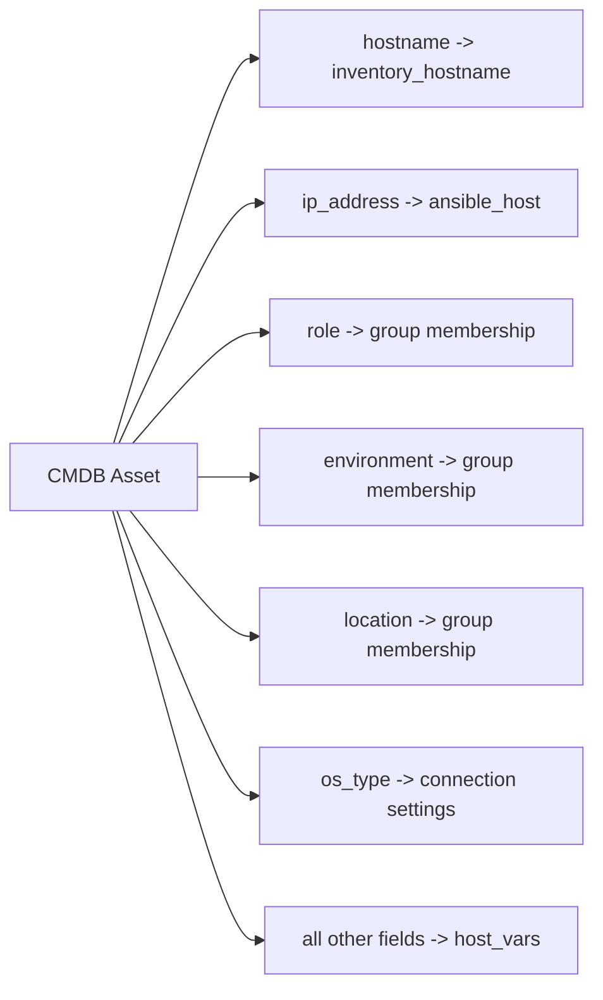

# How to Create Ansible Inventory from a CMDB

Author: [nawazdhandala](https://www.github.com/nawazdhandala)

Tags: Ansible, CMDB, Dynamic Inventory, ITSM, Automation

Description: Learn how to build Ansible dynamic inventory from a Configuration Management Database to keep your automation in sync with your CMDB records.

---

A Configuration Management Database (CMDB) is the system of record for IT infrastructure in many organizations. It tracks every server, its role, location, owner, and lifecycle state. If your CMDB is the source of truth for what servers exist and what they do, it should also be the source of truth for your Ansible inventory. This post shows how to build a dynamic inventory that pulls from a CMDB.

## Why Connect Ansible to Your CMDB

Maintaining separate lists of servers in both a CMDB and Ansible inventory creates drift. When someone adds a new server to the CMDB but forgets to update the Ansible inventory (or vice versa), things break. By pulling inventory directly from the CMDB:

- New servers are automatically picked up by Ansible
- Decommissioned servers drop out of inventory
- Server metadata (role, environment, location) drives Ansible grouping
- You get a single source of truth instead of two

## Generic CMDB API Structure

Most CMDBs expose a REST API. While the specifics differ between products (ServiceNow, Device42, Ralph, NetBox, etc.), the general pattern is similar. Here is a generic dynamic inventory script that works with any REST-based CMDB:

```python
#!/usr/bin/env python3
# cmdb_inventory.py
# Generic dynamic inventory that queries a CMDB REST API

import json
import sys
import os
import requests
from collections import defaultdict

# CMDB connection settings from environment variables
CMDB_URL = os.environ.get('CMDB_URL', 'https://cmdb.example.com/api/v1')
CMDB_API_KEY = os.environ.get('CMDB_API_KEY', '')
CMDB_USERNAME = os.environ.get('CMDB_USERNAME', '')
CMDB_PASSWORD = os.environ.get('CMDB_PASSWORD', '')

# Field mappings: map CMDB field names to Ansible concepts
FIELD_MAP = {
    'hostname': 'hostname',        # CMDB field for the server name
    'ip_address': 'ip_address',    # CMDB field for IP
    'role': 'role',                # Maps to Ansible group
    'environment': 'environment',  # Maps to Ansible group
    'location': 'location',        # Maps to Ansible group
    'os_type': 'os_type',          # Extra variable
    'status': 'status',            # Filter: only include active
}

def cmdb_get(endpoint, params=None):
    """Make an authenticated request to the CMDB API."""
    headers = {'Accept': 'application/json'}

    if CMDB_API_KEY:
        headers['Authorization'] = f'Bearer {CMDB_API_KEY}'
        auth = None
    else:
        auth = (CMDB_USERNAME, CMDB_PASSWORD)

    response = requests.get(
        f'{CMDB_URL}/{endpoint}',
        headers=headers,
        auth=auth,
        params=params,
        verify=True,
    )
    response.raise_for_status()
    return response.json()

def get_all_assets():
    """Fetch all server assets from the CMDB with pagination."""
    all_assets = []
    page = 1
    per_page = 100

    while True:
        data = cmdb_get('assets', params={
            'type': 'server',
            'status': 'active',
            'page': page,
            'per_page': per_page,
        })

        assets = data.get('results', data.get('items', []))
        if not assets:
            break

        all_assets.extend(assets)
        page += 1

        # Check if there are more pages
        total = data.get('total', data.get('count', 0))
        if len(all_assets) >= total:
            break

    return all_assets

def build_inventory():
    """Build Ansible inventory from CMDB data."""
    assets = get_all_assets()

    groups = defaultdict(lambda: {'hosts': [], 'vars': {}})
    hostvars = {}

    for asset in assets:
        hostname = asset.get(FIELD_MAP['hostname'])
        if not hostname:
            continue

        ip_address = asset.get(FIELD_MAP['ip_address'], '')
        role = asset.get(FIELD_MAP['role'], 'ungrouped')
        environment = asset.get(FIELD_MAP['environment'], 'unknown')
        location = asset.get(FIELD_MAP['location'], 'unknown')
        os_type = asset.get(FIELD_MAP['os_type'], 'linux')

        # Add to role-based group
        groups[role]['hosts'].append(hostname)

        # Add to environment group
        env_group = f"env_{environment}"
        groups[env_group]['hosts'].append(hostname)

        # Add to location group
        loc_group = f"loc_{location}"
        groups[loc_group]['hosts'].append(hostname)

        # Set host variables
        hostvars[hostname] = {
            'ansible_host': ip_address,
            'cmdb_role': role,
            'cmdb_environment': environment,
            'cmdb_location': location,
            'cmdb_os_type': os_type,
        }

        # Set ansible_user based on OS type
        if 'windows' in os_type.lower():
            hostvars[hostname]['ansible_user'] = 'Administrator'
            hostvars[hostname]['ansible_connection'] = 'winrm'
        else:
            hostvars[hostname]['ansible_user'] = 'deploy'

    inventory = dict(groups)
    inventory['_meta'] = {'hostvars': hostvars}
    return inventory

def get_host_vars(hostname):
    """Get variables for a single host from the CMDB."""
    try:
        data = cmdb_get(f'assets/{hostname}')
        return {
            'ansible_host': data.get(FIELD_MAP['ip_address'], ''),
            'cmdb_role': data.get(FIELD_MAP['role'], ''),
            'cmdb_environment': data.get(FIELD_MAP['environment'], ''),
        }
    except requests.exceptions.HTTPError:
        return {}

if __name__ == '__main__':
    if len(sys.argv) > 1 and sys.argv[1] == '--host':
        print(json.dumps(get_host_vars(sys.argv[2]), indent=2))
    else:
        print(json.dumps(build_inventory(), indent=2))
```

## Example: ServiceNow CMDB Integration

ServiceNow is one of the most common enterprise CMDBs. Here is a script tailored for its table API:

```python
#!/usr/bin/env python3
# servicenow_inventory.py
# Dynamic inventory for ServiceNow CMDB

import json
import sys
import os
import requests
from collections import defaultdict

SNOW_INSTANCE = os.environ.get('SNOW_INSTANCE', 'mycompany.service-now.com')
SNOW_USERNAME = os.environ.get('SNOW_USERNAME', '')
SNOW_PASSWORD = os.environ.get('SNOW_PASSWORD', '')

def snow_query(table, query_params):
    """Query the ServiceNow Table API."""
    url = f'https://{SNOW_INSTANCE}/api/now/table/{table}'
    response = requests.get(
        url,
        auth=(SNOW_USERNAME, SNOW_PASSWORD),
        headers={'Accept': 'application/json'},
        params=query_params,
    )
    response.raise_for_status()
    return response.json().get('result', [])

def build_inventory():
    groups = defaultdict(lambda: {'hosts': [], 'vars': {}})
    hostvars = {}

    # Query the cmdb_ci_server table for active Linux servers
    servers = snow_query('cmdb_ci_server', {
        'sysparm_query': 'install_status=1^os_familyLIKELinux',
        'sysparm_fields': 'name,ip_address,u_role,u_environment,location.name,os',
        'sysparm_limit': 10000,
    })

    for server in servers:
        hostname = server.get('name', '')
        if not hostname:
            continue

        ip = server.get('ip_address', '')
        role = server.get('u_role', 'ungrouped')
        env = server.get('u_environment', 'unknown')
        location = server.get('location.name', 'unknown')

        groups[role]['hosts'].append(hostname)
        groups[f"env_{env}"]['hosts'].append(hostname)

        hostvars[hostname] = {
            'ansible_host': ip,
            'ansible_user': 'deploy',
            'snow_role': role,
            'snow_environment': env,
            'snow_location': location,
            'snow_os': server.get('os', ''),
        }

    inventory = dict(groups)
    inventory['_meta'] = {'hostvars': hostvars}
    return inventory

if __name__ == '__main__':
    if '--host' in sys.argv:
        print(json.dumps({}))
    else:
        print(json.dumps(build_inventory(), indent=2))
```

## Example: NetBox CMDB Integration

NetBox is a popular open-source network source of truth. It has a dedicated Ansible collection:

```bash
# Install the NetBox Ansible collection
ansible-galaxy collection install netbox.netbox
```

Configure the inventory plugin:

```yaml
# inventory/netbox.yml
plugin: netbox.netbox.nb_inventory
api_endpoint: https://netbox.example.com
token: your-netbox-api-token
validate_certs: true

# Group devices by role, site, and platform
group_by:
  - device_roles
  - sites
  - platforms
  - regions

# Filter to only active devices
query_filters:
  - status: active

# Map NetBox fields to Ansible variables
compose:
  ansible_host: primary_ip4.address | ansible.utils.ipaddr('address')
  ansible_user: "'deploy'"
```

## CMDB to Ansible Group Mapping

Here is how CMDB attributes typically map to Ansible inventory structure:



## Caching CMDB Queries

CMDB APIs can be slow, especially for large inventories. Add caching to your inventory script:

```python
import time
import hashlib

CACHE_FILE = '/tmp/cmdb_inventory_cache.json'
CACHE_TTL = int(os.environ.get('CMDB_CACHE_TTL', '1800'))  # 30 minutes

def get_cached_inventory():
    """Return cached inventory if fresh, otherwise rebuild."""
    if os.path.exists(CACHE_FILE):
        age = time.time() - os.path.getmtime(CACHE_FILE)
        if age < CACHE_TTL:
            with open(CACHE_FILE, 'r') as f:
                return json.load(f)

    # Cache miss or expired
    inventory = build_inventory()

    with open(CACHE_FILE, 'w') as f:
        json.dump(inventory, f)

    return inventory
```

Or use Ansible's built-in caching mechanism:

```ini
# ansible.cfg
[inventory]
cache = true
cache_plugin = ansible.builtin.jsonfile
cache_connection = /tmp/ansible_cmdb_cache
cache_timeout = 1800
```

## Handling CMDB Data Quality Issues

CMDB data is notoriously messy. Build validation into your inventory script:

```python
def validate_and_clean(asset):
    """Validate and clean CMDB data before adding to inventory."""
    hostname = asset.get('hostname', '').strip().lower()
    ip = asset.get('ip_address', '').strip()

    # Skip assets without a hostname
    if not hostname:
        return None

    # Skip assets with invalid hostnames
    if not hostname.replace('-', '').replace('.', '').isalnum():
        print(f"Warning: Skipping asset with invalid hostname: {hostname}", file=sys.stderr)
        return None

    # Validate IP address format
    import ipaddress
    try:
        if ip:
            ipaddress.ip_address(ip)
    except ValueError:
        print(f"Warning: Invalid IP for {hostname}: {ip}", file=sys.stderr)
        ip = ''

    asset['hostname'] = hostname
    asset['ip_address'] = ip
    return asset
```

## Keeping CMDB and Ansible in Sync

The best approach is to treat the CMDB as the source of truth and never manually edit the Ansible inventory. Here is the recommended workflow:

1. All server additions, changes, and decommissions happen in the CMDB first
2. The dynamic inventory script reads from the CMDB on every Ansible run
3. Ansible uses the CMDB-driven groups and variables for all operations
4. Optionally, Ansible reports back to the CMDB (updating configuration status after a successful playbook run)

```yaml
# playbooks/post-deploy-cmdb-update.yml
# After deployment, update the CMDB with the actual configuration state
- hosts: all
  tasks:
    - name: Update CMDB with deployment timestamp
      ansible.builtin.uri:
        url: "https://cmdb.example.com/api/v1/assets/{{ inventory_hostname }}"
        method: PATCH
        headers:
          Authorization: "Bearer {{ cmdb_api_key }}"
        body_format: json
        body:
          last_configured: "{{ ansible_date_time.iso8601 }}"
          ansible_version: "{{ ansible_version.full }}"
      delegate_to: localhost
```

Building your Ansible inventory from a CMDB eliminates the drift between what your organization thinks it has and what Ansible manages. The generic script pattern works with any REST-based CMDB, and products like NetBox have dedicated Ansible plugins that make integration even easier. The key is treating the CMDB as the single source of truth and building everything else on top of it.
