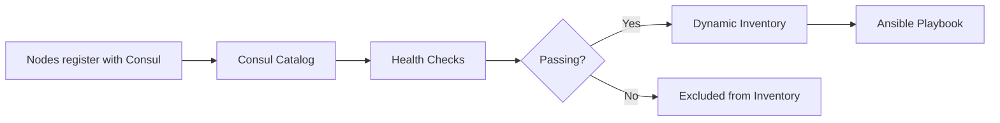

# How to Create Ansible Inventory from Consul Service Discovery

Author: [nawazdhandala](https://www.github.com/nawazdhandala)

Tags: Ansible, Consul, Service Discovery, Dynamic Inventory, HashiCorp

Description: Learn how to use HashiCorp Consul as a dynamic inventory source for Ansible to manage services and nodes registered in Consul.

---

HashiCorp Consul is widely used for service discovery, health checking, and key-value storage. If your infrastructure is already registered in Consul, it makes sense to use that as your Ansible inventory source instead of maintaining a separate list of hosts. This post shows you how to connect Ansible to Consul for dynamic inventory.

## Why Use Consul as Inventory

Consul knows which nodes are alive, what services they run, and their health status. Using Consul as your Ansible inventory source means:

- Your inventory is always current because Consul tracks node registration and health
- Hosts are automatically grouped by the services they provide
- You can target Ansible runs at specific services rather than individual hosts
- Decommissioned nodes drop out of inventory automatically when they deregister from Consul

## Prerequisites

You need:
- A running Consul cluster (or single agent for testing)
- The `community.general` Ansible collection installed
- Network access from your Ansible control node to the Consul HTTP API

Install the collection if you do not have it:

```bash
# Install the community.general collection which includes the consul plugin
ansible-galaxy collection install community.general
```

## Method 1: The consul Inventory Plugin

Ansible includes a `community.general.consul` inventory plugin. Create a configuration file for it:

```yaml
# inventory/consul.yml
# Consul dynamic inventory plugin configuration
plugin: community.general.consul
url: http://consul.example.com:8500
token: "your-consul-acl-token"

# Only include nodes with passing health checks
want_health: true

# Group hosts by their services
compose:
  ansible_host: node_meta.get('ansible_host', address)
```

Enable the plugin in your ansible.cfg:

```ini
# ansible.cfg
[inventory]
enable_plugins = community.general.consul, ansible.builtin.yaml, ansible.builtin.ini
```

Test the inventory:

```bash
# List all hosts and groups from Consul
ansible-inventory -i inventory/consul.yml --graph

# Show detailed host variables
ansible-inventory -i inventory/consul.yml --list
```

## Consul Node and Service Setup

For the inventory to be useful, your Consul nodes should have services registered. Here is an example Consul service definition that your nodes might be running:

```json
{
  "service": {
    "name": "web",
    "tags": ["production", "v2.1"],
    "port": 8080,
    "meta": {
      "ansible_user": "deploy",
      "environment": "production"
    },
    "check": {
      "http": "http://localhost:8080/health",
      "interval": "10s"
    }
  }
}
```

When this service is registered, the consul inventory plugin automatically creates a group for it and places the node in that group.

## Method 2: Custom Dynamic Inventory Script

For more control over how Consul data maps to Ansible inventory, write a custom script using the Consul HTTP API:

```python
#!/usr/bin/env python3
# consul_inventory.py
# Custom dynamic inventory that queries Consul catalog API

import json
import sys
import os
import requests

CONSUL_URL = os.environ.get('CONSUL_HTTP_ADDR', 'http://127.0.0.1:8500')
CONSUL_TOKEN = os.environ.get('CONSUL_HTTP_TOKEN', '')

def consul_get(path):
    """Make a GET request to the Consul HTTP API."""
    headers = {}
    if CONSUL_TOKEN:
        headers['X-Consul-Token'] = CONSUL_TOKEN
    response = requests.get(f'{CONSUL_URL}/v1/{path}', headers=headers)
    response.raise_for_status()
    return response.json()

def get_nodes():
    """Get all nodes from the Consul catalog."""
    return consul_get('catalog/nodes')

def get_services():
    """Get all registered services."""
    return consul_get('catalog/services')

def get_service_nodes(service_name):
    """Get nodes providing a specific service."""
    return consul_get(f'catalog/service/{service_name}')

def get_health_checks(node_name):
    """Get health checks for a node."""
    return consul_get(f'health/node/{node_name}')

def build_inventory():
    """Build Ansible inventory from Consul catalog."""
    inventory = {}
    hostvars = {}

    # Get all services and their nodes
    services = get_services()

    for service_name, tags in services.items():
        # Skip the built-in consul service
        if service_name == 'consul':
            continue

        group_hosts = []
        service_nodes = get_service_nodes(service_name)

        for svc_node in service_nodes:
            node_name = svc_node['Node']
            node_address = svc_node['Address']

            # Use ServiceAddress if available, fall back to node address
            host_address = svc_node.get('ServiceAddress') or node_address

            group_hosts.append(node_name)

            # Build host variables from node and service metadata
            hostvars[node_name] = {
                'ansible_host': host_address,
                'consul_node_id': svc_node.get('ID', ''),
                'consul_datacenter': svc_node.get('Datacenter', ''),
                'consul_service_port': svc_node.get('ServicePort', 22),
                'consul_service_tags': svc_node.get('ServiceTags', []),
            }

            # Pull ansible variables from service metadata
            meta = svc_node.get('ServiceMeta', {})
            if 'ansible_user' in meta:
                hostvars[node_name]['ansible_user'] = meta['ansible_user']
            if 'ansible_port' in meta:
                hostvars[node_name]['ansible_port'] = int(meta['ansible_port'])

        # Create group for this service
        inventory[service_name] = {
            'hosts': group_hosts,
            'vars': {},
        }

        # Create groups based on service tags
        for tag in tags:
            tag_group = f'tag_{tag}'
            if tag_group not in inventory:
                inventory[tag_group] = {'hosts': [], 'vars': {}}
            inventory[tag_group]['hosts'].extend(group_hosts)

    # Create datacenter-based groups
    nodes = get_nodes()
    dc_groups = {}
    for node in nodes:
        dc = node.get('Datacenter', 'default')
        if dc not in dc_groups:
            dc_groups[dc] = []
        dc_groups[dc].append(node['Node'])

    for dc, hosts in dc_groups.items():
        inventory[f'dc_{dc}'] = {'hosts': hosts, 'vars': {}}

    inventory['_meta'] = {'hostvars': hostvars}
    return inventory

def get_host_vars(hostname):
    """Get variables for a specific host."""
    nodes = get_nodes()
    for node in nodes:
        if node['Node'] == hostname:
            return {
                'ansible_host': node['Address'],
                'consul_datacenter': node.get('Datacenter', ''),
            }
    return {}

if __name__ == '__main__':
    if len(sys.argv) > 1 and sys.argv[1] == '--host':
        print(json.dumps(get_host_vars(sys.argv[2]), indent=2))
    else:
        print(json.dumps(build_inventory(), indent=2))
```

Use the script:

```bash
# Set Consul connection details
export CONSUL_HTTP_ADDR="http://consul.example.com:8500"
export CONSUL_HTTP_TOKEN="your-acl-token"

# Make executable and test
chmod +x consul_inventory.py
./consul_inventory.py --list | python3 -m json.tool

# Use with Ansible
ansible -i consul_inventory.py web -m ping
```

## Filtering by Datacenter and Tags

The custom script above creates groups for datacenter and tags. You can target specific subsets:

```bash
# Target only production-tagged services
ansible -i consul_inventory.py tag_production -m ping

# Target a specific datacenter
ansible -i consul_inventory.py dc_us-east-1 -m ping

# Combine service and tag filters
ansible -i consul_inventory.py web:&tag_production -m shell -a "uptime"
```

## Using Consul KV for Extra Variables

Consul's key-value store can hold additional configuration that your inventory script pulls in:

```python
def get_kv_vars(service_name):
    """Pull variables from Consul KV store for a service."""
    try:
        kv_data = consul_get(f'kv/ansible/services/{service_name}?raw')
        if isinstance(kv_data, dict):
            return kv_data
    except requests.exceptions.HTTPError:
        pass
    return {}
```

Store configuration in Consul KV:

```bash
# Store service-specific Ansible variables in Consul KV
consul kv put ansible/services/web '{"http_port": 8080, "max_connections": 1000}'
consul kv put ansible/services/api '{"api_port": 3000, "workers": 4}'
```

## Health-Aware Inventory

One of Consul's strongest features is health checking. You can filter your inventory to only include healthy nodes:

```python
def build_healthy_inventory():
    """Build inventory including only nodes with passing health checks."""
    inventory = {}
    hostvars = {}

    services = get_services()

    for service_name, tags in services.items():
        if service_name == 'consul':
            continue

        # Query only passing instances
        healthy_nodes = consul_get(f'health/service/{service_name}?passing')

        group_hosts = []
        for entry in healthy_nodes:
            node = entry['Node']
            service = entry['Service']
            node_name = node['Node']

            group_hosts.append(node_name)
            hostvars[node_name] = {
                'ansible_host': service.get('Address') or node['Address'],
                'consul_service_port': service.get('Port', 22),
            }

        if group_hosts:
            inventory[service_name] = {'hosts': group_hosts, 'vars': {}}

    inventory['_meta'] = {'hostvars': hostvars}
    return inventory
```

This means if a node fails its health check, it automatically drops out of your Ansible inventory. You will not accidentally try to configure a dead node.

The flow from Consul to Ansible looks like this:



## Combining Consul with Static Inventory

In most setups, you will have some hosts in Consul and others in a static file. Use multiple inventory sources:

```bash
# Merge Consul dynamic inventory with a static file
ansible-playbook -i inventory/static.yml -i consul_inventory.py site.yml
```

Or set it up in ansible.cfg:

```ini
# ansible.cfg
[defaults]
inventory = inventory/static.yml,consul_inventory.py
```

Using Consul as your Ansible inventory source eliminates the need to manually maintain host lists and keeps your inventory in sync with your actual running infrastructure. The built-in plugin handles simple setups well, while a custom script gives you full control over grouping, filtering, and variable mapping. The health-aware filtering is particularly valuable because it ensures your playbooks only target nodes that are actually operational.
