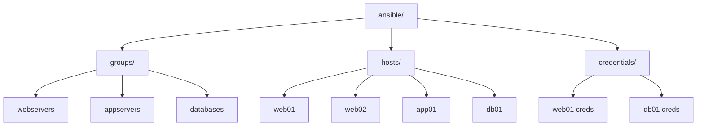

# How to Create Ansible Inventory from HashiCorp Vault

Author: [nawazdhandala](https://www.github.com/nawazdhandala)

Tags: Ansible, HashiCorp Vault, Secrets, Dynamic Inventory, Security

Description: Learn how to use HashiCorp Vault as a source for Ansible dynamic inventory, pulling host data and credentials securely from Vault.

---

HashiCorp Vault is primarily a secrets management tool, but it can also serve as a source of truth for your Ansible inventory. Storing host information in Vault centralizes your infrastructure data alongside credentials and provides audit logging for who accessed what. This post shows you how to build an Ansible inventory that pulls host data from Vault's KV secrets engine.

## Why Store Inventory Data in Vault

There are a few good reasons to keep inventory information in Vault:

- Host credentials (SSH keys, passwords) are already in Vault, so having the inventory there too keeps everything together
- Vault provides access controls and audit logging, so you know exactly who queried which hosts
- Teams that do not have direct access to infrastructure consoles can still manage inventory through Vault's API
- Vault supports versioning, so you can track inventory changes over time

## Setting Up Vault for Inventory

First, let us set up the KV secrets engine with a structure that maps well to Ansible inventory:

```bash
# Enable KV v2 secrets engine for inventory data
vault secrets enable -path=ansible kv-v2

# Store host information organized by group
vault kv put ansible/groups/webservers \
    hosts='["web01","web02","web03"]' \
    ansible_user="deploy" \
    http_port="80"

vault kv put ansible/groups/appservers \
    hosts='["app01","app02"]' \
    ansible_user="appuser" \
    app_port="8080"

vault kv put ansible/groups/databases \
    hosts='["db01"]' \
    ansible_user="dbadmin" \
    db_port="5432"

# Store per-host variables
vault kv put ansible/hosts/web01 \
    ansible_host="10.0.1.10" \
    ansible_port="22" \
    datacenter="us-east"

vault kv put ansible/hosts/web02 \
    ansible_host="10.0.1.11" \
    ansible_port="22" \
    datacenter="us-east"

vault kv put ansible/hosts/web03 \
    ansible_host="10.0.1.12" \
    ansible_port="2222" \
    datacenter="eu-west"

vault kv put ansible/hosts/app01 \
    ansible_host="10.0.2.20" \
    ansible_port="22" \
    datacenter="us-east"

vault kv put ansible/hosts/app02 \
    ansible_host="10.0.2.21" \
    ansible_port="22" \
    datacenter="eu-west"

vault kv put ansible/hosts/db01 \
    ansible_host="10.0.3.30" \
    ansible_port="5432" \
    datacenter="us-east"
```

## Dynamic Inventory Script

Here is a Python script that reads this Vault structure and builds an Ansible inventory:

```python
#!/usr/bin/env python3
# vault_inventory.py
# Dynamic inventory script that reads host data from HashiCorp Vault

import json
import sys
import os
import requests

# Vault connection settings from environment
VAULT_ADDR = os.environ.get('VAULT_ADDR', 'http://127.0.0.1:8200')
VAULT_TOKEN = os.environ.get('VAULT_TOKEN', '')
VAULT_NAMESPACE = os.environ.get('VAULT_NAMESPACE', '')
INVENTORY_PATH = os.environ.get('VAULT_INVENTORY_PATH', 'ansible')

def vault_request(path, method='GET'):
    """Make an authenticated request to the Vault API."""
    headers = {'X-Vault-Token': VAULT_TOKEN}
    if VAULT_NAMESPACE:
        headers['X-Vault-Namespace'] = VAULT_NAMESPACE

    url = f'{VAULT_ADDR}/v1/{path}'
    response = requests.request(method, url, headers=headers)
    response.raise_for_status()
    return response.json()

def vault_kv_get(path):
    """Read a secret from the KV v2 engine."""
    result = vault_request(f'{INVENTORY_PATH}/data/{path}')
    return result.get('data', {}).get('data', {})

def vault_kv_list(path):
    """List keys under a path in the KV v2 engine."""
    try:
        result = vault_request(f'{INVENTORY_PATH}/metadata/{path}?list=true')
        return result.get('data', {}).get('keys', [])
    except requests.exceptions.HTTPError:
        return []

def build_inventory():
    """Build Ansible inventory from Vault KV data."""
    inventory = {}
    hostvars = {}

    # Read all groups
    group_names = vault_kv_list('groups')
    for group_name in group_names:
        # Strip trailing slash if present
        group_name = group_name.rstrip('/')
        group_data = vault_kv_get(f'groups/{group_name}')

        # Extract hosts list (stored as JSON string)
        hosts_raw = group_data.pop('hosts', '[]')
        if isinstance(hosts_raw, str):
            hosts = json.loads(hosts_raw)
        else:
            hosts = hosts_raw

        # Remaining keys become group variables
        inventory[group_name] = {
            'hosts': hosts,
            'vars': group_data,
        }

    # Read per-host variables
    host_names = vault_kv_list('hosts')
    for host_name in host_names:
        host_name = host_name.rstrip('/')
        host_data = vault_kv_get(f'hosts/{host_name}')
        hostvars[host_name] = host_data

    inventory['_meta'] = {'hostvars': hostvars}
    return inventory

def get_host(hostname):
    """Return variables for a single host."""
    try:
        return vault_kv_get(f'hosts/{hostname}')
    except requests.exceptions.HTTPError:
        return {}

if __name__ == '__main__':
    if len(sys.argv) > 1 and sys.argv[1] == '--host':
        print(json.dumps(get_host(sys.argv[2]), indent=2))
    else:
        print(json.dumps(build_inventory(), indent=2))
```

## Using the Script

```bash
# Set Vault connection details
export VAULT_ADDR="https://vault.example.com:8200"
export VAULT_TOKEN="s.your-vault-token"

# Make executable and test
chmod +x vault_inventory.py
./vault_inventory.py --list | python3 -m json.tool

# Use with Ansible
ansible -i vault_inventory.py webservers -m ping

# Run a playbook
ansible-playbook -i vault_inventory.py site.yml
```

## Pulling Credentials from Vault Too

The real power comes from combining inventory data with Vault-managed credentials. Your inventory script can also pull SSH keys or passwords:

```python
def get_host_with_credentials(hostname):
    """Get host vars including credentials from Vault."""
    host_data = vault_kv_get(f'hosts/{hostname}')

    # Also pull SSH credentials for this host
    try:
        creds = vault_kv_get(f'credentials/{hostname}')
        if 'ssh_private_key' in creds:
            # Write the key to a temp file (Ansible needs a file path)
            key_path = f'/tmp/ansible_key_{hostname}'
            with open(key_path, 'w') as f:
                f.write(creds['ssh_private_key'])
            os.chmod(key_path, 0o600)
            host_data['ansible_ssh_private_key_file'] = key_path
        if 'ansible_password' in creds:
            host_data['ansible_password'] = creds['ansible_password']
    except requests.exceptions.HTTPError:
        pass

    return host_data
```

Store the credentials in Vault:

```bash
# Store SSH credentials per host
vault kv put ansible/credentials/web01 \
    ansible_password="secure-password-here" \
    ssh_private_key=@/path/to/web01_key.pem

vault kv put ansible/credentials/db01 \
    ansible_password="db-admin-pass"
```

## Using Vault AppRole for Authentication

In production, you should not use a static root token. Use AppRole authentication instead:

```python
def vault_approle_login(role_id, secret_id):
    """Authenticate with Vault using AppRole and return a token."""
    url = f'{VAULT_ADDR}/v1/auth/approle/login'
    payload = {
        'role_id': role_id,
        'secret_id': secret_id,
    }
    response = requests.post(url, json=payload)
    response.raise_for_status()
    return response.json()['auth']['client_token']

# Use environment variables for AppRole credentials
VAULT_ROLE_ID = os.environ.get('VAULT_ROLE_ID', '')
VAULT_SECRET_ID = os.environ.get('VAULT_SECRET_ID', '')

if VAULT_ROLE_ID and VAULT_SECRET_ID and not VAULT_TOKEN:
    VAULT_TOKEN = vault_approle_login(VAULT_ROLE_ID, VAULT_SECRET_ID)
```

Set up the AppRole in Vault:

```bash
# Enable AppRole auth method
vault auth enable approle

# Create a policy for the inventory script
vault policy write ansible-inventory - <<EOF
path "ansible/data/*" {
  capabilities = ["read", "list"]
}
path "ansible/metadata/*" {
  capabilities = ["list"]
}
path "ansible/credentials/*" {
  capabilities = ["read"]
}
EOF

# Create an AppRole with the inventory policy
vault write auth/approle/role/ansible-inventory \
    policies="ansible-inventory" \
    token_ttl=1h \
    token_max_ttl=4h

# Get the role ID and generate a secret ID
vault read auth/approle/role/ansible-inventory/role-id
vault write -f auth/approle/role/ansible-inventory/secret-id
```

## Vault Structure Diagram

Here is how the data is organized in Vault:



## Caching Vault Responses

Querying Vault for every Ansible run adds latency. Add a simple file-based cache:

```python
import time
import hashlib

CACHE_DIR = os.environ.get('VAULT_CACHE_DIR', '/tmp/vault_inventory_cache')
CACHE_TTL = int(os.environ.get('VAULT_CACHE_TTL', '300'))  # 5 minutes

def cached_vault_get(path):
    """Read from Vault with local file caching."""
    cache_key = hashlib.md5(path.encode()).hexdigest()
    cache_file = os.path.join(CACHE_DIR, cache_key)

    # Check cache freshness
    if os.path.exists(cache_file):
        age = time.time() - os.path.getmtime(cache_file)
        if age < CACHE_TTL:
            with open(cache_file, 'r') as f:
                return json.load(f)

    # Cache miss or expired, fetch from Vault
    data = vault_kv_get(path)

    # Write to cache
    os.makedirs(CACHE_DIR, exist_ok=True)
    with open(cache_file, 'w') as f:
        json.dump(data, f)

    return data
```

## Managing Inventory Through Vault UI or CLI

One benefit of this approach is that non-technical team members can update inventory through the Vault UI. Adding a new server is as simple as:

```bash
# Add a new host to the webservers group
vault kv get -format=json ansible/groups/webservers | \
    jq '.data.data.hosts | fromjson | . + ["web04"] | tojson' | \
    xargs -I {} vault kv patch ansible/groups/webservers hosts='{}'

# Set the new host's variables
vault kv put ansible/hosts/web04 \
    ansible_host="10.0.1.13" \
    ansible_port="22" \
    datacenter="us-east"
```

Using Vault for Ansible inventory works best when you already have Vault deployed and want to centralize infrastructure metadata alongside secrets. The audit trail alone is worth it for compliance-heavy environments. Start with the basic KV structure, add AppRole authentication for production use, and layer on caching to keep things fast.
