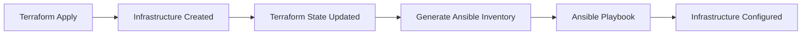

# How to Create Ansible Inventory from Terraform State

Author: [nawazdhandala](https://www.github.com/nawazdhandala)

Tags: Ansible, Terraform, Dynamic Inventory, IaC, DevOps

Description: Learn how to build Ansible dynamic inventory from Terraform state files to seamlessly configure infrastructure that Terraform provisions.

---

Terraform provisions infrastructure. Ansible configures it. The handoff between these two tools happens through inventory: Terraform knows what it created (IP addresses, instance IDs, DNS names), and Ansible needs that information to connect and configure. This post shows multiple ways to generate Ansible inventory from Terraform state.

## The Terraform-Ansible Workflow

The typical flow looks like this:



Terraform state contains everything Ansible needs: IP addresses, DNS names, security group details, and instance metadata. The question is how to extract it.

## Method 1: Terraform Output to Inventory Script

The cleanest approach uses Terraform outputs and a script to convert them:

First, define outputs in your Terraform configuration:

```hcl
# terraform/outputs.tf
# Output the web server IPs for Ansible
output "web_server_ips" {
  value = aws_instance.web[*].private_ip
  description = "Private IPs of web servers"
}

output "web_server_ids" {
  value = aws_instance.web[*].id
  description = "Instance IDs of web servers"
}

output "app_server_ips" {
  value = aws_instance.app[*].private_ip
  description = "Private IPs of app servers"
}

output "db_endpoint" {
  value = aws_db_instance.main.endpoint
  description = "RDS endpoint"
}

output "bastion_ip" {
  value = aws_instance.bastion.public_ip
  description = "Bastion host public IP"
}
```

Now write a dynamic inventory script that reads these outputs:

```python
#!/usr/bin/env python3
# terraform_inventory.py
# Dynamic inventory from Terraform outputs

import json
import subprocess
import sys
import os

TERRAFORM_DIR = os.environ.get('TERRAFORM_DIR', './terraform')

def get_terraform_output():
    """Run terraform output and return parsed JSON."""
    result = subprocess.run(
        ['terraform', 'output', '-json'],
        cwd=TERRAFORM_DIR,
        capture_output=True,
        text=True,
    )
    if result.returncode != 0:
        print(f"Error running terraform output: {result.stderr}", file=sys.stderr)
        sys.exit(1)
    return json.loads(result.stdout)

def build_inventory():
    """Build Ansible inventory from Terraform outputs."""
    tf_output = get_terraform_output()

    inventory = {}
    hostvars = {}

    # Web servers
    web_ips = tf_output.get('web_server_ips', {}).get('value', [])
    web_ids = tf_output.get('web_server_ids', {}).get('value', [])
    web_hosts = []
    for idx, ip in enumerate(web_ips):
        hostname = f"web-{idx:02d}"
        web_hosts.append(hostname)
        hostvars[hostname] = {
            'ansible_host': ip,
            'ansible_user': 'ec2-user',
            'instance_id': web_ids[idx] if idx < len(web_ids) else '',
        }
    inventory['webservers'] = {'hosts': web_hosts, 'vars': {}}

    # App servers
    app_ips = tf_output.get('app_server_ips', {}).get('value', [])
    app_hosts = []
    for idx, ip in enumerate(app_ips):
        hostname = f"app-{idx:02d}"
        app_hosts.append(hostname)
        hostvars[hostname] = {
            'ansible_host': ip,
            'ansible_user': 'ec2-user',
        }
    inventory['appservers'] = {'hosts': app_hosts, 'vars': {}}

    # Database (RDS endpoint, not SSH-managed, but useful as a variable)
    db_endpoint = tf_output.get('db_endpoint', {}).get('value', '')
    inventory['appservers']['vars']['db_endpoint'] = db_endpoint

    # Bastion
    bastion_ip = tf_output.get('bastion_ip', {}).get('value', '')
    if bastion_ip:
        inventory['bastion'] = {
            'hosts': ['bastion'],
            'vars': {},
        }
        hostvars['bastion'] = {
            'ansible_host': bastion_ip,
            'ansible_user': 'ec2-user',
        }
        # Set proxy jump for internal servers
        for host in web_hosts + app_hosts:
            hostvars[host]['ansible_ssh_common_args'] = (
                f'-o ProxyJump=ec2-user@{bastion_ip}'
            )

    inventory['_meta'] = {'hostvars': hostvars}
    return inventory

if __name__ == '__main__':
    if '--host' in sys.argv:
        print(json.dumps({}))
    else:
        print(json.dumps(build_inventory(), indent=2))
```

Usage:

```bash
# Set the Terraform directory
export TERRAFORM_DIR=/path/to/terraform/project

# Test the inventory
chmod +x terraform_inventory.py
./terraform_inventory.py --list | python3 -m json.tool

# Use with Ansible
ansible-playbook -i terraform_inventory.py configure.yml
```

## Method 2: Parsing Terraform State Directly

Instead of relying on Terraform outputs, you can parse the state file directly. This gives you access to all resource attributes:

```python
#!/usr/bin/env python3
# terraform_state_inventory.py
# Build inventory from Terraform state file

import json
import sys
import os
from collections import defaultdict

STATE_FILE = os.environ.get('TF_STATE_FILE', 'terraform.tfstate')

def load_state():
    """Load and parse the Terraform state file."""
    with open(STATE_FILE, 'r') as f:
        return json.load(f)

def extract_instances(state):
    """Extract EC2 instances from Terraform state."""
    instances = []

    for resource in state.get('resources', []):
        if resource['type'] == 'aws_instance':
            for instance in resource.get('instances', []):
                attrs = instance.get('attributes', {})
                instances.append({
                    'name': resource['name'],
                    'index': instance.get('index_key', 0),
                    'private_ip': attrs.get('private_ip', ''),
                    'public_ip': attrs.get('public_ip', ''),
                    'instance_id': attrs.get('id', ''),
                    'instance_type': attrs.get('instance_type', ''),
                    'tags': attrs.get('tags', {}),
                    'subnet_id': attrs.get('subnet_id', ''),
                    'availability_zone': attrs.get('availability_zone', ''),
                })

    return instances

def build_inventory():
    """Build Ansible inventory from Terraform state."""
    state = load_state()
    instances = extract_instances(state)

    groups = defaultdict(lambda: {'hosts': [], 'vars': {}})
    hostvars = {}

    for inst in instances:
        tags = inst['tags']
        # Use Name tag as hostname, or construct from resource name + index
        hostname = tags.get('Name', f"{inst['name']}-{inst['index']}")
        role = tags.get('Role', inst['name'])
        environment = tags.get('Environment', 'unknown')

        # Add to role group
        groups[role]['hosts'].append(hostname)
        # Add to environment group
        groups[f"env_{environment}"]['hosts'].append(hostname)
        # Add to AZ group
        az = inst['availability_zone']
        groups[f"az_{az}"]['hosts'].append(hostname)

        hostvars[hostname] = {
            'ansible_host': inst['private_ip'] or inst['public_ip'],
            'ansible_user': 'ec2-user',
            'instance_id': inst['instance_id'],
            'instance_type': inst['instance_type'],
            'availability_zone': az,
            'subnet_id': inst['subnet_id'],
            'terraform_resource': inst['name'],
        }

    inventory = dict(groups)
    inventory['_meta'] = {'hostvars': hostvars}
    return inventory

if __name__ == '__main__':
    if '--host' in sys.argv:
        print(json.dumps({}))
    else:
        print(json.dumps(build_inventory(), indent=2))
```

## Method 3: Using terraform-inventory Tool

The `terraform-inventory` open source tool converts Terraform state to Ansible inventory format automatically:

```bash
# Install terraform-inventory (Go binary)
# Download from https://github.com/adammck/terraform-inventory/releases

# Use it directly with Ansible
TF_STATE=terraform.tfstate ansible-playbook -i /usr/local/bin/terraform-inventory site.yml

# Or test the output
TF_STATE=terraform.tfstate terraform-inventory --list | python3 -m json.tool
```

## Method 4: Terraform Generates Static Inventory

Use Terraform's `local_file` resource to generate an Ansible inventory file directly:

```hcl
# terraform/ansible_inventory.tf
# Generate an Ansible inventory file from Terraform resources

resource "local_file" "ansible_inventory" {
  content = templatefile("${path.module}/templates/inventory.yml.tftpl", {
    web_servers = aws_instance.web[*]
    app_servers = aws_instance.app[*]
    bastion     = aws_instance.bastion
    db_endpoint = aws_db_instance.main.endpoint
  })
  filename = "${path.module}/../inventory/terraform_hosts.yml"
}
```

Create the template:

```yaml
# terraform/templates/inventory.yml.tftpl
# Auto-generated by Terraform - DO NOT EDIT
all:
  children:
    bastion:
      hosts:
        bastion:
          ansible_host: "${bastion.public_ip}"
          ansible_user: ec2-user
    webservers:
      hosts:
%{ for idx, server in web_servers ~}
        web-${format("%02d", idx)}:
          ansible_host: "${server.private_ip}"
          ansible_user: ec2-user
          instance_id: "${server.id}"
          ansible_ssh_common_args: "-o ProxyJump=ec2-user@${bastion.public_ip}"
%{ endfor ~}
    appservers:
      hosts:
%{ for idx, server in app_servers ~}
        app-${format("%02d", idx)}:
          ansible_host: "${server.private_ip}"
          ansible_user: ec2-user
          instance_id: "${server.id}"
          ansible_ssh_common_args: "-o ProxyJump=ec2-user@${bastion.public_ip}"
%{ endfor ~}
      vars:
        db_endpoint: "${db_endpoint}"
```

After `terraform apply`, the inventory file is ready:

```bash
# Terraform generates the inventory file during apply
terraform apply

# Use the generated inventory with Ansible
ansible-playbook -i inventory/terraform_hosts.yml configure.yml
```

## Method 5: Remote State with S3

When Terraform state is stored in S3 (or another remote backend), your inventory script needs to fetch it:

```python
#!/usr/bin/env python3
# s3_terraform_inventory.py
# Read Terraform state from S3 and build inventory

import json
import sys
import os
import boto3
from collections import defaultdict

S3_BUCKET = os.environ.get('TF_STATE_BUCKET', 'my-terraform-state')
S3_KEY = os.environ.get('TF_STATE_KEY', 'production/terraform.tfstate')
AWS_REGION = os.environ.get('AWS_REGION', 'us-east-1')

def load_remote_state():
    """Load Terraform state from S3."""
    s3 = boto3.client('s3', region_name=AWS_REGION)
    response = s3.get_object(Bucket=S3_BUCKET, Key=S3_KEY)
    return json.loads(response['Body'].read().decode('utf-8'))

def build_inventory():
    state = load_remote_state()
    # ... same extraction logic as Method 2 ...
    groups = defaultdict(lambda: {'hosts': [], 'vars': {}})
    hostvars = {}

    for resource in state.get('resources', []):
        if resource['type'] == 'aws_instance':
            for instance in resource.get('instances', []):
                attrs = instance.get('attributes', {})
                tags = attrs.get('tags', {})
                hostname = tags.get('Name', f"{resource['name']}-{instance.get('index_key', 0)}")
                role = tags.get('Role', resource['name'])

                groups[role]['hosts'].append(hostname)
                hostvars[hostname] = {
                    'ansible_host': attrs.get('private_ip', ''),
                    'ansible_user': 'ec2-user',
                    'instance_id': attrs.get('id', ''),
                }

    inventory = dict(groups)
    inventory['_meta'] = {'hostvars': hostvars}
    return inventory

if __name__ == '__main__':
    print(json.dumps(build_inventory(), indent=2))
```

## Complete Deployment Script

Here is a wrapper script that runs Terraform and Ansible together:

```bash
#!/bin/bash
# deploy.sh
# Full deployment: provision with Terraform, configure with Ansible

set -e

TERRAFORM_DIR="terraform"
INVENTORY_SCRIPT="scripts/terraform_inventory.py"
PLAYBOOK="playbooks/site.yml"

echo "Step 1: Running Terraform..."
cd "$TERRAFORM_DIR"
terraform init -input=false
terraform apply -auto-approve
cd ..

echo "Step 2: Waiting for instances to be reachable..."
sleep 30

echo "Step 3: Running Ansible..."
export TERRAFORM_DIR
ansible-playbook -i "$INVENTORY_SCRIPT" "$PLAYBOOK"

echo "Deployment complete."
```

The Terraform-to-Ansible inventory bridge is essential for any team using both tools. The output-based approach (Method 1) is the most maintainable because it decouples the inventory script from Terraform's internal state structure. The generated file approach (Method 4) is simplest if you want zero runtime dependencies. Choose the method that fits your workflow and state backend setup.
