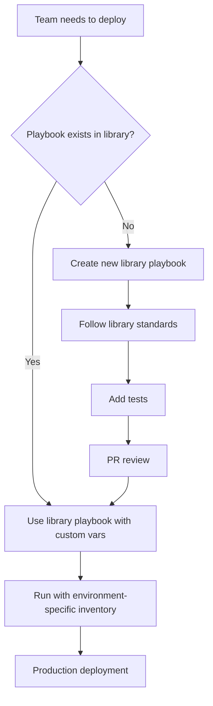

# How to Create Ansible Playbook Libraries

Author: [nawazdhandala](https://www.github.com/nawazdhandala)

Tags: Ansible, Playbook Libraries, Code Reuse, Automation

Description: Build a library of reusable Ansible playbooks that your team can combine and customize for common infrastructure operations and deployments.

---

A playbook library is a collection of well-tested, parameterized playbooks that handle common infrastructure operations. Instead of writing a new playbook every time you need to deploy an application or patch servers, you pull from the library and customize with variables. It is the Ansible equivalent of a standard library in programming.

## Library Structure

Organize your playbook library by operation type:

```
playbook-library/
├── provisioning/
│   ├── provision-server.yml
│   ├── provision-database.yml
│   └── provision-loadbalancer.yml
├── deployment/
│   ├── deploy-application.yml
│   ├── deploy-static-site.yml
│   ├── deploy-docker-app.yml
│   └── rolling-update.yml
├── maintenance/
│   ├── patch-servers.yml
│   ├── rotate-logs.yml
│   ├── rotate-certificates.yml
│   └── cleanup-disk.yml
├── operations/
│   ├── database-backup.yml
│   ├── database-restore.yml
│   ├── database-failover.yml
│   └── scale-fleet.yml
├── diagnostics/
│   ├── health-check.yml
│   ├── collect-logs.yml
│   ├── network-test.yml
│   └── performance-audit.yml
├── security/
│   ├── security-audit.yml
│   ├── rotate-secrets.yml
│   ├── disable-user.yml
│   └── emergency-lockdown.yml
└── README.md
```

## A Well-Designed Library Playbook

Each library playbook should be self-contained with documentation, validation, and sensible defaults:

```yaml
# deployment/deploy-application.yml
#
# Generic application deployment playbook.
#
# Usage:
#   ansible-playbook deployment/deploy-application.yml \
#     -i inventories/production/hosts.yml \
#     -e "app_name=myapi app_version=v2.1.0"
#
# Required variables:
#   app_name       - Name of the application
#   app_version    - Version/tag to deploy
#
# Optional variables:
#   app_repo       - Git repository URL (default: from inventory)
#   deploy_serial  - Number/percentage of hosts per batch (default: 25%)
#   skip_backup    - Skip pre-deploy backup (default: false)
#   skip_verify    - Skip post-deploy verification (default: false)

- name: Deploy application
  hosts: "{{ target_hosts | default(app_name + '_servers') }}"
  become: yes
  serial: "{{ deploy_serial | default('25%') }}"
  max_fail_percentage: "{{ max_fail_pct | default(10) }}"

  pre_tasks:
    - name: Validate required variables
      ansible.builtin.assert:
        that:
          - app_name is defined and app_name | length > 0
          - app_version is defined and app_version | length > 0
        fail_msg: "app_name and app_version are required"
      tags: [always]

    - name: Create pre-deployment backup
      ansible.builtin.include_tasks: ../shared/tasks/backup-app.yml
      when: not (skip_backup | default(false) | bool)

    - name: Remove from load balancer
      ansible.builtin.include_tasks: ../shared/tasks/lb-drain.yml
      when: lb_enabled | default(true) | bool

  tasks:
    - name: Stop application service
      ansible.builtin.service:
        name: "{{ app_name }}"
        state: stopped

    - name: Deploy application code
      ansible.builtin.git:
        repo: "{{ app_repo }}"
        dest: "/opt/{{ app_name }}"
        version: "{{ app_version }}"
      become_user: "{{ app_user | default('deploy') }}"

    - name: Install dependencies
      ansible.builtin.pip:
        requirements: "/opt/{{ app_name }}/requirements.txt"
        virtualenv: "/opt/{{ app_name }}/venv"
      become_user: "{{ app_user | default('deploy') }}"
      when: app_type | default('python') == 'python'

    - name: Run database migrations
      ansible.builtin.command:
        cmd: "/opt/{{ app_name }}/venv/bin/python manage.py migrate --noinput"
        chdir: "/opt/{{ app_name }}"
      become_user: "{{ app_user | default('deploy') }}"
      run_once: true
      when: run_migrations | default(true) | bool
      register: migration_result
      changed_when: "'No migrations to apply' not in migration_result.stdout"

    - name: Start application service
      ansible.builtin.service:
        name: "{{ app_name }}"
        state: started

  post_tasks:
    - name: Verify application health
      ansible.builtin.include_tasks: ../shared/tasks/health-check.yml
      when: not (skip_verify | default(false) | bool)

    - name: Re-add to load balancer
      ansible.builtin.include_tasks: ../shared/tasks/lb-enable.yml
      when: lb_enabled | default(true) | bool
```

## Shared Task Files

Create reusable task files that library playbooks reference:

```yaml
# shared/tasks/health-check.yml
# Reusable health check task
# Required: app_name, app_port (or health_check_url)

- name: Wait for application to respond
  ansible.builtin.uri:
    url: "{{ health_check_url | default('http://localhost:' + (app_port | default(8080) | string) + '/health') }}"
    method: GET
    status_code: 200
    timeout: 5
  register: health
  until: health.status == 200
  retries: "{{ health_check_retries | default(30) }}"
  delay: "{{ health_check_delay | default(5) }}"

- name: Log health check result
  ansible.builtin.debug:
    msg: "{{ app_name }} is healthy on {{ inventory_hostname }}"
```

```yaml
# shared/tasks/lb-drain.yml
# Remove server from load balancer and wait for connections to drain

- name: Disable server in load balancer
  ansible.builtin.command:
    cmd: >
      /opt/scripts/lb-control.sh disable
      --server {{ inventory_hostname }}
      --pool {{ lb_pool | default(app_name) }}
  delegate_to: "{{ lb_control_host | default('localhost') }}"
  changed_when: true

- name: Wait for connections to drain
  ansible.builtin.pause:
    seconds: "{{ lb_drain_seconds | default(30) }}"
```

```yaml
# shared/tasks/backup-app.yml
# Back up application before deployment

- name: Create backup of current deployment
  ansible.builtin.archive:
    path: "/opt/{{ app_name }}"
    dest: "/opt/backups/{{ app_name }}-{{ ansible_date_time.iso8601_basic_short }}.tar.gz"
    format: gz

- name: Retain only last 5 backups
  ansible.builtin.shell: |
    ls -t /opt/backups/{{ app_name }}-*.tar.gz | tail -n +6 | xargs -r rm
  changed_when: false
```

## Diagnostic Playbooks

```yaml
# diagnostics/health-check.yml
# Fleet-wide health check with detailed reporting
- name: Fleet health diagnostic
  hosts: "{{ target_hosts | default('all') }}"
  become: yes
  gather_facts: yes
  strategy: free

  tasks:
    - name: Check disk space
      ansible.builtin.shell: df -h / | tail -1 | awk '{print $5}' | tr -d '%'
      register: disk_pct
      changed_when: false

    - name: Flag disk space warning
      ansible.builtin.set_fact:
        disk_warning: "{{ disk_pct.stdout | int > 80 }}"

    - name: Check memory usage
      ansible.builtin.shell: free -m | awk 'NR==2{printf "%d", $3/$2*100}'
      register: mem_pct
      changed_when: false

    - name: Check system load
      ansible.builtin.shell: cat /proc/loadavg | awk '{print $1}'
      register: load_avg
      changed_when: false

    - name: Check critical services
      ansible.builtin.service_facts:

    - name: Report health status
      ansible.builtin.debug:
        msg: |
          {{ inventory_hostname }}:
            Disk: {{ disk_pct.stdout }}% {{ '(WARNING)' if disk_warning else '(OK)' }}
            Memory: {{ mem_pct.stdout }}%
            Load: {{ load_avg.stdout }}
            CPU Cores: {{ ansible_processor_vcpus }}
```

## Library Usage Pattern



## Library Index

Maintain an index file so teams can discover available playbooks:

```yaml
# library-index.yml
# Index of all available library playbooks

playbooks:
  - name: deploy-application
    path: deployment/deploy-application.yml
    description: "Deploy a Python/Node application with rolling update"
    required_vars: [app_name, app_version]
    optional_vars: [deploy_serial, skip_backup, skip_verify]
    example: |
      ansible-playbook deployment/deploy-application.yml \
        -e "app_name=myapi app_version=v2.1.0"

  - name: patch-servers
    path: maintenance/patch-servers.yml
    description: "Rolling OS patching with reboot handling"
    required_vars: []
    optional_vars: [patch_group, batch_size]
    example: |
      ansible-playbook maintenance/patch-servers.yml \
        -e "patch_group=webservers batch_size=10%"

  - name: database-backup
    path: operations/database-backup.yml
    description: "Full database backup with S3 upload"
    required_vars: [db_name]
    optional_vars: [upload_to_s3, retention_days]
```

## Summary

A playbook library standardizes common operations across your team. Each playbook is self-documenting with usage instructions, required variables, and sensible defaults. Shared task files handle cross-cutting concerns like health checks and load balancer management. Maintain a library index so teams can discover what is available. Follow consistent patterns for validation, backup, execution, and verification. The library grows organically as teams contribute new playbooks, and the entire organization benefits from battle-tested automation.
