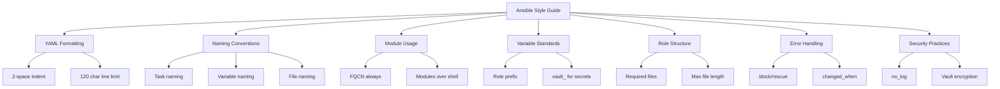

# How to Create Ansible Style Guides for Teams

Author: [nawazdhandala](https://www.github.com/nawazdhandala)

Tags: Ansible, Style Guide, Team Standards, Code Quality

Description: Create a comprehensive Ansible style guide for your team covering formatting, naming, structure, and patterns to ensure consistent automation code.

---

When five engineers write Ansible code without a style guide, you get five different approaches to the same problems. One person uses `shell` for everything, another creates deeply nested roles, and a third puts all variables in playbooks. A style guide eliminates these inconsistencies and makes your Ansible codebase feel like it was written by one person, which is exactly what you want when someone is debugging a production issue at 2 AM.

## Start with a Living Document

Your style guide should live in the repository and evolve with your practices:

```
ansible-project/
├── docs/
│   └── STYLE_GUIDE.md
├── .ansible-lint
├── .yamllint.yml
└── ...
```

## YAML Formatting Rules

Define consistent YAML formatting:

```yaml
# .yamllint.yml
# Enforce consistent YAML formatting
extends: default

rules:
  line-length:
    max: 120
    level: warning
  indentation:
    spaces: 2
    indent-sequences: true
  truthy:
    allowed-values: ['true', 'false', 'yes', 'no']
  comments:
    min-spaces-from-content: 1
  braces:
    max-spaces-inside: 1
  brackets:
    max-spaces-inside: 1
```

Enforce formatting in your style guide:

```yaml
# GOOD: 2-space indentation, consistent quoting
- name: Deploy application configuration
  ansible.builtin.template:
    src: app.conf.j2
    dest: /etc/myapp/app.conf
    owner: myapp
    group: myapp
    mode: '0640'
  notify: restart myapp

# BAD: Mixed indentation, inconsistent quoting
- name: Deploy application configuration
  ansible.builtin.template:
      src: app.conf.j2
      dest: "/etc/myapp/app.conf"
      owner: myapp
      group: myapp
      mode: 0640
  notify: restart myapp
```

## Module Usage Rules

Define which modules to use for common operations:

```yaml
# Rule: Always use FQCN for all modules
# GOOD
- name: Install package
  ansible.builtin.apt:
    name: nginx
    state: present

# BAD
- name: Install package
  apt:
    name: nginx
    state: present
```

```yaml
# Rule: Never use shell/command when a module exists
# GOOD
- name: Create user
  ansible.builtin.user:
    name: deploy
    groups: www-data
    shell: /bin/bash

# BAD
- name: Create user
  ansible.builtin.shell: useradd -m -s /bin/bash -G www-data deploy
```

```yaml
# Rule: Use ansible.builtin.file for filesystem operations
# GOOD
- name: Set permissions on config directory
  ansible.builtin.file:
    path: /etc/myapp
    state: directory
    owner: myapp
    group: myapp
    mode: '0750'
    recurse: yes

# BAD
- name: Set permissions
  ansible.builtin.command: chmod -R 750 /etc/myapp && chown -R myapp:myapp /etc/myapp
```

## Task Naming Standards

```yaml
# Rule: Every task MUST have a name
# Rule: Names describe desired state in sentence case
# Rule: Start names with "Ensure", "Deploy", "Configure", "Create", "Remove"

# GOOD
- name: Ensure nginx is installed
  ansible.builtin.apt:
    name: nginx
    state: present

- name: Deploy application configuration
  ansible.builtin.template:
    src: app.conf.j2
    dest: /etc/app/app.conf

- name: Configure firewall to allow HTTP traffic
  community.general.ufw:
    rule: allow
    port: '80'

# BAD
- name: nginx        # Too vague
- name: install stuff # Vague, does not describe state
- name: INSTALL NGINX # Wrong casing
```

## Variable Standards

```yaml
# Rule: Prefix all role variables with the role name
# Rule: Use snake_case for all variable names
# Rule: Boolean variables use _enabled suffix
# Rule: List variables use plural names
# Rule: Secret references use vault_ prefix

# GOOD
nginx_worker_processes: auto
nginx_ssl_enabled: true
nginx_vhosts:
  - name: app
    port: 8080
nginx_ssl_certificate: "{{ vault_nginx_ssl_certificate }}"

# BAD
workerProcesses: auto    # camelCase
ssl: true                # Not prefixed, ambiguous
vhost:                   # Singular for a list
  - name: app
certificate: "secret"    # Hardcoded secret
```

## Role Structure Standards

```yaml
# Rule: Every role must have these files at minimum:
# - tasks/main.yml
# - defaults/main.yml
# - handlers/main.yml (if handlers are needed)
# - meta/main.yml
# - README.md

# Rule: Task files over 50 lines must be split into includes
# roles/nginx/tasks/main.yml
- name: Include installation tasks
  ansible.builtin.include_tasks: install.yml
  tags: [nginx, install]

- name: Include configuration tasks
  ansible.builtin.include_tasks: configure.yml
  tags: [nginx, configure]

- name: Include SSL tasks
  ansible.builtin.include_tasks: ssl.yml
  when: nginx_ssl_enabled
  tags: [nginx, ssl]
```

## Error Handling Standards

```yaml
# Rule: Critical operations must use block/rescue
- name: Deploy new application version
  block:
    - name: Pull new code
      ansible.builtin.git:
        repo: "{{ app_repo }}"
        dest: "{{ app_dir }}"
        version: "{{ app_version }}"

    - name: Run migrations
      ansible.builtin.command:
        cmd: python manage.py migrate
        chdir: "{{ app_dir }}"
      changed_when: "'No migrations' not in migration_result.stdout"
      register: migration_result

    - name: Restart service
      ansible.builtin.service:
        name: "{{ app_service }}"
        state: restarted

  rescue:
    - name: Rollback to previous version
      ansible.builtin.git:
        repo: "{{ app_repo }}"
        dest: "{{ app_dir }}"
        version: "{{ app_previous_version }}"

    - name: Restart service with old version
      ansible.builtin.service:
        name: "{{ app_service }}"
        state: restarted

    - name: Notify about failed deployment
      ansible.builtin.debug:
        msg: "Deployment of {{ app_version }} failed, rolled back to {{ app_previous_version }}"
```

## Ansible-lint Configuration

Enforce style rules automatically:

```yaml
# .ansible-lint
# Automated style enforcement
profile: production

enable_list:
  - fqcn[action-core]
  - fqcn[action]
  - name[casing]
  - name[template]
  - no-changed-when
  - no-handler
  - role-name
  - var-naming[no-role-prefix]
  - yaml[truthy]

var_naming_pattern: "^[a-z_][a-z0-9_]*$"

warn_list:
  - experimental

skip_list: []

exclude_paths:
  - .github/
  - molecule/
```

## Style Guide Sections Overview



## Playbook Standards

```yaml
# Rule: Playbooks are thin wrappers
# Rule: Logic lives in roles, not playbooks
# Rule: Playbooks specify hosts, roles, and tags only

# GOOD
- name: Configure web servers
  hosts: webservers
  become: yes
  roles:
    - role: common
      tags: [common]
    - role: nginx
      tags: [nginx]

# BAD - logic in playbook
- name: Configure web servers
  hosts: webservers
  become: yes
  tasks:
    - name: Install nginx
      ansible.builtin.apt:
        name: nginx
    - name: Copy config
      ansible.builtin.template:
        src: templates/nginx.conf.j2
        dest: /etc/nginx/nginx.conf
    # 200 more lines of tasks...
```

## Onboarding New Team Members

Include a quick-start section in your style guide:

```bash
# Quick setup for new team members
git clone git@github.com:company/ansible-infra.git
cd ansible-infra
python -m venv venv
source venv/bin/activate
pip install -r requirements.txt
ansible-galaxy collection install -r requirements.yml

# Install pre-commit hooks
pip install pre-commit
pre-commit install

# Verify setup by running lint
ansible-lint playbooks/ roles/

# Run tests for a role
cd roles/common && molecule test
```

## Summary

A style guide for Ansible is not about personal preferences; it is about making your infrastructure code predictable and maintainable. Start with formatting rules enforced by yamllint and ansible-lint. Define naming conventions for tasks, variables, roles, and files. Require FQCNs and proper module usage. Set standards for error handling and security. Automate enforcement with pre-commit hooks and CI. Review and update the guide regularly as your team encounters new patterns. The best style guide is one that removes decisions so your team can focus on solving infrastructure problems.
