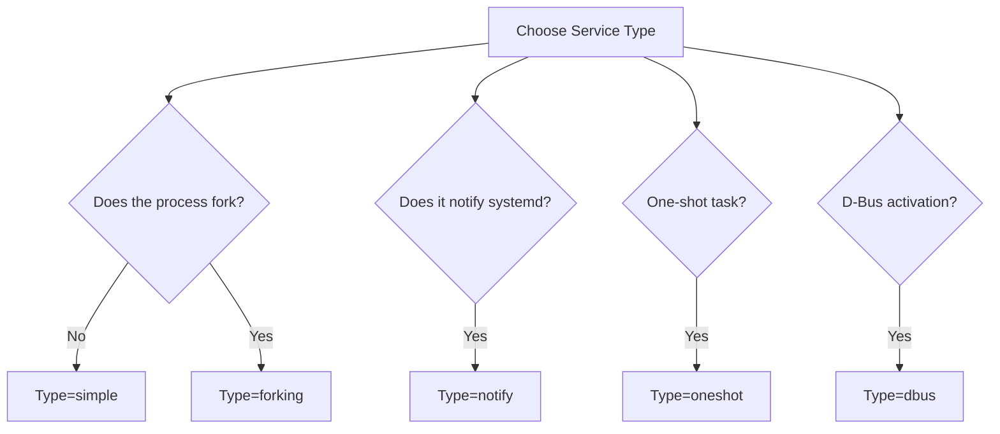

# How to Create Custom systemd Unit Files with Ansible

Author: [nawazdhandala](https://www.github.com/nawazdhandala)

Tags: Ansible, systemd, Linux, DevOps, Configuration Management

Description: Learn how to create, deploy, and manage custom systemd unit files using Ansible templates and the systemd module for reliable service management.

---

If you have ever had to deploy a custom application across dozens of servers and make sure it starts on boot, survives crashes, and logs properly, you know that writing systemd unit files by hand on each box is a pain. Ansible makes this process repeatable and version-controlled. In this guide, I will walk through creating custom systemd unit files with Ansible, covering everything from basic services to more advanced configurations like resource limits and dependency ordering.

## Why Custom systemd Unit Files?

Most packages you install through apt or yum come with their own unit files. But when you deploy your own applications, whether they are Go binaries, Python services, or Java JARs, you need to write your own. A systemd unit file tells the init system how to start your process, when to restart it, what user to run it as, and how it relates to other services.

Ansible lets you template these unit files so you can reuse them across different environments with different parameters.

## Basic Unit File Structure

Before jumping into Ansible, let's review what a systemd unit file looks like.

A minimal unit file for a custom application:

```ini
# /etc/systemd/system/myapp.service
[Unit]
Description=My Custom Application
After=network.target

[Service]
Type=simple
User=myapp
Group=myapp
WorkingDirectory=/opt/myapp
ExecStart=/opt/myapp/bin/myapp --config /etc/myapp/config.yaml
Restart=on-failure
RestartSec=5

[Install]
WantedBy=multi-user.target
```

The `[Unit]` section defines metadata and ordering. The `[Service]` section controls how the process runs. The `[Install]` section determines what happens when you enable the service.

## Creating the Ansible Role Structure

Let's set up a proper role for deploying our custom service.

Create the role directory structure:

```bash
# Standard Ansible role layout for our service deployment
mkdir -p roles/custom_service/{tasks,templates,handlers,defaults}
```

Define default variables that make the role reusable:

```yaml
# roles/custom_service/defaults/main.yml
---
service_name: myapp
service_user: myapp
service_group: myapp
service_description: "My Custom Application"
service_type: simple
service_working_dir: "/opt/{{ service_name }}"
service_exec_start: "/opt/{{ service_name }}/bin/{{ service_name }}"
service_exec_args: ""
service_restart_policy: on-failure
service_restart_sec: 5
service_environment: {}
service_after:
  - network.target
service_wants: []
service_required_by:
  - multi-user.target
service_limit_nofile: 65536
service_limit_nproc: 4096
```

## The Jinja2 Template

This is where the magic happens. A single template can produce different unit files for different services.

The systemd unit file template with conditional sections:

```jinja2
# roles/custom_service/templates/systemd.service.j2
# Managed by Ansible - do not edit manually
[Unit]
Description={{ service_description }}

After={{ dep }}


Wants={{ dep }}


[Service]
Type={{ service_type }}
User={{ service_user }}
Group={{ service_group }}
WorkingDirectory={{ service_working_dir }}
ExecStart={{ service_exec_start }} {{ service_exec_args }}
Restart={{ service_restart_policy }}
RestartSec={{ service_restart_sec }}

# Resource limits
LimitNOFILE={{ service_limit_nofile }}
LimitNPROC={{ service_limit_nproc }}


# Environment variables

Environment="{{ key }}={{ value }}"




ExecStartPre={{ service_exec_start_pre }}



ExecStartPost={{ service_exec_start_post }}



ExecStop={{ service_exec_stop }}



ExecReload={{ service_exec_reload }}


# Security hardening

PrivateTmp=true


ProtectSystem={{ service_protect_system | default('full') }}


NoNewPrivileges=true


[Install]

WantedBy={{ target }}

```

## The Task File

Now let's write the tasks that use this template.

The main task file handles user creation, directory setup, template deployment, and service management:

```yaml
# roles/custom_service/tasks/main.yml
---
- name: Create service group
  ansible.builtin.group:
    name: "{{ service_group }}"
    system: yes
    state: present

- name: Create service user
  ansible.builtin.user:
    name: "{{ service_user }}"
    group: "{{ service_group }}"
    system: yes
    shell: /usr/sbin/nologin
    home: "{{ service_working_dir }}"
    create_home: no

- name: Create working directory
  ansible.builtin.file:
    path: "{{ service_working_dir }}"
    state: directory
    owner: "{{ service_user }}"
    group: "{{ service_group }}"
    mode: '0755'

- name: Deploy systemd unit file
  ansible.builtin.template:
    src: systemd.service.j2
    dest: "/etc/systemd/system/{{ service_name }}.service"
    owner: root
    group: root
    mode: '0644'
  notify:
    - Reload systemd daemon
    - Restart service

- name: Enable and start the service
  ansible.builtin.systemd:
    name: "{{ service_name }}"
    enabled: yes
    state: started
    daemon_reload: yes
```

## Handlers

Handlers only run when notified, which prevents unnecessary restarts.

Handlers for daemon reload and service restart:

```yaml
# roles/custom_service/handlers/main.yml
---
- name: Reload systemd daemon
  ansible.builtin.systemd:
    daemon_reload: yes

- name: Restart service
  ansible.builtin.systemd:
    name: "{{ service_name }}"
    state: restarted
```

## Using the Role in a Playbook

Here is how you would use this role to deploy two different services on different hosts.

A playbook deploying a Go API and a Python worker using the same role:

```yaml
# deploy_services.yml
---
- name: Deploy API service
  hosts: api_servers
  become: yes
  roles:
    - role: custom_service
      vars:
        service_name: myapi
        service_description: "My REST API Service"
        service_exec_start: /opt/myapi/bin/myapi
        service_exec_args: "--port 8080 --config /etc/myapi/config.yaml"
        service_environment:
          GOMAXPROCS: "4"
          LOG_LEVEL: "info"
          DB_HOST: "db.internal.example.com"
        service_after:
          - network.target
          - postgresql.service
        service_wants:
          - postgresql.service

- name: Deploy worker service
  hosts: worker_servers
  become: yes
  roles:
    - role: custom_service
      vars:
        service_name: myworker
        service_description: "Background Job Worker"
        service_type: simple
        service_exec_start: /usr/bin/python3
        service_exec_args: "/opt/myworker/worker.py"
        service_environment:
          PYTHONUNBUFFERED: "1"
          REDIS_URL: "redis://cache.internal.example.com:6379"
        service_restart_sec: 10
        service_limit_nofile: 8192
```

## Validating the Unit File

It is a good idea to validate your unit file after deploying it. You can add a verification task.

Run systemd-analyze to check the unit file for errors:

```yaml
- name: Validate the unit file
  ansible.builtin.command:
    cmd: "systemd-analyze verify /etc/systemd/system/{{ service_name }}.service"
  register: verify_result
  changed_when: false
  failed_when: verify_result.rc != 0

- name: Show validation output
  ansible.builtin.debug:
    var: verify_result.stderr_lines
  when: verify_result.stderr_lines | length > 0
```

## Handling Different Service Types

systemd supports several service types. Here is when to use each one.



For forking services, you need to specify the PID file:

```yaml
# Variables for a forking service like Apache or Nginx built from source
service_type: forking
service_exec_start: /opt/myapp/bin/myapp --daemon
service_pid_file: /run/myapp/myapp.pid
```

Then update the template to include the PID file directive:

```jinja2

PIDFile={{ service_pid_file }}

```

## Deploying Multiple Instances

Sometimes you need multiple instances of the same service, like running several workers. systemd supports template units for this.

Template for an instanced unit file using the @ syntax:

```yaml
- name: Deploy template unit file
  ansible.builtin.template:
    src: systemd.service.j2
    dest: "/etc/systemd/system/{{ service_name }}@.service"
    owner: root
    group: root
    mode: '0644'
  notify: Reload systemd daemon

- name: Enable and start multiple instances
  ansible.builtin.systemd:
    name: "{{ service_name }}@{{ item }}"
    enabled: yes
    state: started
  loop: "{{ range(1, worker_count + 1) | list }}"
```

In your template, use `%i` to reference the instance identifier:

```jinja2
ExecStart={{ service_exec_start }} --instance %i
```

## Wrapping Up

Creating custom systemd unit files with Ansible gives you a clean, repeatable way to deploy services across your infrastructure. The key takeaways are:

- Use Jinja2 templates to make your unit files flexible and reusable across different services.
- Always reload the systemd daemon after deploying a new or modified unit file.
- Use handlers to avoid unnecessary service restarts.
- Add validation tasks to catch errors before they cause downtime.
- Consider security hardening options like `PrivateTmp`, `ProtectSystem`, and `NoNewPrivileges`.

Once you have this pattern in place, deploying a new service becomes as simple as adding a new set of variables to your playbook. No more SSH-ing into boxes and editing files by hand.
