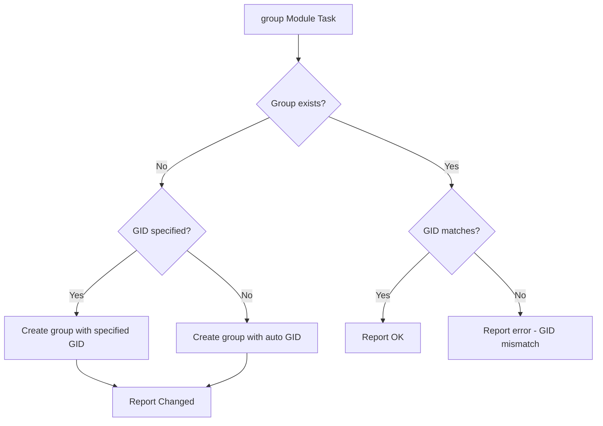

# How to Create Groups with the Ansible group Module

Author: [nawazdhandala](https://www.github.com/nawazdhandala)

Tags: Ansible, Group Management, Linux, System Administration

Description: Learn how to create and manage Linux groups using the Ansible group module with practical examples for system and regular groups.

---

Groups are the backbone of permission management on Linux. Every file and process has a group owner, and group membership determines who can access what. Managing groups manually across a fleet of servers is a recipe for inconsistency. The Ansible `group` module lets you define groups declaratively and ensure they exist everywhere they need to.

## The Basics of the group Module

The `group` module is part of `ansible.builtin`, so it is available out of the box. Here is the simplest possible example:

```yaml
# create-group-basic.yml - Create a basic group
- name: Create a group
  hosts: all
  become: yes
  tasks:
    - name: Create the developers group
      ansible.builtin.group:
        name: developers
        state: present
```

That is all you need. If the group already exists, Ansible reports "ok" and moves on. If it does not exist, Ansible creates it and reports "changed". The idempotent behavior means you can run this playbook as many times as you want without side effects.

## Creating a Group with a Specific GID

In production environments, you almost always want to specify the GID (Group ID) explicitly. This ensures consistency across servers, which is critical for shared filesystems:

```yaml
# create-group-gid.yml - Create group with specific GID
- name: Create group with specific GID
  hosts: all
  become: yes
  tasks:
    - name: Create developers group with GID 2000
      ansible.builtin.group:
        name: developers
        gid: 2000
        state: present
```

Without an explicit GID, the system assigns the next available number. On server A that might be 1001, on server B it might be 1005, and suddenly your NFS shares have permission problems.

## Creating System Groups

System groups use GIDs from the lower range (typically below 1000) and are meant for services and daemons:

```yaml
# create-system-group.yml - Create a system group
- name: Create system groups for services
  hosts: all
  become: yes
  tasks:
    - name: Create nginx system group
      ansible.builtin.group:
        name: nginx
        system: yes
        state: present

    - name: Create redis system group
      ansible.builtin.group:
        name: redis
        system: yes
        gid: 110
        state: present
```

When `system: yes` is set, the GID is allocated from the system range. The exact range depends on your distribution's configuration in `/etc/login.defs`.

## Creating Multiple Groups

Use a loop to create several groups at once:

```yaml
# create-multiple-groups.yml - Create several groups
- name: Create multiple groups
  hosts: all
  become: yes
  vars:
    groups_to_create:
      - name: developers
        gid: 2000
      - name: operations
        gid: 2001
      - name: security
        gid: 2002
      - name: data-engineering
        gid: 2003
  tasks:
    - name: Create all project groups
      ansible.builtin.group:
        name: "{{ item.name }}"
        gid: "{{ item.gid }}"
        state: present
      loop: "{{ groups_to_create }}"
```

## Group and User Creation Together

Groups must exist before you can assign users to them. Here is the typical pattern:

```yaml
# groups-and-users.yml - Create groups then assign users
- name: Set up groups and users
  hosts: all
  become: yes
  vars:
    project_groups:
      - name: backend
        gid: 3000
      - name: frontend
        gid: 3001
      - name: devops
        gid: 3002

    team_members:
      - name: alice
        groups: [backend, devops]
      - name: bob
        groups: [frontend]
      - name: carol
        groups: [backend, frontend, devops]

  tasks:
    # Groups first
    - name: Create project groups
      ansible.builtin.group:
        name: "{{ item.name }}"
        gid: "{{ item.gid }}"
        state: present
      loop: "{{ project_groups }}"

    # Then users
    - name: Create team members with group assignments
      ansible.builtin.user:
        name: "{{ item.name }}"
        groups: "{{ item.groups }}"
        append: yes
        state: present
      loop: "{{ team_members }}"
```

## Group Creation Workflow

Here is what happens when Ansible processes a group creation task:



## Creating Groups from Data Files

For larger organizations, store group definitions in a separate YAML file:

```yaml
# vars/groups.yml - Group definitions
company_groups:
  engineering:
    gid: 5000
    system: false
  operations:
    gid: 5001
    system: false
  security:
    gid: 5002
    system: false
  monitoring:
    gid: 5003
    system: true
  backup:
    gid: 5004
    system: true
```

Reference them in your playbook:

```yaml
# create-groups-from-file.yml - Create groups from data file
- name: Create groups from definition file
  hosts: all
  become: yes
  vars_files:
    - vars/groups.yml
  tasks:
    - name: Create all company groups
      ansible.builtin.group:
        name: "{{ item.key }}"
        gid: "{{ item.value.gid }}"
        system: "{{ item.value.system }}"
        state: present
      loop: "{{ company_groups | dict2items }}"
```

## Environment-Specific Groups

Different environments might need different groups:

```yaml
# env-groups.yml - Environment-specific groups
- name: Create environment-specific groups
  hosts: all
  become: yes
  vars:
    common_groups:
      - name: deployers
        gid: 4000
      - name: monitoring
        gid: 4001

    production_groups:
      - name: dba
        gid: 4100
      - name: oncall
        gid: 4101

    development_groups:
      - name: testers
        gid: 4200
      - name: interns
        gid: 4201

  tasks:
    - name: Create common groups
      ansible.builtin.group:
        name: "{{ item.name }}"
        gid: "{{ item.gid }}"
        state: present
      loop: "{{ common_groups }}"

    - name: Create production groups
      ansible.builtin.group:
        name: "{{ item.name }}"
        gid: "{{ item.gid }}"
        state: present
      loop: "{{ production_groups }}"
      when: env == 'production'

    - name: Create development groups
      ansible.builtin.group:
        name: "{{ item.name }}"
        gid: "{{ item.gid }}"
        state: present
      loop: "{{ development_groups }}"
      when: env == 'development'
```

## Verifying Group Creation

After creating groups, verify they were set up correctly:

```yaml
# verify-groups.yml - Verify group creation
- name: Verify groups were created correctly
  hosts: all
  become: yes
  tasks:
    - name: Get group info from /etc/group
      ansible.builtin.getent:
        database: group
        key: developers

    - name: Display group info
      ansible.builtin.debug:
        msg: "Group developers - GID: {{ getent_group['developers'][1] }}, Members: {{ getent_group['developers'][2] }}"

    - name: Verify GID consistency across hosts
      ansible.builtin.assert:
        that:
          - getent_group['developers'][1] == '2000'
        fail_msg: "GID mismatch on {{ inventory_hostname }}: expected 2000, got {{ getent_group['developers'][1] }}"
        success_msg: "GID is correct on {{ inventory_hostname }}"
```

## Handling GID Conflicts

Sometimes the GID you want is already taken by a different group. Here is how to handle that:

```yaml
# handle-gid-conflict.yml - Handle GID conflicts gracefully
- name: Create group with conflict handling
  hosts: all
  become: yes
  tasks:
    - name: Check if GID 2000 is already in use
      ansible.builtin.shell: "getent group 2000 || true"
      register: gid_check
      changed_when: false

    - name: Warn about GID conflict
      ansible.builtin.debug:
        msg: "WARNING: GID 2000 is already used by group '{{ gid_check.stdout.split(':')[0] }}'"
      when: gid_check.stdout | length > 0 and gid_check.stdout.split(':')[0] != 'developers'

    - name: Create group if GID is available
      ansible.builtin.group:
        name: developers
        gid: 2000
        state: present
      when: gid_check.stdout | length == 0 or gid_check.stdout.split(':')[0] == 'developers'
```

## Using Groups in Ansible Roles

When writing Ansible roles, define required groups in the role defaults and create them in the tasks:

```yaml
# roles/webapp/defaults/main.yml
webapp_group: webapp
webapp_gid: 3000
webapp_extra_groups:
  - name: ssl-cert
    gid: 3001
```

```yaml
# roles/webapp/tasks/main.yml
- name: Create webapp group
  ansible.builtin.group:
    name: "{{ webapp_group }}"
    gid: "{{ webapp_gid }}"
    state: present

- name: Create extra groups
  ansible.builtin.group:
    name: "{{ item.name }}"
    gid: "{{ item.gid }}"
    state: present
  loop: "{{ webapp_extra_groups }}"
```

## Best Practices

1. **Always specify GIDs in production**. Auto-assigned GIDs lead to inconsistencies across servers.

2. **Create groups before users**. If you reference a group in a `user` task that does not exist yet, the task will fail.

3. **Use system groups for services**. This keeps the GID namespace organized and makes it clear which groups are for services vs humans.

4. **Document your GID allocation**. Maintain a registry of which GID ranges are assigned to which teams or purposes. This prevents conflicts.

5. **Store group definitions in version control**. Treat your group definitions like infrastructure code.

6. **Use `dict2items` for dictionary-style group definitions**. It makes the variable structure cleaner and easier to extend.

The `group` module is simple but foundational. Getting your group structure right from the start saves you from permission headaches down the road.
