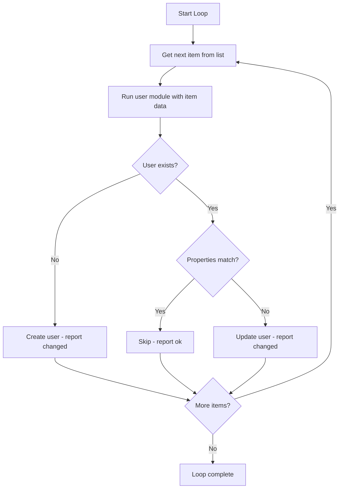

# How to Create Multiple Users in Ansible Using a Loop

Author: [nawazdhandala](https://www.github.com/nawazdhandala)

Tags: Ansible, User Management, Loops, Automation

Description: Learn how to create multiple users efficiently in Ansible using loops, including simple lists, dictionaries, and nested loops with real examples.

---

Creating users one at a time in Ansible is fine when you have two or three accounts to manage. But when you are provisioning a team of 20 developers, a set of service accounts, or onboarding a batch of new hires, you need loops. Ansible offers several loop constructs that make batch user creation clean and maintainable. Let me walk through the different approaches, from simple to advanced.

## Simple Loop with a List of Names

The most basic pattern loops over a list of usernames:

```yaml
# simple-loop.yml - Create users from a simple list
- name: Create users from a list
  hosts: all
  become: yes
  tasks:
    - name: Create user accounts
      ansible.builtin.user:
        name: "{{ item }}"
        state: present
      loop:
        - alice
        - bob
        - carol
        - dave
        - eve
```

This creates five users with default settings. Ansible runs the `user` module once for each item in the list. If a user already exists, Ansible skips it.

## Loop with Dictionaries

Usually you need more than just a username. Use a list of dictionaries to include additional properties:

```yaml
# dict-loop.yml - Create users with properties
- name: Create users with full details
  hosts: all
  become: yes
  vars:
    users:
      - name: alice
        uid: 2001
        comment: "Alice - Backend Engineer"
        shell: /bin/bash
        groups: [developers, docker]
      - name: bob
        uid: 2002
        comment: "Bob - Frontend Engineer"
        shell: /bin/zsh
        groups: [developers]
      - name: carol
        uid: 2003
        comment: "Carol - DevOps Engineer"
        shell: /bin/bash
        groups: [developers, docker, sudo]
  tasks:
    # Create groups first
    - name: Ensure required groups exist
      ansible.builtin.group:
        name: "{{ item }}"
        state: present
      loop: "{{ users | map(attribute='groups') | flatten | unique }}"

    # Create users
    - name: Create user accounts
      ansible.builtin.user:
        name: "{{ item.name }}"
        uid: "{{ item.uid }}"
        comment: "{{ item.comment }}"
        shell: "{{ item.shell }}"
        groups: "{{ item.groups }}"
        append: yes
        state: present
      loop: "{{ users }}"
```

Notice how we first extract all unique group names from the user list and create them. The `map(attribute='groups') | flatten | unique` chain pulls out every group, flattens nested lists, and removes duplicates.

## Loop Flow Diagram

Here is how Ansible processes a user creation loop:



## Using Variables from External Files

For larger teams, keep user data in a separate file:

```yaml
# vars/users.yml - External user data file
team_users:
  - name: alice
    uid: 2001
    comment: "Alice Johnson - Backend"
    shell: /bin/bash
    groups: [developers, docker]
    ssh_key: "ssh-ed25519 AAAAC3NzaC1lZDI1NTE5AAAA... alice@laptop"
  - name: bob
    uid: 2002
    comment: "Bob Smith - Frontend"
    shell: /bin/bash
    groups: [developers]
    ssh_key: "ssh-ed25519 AAAAC3NzaC1lZDI1NTE5AAAA... bob@laptop"
  - name: carol
    uid: 2003
    comment: "Carol Williams - DevOps"
    shell: /bin/bash
    groups: [developers, docker, sudo]
    ssh_key: "ssh-ed25519 AAAAC3NzaC1lZDI1NTE5AAAA... carol@laptop"
```

Reference it in your playbook:

```yaml
# create-team.yml - Create users from external file
- name: Provision team accounts
  hosts: all
  become: yes
  vars_files:
    - vars/users.yml
  tasks:
    - name: Create required groups
      ansible.builtin.group:
        name: "{{ item }}"
        state: present
      loop: "{{ team_users | map(attribute='groups') | flatten | unique }}"

    - name: Create user accounts
      ansible.builtin.user:
        name: "{{ item.name }}"
        uid: "{{ item.uid }}"
        comment: "{{ item.comment }}"
        shell: "{{ item.shell }}"
        groups: "{{ item.groups }}"
        append: yes
        state: present
      loop: "{{ team_users }}"

    - name: Deploy SSH keys
      ansible.posix.authorized_key:
        user: "{{ item.name }}"
        key: "{{ item.ssh_key }}"
        state: present
      loop: "{{ team_users }}"
      when: item.ssh_key is defined
```

## Using loop with index_var

Sometimes you need the index of the current iteration, for example to calculate UIDs:

```yaml
# loop-with-index.yml - Use loop index for UID calculation
- name: Create users with calculated UIDs
  hosts: all
  become: yes
  vars:
    base_uid: 3000
    new_hires:
      - name: frank
        comment: "Frank - New hire batch 2024-Q4"
      - name: grace
        comment: "Grace - New hire batch 2024-Q4"
      - name: henry
        comment: "Henry - New hire batch 2024-Q4"
  tasks:
    - name: Create users with auto-calculated UIDs
      ansible.builtin.user:
        name: "{{ item.name }}"
        uid: "{{ base_uid + index }}"
        comment: "{{ item.comment }}"
        shell: /bin/bash
        state: present
      loop: "{{ new_hires }}"
      loop_control:
        index_var: index

    - name: Display UID assignments
      ansible.builtin.debug:
        msg: "{{ item.name }} -> UID {{ base_uid + index }}"
      loop: "{{ new_hires }}"
      loop_control:
        index_var: index
```

## Using loop_control for Better Output

By default, Ansible prints the entire dictionary for each loop iteration, which gets noisy. Use `label` to clean up the output:

```yaml
# clean-output.yml - Loop with clean output labels
- name: Create users with clean output
  hosts: all
  become: yes
  vars:
    users:
      - name: alice
        uid: 2001
        comment: "Alice Johnson"
        shell: /bin/bash
        groups: [developers]
        password: "{{ vault_alice_pass }}"
      - name: bob
        uid: 2002
        comment: "Bob Smith"
        shell: /bin/bash
        groups: [developers]
        password: "{{ vault_bob_pass }}"
  tasks:
    - name: Create user accounts
      ansible.builtin.user:
        name: "{{ item.name }}"
        uid: "{{ item.uid }}"
        comment: "{{ item.comment }}"
        shell: "{{ item.shell }}"
        groups: "{{ item.groups }}"
        password: "{{ item.password | password_hash('sha512', 'salt' + item.name) }}"
        append: yes
        state: present
      loop: "{{ users }}"
      loop_control:
        label: "{{ item.name }}"
      no_log: yes
```

The `label` parameter makes the output show just the username instead of the entire dictionary. Combined with `no_log: yes`, this keeps passwords out of the output.

## Conditional User Creation

You might want to create users only on certain hosts or only if certain conditions are met:

```yaml
# conditional-users.yml - Create users based on conditions
- name: Create users conditionally
  hosts: all
  become: yes
  vars:
    users:
      - name: webadmin
        groups: [www-data]
        only_on: webservers
      - name: dbadmin
        groups: [mysql]
        only_on: dbservers
      - name: deploy
        groups: [docker]
        only_on: all
  tasks:
    - name: Create users based on server role
      ansible.builtin.user:
        name: "{{ item.name }}"
        groups: "{{ item.groups }}"
        append: yes
        state: present
      loop: "{{ users }}"
      when: item.only_on == 'all' or item.only_on == group_names[0]
```

## Creating Users with Passwords from Vault

Combine loops with Ansible Vault for secure password management:

```yaml
# users-with-vault-passwords.yml - Users with encrypted passwords
- name: Create users with vault passwords
  hosts: all
  become: yes
  vars_files:
    - vars/users.yml
    - vars/secrets.yml  # Encrypted with ansible-vault
  tasks:
    - name: Create users with passwords
      ansible.builtin.user:
        name: "{{ item.name }}"
        uid: "{{ item.uid }}"
        password: "{{ vault_passwords[item.name] | password_hash('sha512', 'salt' + item.name) }}"
        update_password: on_create
        state: present
      loop: "{{ team_users }}"
      loop_control:
        label: "{{ item.name }}"
      no_log: yes
```

The vault file would contain:

```yaml
# vars/secrets.yml (encrypted)
vault_passwords:
  alice: "AliceSecurePass123!"
  bob: "BobSecurePass456!"
  carol: "CarolSecurePass789!"
```

## Complete Onboarding Playbook

Here is a full onboarding playbook that brings it all together:

```yaml
# onboard-team.yml - Complete team onboarding
- name: Onboard new team members
  hosts: all
  become: yes
  vars_files:
    - vars/users.yml
    - vars/secrets.yml
  tasks:
    - name: Create required groups
      ansible.builtin.group:
        name: "{{ item }}"
        state: present
      loop: "{{ team_users | map(attribute='groups') | flatten | unique }}"

    - name: Create user accounts
      ansible.builtin.user:
        name: "{{ item.name }}"
        uid: "{{ item.uid }}"
        comment: "{{ item.comment }}"
        shell: "{{ item.shell | default('/bin/bash') }}"
        groups: "{{ item.groups }}"
        append: yes
        password: "{{ vault_passwords[item.name] | password_hash('sha512', 'salt' + item.name) }}"
        update_password: on_create
        state: present
      loop: "{{ team_users }}"
      loop_control:
        label: "{{ item.name }}"
      no_log: yes

    - name: Deploy SSH authorized keys
      ansible.posix.authorized_key:
        user: "{{ item.name }}"
        key: "{{ item.ssh_key }}"
        state: present
      loop: "{{ team_users }}"
      when: item.ssh_key is defined
      loop_control:
        label: "{{ item.name }}"

    - name: Set up sudoers for privileged users
      ansible.builtin.copy:
        dest: "/etc/sudoers.d/{{ item.name }}"
        content: "{{ item.name }} ALL=(ALL) NOPASSWD:ALL\n"
        mode: '0440'
        validate: 'visudo -cf %s'
      loop: "{{ team_users | selectattr('sudo', 'defined') | selectattr('sudo', 'equalto', true) | list }}"
      loop_control:
        label: "{{ item.name }}"
```

## Best Practices

1. **Keep user data in external files**. Separating data from logic makes your playbooks reusable and your user lists easy to update.

2. **Use `loop_control.label`** to keep output clean. Nobody wants to see 20 full dictionaries scroll by.

3. **Create groups before users**. Always loop through group creation first, then user creation.

4. **Use `no_log: yes` for password tasks**. This prevents sensitive data from appearing in logs.

5. **Use `update_password: on_create`** so passwords are only set during initial user creation, not overwritten on every run.

6. **Use `append: yes` for groups**. Always. Unless you explicitly want to replace the user's group list.

Loops in Ansible turn a 50-line playbook into a 10-line one. For user management specifically, they are essential once you go beyond a handful of accounts.
