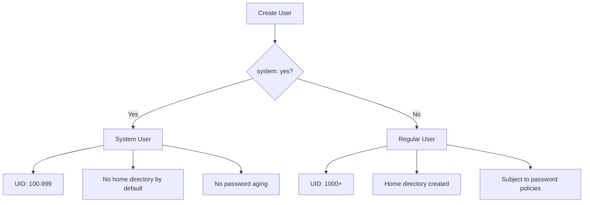

# How to Create System Users with the Ansible user Module

Author: [nawazdhandala](https://www.github.com/nawazdhandala)

Tags: Ansible, User Management, Linux, System Administration

Description: Learn how to create system users and service accounts using the Ansible user module with the system parameter and related configurations.

---

System users are a special category of Linux user accounts designed to run services and daemons. They differ from regular users in several key ways, and the Ansible `user` module has a dedicated parameter for creating them. If you are deploying applications, databases, or any kind of service with Ansible, understanding system user creation is essential.

## What Makes a System User Different

System users have a few characteristics that set them apart from regular user accounts:

- **UID range**: System users get UIDs from a lower range (typically 100-999 on most distributions), while regular users start at 1000.
- **No home directory by default**: System users usually do not need a home directory, though you can create one if the service requires it.
- **No login shell**: System users typically use `/usr/sbin/nologin` or `/bin/false` as their shell, preventing interactive login.
- **No password aging**: System accounts are not subject to password expiration policies.

## Creating a Basic System User

The `system` parameter is what tells Ansible to create a system user instead of a regular one:

```yaml
# create-system-user.yml - Create a basic system user
- name: Create a system user for a service
  hosts: all
  become: yes
  tasks:
    - name: Create nginx system user
      ansible.builtin.user:
        name: nginx
        system: yes
        shell: /usr/sbin/nologin
        create_home: no
        state: present
```

When `system: yes` is set, Ansible passes the `--system` flag to `useradd`, which tells it to allocate a UID from the system range and skip creating a home directory by default.

## System User vs Regular User

Here is a comparison of the key differences:



## Creating System Users for Common Services

Let me walk through creating system users for several common services. Each service has slightly different requirements.

Here is a system user for a web application:

```yaml
# webapp-system-user.yml - System user for a web application
- name: Create system user for web application
  hosts: webservers
  become: yes
  tasks:
    - name: Create webapp group
      ansible.builtin.group:
        name: webapp
        system: yes
        state: present

    - name: Create webapp user
      ansible.builtin.user:
        name: webapp
        group: webapp
        system: yes
        shell: /usr/sbin/nologin
        home: /opt/webapp
        create_home: yes
        state: present

    # Set proper permissions on the application directory
    - name: Set ownership of application directory
      ansible.builtin.file:
        path: /opt/webapp
        owner: webapp
        group: webapp
        mode: '0755'
        state: directory
```

Notice that for a web application, we do create a home directory because the application needs somewhere to live. The home directory is set to `/opt/webapp` instead of the default `/home/webapp`, which is a common pattern for service accounts.

## Creating System Users for Database Services

Database services often need specific directory structures:

```yaml
# postgres-system-user.yml - System user for PostgreSQL
- name: Create PostgreSQL system user
  hosts: dbservers
  become: yes
  tasks:
    - name: Create postgres group
      ansible.builtin.group:
        name: postgres
        gid: 26
        system: yes
        state: present

    - name: Create postgres user
      ansible.builtin.user:
        name: postgres
        uid: 26
        group: postgres
        system: yes
        shell: /bin/bash
        home: /var/lib/postgresql
        create_home: yes
        comment: "PostgreSQL Database Server"
        state: present

    - name: Create PostgreSQL data directory
      ansible.builtin.file:
        path: /var/lib/postgresql/data
        owner: postgres
        group: postgres
        mode: '0700'
        state: directory
```

For PostgreSQL, we use `/bin/bash` as the shell because database administrators sometimes need to `su - postgres` to run maintenance commands. The UID and GID are set to 26, which is the conventional value for PostgreSQL on many distributions.

## Creating a Monitoring Agent User

Monitoring agents like Prometheus Node Exporter need minimal permissions:

```yaml
# monitoring-system-user.yml - System user for monitoring
- name: Create monitoring system user
  hosts: all
  become: yes
  tasks:
    - name: Create node_exporter group
      ansible.builtin.group:
        name: node_exporter
        system: yes
        state: present

    - name: Create node_exporter user
      ansible.builtin.user:
        name: node_exporter
        group: node_exporter
        system: yes
        shell: /usr/sbin/nologin
        create_home: no
        state: present

    # Install and configure node_exporter
    - name: Create node_exporter directory
      ansible.builtin.file:
        path: /opt/node_exporter
        owner: node_exporter
        group: node_exporter
        mode: '0755'
        state: directory
```

## Systemd Service with System User

After creating a system user, you typically create a systemd service file that runs as that user:

```yaml
# service-with-user.yml - Complete service deployment with system user
- name: Deploy application with system user
  hosts: appservers
  become: yes
  vars:
    app_name: myapi
    app_port: 8080
  tasks:
    - name: Create application group
      ansible.builtin.group:
        name: "{{ app_name }}"
        system: yes
        state: present

    - name: Create application user
      ansible.builtin.user:
        name: "{{ app_name }}"
        group: "{{ app_name }}"
        system: yes
        shell: /usr/sbin/nologin
        home: "/opt/{{ app_name }}"
        create_home: yes
        state: present

    # Deploy the systemd service file
    - name: Create systemd service
      ansible.builtin.copy:
        dest: "/etc/systemd/system/{{ app_name }}.service"
        content: |
          [Unit]
          Description={{ app_name }} API Service
          After=network.target

          [Service]
          Type=simple
          User={{ app_name }}
          Group={{ app_name }}
          WorkingDirectory=/opt/{{ app_name }}
          ExecStart=/opt/{{ app_name }}/bin/{{ app_name }} --port {{ app_port }}
          Restart=always
          RestartSec=5

          [Install]
          WantedBy=multi-user.target
        mode: '0644'
      notify: reload systemd

  handlers:
    - name: reload systemd
      ansible.builtin.systemd:
        daemon_reload: yes
```

## Creating Multiple System Users in a Role

If you are writing an Ansible role, you might want a reusable pattern for creating system users:

```yaml
# roles/system-user/tasks/main.yml - Reusable system user role
- name: Create system group
  ansible.builtin.group:
    name: "{{ system_user_name }}"
    gid: "{{ system_user_gid | default(omit) }}"
    system: yes
    state: present

- name: Create system user
  ansible.builtin.user:
    name: "{{ system_user_name }}"
    uid: "{{ system_user_uid | default(omit) }}"
    group: "{{ system_user_name }}"
    groups: "{{ system_user_extra_groups | default(omit) }}"
    system: yes
    shell: "{{ system_user_shell | default('/usr/sbin/nologin') }}"
    home: "{{ system_user_home | default('/opt/' + system_user_name) }}"
    create_home: "{{ system_user_create_home | default(false) }}"
    comment: "{{ system_user_comment | default(system_user_name + ' service account') }}"
    state: present

- name: Ensure home directory permissions
  ansible.builtin.file:
    path: "{{ system_user_home | default('/opt/' + system_user_name) }}"
    owner: "{{ system_user_name }}"
    group: "{{ system_user_name }}"
    mode: "{{ system_user_home_mode | default('0755') }}"
    state: directory
  when: system_user_create_home | default(false)
```

Use the role in a playbook:

```yaml
# deploy-services.yml - Using the system-user role
- name: Deploy services
  hosts: all
  become: yes
  tasks:
    - name: Create Redis system user
      ansible.builtin.include_role:
        name: system-user
      vars:
        system_user_name: redis
        system_user_uid: 110
        system_user_gid: 110
        system_user_home: /var/lib/redis
        system_user_create_home: yes
        system_user_home_mode: '0750'

    - name: Create Elasticsearch system user
      ansible.builtin.include_role:
        name: system-user
      vars:
        system_user_name: elasticsearch
        system_user_home: /var/lib/elasticsearch
        system_user_create_home: yes
```

## Best Practices for System Users

1. **Always use `system: yes`**. This ensures the UID is allocated from the system range, keeping your UID space organized.

2. **Set the shell to `/usr/sbin/nologin`** unless there is a specific reason the service needs an interactive shell.

3. **Use `/opt/` or `/var/lib/` for home directories**. Do not put service account home directories under `/home/`. That path is for human users.

4. **Create a dedicated group** for each system user. This follows the User Private Group scheme and makes permission management cleaner.

5. **Set explicit UIDs and GIDs** for services that share data across servers. Inconsistent UIDs cause file permission mismatches on shared filesystems.

6. **Use `create_home: no`** for services that do not need a home directory. There is no point creating directories that will never be used.

System users are a foundational part of any Linux server setup. Getting them right with Ansible means your services run with the principle of least privilege, and your user namespace stays clean and predictable.
