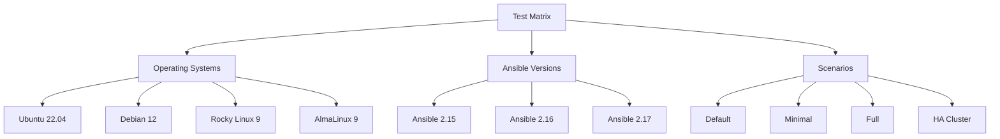

# How to Create Test Matrices for Ansible Roles

Author: [nawazdhandala](https://www.github.com/nawazdhandala)

Tags: Ansible, Testing, Molecule, CI/CD, Test Matrix

Description: Learn how to build comprehensive test matrices for Ansible roles that cover multiple operating systems, Ansible versions, and configuration scenarios.

---

When you write an Ansible role that targets multiple operating systems or needs to support different Ansible versions, testing against a single platform is not enough. A test matrix lets you systematically verify your role works across every combination of OS, Ansible version, and configuration variant that you claim to support. Without one, you are guessing.

I maintain several public Ansible roles and every release used to come with a wave of "this does not work on Debian 12" or "fails with Ansible 2.14" bug reports. Building proper test matrices eliminated those reports almost entirely.

## What Is a Test Matrix?

A test matrix defines the combinations of variables you want to test against. For an Ansible role, the typical dimensions are:

- Operating system (Ubuntu 22.04, Debian 12, RHEL 9, Rocky Linux 9)
- Ansible version (2.15, 2.16, 2.17)
- Python version (3.10, 3.11, 3.12)
- Role configuration variants (minimal, full, custom)

The total test count is the product of all dimensions. Three OS platforms times three Ansible versions times two configuration variants gives you 18 test runs.

## Setting Up Molecule Scenarios

Molecule supports multiple test scenarios, each with its own platform configuration. Here is the base setup:

```yaml
# molecule/default/molecule.yml
# Default Molecule scenario testing across multiple platforms
dependency:
  name: galaxy
driver:
  name: docker
platforms:
  - name: ubuntu2204
    image: ubuntu:22.04
    pre_build_image: true
    privileged: true
    command: /sbin/init
    groups:
      - debian_family
  - name: debian12
    image: debian:12
    pre_build_image: true
    privileged: true
    command: /sbin/init
    groups:
      - debian_family
  - name: rockylinux9
    image: rockylinux:9
    pre_build_image: true
    privileged: true
    command: /usr/sbin/init
    groups:
      - redhat_family
  - name: almalinux9
    image: almalinux:9
    pre_build_image: true
    privileged: true
    command: /usr/sbin/init
    groups:
      - redhat_family
provisioner:
  name: ansible
  env:
    ANSIBLE_FORCE_COLOR: "true"
verifier:
  name: ansible
```

Create separate scenarios for configuration variants:

```yaml
# molecule/minimal/molecule.yml
# Scenario testing the role with minimal configuration
dependency:
  name: galaxy
driver:
  name: docker
platforms:
  - name: ubuntu2204-minimal
    image: ubuntu:22.04
    pre_build_image: true
    privileged: true
    command: /sbin/init
provisioner:
  name: ansible
  inventory:
    host_vars:
      ubuntu2204-minimal:
        # Only required variables, everything else uses defaults
        app_name: testapp
verifier:
  name: ansible
```

```yaml
# molecule/full/molecule.yml
# Scenario testing the role with all features enabled
dependency:
  name: galaxy
driver:
  name: docker
platforms:
  - name: ubuntu2204-full
    image: ubuntu:22.04
    pre_build_image: true
    privileged: true
    command: /sbin/init
provisioner:
  name: ansible
  inventory:
    host_vars:
      ubuntu2204-full:
        # Every optional feature enabled
        app_name: testapp
        app_ssl_enabled: true
        app_monitoring_enabled: true
        app_backup_enabled: true
        app_custom_config:
          workers: 4
          timeout: 30
          log_level: debug
verifier:
  name: ansible
```

## GitHub Actions Test Matrix

GitHub Actions has built-in matrix support that works well with Molecule:

```yaml
# .github/workflows/test-matrix.yml
# Test matrix covering OS, Ansible version, and scenario combinations
name: Ansible Role Test Matrix
on:
  push:
    branches: [main]
  pull_request:

jobs:
  test:
    runs-on: ubuntu-latest
    strategy:
      fail-fast: false
      matrix:
        distro:
          - ubuntu2204
          - debian12
          - rockylinux9
          - almalinux9
        ansible-version:
          - '2.15'
          - '2.16'
          - '2.17'
        scenario:
          - default
          - minimal
          - full
        exclude:
          # Exclude combinations known to be unsupported
          - distro: rockylinux9
            ansible-version: '2.15'
    steps:
      - uses: actions/checkout@v4

      - name: Set up Python
        uses: actions/setup-python@v5
        with:
          python-version: '3.11'

      - name: Install dependencies
        run: |
          pip install \
            "ansible-core~=${{ matrix.ansible-version }}.0" \
            molecule \
            molecule-docker \
            docker

      - name: Run Molecule tests
        run: |
          molecule test -s ${{ matrix.scenario }}
        env:
          MOLECULE_DISTRO: ${{ matrix.distro }}
          PY_COLORS: '1'
          ANSIBLE_FORCE_COLOR: '1'
```

## Dynamic Platform Selection with Environment Variables

Instead of hardcoding platforms in each scenario, use environment variables to select the platform dynamically:

```yaml
# molecule/default/molecule.yml
# Platform selected dynamically via MOLECULE_DISTRO env var
dependency:
  name: galaxy
driver:
  name: docker
platforms:
  - name: ${MOLECULE_DISTRO:-ubuntu2204}
    image: ${MOLECULE_IMAGE:-ubuntu:22.04}
    pre_build_image: true
    privileged: true
    command: ${MOLECULE_COMMAND:-/sbin/init}
provisioner:
  name: ansible
verifier:
  name: ansible
```

Create a lookup script that maps distro names to Docker images:

```bash
#!/bin/bash
# scripts/set_molecule_vars.sh
# Map distro short names to Docker image details
case "${MOLECULE_DISTRO}" in
    ubuntu2204)
        export MOLECULE_IMAGE="ubuntu:22.04"
        export MOLECULE_COMMAND="/sbin/init"
        ;;
    ubuntu2404)
        export MOLECULE_IMAGE="ubuntu:24.04"
        export MOLECULE_COMMAND="/sbin/init"
        ;;
    debian12)
        export MOLECULE_IMAGE="debian:12"
        export MOLECULE_COMMAND="/sbin/init"
        ;;
    rockylinux9)
        export MOLECULE_IMAGE="rockylinux:9"
        export MOLECULE_COMMAND="/usr/sbin/init"
        ;;
    almalinux9)
        export MOLECULE_IMAGE="almalinux:9"
        export MOLECULE_COMMAND="/usr/sbin/init"
        ;;
    *)
        echo "Unknown distro: ${MOLECULE_DISTRO}"
        exit 1
        ;;
esac
```

## Testing Configuration Variants with Converge Playbooks

Each scenario gets its own converge playbook with different variable sets:

```yaml
# molecule/default/converge.yml
# Standard converge with default configuration
- name: Converge
  hosts: all
  become: true
  vars:
    app_name: testapp
    app_port: 8080
  roles:
    - role: "{{ lookup('env', 'MOLECULE_PROJECT_DIRECTORY') | basename }}"
```

```yaml
# molecule/ha-cluster/converge.yml
# Converge testing high-availability cluster configuration
- name: Converge HA cluster
  hosts: all
  become: true
  vars:
    app_name: testapp
    app_port: 8080
    app_cluster_enabled: true
    app_cluster_nodes:
      - host: node1
        port: 8080
      - host: node2
        port: 8080
      - host: node3
        port: 8080
    app_replication_factor: 3
  roles:
    - role: "{{ lookup('env', 'MOLECULE_PROJECT_DIRECTORY') | basename }}"
```

## Verify Playbooks per Scenario

Each scenario needs its own verification:

```yaml
# molecule/default/verify.yml
# Verify standard deployment
- name: Verify standard deployment
  hosts: all
  become: true
  tasks:
    - name: Check service is running
      ansible.builtin.service_facts:

    - name: Assert service is active
      ansible.builtin.assert:
        that:
          - ansible_facts.services['testapp.service'].state == 'running'

    - name: Check port is listening
      ansible.builtin.wait_for:
        port: 8080
        timeout: 10
```

```yaml
# molecule/ha-cluster/verify.yml
# Verify HA cluster deployment
- name: Verify HA cluster
  hosts: all
  become: true
  tasks:
    - name: Check cluster config exists
      ansible.builtin.stat:
        path: /etc/testapp/cluster.yml
      register: cluster_config

    - name: Assert cluster config was deployed
      ansible.builtin.assert:
        that:
          - cluster_config.stat.exists

    - name: Read cluster config
      ansible.builtin.slurp:
        src: /etc/testapp/cluster.yml
      register: config_content

    - name: Verify cluster nodes in config
      ansible.builtin.assert:
        that:
          - "'node1' in (config_content.content | b64decode)"
          - "'node2' in (config_content.content | b64decode)"
          - "'node3' in (config_content.content | b64decode)"
```

## Makefile for Local Matrix Testing

Running the full matrix locally can be done with a Makefile:

```makefile
# Makefile
# Run test matrix locally across all scenarios and platforms
DISTROS := ubuntu2204 debian12 rockylinux9 almalinux9
SCENARIOS := default minimal full

.PHONY: test test-all

test:
	molecule test

test-all:
	@for scenario in $(SCENARIOS); do \
		for distro in $(DISTROS); do \
			echo "=== Testing $$scenario on $$distro ==="; \
			MOLECULE_DISTRO=$$distro molecule test -s $$scenario || exit 1; \
		done; \
	done

test-quick:
	@for distro in $(DISTROS); do \
		echo "=== Quick test on $$distro ==="; \
		MOLECULE_DISTRO=$$distro molecule converge || exit 1; \
		MOLECULE_DISTRO=$$distro molecule verify || exit 1; \
	done
```

## Visualizing Your Test Matrix

Document your test matrix so contributors know what is covered:



## Conclusion

A well-designed test matrix turns "it works on my machine" into "it works on every supported platform." Define your dimensions (OS, Ansible version, configuration variant), use Molecule scenarios for configuration variants, use CI matrix strategies for platform and version combinations, and automate everything. The upfront investment in building the matrix saves hours of debugging cross-platform issues down the road.
