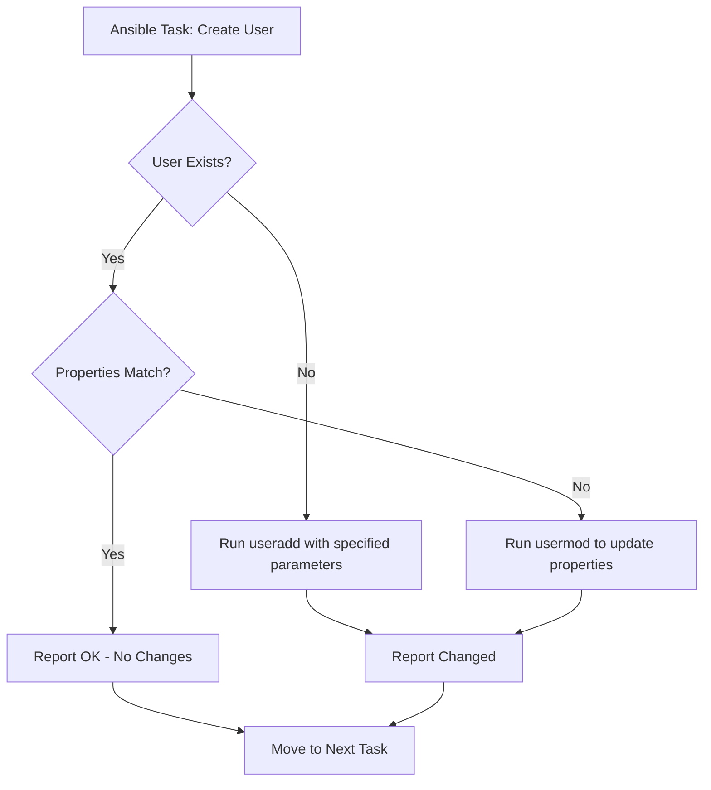

# How to Create Users with the Ansible user Module

Author: [nawazdhandala](https://www.github.com/nawazdhandala)

Tags: Ansible, User Management, Linux, DevOps, Automation

Description: Learn how to create and manage user accounts on Linux servers using the Ansible user module with practical examples and best practices.

---

Managing user accounts across dozens or hundreds of servers is one of those tasks that gets old fast. If you have ever manually run `useradd` on 50 machines, you know exactly what I mean. The Ansible `user` module solves this by letting you declare the desired state of a user account and having Ansible figure out the rest.

In this post, we will walk through everything you need to know about creating users with the Ansible `user` module, from basic usage to more advanced configurations.

## The Basics of the user Module

The `user` module is a built-in Ansible module (part of `ansible.builtin`), so you do not need to install anything extra. At its core, the module wraps around the system-level user management tools (`useradd`, `usermod`, etc.) but gives you a declarative interface.

Here is the simplest possible example that creates a user:

```yaml
# create-user.yml - Basic user creation playbook
- name: Create a basic user account
  hosts: all
  become: yes
  tasks:
    - name: Create user 'deploy'
      ansible.builtin.user:
        name: deploy
        state: present
```

The `state: present` parameter tells Ansible to make sure this user exists. If the user already exists, Ansible will not make any changes and will report "ok" instead of "changed". This idempotent behavior is one of the biggest advantages over raw shell scripts.

## Setting Common User Properties

Most of the time, you want more than just a username. You probably need to set a UID, comment, shell, and home directory. The `user` module supports all of these through straightforward parameters.

```yaml
# create-full-user.yml - Create user with common properties
- name: Create a fully configured user
  hosts: all
  become: yes
  tasks:
    - name: Create user 'appuser' with full details
      ansible.builtin.user:
        name: appuser
        uid: 1050
        comment: "Application deployment user"
        shell: /bin/bash
        home: /home/appuser
        create_home: yes
        state: present
```

Let me break down each parameter:

- **name**: The username (required). This is the only mandatory parameter.
- **uid**: The numeric user ID. If you skip this, the system assigns the next available UID.
- **comment**: The GECOS field, typically used for the user's full name or description.
- **shell**: The login shell. Common choices are `/bin/bash`, `/bin/zsh`, or `/usr/sbin/nologin` for non-interactive accounts.
- **home**: The path to the home directory.
- **create_home**: Whether to create the home directory if it does not exist. Defaults to `yes`.

## Using Variables for User Data

Hard-coding user details in tasks is fine for a quick one-off, but in production you will want to pull user data from variables. This makes your playbooks reusable and keeps your data separate from your logic.

```yaml
# create-user-vars.yml - User creation with variables
- name: Create users from variables
  hosts: all
  become: yes
  vars:
    new_user:
      name: jdoe
      uid: 2001
      comment: "John Doe - Backend Developer"
      shell: /bin/bash
      groups:
        - developers
        - docker
  tasks:
    - name: Ensure required groups exist
      ansible.builtin.group:
        name: "{{ item }}"
        state: present
      loop: "{{ new_user.groups }}"

    - name: Create the user account
      ansible.builtin.user:
        name: "{{ new_user.name }}"
        uid: "{{ new_user.uid }}"
        comment: "{{ new_user.comment }}"
        shell: "{{ new_user.shell }}"
        groups: "{{ new_user.groups | join(',') }}"
        append: yes
        state: present
```

The `append: yes` parameter is important here. Without it, Ansible replaces the user's supplementary group list with only the groups you specify. With `append: yes`, it adds the user to those groups while keeping any existing group memberships intact.

## Creating Users from a List

When you need to create multiple users, a loop is much cleaner than repeating the task:

```yaml
# create-multiple-users.yml - Batch user creation
- name: Create multiple users
  hosts: all
  become: yes
  vars:
    users:
      - name: alice
        uid: 3001
        comment: "Alice - SRE Team"
        shell: /bin/bash
      - name: bob
        uid: 3002
        comment: "Bob - Dev Team"
        shell: /bin/zsh
      - name: carol
        uid: 3003
        comment: "Carol - Security Team"
        shell: /bin/bash
  tasks:
    - name: Create all user accounts
      ansible.builtin.user:
        name: "{{ item.name }}"
        uid: "{{ item.uid }}"
        comment: "{{ item.comment }}"
        shell: "{{ item.shell }}"
        state: present
      loop: "{{ users }}"
```

## Handling SSH Keys During User Creation

You can also set up SSH authorized keys as part of the user creation process. While the `user` module itself can generate SSH keys (covered in a separate post), you will typically want to deploy existing public keys using the `authorized_key` module alongside the user creation:

```yaml
# create-user-with-ssh.yml - Create user and deploy SSH key
- name: Create user with SSH access
  hosts: all
  become: yes
  tasks:
    - name: Create the user account
      ansible.builtin.user:
        name: deployer
        shell: /bin/bash
        state: present

    - name: Add SSH authorized key for deployer
      ansible.posix.authorized_key:
        user: deployer
        key: "ssh-ed25519 AAAAC3NzaC1lZDI1NTE5AAAAIExample deployer@company.com"
        state: present
```

## The User Creation Workflow

Here is a visual overview of what happens when Ansible processes a user creation task:



## Platform Differences

The `user` module works across Linux distributions, but there are some subtle differences to be aware of. On Debian-based systems, the default skeleton files come from `/etc/skel`. On Red Hat-based systems, the behavior is similar but the default shell might differ.

If you need to support multiple distributions, you can use `ansible_os_family` to handle differences:

```yaml
# cross-platform-user.yml - Handle platform differences
- name: Create user with platform-specific settings
  hosts: all
  become: yes
  tasks:
    - name: Create user with correct default group
      ansible.builtin.user:
        name: webadmin
        shell: /bin/bash
        group: "{{ 'www-data' if ansible_os_family == 'Debian' else 'apache' }}"
        state: present
```

## Error Handling

Things can go wrong during user creation. Maybe the UID is already taken, or the specified shell does not exist on the target system. You can handle these situations with Ansible's `block/rescue` pattern:

```yaml
# safe-user-creation.yml - User creation with error handling
- name: Safely create a user
  hosts: all
  become: yes
  tasks:
    - name: Attempt user creation
      block:
        - name: Create user account
          ansible.builtin.user:
            name: testuser
            uid: 5001
            shell: /bin/bash
            state: present
      rescue:
        - name: Log the failure
          ansible.builtin.debug:
            msg: "Failed to create user on {{ inventory_hostname }}"

        - name: Try without specifying UID
          ansible.builtin.user:
            name: testuser
            shell: /bin/bash
            state: present
```

## Verifying User Creation

After creating users, you might want to verify that everything was set up correctly. You can use the `getent` module or a simple shell command:

```yaml
# verify-user.yml - Verify user was created correctly
- name: Verify user creation
  hosts: all
  become: yes
  tasks:
    - name: Check user exists in passwd
      ansible.builtin.getent:
        database: passwd
        key: deploy

    - name: Display user info
      ansible.builtin.debug:
        msg: "User info: {{ getent_passwd['deploy'] }}"
```

## Best Practices

After managing users with Ansible across many projects, here are a few patterns that have served me well:

1. **Always specify UIDs explicitly** in production environments. Letting the system auto-assign UIDs leads to inconsistencies across servers, which causes permission headaches with shared storage (NFS, GlusterFS, etc.).

2. **Keep user data in group_vars or host_vars**, not in the playbook itself. This makes it easy to have different user sets for different environments.

3. **Use `append: yes` for groups** unless you specifically want to replace the entire group list.

4. **Test on a staging server first**. User management mistakes can lock people out of production systems.

5. **Always set `become: yes`**. Creating users requires root privileges. If you forget `become`, the task will fail with a permissions error.

The Ansible `user` module is one of those tools that looks simple on the surface but has enough depth to handle just about any user management scenario you will encounter. Start with the basics and layer on complexity as your needs grow.
