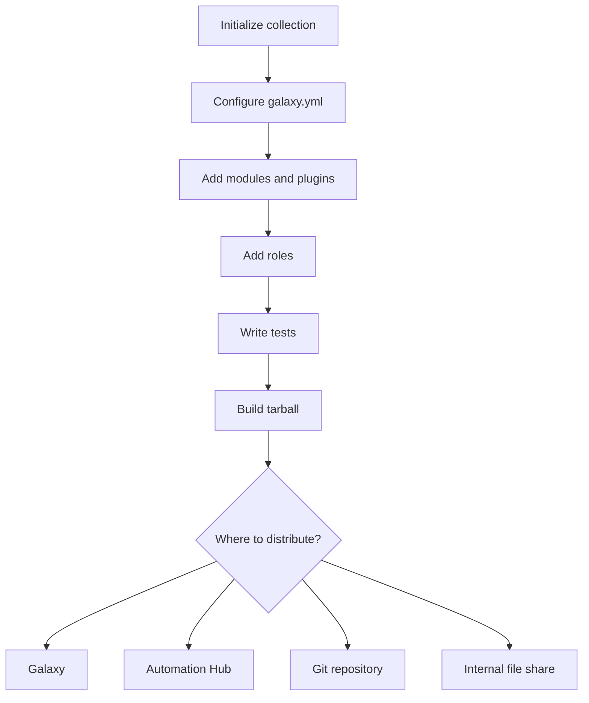

# How to Create Your Own Ansible Collection

Author: [nawazdhandala](https://www.github.com/nawazdhandala)

Tags: Ansible, Collections, Custom Modules, DevOps, Automation

Description: A complete walkthrough of creating your own Ansible collection from scratch with custom modules, plugins, roles, and metadata configuration.

---

At some point, every Ansible team reaches the stage where copying roles between repositories and maintaining ad-hoc module libraries becomes unmanageable. Ansible collections solve this by providing a standard packaging format for organizing, versioning, and distributing automation content. Creating your own collection is easier than you might think.

This guide walks through initializing a new collection, adding content to it, and getting it ready for use in playbooks.

## Initializing a New Collection

The fastest way to start is with the `ansible-galaxy collection init` command:

```bash
# Create a new collection skeleton
ansible-galaxy collection init my_company.infrastructure
```

This creates a directory structure under `my_company/infrastructure/`:

```
my_company/infrastructure/
  galaxy.yml           # Collection metadata
  README.md            # Documentation
  docs/                # Additional documentation
  meta/                # Collection metadata files
    runtime.yml        # Runtime routing information
  plugins/             # Plugins directory
    modules/           # Custom modules go here
    README.md
  roles/               # Roles directory
```

The namespace is `my_company` and the collection name is `infrastructure`. Together they form the collection's identity: `my_company.infrastructure`.

## Configuring galaxy.yml

The `galaxy.yml` file is the heart of your collection's metadata. Let me walk through the important fields:

```yaml
# galaxy.yml - Collection metadata and configuration
---
namespace: my_company
name: infrastructure
version: 1.0.0
readme: README.md
authors:
  - DevOps Team <devops@mycompany.com>
description: Infrastructure automation modules and roles for internal use
license:
  - GPL-3.0-or-later
license_file: LICENSE
tags:
  - infrastructure
  - networking
  - security
  - linux
dependencies:
  ansible.posix: ">=1.4.0"
  community.general: ">=6.0.0"
repository: https://github.com/my-company/ansible-infrastructure
documentation: https://github.com/my-company/ansible-infrastructure/wiki
homepage: https://github.com/my-company/ansible-infrastructure
issues: https://github.com/my-company/ansible-infrastructure/issues
build_ignore:
  - .gitignore
  - .github
  - tests/output
  - "*.tar.gz"
```

A few things worth calling out:

- **namespace** must match your Galaxy namespace if you plan to publish. For internal use, pick something that represents your organization.
- **version** follows semantic versioning. Bump it before each release.
- **dependencies** lists other collections your collection requires. These get installed automatically when someone installs your collection.
- **build_ignore** excludes files from the built tarball. Keep test outputs, CI configs, and build artifacts out of the distribution.

## Writing a Custom Module

Let me add a practical module. Say your team frequently needs to check whether specific TCP ports are open on remote hosts. Here is a simple module for that:

```python
#!/usr/bin/python
# plugins/modules/check_port.py
# Module to check if a TCP port is open on a target host

from __future__ import absolute_import, division, print_function
__metaclass__ = type

DOCUMENTATION = r"""
---
module: check_port
short_description: Check if a TCP port is open
version_added: "1.0.0"
description:
  - Attempts a TCP connection to the specified host and port.
  - Returns whether the port is open or closed.
options:
  host:
    description: The hostname or IP address to check.
    required: true
    type: str
  port:
    description: The TCP port number to check.
    required: true
    type: int
  timeout:
    description: Connection timeout in seconds.
    required: false
    type: int
    default: 5
author:
  - DevOps Team (@devops)
"""

EXAMPLES = r"""
- name: Check if SSH port is open
  my_company.infrastructure.check_port:
    host: 192.168.1.10
    port: 22
    timeout: 3
  register: ssh_check

- name: Fail if database port is closed
  my_company.infrastructure.check_port:
    host: db.internal
    port: 5432
  register: db_check
  failed_when: not db_check.is_open
"""

RETURN = r"""
is_open:
  description: Whether the port is accepting connections.
  type: bool
  returned: always
elapsed:
  description: Time taken for the connection attempt in seconds.
  type: float
  returned: always
"""

import socket
import time
from ansible.module_utils.basic import AnsibleModule


def main():
    module = AnsibleModule(
        argument_spec=dict(
            host=dict(type="str", required=True),
            port=dict(type="int", required=True),
            timeout=dict(type="int", default=5),
        ),
        supports_check_mode=True,
    )

    host = module.params["host"]
    port = module.params["port"]
    timeout = module.params["timeout"]

    start_time = time.time()
    try:
        sock = socket.socket(socket.AF_INET, socket.SOCK_STREAM)
        sock.settimeout(timeout)
        result = sock.connect_ex((host, port))
        sock.close()
        is_open = result == 0
    except socket.error as e:
        is_open = False

    elapsed = round(time.time() - start_time, 3)

    module.exit_json(
        changed=False,
        is_open=is_open,
        elapsed=elapsed,
        host=host,
        port=port,
    )


if __name__ == "__main__":
    main()
```

Place this file at `plugins/modules/check_port.py`. The file name (without `.py`) becomes the module name. Users will reference it as `my_company.infrastructure.check_port`.

## Adding a Role to the Collection

Roles go in the `roles/` directory and follow the standard Ansible role structure:

```bash
# Create the role directory structure
mkdir -p roles/hardening/{tasks,defaults,handlers,templates,meta}
```

Create the role's main task file:

```yaml
# roles/hardening/tasks/main.yml
# System hardening tasks for Linux servers
---
- name: Set password quality requirements
  ansible.builtin.template:
    src: pwquality.conf.j2
    dest: /etc/security/pwquality.conf
    owner: root
    group: root
    mode: "0644"

- name: Disable unused filesystems
  ansible.builtin.copy:
    content: |
      install cramfs /bin/true
      install freevxfs /bin/true
      install hfs /bin/true
      install hfsplus /bin/true
      install squashfs /bin/true
      install udf /bin/true
    dest: /etc/modprobe.d/disable-filesystems.conf
    owner: root
    group: root
    mode: "0644"

- name: Set sysctl security parameters
  ansible.posix.sysctl:
    name: "{{ item.key }}"
    value: "{{ item.value }}"
    sysctl_set: true
    state: present
    reload: true
  loop: "{{ hardening_sysctl_params | dict2items }}"
```

Define defaults for the role:

```yaml
# roles/hardening/defaults/main.yml
# Default variables for the hardening role
---
hardening_sysctl_params:
  net.ipv4.ip_forward: "0"
  net.ipv4.conf.all.send_redirects: "0"
  net.ipv4.conf.default.send_redirects: "0"
  net.ipv4.conf.all.accept_redirects: "0"
  net.ipv4.conf.default.accept_redirects: "0"
  net.ipv4.conf.all.log_martians: "1"
  kernel.randomize_va_space: "2"
```

Add role metadata:

```yaml
# roles/hardening/meta/main.yml
---
galaxy_info:
  role_name: hardening
  description: Linux system hardening
  min_ansible_version: "2.14"
  platforms:
    - name: EL
      versions:
        - "8"
        - "9"
    - name: Ubuntu
      versions:
        - focal
        - jammy
dependencies: []
```

## Adding a Filter Plugin

Filter plugins let you transform data within Jinja2 expressions. Here is a plugin that converts bytes to human-readable sizes:

```python
# plugins/filter/human_readable.py
# Filter plugin to convert byte values to human-readable format

from __future__ import absolute_import, division, print_function
__metaclass__ = type


def bytes_to_human(value, precision=2):
    """Convert bytes to human readable string."""
    value = float(value)
    units = ["B", "KB", "MB", "GB", "TB", "PB"]
    for unit in units:
        if abs(value) < 1024.0:
            return f"{value:.{precision}f} {unit}"
        value /= 1024.0
    return f"{value:.{precision}f} EB"


class FilterModule(object):
    """Custom filters for the infrastructure collection."""

    def filters(self):
        return {
            "bytes_to_human": bytes_to_human,
        }
```

Users reference this filter as `my_company.infrastructure.bytes_to_human`:

```yaml
# Example usage in a playbook
- name: Show disk usage in human-readable format
  ansible.builtin.debug:
    msg: "Disk usage: {{ disk_bytes | my_company.infrastructure.bytes_to_human }}"
```

## Setting Up Runtime Configuration

The `meta/runtime.yml` file controls module routing and deprecation notices:

```yaml
# meta/runtime.yml - Runtime configuration for the collection
---
requires_ansible: ">=2.14.0"
action_groups:
  my_company.infrastructure:
    - check_port
plugin_routing:
  modules:
    old_module_name:
      redirect: my_company.infrastructure.check_port
      deprecation:
        removal_version: "2.0.0"
        warning_text: Use my_company.infrastructure.check_port instead
```

The `requires_ansible` field prevents installation on incompatible ansible-core versions. The `plugin_routing` section is useful when you rename modules and want to maintain backward compatibility.

## Testing Your Collection Locally

Before distributing, test that your collection works by installing it locally:

```bash
# Build the collection
cd my_company/infrastructure
ansible-galaxy collection build

# Install the built tarball
ansible-galaxy collection install my_company-infrastructure-1.0.0.tar.gz -p ~/.ansible/collections --force
```

Then create a test playbook:

```yaml
# test-playbook.yml - Verify the collection works
---
- name: Test my_company.infrastructure collection
  hosts: localhost
  connection: local
  tasks:
    - name: Test the check_port module
      my_company.infrastructure.check_port:
        host: localhost
        port: 22
        timeout: 2
      register: port_result

    - name: Show result
      ansible.builtin.debug:
        var: port_result

    - name: Test the filter plugin
      ansible.builtin.debug:
        msg: "{{ 1073741824 | my_company.infrastructure.bytes_to_human }}"

- name: Test the hardening role
  hosts: localhost
  connection: local
  become: true
  roles:
    - role: my_company.infrastructure.hardening
```

```bash
# Run the test playbook
ansible-playbook test-playbook.yml
```

## Collection Workflow Overview



## Conclusion

Creating an Ansible collection is about packaging your automation content in a standardized way so it can be versioned, tested, and shared. Start small with one module or role, get the structure right, and expand from there. The key files are `galaxy.yml` for metadata and `meta/runtime.yml` for runtime behavior. Everything else follows the standard Ansible conventions you already know.
