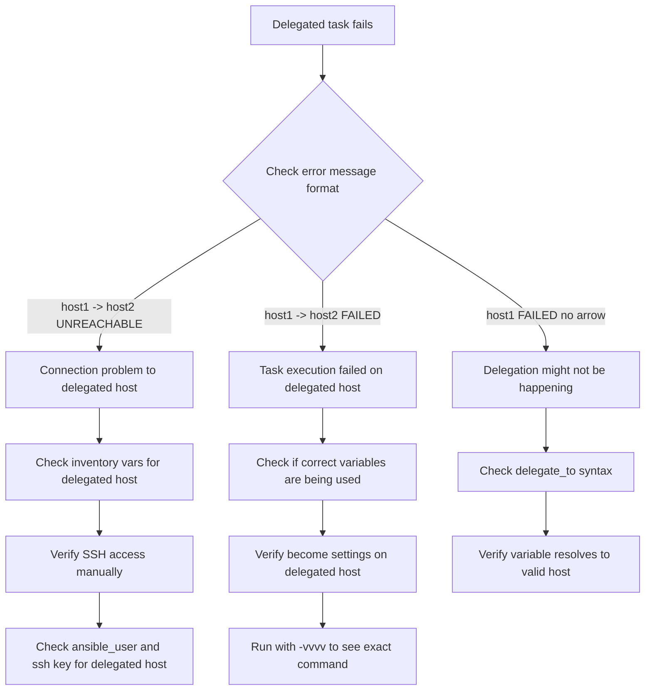

# How to Debug Ansible Delegation Issues

Author: [nawazdhandala](https://www.github.com/nawazdhandala)

Tags: Ansible, Debugging, Delegation, Troubleshooting

Description: A practical guide to diagnosing and fixing common Ansible delegation problems including connection errors, variable scoping, and become issues.

---

Delegation in Ansible is one of those features that works perfectly in simple cases but can produce baffling errors in more complex scenarios. When a delegated task fails, the error messages are often confusing because they mix information from the original target host and the delegated host. In this guide, we will go through systematic debugging techniques and common issues you will encounter with `delegate_to`.

## Enable Verbose Output

The first step in debugging any Ansible issue is to increase the verbosity. For delegation problems, you want at least `-vvv` to see connection details.

```bash
# Run with maximum verbosity to see connection details
ansible-playbook site.yml -vvvv

# Or target just the problematic host for less noise
ansible-playbook site.yml -vvvv --limit problematic_host
```

At `-vvv`, you will see which host Ansible is actually connecting to for each task. This is critical for delegation debugging because you can verify that the task is being sent to the correct host.

Look for lines like:

```
TASK [Install package] *************************
task path: /home/user/playbooks/site.yml:15
<delegated_host> ESTABLISH SSH CONNECTION FOR USER: admin
<delegated_host> SSH: EXEC ssh -o ControlMaster=auto ...
```

If you see the wrong hostname in the `ESTABLISH SSH CONNECTION` line, your delegation target is wrong.

## The Most Common Delegation Problems

### Problem 1: Variable Scope Confusion

When you delegate a task, Ansible uses the variables from the original target host by default, not from the delegated host. This is the single most confusing aspect of delegation.

```yaml
# broken_example.yml - This will NOT work as expected
---
- name: Demonstrate variable scope issue
  hosts: webservers
  gather_facts: false
  tasks:
    # ansible_host will be the web server's IP, not the db server's IP
    - name: Show which host variables are used
      ansible.builtin.debug:
        msg: "ansible_host is {{ ansible_host }}"
      delegate_to: db.example.com
```

To use the delegated host's variables, you need to explicitly reference them through `hostvars`:

```yaml
# fixed_example.yml - Correctly reference delegated host variables
---
- name: Use delegated host's variables
  hosts: webservers
  gather_facts: false
  tasks:
    - name: Show the delegated host's IP
      ansible.builtin.debug:
        msg: "db server IP is {{ hostvars['db.example.com']['ansible_host'] }}"
      delegate_to: db.example.com
```

### Problem 2: Connection Credential Mismatch

A very common error looks like this:

```
fatal: [web01 -> db01]: UNREACHABLE! => {
    "changed": false,
    "msg": "Failed to connect to the host via ssh: Permission denied (publickey).",
    "unreachable": true
}
```

The `[web01 -> db01]` notation tells you the task was delegated from web01 to db01. The SSH failure is happening on db01, but Ansible might be using web01's SSH credentials to connect.

Here is how to diagnose and fix it:

```yaml
# debug_connection.yml - Debug which credentials are being used
---
- name: Debug connection settings for delegated tasks
  hosts: webservers
  gather_facts: false
  tasks:
    - name: Show connection variables for current host
      ansible.builtin.debug:
        msg:
          current_host: "{{ inventory_hostname }}"
          current_ansible_user: "{{ ansible_user | default('not set') }}"
          current_ansible_host: "{{ ansible_host | default('not set') }}"

    - name: Show connection variables for delegated host
      ansible.builtin.debug:
        msg:
          delegated_host: "db.example.com"
          delegated_ansible_user: "{{ hostvars['db.example.com']['ansible_user'] | default('not set') }}"
          delegated_ansible_host: "{{ hostvars['db.example.com']['ansible_host'] | default('not set') }}"
      delegate_to: db.example.com
```

Fix by ensuring the delegated host has proper connection variables in inventory:

```ini
# inventory/hosts - Set explicit connection vars for delegation targets
[databases]
db.example.com ansible_host=10.0.2.50 ansible_user=dbadmin ansible_ssh_private_key_file=~/.ssh/db-key
```

### Problem 3: Facts Not Available on Delegated Host

If you delegate to a host that has not had `gather_facts` run, any reference to `ansible_facts` for that host will fail.

```yaml
# fix_missing_facts.yml - Gather facts before delegating
---
- name: Gather facts from delegation targets first
  hosts: databases
  gather_facts: true

- name: Now delegate tasks that need database host facts
  hosts: webservers
  gather_facts: true
  tasks:
    - name: Configure app with database IP
      ansible.builtin.template:
        src: app.conf.j2
        dest: /etc/myapp/app.conf
      vars:
        db_ip: "{{ hostvars[groups['databases'][0]]['ansible_default_ipv4']['address'] }}"
```

### Problem 4: become Applying to Wrong Host

When `become` is set at the play level and you delegate a task, the become settings apply on the delegated host. This can cause unexpected failures.

```yaml
# debug_become.yml - Diagnose become issues with delegation
---
- name: Debug become with delegation
  hosts: webservers
  become: true
  become_user: root
  tasks:
    # This will try to sudo on localhost, which might not be configured
    - name: Write a local file (might fail due to become on localhost)
      ansible.builtin.copy:
        content: "test"
        dest: /tmp/test.txt
      delegate_to: localhost

    # Fix: override become for the delegated task
    - name: Write a local file (correct approach)
      ansible.builtin.copy:
        content: "test"
        dest: /tmp/test.txt
      delegate_to: localhost
      become: false
```

## Using the Debug Strategy

Ansible's debug strategy lets you step through tasks interactively, which is very helpful for delegation issues.

```yaml
# debug_strategy.yml - Use debug strategy for interactive troubleshooting
---
- name: Step through delegation tasks
  hosts: webservers
  strategy: debug
  tasks:
    - name: Task that might fail with delegation
      ansible.builtin.command: whoami
      delegate_to: db.example.com
```

Run the playbook normally, and when a task fails, you will drop into the debug prompt:

```bash
# At the debug prompt, you can inspect variables
[web01] TASK: Task that might fail with delegation (debug)> p task.delegate_to
'db.example.com'

[web01] TASK: Task that might fail with delegation (debug)> p task_vars['ansible_user']
'deploy'

# Continue or redo the task
[web01] TASK: Task that might fail with delegation (debug)> c
```

## Debugging Workflow

Here is a systematic approach to debugging delegation issues:



## Logging Delegated Task Details

Create a custom callback plugin or use the `log_path` setting to capture delegation details persistently.

```ini
# ansible.cfg - Enable logging for debugging
[defaults]
log_path = /var/log/ansible/ansible.log
stdout_callback = yaml
verbosity = 2

[ssh_connection]
ssh_args = -o ControlMaster=auto -o ControlPersist=60s -vvv
```

For more targeted debugging, add debug tasks that log delegation context:

```yaml
# delegation_debug_helper.yml - Reusable debug block for delegation
---
- name: Debug delegation context
  ansible.builtin.debug:
    msg:
      play_host: "{{ inventory_hostname }}"
      delegated_to: "{{ ansible_delegated_vars.get('ansible_host', 'N/A') if ansible_delegated_vars is defined else 'no delegation' }}"
      effective_user: "{{ ansible_user | default('default') }}"
      become_active: "{{ ansible_become | default(false) }}"
      become_user: "{{ ansible_become_user | default('N/A') }}"
  delegate_to: "{{ delegation_target }}"
  vars:
    delegation_target: db.example.com
```

## Testing Delegation in Isolation

When you have a complex playbook with delegation issues, isolate the problem by creating a minimal test playbook.

```yaml
# test_delegation.yml - Minimal playbook to test delegation connectivity
---
- name: Test basic delegation connectivity
  hosts: webservers
  gather_facts: false
  tasks:
    - name: Ping the delegated host
      ansible.builtin.ping:
      delegate_to: db.example.com

    - name: Run whoami on delegated host
      ansible.builtin.command: whoami
      delegate_to: db.example.com
      register: whoami_result
      changed_when: false

    - name: Show who we connected as
      ansible.builtin.debug:
        msg: "Connected to db.example.com as {{ whoami_result.stdout }}"

    - name: Test become on delegated host
      ansible.builtin.command: whoami
      delegate_to: db.example.com
      become: true
      become_user: root
      register: become_result
      changed_when: false

    - name: Show become result
      ansible.builtin.debug:
        msg: "After become on db.example.com: {{ become_result.stdout }}"
```

Run this with `-vvvv` and compare the connection details against what you expect. This eliminates all the noise from your actual playbook and lets you focus purely on the delegation mechanics.

## Quick Reference: Delegation Debug Checklist

When a delegated task fails, run through this checklist:

1. Can you SSH to the delegated host manually from the control machine?
2. Does the delegated host exist in your inventory with correct connection variables?
3. Are you using `hostvars` to access the delegated host's variables, or are you accidentally using the original host's variables?
4. If using `become`, does the connecting user on the delegated host have sudo access?
5. Have you gathered facts on the delegated host in a prior play if you need its facts?
6. Is the delegated host reachable from the control machine on the required port?
7. Are there firewall rules blocking access to the delegated host?

Working through these questions systematically will resolve the vast majority of delegation issues you encounter in production playbooks.
