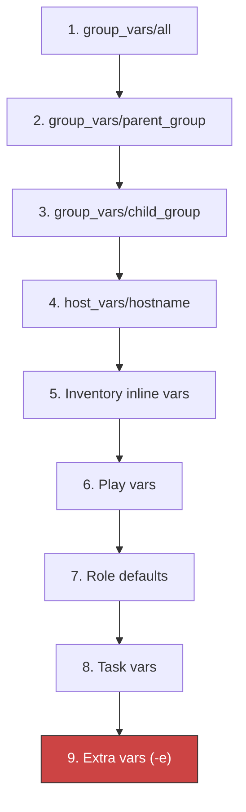

# How to Debug Ansible Inventory Variables with ansible-inventory

Author: [nawazdhandala](https://www.github.com/nawazdhandala)

Tags: Ansible, Inventory, Debugging, Variables, DevOps

Description: Learn how to use the ansible-inventory command to inspect, debug, and trace variable resolution in your Ansible inventory for troubleshooting configuration issues.

---

When an Ansible playbook does not behave the way you expect, the problem is often a variable that has the wrong value. Maybe a group variable is being overridden by a host variable, maybe a variable file is not being loaded at all, or maybe two groups are setting the same variable and the wrong one is winning. The `ansible-inventory` command is your primary debugging tool for tracking down these issues.

## The --host Flag: Your Best Friend

The `--host` flag shows every variable that a specific host will receive, with all group_vars, host_vars, inline variables, and defaults merged together.

```bash
# Show all resolved variables for a host
ansible-inventory -i inventory.ini --host web1.example.com
```

Output:

```json
{
    "ansible_host": "10.0.1.10",
    "ansible_user": "deploy",
    "ansible_port": 22,
    "http_port": 8080,
    "ssl_enabled": true,
    "nginx_version": "1.24",
    "env": "production",
    "monitoring_enabled": true,
    "ntp_servers": [
        "0.pool.ntp.org",
        "1.pool.ntp.org"
    ]
}
```

This output shows the final, merged value of every variable. If `http_port` shows `8080` but you expected `80`, the `--host` flag confirms the actual value and tells you something is overriding the group default.

## Tracing Variable Sources

The `--host` output tells you the final value, but not where it came from. To trace the source, use verbose mode:

```bash
# Show variable loading with verbose output
ansible-inventory -i inventory.ini --host web1.example.com -vvv
```

The verbose output shows which files were loaded, in what order, and which variables were set from each file. Look for lines like:

```
Loading data from /path/to/group_vars/webservers.yml
Loading data from /path/to/host_vars/web1.example.com.yml
```

This tells you exactly which files contributed variables to this host.

## Comparing Variables Between Hosts

When two hosts should have the same configuration but one behaves differently, compare their variables:

```bash
# Dump variables for both hosts and compare
ansible-inventory -i inventory.ini --host web1.example.com > /tmp/web1_vars.json
ansible-inventory -i inventory.ini --host web2.example.com > /tmp/web2_vars.json
diff /tmp/web1_vars.json /tmp/web2_vars.json
```

This immediately shows which variables differ between the two hosts.

A more targeted comparison:

```bash
# Compare a specific variable between two hosts using jq
echo "web1: $(ansible-inventory -i inventory.ini --host web1.example.com | python3 -c "import json,sys; print(json.load(sys.stdin).get('http_port', 'NOT SET'))")"
echo "web2: $(ansible-inventory -i inventory.ini --host web2.example.com | python3 -c "import json,sys; print(json.load(sys.stdin).get('http_port', 'NOT SET'))")"
```

## Checking Group Variables

To see what variables a group defines (before host-level overrides), look at the `--list` output:

```bash
# Show the full inventory with group variables
ansible-inventory -i inventory.ini --list | python3 -m json.tool
```

The group entries include a `vars` key:

```json
{
    "webservers": {
        "hosts": ["web1.example.com", "web2.example.com"],
        "vars": {
            "ansible_user": "deploy",
            "http_port": 80,
            "nginx_version": "1.24"
        }
    }
}
```

## Debugging Variable Precedence

Ansible has a complex precedence order. When you need to understand why a variable has a certain value, check each level:

```bash
# Step 1: Check group_vars/all.yml
ansible-inventory -i inventory.ini --list | python3 -c "
import json, sys
data = json.load(sys.stdin)
all_vars = data.get('all', {}).get('vars', {})
print('all vars:', json.dumps(all_vars, indent=2))
"

# Step 2: Check the host's group vars
ansible-inventory -i inventory.ini --list | python3 -c "
import json, sys
data = json.load(sys.stdin)
for group_name, group_data in data.items():
    if group_name == '_meta':
        continue
    if isinstance(group_data, dict):
        hosts = group_data.get('hosts', [])
        if 'web1.example.com' in hosts:
            vars_data = group_data.get('vars', {})
            if vars_data:
                print(f'{group_name} vars: {json.dumps(vars_data, indent=2)}')
"

# Step 3: Check host_vars
ansible-inventory -i inventory.ini --host web1.example.com
```

The precedence from lowest to highest:



Extra vars (`-e`) always win. They cannot be overridden by anything.

## Using the debug Module in Playbooks

For runtime variable inspection, use the `debug` module:

```yaml
# debug-vars.yml
# Inspect variables at runtime
- hosts: webservers
  gather_facts: false
  tasks:
    - name: Show a specific variable
      debug:
        var: http_port

    - name: Show all variables for this host
      debug:
        var: hostvars[inventory_hostname]

    - name: Show which groups this host belongs to
      debug:
        var: group_names

    - name: Show all hosts in a specific group
      debug:
        var: groups['webservers']

    - name: Check if a variable is defined
      debug:
        msg: "ssl_enabled is {{ 'defined' if ssl_enabled is defined else 'NOT defined' }}"

    - name: Show variable with fallback
      debug:
        msg: "http_port = {{ http_port | default('NOT SET') }}"
```

Run it:

```bash
# Inspect variables on all webservers
ansible-playbook -i inventory.ini debug-vars.yml
```

## Detecting Undefined Variables

Find out which hosts are missing expected variables:

```yaml
# check-required-vars.yml
# Verify that all required variables are set
- hosts: all
  gather_facts: false
  tasks:
    - name: Check required variables
      assert:
        that:
          - ansible_host is defined
          - ansible_user is defined
          - env is defined
          - monitoring_enabled is defined
        fail_msg: "Missing required variable on {{ inventory_hostname }}"
        success_msg: "All required variables present on {{ inventory_hostname }}"
```

```bash
# Check all hosts for required variables
ansible-playbook -i inventory.ini check-required-vars.yml
```

## Debugging Dynamic Inventory

For dynamic inventory sources, the debugging process is the same:

```bash
# List all hosts discovered by the EC2 plugin
ansible-inventory -i inventory/aws_ec2.yml --list

# Check variables for a specific EC2 instance
ansible-inventory -i inventory/aws_ec2.yml --host i-0abc123def456

# Show the graph including dynamic groups
ansible-inventory -i inventory/aws_ec2.yml --graph

# Verbose output to see API calls
ansible-inventory -i inventory/aws_ec2.yml --list -vvv
```

When combining static and dynamic inventory:

```bash
# Show the merged inventory from all sources
ansible-inventory -i inventory/ --list

# Verify a host from the static file
ansible-inventory -i inventory/ --host web-dc-01.local

# Verify a host from the dynamic plugin
ansible-inventory -i inventory/ --host web-aws-01.example.com
```

## Common Variable Issues and Solutions

**Problem: Variable has the wrong value**

```bash
# Check where the value comes from
ansible-inventory -i inventory.ini --host web1.example.com -vvv 2>&1 | grep http_port
```

**Problem: Variable is undefined**

```bash
# Check if the variable appears in the host dump
ansible-inventory -i inventory.ini --host web1.example.com | python3 -c "
import json, sys
data = json.load(sys.stdin)
var_name = 'http_port'
if var_name in data:
    print(f'{var_name} = {data[var_name]}')
else:
    print(f'{var_name} is NOT SET for this host')
"
```

**Problem: Two groups set the same variable**

When a host is in multiple groups that define the same variable, the group that sorts last alphabetically wins (unless `ansible_group_priority` is set).

```bash
# Check group membership
ansible-inventory -i inventory.ini --host web1.example.com | python3 -c "
import json, sys
# The group membership is not directly shown in --host output
# Use the list output instead
"

# Check the graph to see all groups
ansible-inventory -i inventory.ini --graph | grep -A 5 web1
```

**Problem: host_vars file is not being loaded**

Check that the filename matches exactly:

```bash
# List host_vars files
ls -la host_vars/

# The filename must match the inventory hostname exactly
# If inventory says "web1.example.com", the file must be:
#   host_vars/web1.example.com.yml
# NOT:
#   host_vars/web1.yml
#   host_vars/Web1.example.com.yml
```

## Quick Debugging Checklist

1. Run `ansible-inventory --host <hostname>` to see the final merged variables
2. Run with `-vvv` to see which files are loaded
3. Check group membership with `--graph`
4. Compare two hosts with `diff` on their `--host` outputs
5. Use the `debug` module in a playbook for runtime inspection
6. Use `assert` to validate required variables across all hosts

Variable debugging is a skill you will use constantly. The `ansible-inventory` command gives you full visibility into how your inventory is resolved, making it straightforward to find and fix configuration issues.
