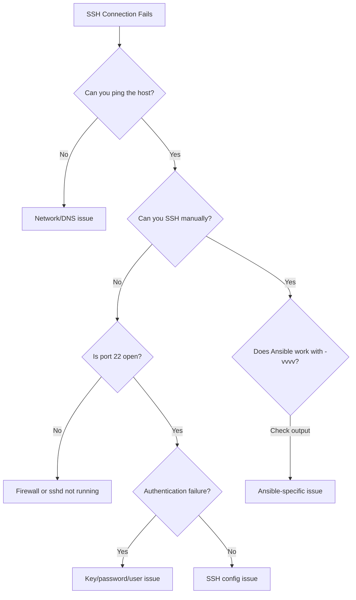

# How to Debug Ansible SSH Connection Issues

Author: [nawazdhandala](https://www.github.com/nawazdhandala)

Tags: Ansible, SSH, Debugging, Troubleshooting

Description: Systematically debug and resolve Ansible SSH connection issues using verbose output, manual testing, and common fix patterns.

---

SSH connection problems are probably the most common issues Ansible users face. The error messages are often cryptic, and the root cause can be anywhere in the chain: DNS resolution, network connectivity, SSH daemon configuration, authentication, or Ansible's own settings. This post walks through a systematic approach to diagnosing and fixing SSH connection issues, covering the most common problems and their solutions.

## Start with Verbose Mode

The first step in debugging any Ansible connection issue is increasing verbosity. Ansible supports four levels:

```bash
# Level 1: Basic output
ansible all -m ping -v

# Level 2: More detail
ansible all -m ping -vv

# Level 3: SSH command details
ansible all -m ping -vvv

# Level 4: Full SSH debug output (most useful for connection issues)
ansible all -m ping -vvvv
```

At `-vvvv`, Ansible shows the exact SSH command it executes, which is invaluable:

```
<web01> SSH: EXEC ssh -vvv -o ControlMaster=auto -o ControlPersist=60s -o StrictHostKeyChecking=no -o 'IdentityFile="/home/user/.ssh/ansible_key"' -o KbdInteractiveAuthentication=no -o PreferredAuthentications=gssapi-with-mic,gssapi-keyex,hostbased,publickey -o PasswordAuthentication=no -o 'User="deploy"' -o ConnectTimeout=10 10.0.1.10 '/bin/sh -c '"'"'echo ~deploy && sleep 0'"'"''
```

## The Debugging Flowchart

Follow this order to systematically identify the problem:



## Step 1: Check Basic Connectivity

Before blaming SSH, verify you can reach the host at all:

```bash
# Test network connectivity
ping -c 3 10.0.1.10

# Test DNS resolution (if using hostnames)
dig web01.example.com +short
nslookup web01.example.com

# Test if SSH port is open
nc -zv 10.0.1.10 22
# or
nmap -p 22 10.0.1.10
```

If ping works but port 22 is closed, the issue is either a firewall or sshd not running on the target.

## Step 2: Test Manual SSH

Test SSH independently from Ansible:

```bash
# Simple SSH test
ssh deploy@10.0.1.10

# Test with the specific key Ansible uses
ssh -i ~/.ssh/ansible_key deploy@10.0.1.10

# Test with verbose output to see what happens
ssh -vvv -i ~/.ssh/ansible_key deploy@10.0.1.10
```

Look for these key lines in the verbose output:

```
# Good signs:
debug1: Authentication succeeded (publickey).
debug1: channel 0: new [client-session]

# Bad signs:
debug1: Authentications that can continue: publickey,password
debug1: No more authentication methods to try.
Permission denied (publickey).
```

## Step 3: Common Error Messages and Fixes

### "Permission denied (publickey)"

The SSH key is not accepted. Check these things:

```bash
# Verify the key file exists and has correct permissions
ls -la ~/.ssh/ansible_key
# Should be: -rw------- (600)

# Fix permissions if needed
chmod 600 ~/.ssh/ansible_key
chmod 644 ~/.ssh/ansible_key.pub
chmod 700 ~/.ssh

# Check if the public key is in authorized_keys on the remote host
ssh root@10.0.1.10 "cat /home/deploy/.ssh/authorized_keys"

# Check remote file permissions
ssh root@10.0.1.10 "ls -la /home/deploy/.ssh/"
# authorized_keys should be 600, .ssh should be 700
```

### "Connection refused"

The SSH daemon is not running or not listening on the expected port:

```bash
# Check if sshd is running on the remote host
# (if you have another way to access, like console)
systemctl status sshd

# Check what port sshd is listening on
ss -tlnp | grep sshd

# If using a non-standard port, tell Ansible
ansible all -m ping -e "ansible_port=2222"
```

### "Connection timed out"

The host is unreachable or a firewall is dropping packets:

```bash
# Test with a longer timeout
ansible all -m ping -T 60

# Check for firewall rules on the remote host
iptables -L -n | grep 22
firewall-cmd --list-ports

# Test from the control node
traceroute 10.0.1.10
```

### "Host key verification failed"

The host key has changed (server was reprovisioned) or is unknown:

```bash
# Remove the old host key
ssh-keygen -R 10.0.1.10

# Or disable host key checking temporarily
ANSIBLE_HOST_KEY_CHECKING=False ansible all -m ping

# Or accept new keys automatically
ansible all -m ping -e 'ansible_ssh_extra_args="-o StrictHostKeyChecking=accept-new"'
```

### "Unreachable" with no clear error

```bash
# Check Ansible's SSH command directly
# Copy the EXEC line from -vvvv output and run it manually
ssh -vvv -o ControlMaster=auto -o ControlPersist=60s -o 'User="deploy"' -o ConnectTimeout=10 10.0.1.10

# Check for stale control sockets
rm -f ~/.ansible/cp/*
```

## Step 4: Ansible-Specific Issues

### Wrong Python Interpreter

```
/bin/sh: /usr/bin/python: No such file or directory
```

The remote host does not have Python where Ansible expects it:

```ini
# inventory/hosts
[webservers:vars]
ansible_python_interpreter=/usr/bin/python3
```

### Wrong User

```bash
# Check which user Ansible is trying to connect as
ansible all -m ping -vvvv 2>&1 | grep "User="

# Override the user
ansible all -m ping -u deploy
```

### Key File Not Found

```bash
# Check what key file Ansible is using
ansible all -m ping -vvvv 2>&1 | grep "IdentityFile"

# Set the correct key
ansible all -m ping --private-key=~/.ssh/correct_key
```

## Step 5: Remote Host Configuration Issues

If manual SSH works but Ansible fails, check these remote host settings:

```bash
# Check sshd configuration
cat /etc/ssh/sshd_config | grep -v "^#" | grep -v "^$"

# Important settings to verify:
# PubkeyAuthentication yes          - Must be yes
# PasswordAuthentication no         - If using keys only
# AllowUsers deploy ansible         - If set, your user must be listed
# AllowGroups ssh-users             - If set, your user must be in the group
# MaxSessions 10                    - Must be high enough for multiplexing
# MaxStartups 10:30:60              - Might throttle parallel connections
# UseDNS no                         - Set to no to speed up connections
# AuthorizedKeysFile .ssh/authorized_keys  - Default location
```

After changing sshd_config:

```bash
# Validate the configuration
sshd -t

# Restart sshd
systemctl restart sshd
```

## Step 6: Network and Firewall Issues

```bash
# Check local firewall (on control node)
iptables -L OUTPUT -n | grep 22
ufw status

# Check remote firewall
ssh root@host "iptables -L INPUT -n | grep 22"

# Check for TCP wrappers
cat /etc/hosts.allow
cat /etc/hosts.deny

# Check SELinux (RHEL/CentOS)
getenforce
# If Enforcing, check for SELinux denials
ausearch -m avc --ts recent | grep ssh
```

## Step 7: Authentication Chain Issues

SSH tries authentication methods in order. Understanding this order helps:

```bash
# See the authentication order in verbose output
ssh -vvv deploy@10.0.1.10 2>&1 | grep "Trying\|Offering\|Authentication"
```

Typical output:

```
debug1: Authentications that can continue: publickey,keyboard-interactive
debug1: Next authentication method: publickey
debug1: Offering public key: /home/user/.ssh/ansible_key ED25519
debug1: Server accepts key: /home/user/.ssh/ansible_key ED25519
debug1: Authentication succeeded (publickey).
```

Force a specific authentication method:

```ini
# ansible.cfg - Only try public key
[ssh_connection]
ssh_args = -o PreferredAuthentications=publickey -o IdentitiesOnly=yes
```

## Debugging Checklist

When all else fails, work through this checklist:

```bash
# 1. Network connectivity
ping -c 1 TARGET_HOST

# 2. Port accessible
nc -zv TARGET_HOST 22

# 3. DNS resolution (if using hostnames)
dig TARGET_HOST +short

# 4. Manual SSH with correct key
ssh -i ~/.ssh/ansible_key -o StrictHostKeyChecking=no USER@TARGET_HOST hostname

# 5. Ansible with maximum verbosity
ansible TARGET_HOST -m ping -vvvv

# 6. Check key permissions
stat ~/.ssh/ansible_key

# 7. Check remote authorized_keys
ssh USER@TARGET_HOST "cat ~/.ssh/authorized_keys"

# 8. Check remote sshd logs
ssh root@TARGET_HOST "tail -50 /var/log/auth.log"
# or
ssh root@TARGET_HOST "tail -50 /var/log/secure"

# 9. Clean up stale connections
rm -f ~/.ansible/cp/*

# 10. Test with minimal configuration
ANSIBLE_CONFIG=/dev/null ansible TARGET_HOST -m ping -u USER --private-key=~/.ssh/key -vvvv
```

## Creating a Debug Script

Save yourself time with a reusable debug script:

```bash
#!/bin/bash
# ansible_ssh_debug.sh - Debug SSH connectivity for Ansible
# Usage: ./ansible_ssh_debug.sh <host> [user] [key]

HOST=$1
USER=${2:-deploy}
KEY=${3:-~/.ssh/ansible_key}

echo "=== Ansible SSH Debug ==="
echo "Host: $HOST"
echo "User: $USER"
echo "Key: $KEY"
echo ""

echo "--- Step 1: DNS Resolution ---"
dig +short "$HOST" 2>/dev/null || echo "Not a hostname or DNS failed"
echo ""

echo "--- Step 2: Ping Test ---"
ping -c 1 -W 3 "$HOST" 2>&1 | tail -2
echo ""

echo "--- Step 3: Port 22 Check ---"
nc -zv -w3 "$HOST" 22 2>&1
echo ""

echo "--- Step 4: Key File Check ---"
ls -la "$KEY" 2>&1
echo ""

echo "--- Step 5: SSH Test ---"
ssh -o ConnectTimeout=5 -o StrictHostKeyChecking=no -o BatchMode=yes -i "$KEY" "$USER@$HOST" "hostname" 2>&1
echo ""

echo "--- Step 6: Ansible Ping ---"
ansible "$HOST" -m ping -u "$USER" --private-key="$KEY" -v 2>&1
echo ""

echo "=== Debug Complete ==="
```

## Wrapping Up

Debugging SSH connection issues in Ansible follows a predictable pattern: start with basic network connectivity, then test SSH independently, then test through Ansible with maximum verbosity. Most issues fall into one of a few categories: wrong key, wrong permissions, firewall blocking, sshd misconfiguration, or DNS problems. The `-vvvv` flag is your best friend because it shows the exact SSH command Ansible uses, which you can run manually to isolate the problem. Keep the debug checklist handy and work through it systematically rather than guessing. That approach will get you to the root cause faster than randomly changing settings.
