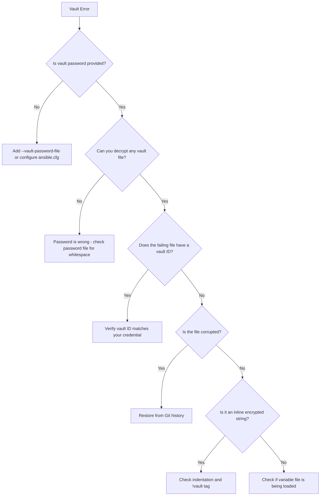

# How to Debug Issues with Ansible Vault Encrypted Variables

Author: [nawazdhandala](https://www.github.com/nawazdhandala)

Tags: Ansible, Vault, Debugging, Troubleshooting, DevOps

Description: Learn how to diagnose and fix common Ansible Vault decryption failures, password mismatches, and variable resolution issues in your playbooks.

---

Vault-related errors are some of the most frustrating to debug in Ansible because the encryption hides the actual values. You cannot just print the variable to see what is going on. The error messages are often vague ("Decryption failed"), and the root cause could be anything from a wrong password to a corrupted file to a YAML formatting issue. This guide covers systematic approaches to diagnosing and fixing the most common vault problems.

## The Most Common Error Messages

### "Decryption failed (no vault secrets were found that could decrypt)"

This is the most frequent vault error. It means Ansible tried to decrypt something but none of the available vault passwords worked.

```bash
# The error looks like this:
ERROR! Decryption failed (no vault secrets were found that could decrypt)
```

Possible causes:
1. No vault password was provided at all
2. The wrong vault password was provided
3. The vault ID does not match
4. The file is corrupted

### "input is not vault encrypted data"

```bash
ERROR! input is not vault encrypted data
```

Ansible expected vault-encrypted content but found plaintext. This usually happens when a vault file was accidentally decrypted and committed without re-encrypting.

### "Vault password client script had non-zero exit status"

```bash
ERROR! Vault password client script had non-zero exit status
```

Your vault password script failed. The script returned a non-zero exit code.

## Systematic Debugging Approach

### Step 1: Verify the Vault Password

Start by confirming you have the right password:

```bash
# Try to view any vault-encrypted file with your password
ansible-vault view --vault-password-file vault_pass.txt group_vars/production/vault.yml

# If this fails, the password is wrong
# If this succeeds, the password works for at least this file
```

### Step 2: Check the Vault File Header

Inspect the encrypted file to verify its format:

```bash
# Show the first line of the encrypted file
head -1 group_vars/production/vault.yml
```

Valid headers look like:
```
$ANSIBLE_VAULT;1.1;AES256
$ANSIBLE_VAULT;1.2;AES256;prod
```

If the first line is anything else (like `---` or plain YAML), the file is not encrypted.

### Step 3: Verify Vault IDs Match

If you use vault IDs, confirm the encrypted file's vault ID matches your password:

```bash
# Check the vault ID in the file header
head -1 group_vars/production/vault.yml
# Output: $ANSIBLE_VAULT;1.2;AES256;prod
#                                     ^^^^ this is the vault ID

# Verify your vault password is configured with the matching ID
ansible-config dump | grep -i vault_identity
```

### Step 4: Run with Maximum Verbosity

```bash
# Run with -vvvv to see vault-related debug output
ansible-playbook site.yml \
  --vault-password-file vault_pass.txt \
  -vvvv 2>&1 | grep -i vault
```

This shows which vault secrets Ansible is trying, which files it is attempting to decrypt, and where it fails.

## Debugging Specific Problems

### Wrong Password

```bash
# Quick test: try to decrypt with your password
ansible-vault decrypt --vault-password-file vault_pass.txt \
  --output /tmp/test_decrypt.yml \
  group_vars/production/vault.yml

# If it fails with "Decryption failed", your password is wrong
# Check for trailing whitespace in your password file
cat -A vault_pass.txt
# The output should show your password followed by $ (end of line)
# If you see spaces before the $ or extra lines, that's the problem
```

Fix trailing whitespace:

```bash
# Remove trailing newlines and whitespace from password file
printf '%s' "$(cat vault_pass.txt)" > vault_pass_clean.txt
chmod 600 vault_pass_clean.txt
mv vault_pass_clean.txt vault_pass.txt
```

### Password Script Failures

```bash
# Test the password script independently
./vault_pass.sh
echo "Exit code: $?"

# Check stderr output
./vault_pass.sh 2>/tmp/vault_script_errors.txt
cat /tmp/vault_script_errors.txt

# Verify the script outputs only the password (no extra lines or spaces)
./vault_pass.sh | xxd | tail -5
# Look for unexpected bytes
```

Common script problems:
- Script is not executable (`chmod +x vault_pass.sh`)
- Environment variable not set
- Wrong shebang line
- Script outputs error messages to stdout instead of stderr

### Corrupted Vault File

If the vault file has been edited incorrectly (e.g., a bad merge or manual editing), it can become corrupted:

```bash
# Check if the file has consistent formatting
# Each line of the encrypted payload should be exactly 80 characters
awk 'NR>1 {print length, $0}' group_vars/production/vault.yml | head -10

# If line lengths vary (except possibly the last line), the file may be corrupted
```

To recover from corruption, check your Git history:

```bash
# View previous versions of the file
git log --oneline group_vars/production/vault.yml

# Restore the last known good version
git checkout HEAD~1 -- group_vars/production/vault.yml

# Verify the restored file decrypts
ansible-vault view --vault-password-file vault_pass.txt group_vars/production/vault.yml
```

### Inline Encrypted String Issues

Inline encrypted strings (using `!vault` tag) have specific formatting requirements:

```yaml
# CORRECT: proper indentation of the encrypted payload
db_password: !vault |
          $ANSIBLE_VAULT;1.1;AES256
          62313365396662343061393464336163383764316462616131633538343062376662
          31303031633534393463313865303732646463376565326435613066643831386237
          6337

# WRONG: inconsistent indentation
db_password: !vault |
  $ANSIBLE_VAULT;1.1;AES256
          62313365396662343061393464336163383764316462616131633538343062376662
          31303031633534393463313865303732646463376565326435613066643831386237
          6337
```

The entire encrypted payload must have consistent indentation. If you copy-pasted and the indentation got mangled, the decryption will fail.

### Variable Not Being Decrypted

If a variable seems to not be decrypted (you see the raw encrypted text instead of the plaintext):

```yaml
# This might happen if you forgot the !vault tag
# WRONG: treated as a regular string, not decrypted
db_password: |
          $ANSIBLE_VAULT;1.1;AES256
          ...

# CORRECT: the !vault tag triggers decryption
db_password: !vault |
          $ANSIBLE_VAULT;1.1;AES256
          ...
```

### Variable File Not Being Loaded

Sometimes the issue is not vault decryption but the variable file not being loaded at all:

```bash
# Verify the variable file is in the right location
# Ansible auto-loads from these paths:
# - group_vars/<group_name>/
# - host_vars/<hostname>/
ls -la group_vars/production/

# Verify the host is in the right group
ansible-inventory --list | python3 -m json.tool | grep -A 10 '"production"'

# Test if the variable is defined at all
ansible -m debug -a "var=vault_db_password" \
  production_host \
  -e "@group_vars/production/vault.yml" \
  --vault-password-file vault_pass.txt
```

## Debugging with a Test Playbook

Create a minimal playbook to isolate vault issues:

```yaml
# debug_vault.yml
# Minimal playbook to test vault variable decryption
---
- name: Debug Vault Variables
  hosts: localhost
  connection: local
  vars_files:
    - group_vars/production/vault.yml

  tasks:
    - name: Check if vault variable is defined
      ansible.builtin.debug:
        msg: "vault_db_password is {{ 'defined' if vault_db_password is defined else 'NOT defined' }}"

    - name: Show vault variable type
      ansible.builtin.debug:
        msg: "Type: {{ vault_db_password | type_debug }}"
      when: vault_db_password is defined

    - name: Show vault variable length
      ansible.builtin.debug:
        msg: "Length: {{ vault_db_password | length }}"
      when: vault_db_password is defined

    - name: Show vault variable value (REMOVE BEFORE PRODUCTION)
      ansible.builtin.debug:
        var: vault_db_password
        verbosity: 2
      when: vault_db_password is defined
```

Run it:

```bash
# Run the debug playbook with vault password
ansible-playbook debug_vault.yml \
  --vault-password-file vault_pass.txt \
  -vv
```

## Checking Multiple Files at Once

Verify all vault files in your project can be decrypted:

```bash
#!/bin/bash
# check_all_vault_files.sh
# Tests decryption of every vault-encrypted file in the project

VAULT_PASS_FILE="${1:-vault_pass.txt}"
PASS=0
FAIL=0

echo "Testing vault decryption for all encrypted files..."
echo ""

grep -rl '^\$ANSIBLE_VAULT' . \
  --include="*.yml" --include="*.yaml" | sort | while read -r file; do
  if ansible-vault view --vault-password-file "${VAULT_PASS_FILE}" "${file}" > /dev/null 2>&1; then
    echo "  PASS: ${file}"
    PASS=$((PASS + 1))
  else
    echo "  FAIL: ${file}"
    FAIL=$((FAIL + 1))
  fi
done

echo ""
echo "Results: ${PASS} passed, ${FAIL} failed"
```

## Debugging Flow



## Prevention Tips

1. Use a pre-commit hook that verifies all vault files decrypt successfully before allowing commits.
2. Add vault decryption verification to your CI/CD pipeline.
3. Document which vault ID each file uses.
4. Keep vault password files out of the repository with `.gitignore`.
5. Use `ansible-lint` which can catch some vault-related formatting issues.

## Summary

Vault debugging follows a systematic process: verify the password, check the file header, confirm vault IDs match, and run with maximum verbosity. Most issues come down to wrong passwords (often due to trailing whitespace), mismatched vault IDs, or corrupted encrypted content. The test playbook and bulk verification script help you quickly isolate whether the problem is with a specific file, a specific password, or the overall vault configuration. Build verification into your workflow (pre-commit hooks, CI checks) to catch problems before they reach production.
